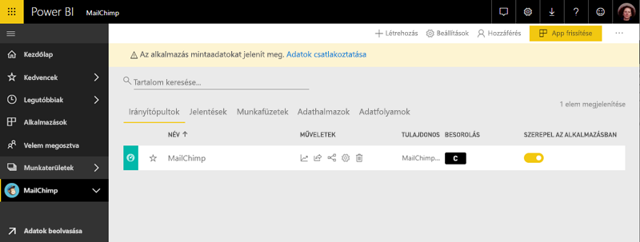

# Kapcsolódás a MailChimphez a Power BI-jal
Ez a cikk végigvezeti a MailChimp-fiókjából sablon alkalmazás használatával a Power BI adatok lekérése. A sablon alkalmazása hoz létre egy munkaterületet egy irányítópultot, több jelentést és a egy adathalmazt, amelyek segítségével megvizsgálhatja a MailChimp-adatokat. Az elemzés révén [MailChimp-irányítópultokat](https://powerbi.microsoft.com/integrations/mailchimp) készíthet, és gyorsan felismerheti a kampányokban, a jelentésekben és az egyes előfizetőknél megmutatkozó trendeket. Az adatok napi, frissíti, biztosítva az Ön adatai mindig naprakészek.

Ha már telepítette a sablonalapú alkalmazásként, módosíthatja az irányítópultot és jelentést. Majd terjesztheti azt munkatársainak alkalmazásként a szervezet.

Csatlakozás a [MailChimp sablonalapú alkalmazásként](https://app.powerbi.com/getdata/services/mailchimp) a Power bi-hoz.

## Csatlakozás

[!INCLUDE [powerbi-service-apps-get-more-apps](./includes/powerbi-service-apps-get-more-apps.md)]

3. Válassza ki **MailChimp** \> **Letöltés most**.
4. A **a Power BI-alkalmazás telepítése?** kiválasztása **telepítése**.
4. Az a **alkalmazások** panelen válassza a **MailChimp** csempére.

    

6. A **az új alkalmazás használatának első lépései**válassza **adatok**.

    

1. Az Authentication Method (Hitelesítési módszer) beállításnál válassza az **oAuth2** \> beállítást, majd a **Sign In** (Bejelentkezés) elemet.
   
    Amikor a rendszer kéri, adja meg saját MailChimp-beli hitelesítő adatait, majd haladjon végig a hitelesítési folyamaton.
   
    Az első csatlakozás alkalmával a Power BI megkéri, hogy adjon olvasási hozzáférést a fiókjához. Az **Engedélyezés** elemre kattintva kezdje el az importálási folyamatot. A fiókban lévő adatok mennyiségétől függően néhány percet is igénybe vehet.
   
    

5. Miután a Power BI importálta az adatokat, a MailChimp-irányítópult megnyitása.
   
    

## Módosíthatja, és az alkalmazás terjesztése

A MailChimp-sablon alkalmazást telepítette. Ez azt jelenti, hogy a MailChimp alkalmazás-munkaterület is létrehozott. A munkaterületen a jelentések és irányítópultok módosítsa, majd ezután osztja el, mint egy *alkalmazás* munkatársaknak a szervezetben. 

1. Az új MailChimp-munkaterületen a tartalmát megtekintéséhez a bal oldali navigációs sávon válassza **munkaterületek** > **MailChimp**. 

    

    Ez a nézet a munkaterület számára a tartalmak listája. A jobb felső sarokban látható **app frissítése**. Ha már készen áll az alkalmazást a munkatársai, ez az először lesz.

    

2. Válassza ki **jelentések** és **adatkészletek** a munkaterület az egyéb elemek megtekintéséhez. 

    További információ [alkalmazások terjesztése](service-create-distribute-apps.md) munkatársainak.

## Következő lépések

* [Az új munkaterületek létrehozása a Power bi-ban](service-create-the-new-workspaces.md)
* [Alkalmazások telepítése és használata a Power BI-ban](consumer/end-user-apps.md)
* [Power BI alkalmazások külső szolgáltatásokhoz](service-connect-to-services.md)
* Kérdése van? [Kérdezze meg a Power BI közösségét](http://community.powerbi.com/)

