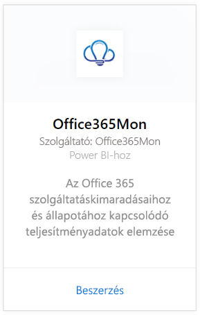
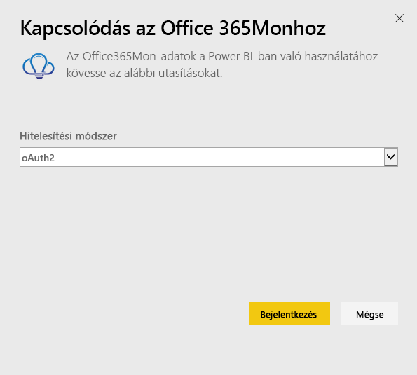
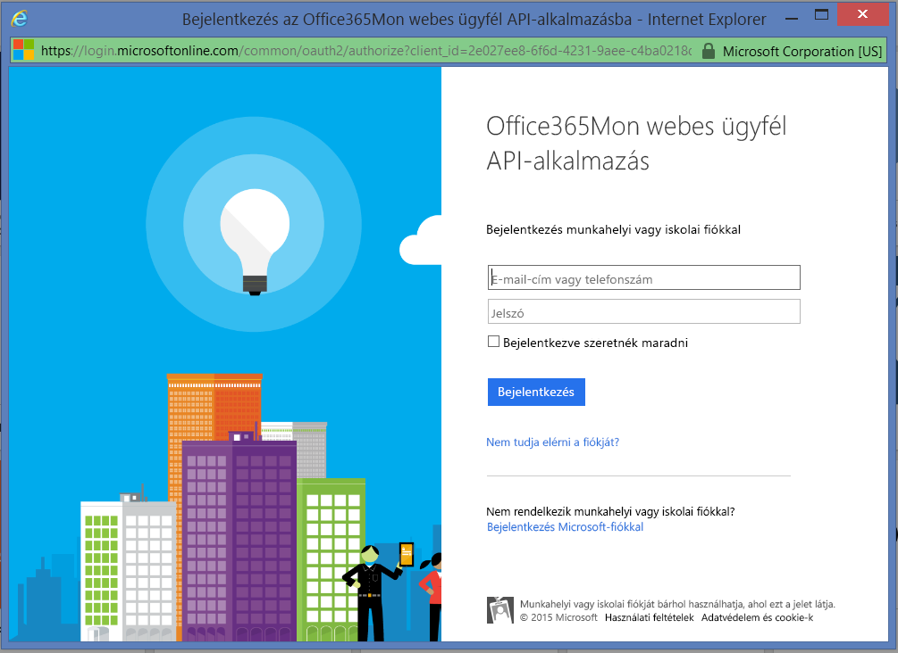
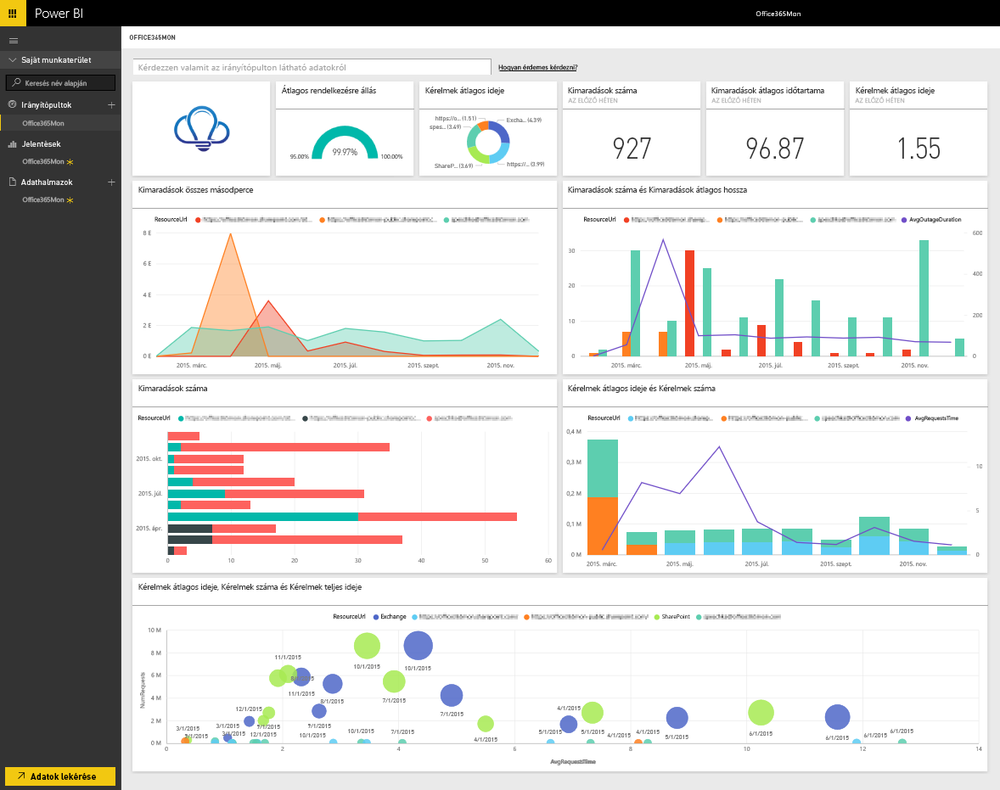

# Kapcsolódás az Office365Mon tartalomcsomaghoz a Power BI-jal
Az Office 365 leállásainak és az állapot teljesítményadatainak elemzése egyszerű a Power BI-jal és az Office365Mon sablonalkalmazással. A Power BI lekéri az adatokat, többek között a leállásokat és az állapotmintákat, majd ezeken az adatokon alapuló, használatra kész irányítópultot és jelentéseket hoz létre.

Csatlakozzon a Power BI-hoz készült [Office365Mon sablonalkalmazáshoz](https://msit.powerbi.com/groups/me/getapps/services/office365mon.office365mon_powerbi_v3).

>[!NOTE]
>A Power BI-sablonalkalmazás betöltéséhez Office365Mon rendszergazdai fiók szükséges.

## Csatlakozás
1. Kattintson az **Adatok lekérése** elemre a navigációs panel alján.
   
   
2. A **Szolgáltatások** mezőben kattintson a **Lekérés** elemre.
   
    
3. Válassza az **Office365Mon** \> **Lekérés** lehetőséget.
   
   
4. A Hitelesítési módszernél válassza az **oAuth2** \> **Bejelentkezés** lehetőséget.
   
   Amikor a rendszer kéri, adja meg az Office365Mon rendszergazdai hitelesítő adatait, majd haladjon végig a hitelesítési folyamaton.
   
   
   
   
5. Miután a Power BI importálta az adatokat, megjelenik egy új irányítópult, jelentés és adathalmaz a navigációs panelen. Az új elemeket egy sárga csillag jelöli \*, válassza ki az Office365Mon bejegyzést.
   
   

**Mi a következő lépés?**

* [Kérdéseket tehet fel a Q&A mezőben](consumer/end-user-q-and-a.md) az irányítópult tetején.
* [Módosíthatja az irányítópult csempéit](service-dashboard-edit-tile.md).
* [Kiválaszthatja valamelyik csempét](consumer/end-user-tiles.md) a mögöttes jelentés megnyitásához.
* Noha az adatkészlet napi frissítésre van ütemezve, módosíthatja a frissítési ütemezést, vagy igény szerint frissíthet az **Azonnali frissítés** gombbal.

## Hibaelhárítás
Ha **„Sikertelen bejelentkezés”** hibaüzenetet kap az Office365Mont hitelesítő adatai megadása után, akkor a használt fióknak nincs jogosultsága az Office365Mon-adatokat lekérni az Ön fiókjából. Ellenőrizze, hogy rendszergazdai fiókot használ-e, és próbálkozzon újra.

## Következő lépések
[Mi az a Power BI?](fundamentals/power-bi-overview.md)

[Power BI – Adatok lekérése](service-get-data.md)

