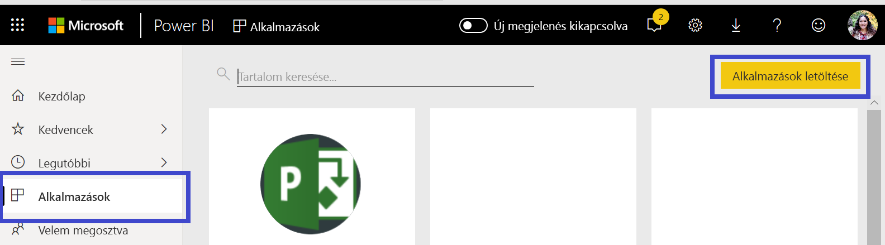
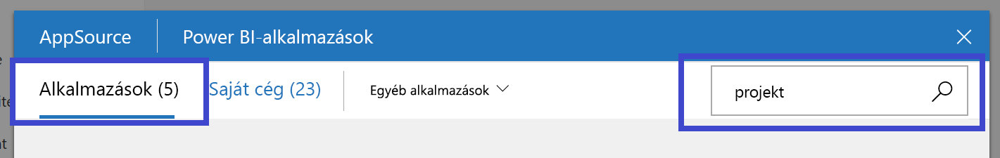
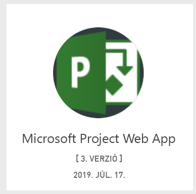
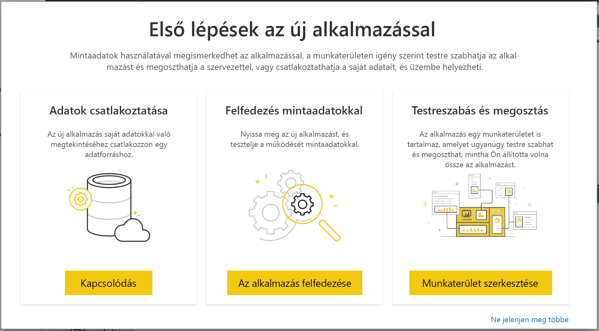
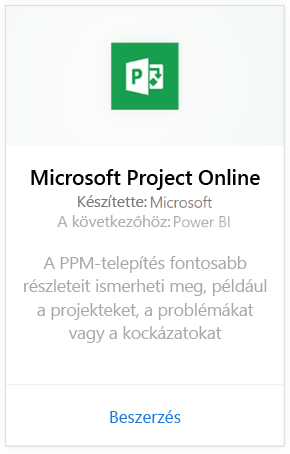
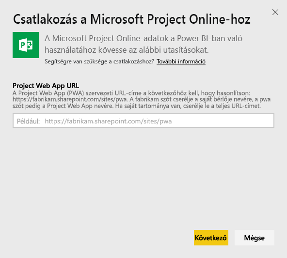
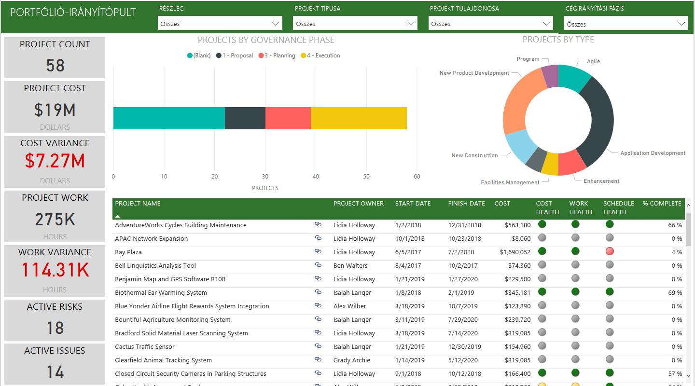
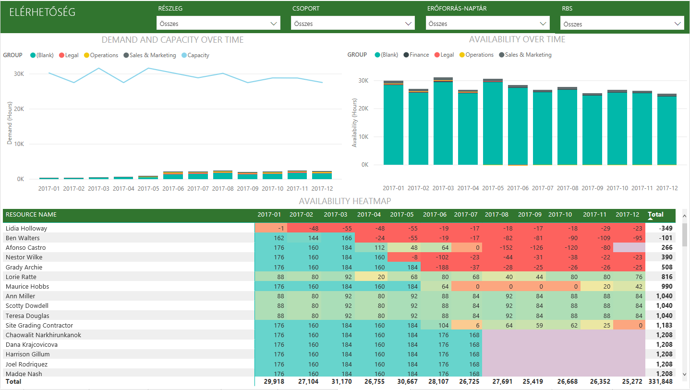
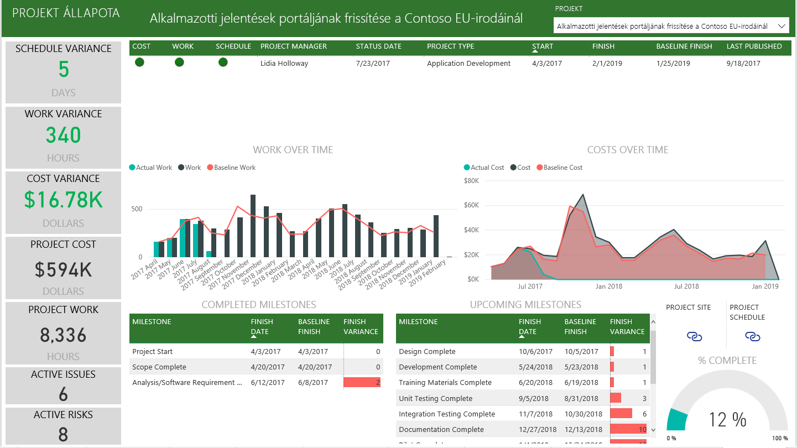

# Csatlakozás a Project Web Apphoz a Power BI használatával
A Microsoft Project Web App a projektportfólió-kezeléshez (PPM) és a mindennapi munkához nyújt rugalmas online megoldást. A Project Web App lehetővé teszi a cég számára, hogy megtegye az előkészületeket, rangsorolja a projektporfólió-befektetéseket, és elérje a tervezett üzleti eredményt. A Power BI Project Web App sablonalkalmazásával fontos információkat ismerhet meg a Project Web App elemzéseiből, így könnyebben kezelheti a projekteket, a portfóliókat és az erőforrásokat.

Csatlakozzon a Power BI [Project Web App sablonalkalmazásához](https://appsource.microsoft.com/product/power-bi/pbi_msprojectonline.pbi-microsoftprojectwebapp).

## Csatlakozás

1. A navigációs panelen válassza az **Alkalmazások** elemet, majd a jobb felső sarokban az **Alkalmazások letöltése** lehetőséget.

    

2. A **Szolgáltatások** mezőben kattintson a **Lekérés** elemre.
   
   
3. Az AppSource-on válassza az **Alkalmazások** lapfület, és keresse meg/válassza ki a **Microsoft Project Web App** lehetőséget.
   
4. Amikor megjelenik a **Telepíti ezt a Power BI-alkalmazást?** kérdés, válassza a **Telepítés** lehetőséget. 

   
5. Az **Alkalmazások** ablaktáblán válassza ki a **Microsoft Project Web App** mozaikot. 
   
   
6. **Az új alkalmazás használatának első lépései** résznél válassza az **Adatok csatlakoztatása** lehetőséget.
   
   
7. A **Project Web App URL** szövegdobozba írja be a csatlakoztatni kívánt Project Web App (PWA) URL-címét.  Vegye figyelembe, hogy ez az adat egyedi tartomány esetén eltérhet a példától. A **PWA Site Language** szövegmezőbe írja be a PWA-webhely nyelvének megfelelő számot. Angol nyelvhez az 1-es, franciához a 2-es, némethez a 3-as, brazil portugálhoz a 4-es, portugálhoz az 5-ös, spanyolhoz pedig a 6-os számot írja be. 
   
   
8. Az Authentication Method (Hitelesítési módszer) beállításnál válassza az **oAuth2** \> beállítást, majd a **Sign In** (Bejelentkezés) elemet. Amikor a rendszer kéri, adja meg a saját Projekt Web App hitelesítő adatait, majd haladjon végig a hitelesítési folyamaton.

    > [!NOTE]
    > Portfóliómegtekintő, portfóliókezelő vagy rendszergazdai engedélyekre van szüksége ahhoz a Project Web-alkalmazáshoz, amelyhez csatlakozik.

9. Egy értesítés jelzi, hogy az adatok betöltése folyamatban van. A fiók méretétől függően ez eltarthat egy ideig. Miután a Power BI importálta az adatokat, megjelenik az új munkaterület tartalma. Előfordulhat, hogy a legújabb elemek megjelenítéséhez frissítenie kell az adathalmazt. 

    Miután a Power BI importálta az adatokat, megjelenik a 13 oldalas jelentés és egy adatkészlet a navigációs panelen. 

10. Miután a jelentések elkészültek, megkezdheti a Project Web App-adatokkal való munkát. A sablonalkalmazás 13 részletgazdag jelentést tartalmaz portfólióáttekintéshez (6 jelentésoldal), erőforrás-áttekintéshez (5 jelentésoldal), valamint projektállapothoz (2 jelentésoldal). 

    
   
    
   
    

**Mi a következő lépés?**

* Noha az adatkészlet napi frissítésre van ütemezve, módosíthatja a frissítési ütemezést, vagy igény szerint frissíthet az **Azonnali frissítés** gombbal.

**A sablonalkalmazás bővítése**

Töltse le a [GitHub PBIT-fájlt](https://github.com/OfficeDev/Project-Power-BI-Content-Packs) a tartalom további testreszabásához és frissítéséhez.

## Következő lépések
[Első lépések a Power BI-ban](service-get-started.md)

[Adatok lekérése a Power BI-ban](service-get-data.md)

