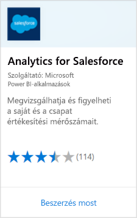
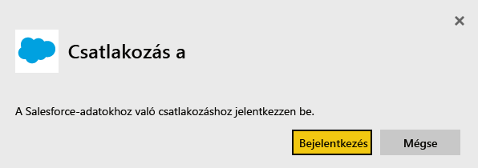
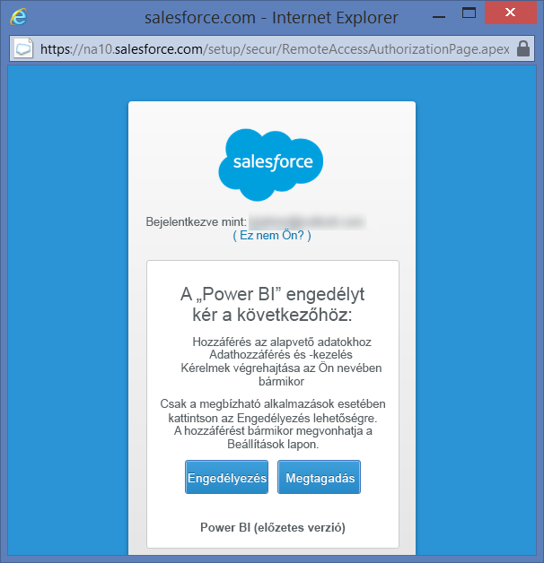
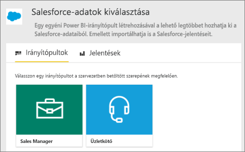
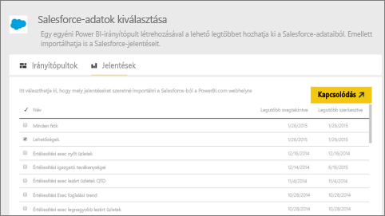
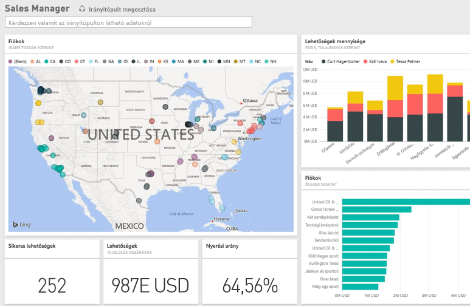

# Csatlakozás a Salesforce-hoz a Power BI-ban
A Power BI használatával könnyedén csatlakozhat a Salesforce.com-fiókjához. Ezzel a kapcsolattal lekérheti a Salesforce-adatokat, és automatikusan a rendelkezésére bocsáthat egy irányítópultot és jelentéseket.

További információ a Power BI és a [Salesforce-integrációjáról](https://powerbi.microsoft.com/integrations/salesforce).

## Csatlakozás
1. A Power BI-ban válassza az **Adatok lekérése** elemet a navigációs panel alján.
   
    
2. A **Szolgáltatások** mezőben kattintson a **Lekérés** elemre.
   
    
3. Válassza az **Analytics for Salesforce** lehetőséget, majd kattintson a **Lekérés** elemre.  
   
   
4. A bejelentkezési folyamat elindításához válassza a **Bejelentkezés** lehetőséget.
   
    
5. Amikor a rendszer kéri, adja meg a Salesforce-fiókja hitelesítő adatait. Válassza az **Engedélyezés** lehetőséget, és tegye elérhetővé az alapvető Salesforce-információkat és -adatokat a Power BI számára.
   
   
6. A legördülő menü alábbi beállításával adja meg, hogy mit szeretne importálni a Power BI-ba:
   
   * **Irányítópult**
     
     Válasszon ki egy személyen (például **Értékesítési igazgató**) alapuló, előre meghatározott irányítópultot. Az ilyen irányítópultok a Salesforce adott szabványadatkészletét jelenítik meg, és nem tartalmaznak egyéni mezőket.
     
     
   * **Jelentések**
     
     Válasszon ki egy vagy több egyéni jelentést a Salesforce-fiókjából. Ezek a jelentések megegyeznek a Salesforce-beli saját nézetekkel, és tartalmazhatnak egyéni mezőkből és objektumokból származó adatokat.
     
     
     
     Ha nem lát jelentést, vegye fel vagy hozza létre a Salesforce-fiókban, majd kísérelje meg újra a csatlakozást.

7. Az importálás megkezdéséhez válassza a **Csatlakozás** lehetőséget. Az importálás során megjelenik egy értesítés, hogy az importálás folyamatban van. Ha az importálás befejeződött, a navigációs panelen megjelenik a Salesforce-adatokat tartalmazó irányítópult, jelentés és adathalmaz.
   
   

Az adatok igény szerinti megjelenítéséhez tetszés szerint módosíthatja az irányítópultot. Kérdéseket tehet fel a Q&A használatával, vagy egy [csempe kiválasztásával](consumer/end-user-tiles.md) megnyithatja az alapjául szolgáló jelentést, és [módosíthatja a csempéket](service-dashboard-edit-tile.md) az irányítópulton.

**Mi a következő lépés?**

* [Kérdéseket tehet fel a Q&A mezőben](consumer/end-user-q-and-a.md) az irányítópult tetején.
* [Csempe szerkesztése vagy eltávolítása](service-dashboard-edit-tile.md) az irányítópulton
* [Kattintson egy csempére](service-dashboard-tiles.md) az alapjául szolgáló jelentés megnyitásához
* Noha az adatkészlet napi frissítésre van ütemezve, módosíthatja a frissítési ütemezést, vagy igény szerint frissíthet az **Azonnali frissítés** gombbal

## Rendszerkövetelmények és megfontolandó szempontok

- Kapcsolódás egy éles környezetben lévő Salesforce-fiókhoz, amelyen engedélyezve van az API-hozzáférés

- Engedély a Power BI alkalmazásnak a bejelentkezéskor

- Elegendő elérhető API-hívás a fiók számára az adatok lekéréséhez és frissítéséhez

- A frissítéshez érvényes hitelesítési jogkivonatra van szükség. Ellenőrizze, hogy öt vagy annál kevesebb Salesforce-adatkészletet importált-e, mert a Salesforce legfeljebb öt hitelesítési jogkivonatot engedélyez alkalmazásonként.

- A Salesforce-jelentések API a korlátozás miatt legfeljebb 2000 adatsort támogat.

## Hibaelhárítás

Ha hibát észlel, tekintse át a fenti követelményeket. 

Az egyéni vagy tesztkörnyezeti tartományba való bejelentkezés jelenleg nem támogatott.

### „Nem sikerült csatlakozni a távoli kiszolgálóhoz” üzenet

Ha a „Nem sikerült csatlakozni a távoli kiszolgálóhoz” üzenet jelenik meg, amikor megpróbál kapcsolódni a Salesforce-fiókjához, tekintse meg a következő megoldást az alábbi fórumon: [A Salesforce-összekötő bejelentkezési hibaüzenete: Nem sikerült csatlakozni a távoli kiszolgálóhoz](https://www.outsystems.com/forums/Forum_TopicView.aspx?TopicId=17674&TopicName=log-in-error-message-unable-to-connect-to-the-remote-server&)

## Következő lépések
[Mi az a Power BI?](fundamentals/power-bi-overview.md)

[Adatforrások a Power BI szolgáltatásban](service-get-data.md)

