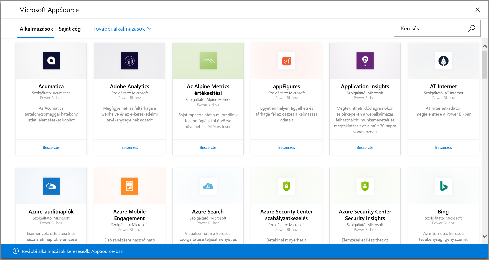
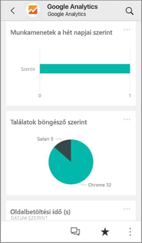
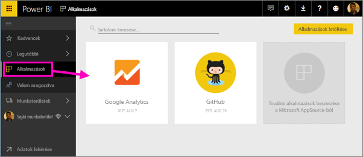
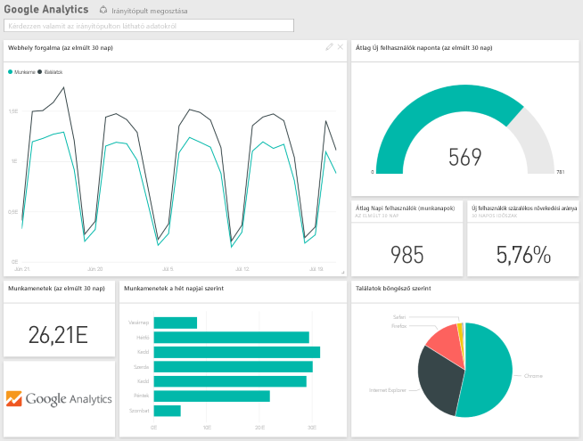
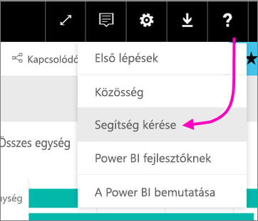

# Kapcsolódás a Power BI segítségével a használt szolgáltatásokhoz
A Power BI-jal könnyedén kapcsolódhat a vállalkozása működtetéséhez használt olyan szolgáltatásokhoz, mint például a Salesforce, a Microsoft Dynamics CRM és a Google Analytics. Power BI az indulásakor kapcsolódik a szolgáltatáshoz az Ön hitelesítő adataival. Ezt követően létrehoz egy irányítópulttal rendelkező *Power BI-munkaterületet* és néhány jelentést, amelyek automatikusan megjelenítik adatait, és vizuális elemzést biztosítanak az üzletmenetről.

>[!IMPORTANT]
>2019. szeptember 25-én több tartalomcsomagot kivonunk. A már telepített tartalomcsomagok továbbra is működni fognak, de már nem fog tudni újabbakat telepíteni. A szolgáltatás-tartalomcsomagokat a [sablonalkalmazások](https://docs.microsoft.com/power-bi/service-template-apps-overview) váltják fel.

Ha meg szeretné tekinteni azon [szolgáltatásokat, amelyekhez kapcsolódni tud](https://app.powerbi.com/getdata/services), jelentkezzen be a Power BI-ba. 

Az alkalmazás telepítése után az irányítópultot és a jelentéseket a Power BI szolgáltatásban ([https://app.powerbi.com](https://app.powerbi.com)) megtekintheti az alkalmazásban és a munkaterületen. Ezen kívül megtekintheti őket a Power BI-mobilalkalmazásokban is. A munkaterületen módosíthatja az irányítópultot és a jelentéseket, hogy megfeleljen a szervezet követelményeinek, majd terjesztheti azokat *alkalmazásként* a munkatársainak. 

## Első lépések
[!INCLUDE [powerbi-service-apps-get-more-apps](./includes/powerbi-service-apps-get-more-apps.md)]

## Az irányítópult és a jelentések szerkesztése
Az importálás befejezésekor az új alkalmazás megjelenik az Alkalmazások lapon.

1. A bal oldali navigációs panelen válassza az **Alkalmazások** ikont > válassza ki az alkalmazást.
   
     
2. A Q&A mezőben kérdéseket tehet fel, egy csempére kattintva pedig megnyithatja az alapul szolgáló jelentést. 
   
    
   
    Módosítsa az irányítópultot és a jelentést úgy, hogy megfeleljen a szervezet igényeinek. Ezután [ossza meg alkalmazásait a munkatársaival](service-create-distribute-apps.md)

## Tartalom
A szolgáltatáshoz való csatlakozást követően látni fog egy irányítópulttal, jelentésekkel és adatkészlettel rendelkező újonnan létrehozott alkalmazást és munkaterületet. A szolgáltatásból származó adatok egy adott forgatókönyvre vonatkoznak, és nem feltétlenül tartalmazzák a szolgáltatással kapcsolatos összes információt. Az adatok naponta egyszer automatikusan frissülnek. Az adatkészlet kiválasztásával Ön határozhatja meg az ütemezést.

A [Power BI Desktopban számos szolgáltatáshoz kapcsolódhat](desktop-data-sources.md), például a Google Analyticshez, és létrehozhatja saját, személyre szabott irányítópultjait és jelentéseit.  

Ha szeretne többet megtudni az egyes szolgáltatásokhoz való csatlakozásról, olvassa el a megfelelő súgóoldalakat.

## Hibaelhárítás
**Üres csempék**  
Amikor a Power BI először kapcsolódik egy adott szolgáltatáshoz, lehetséges, hogy üres csempéket fog látni az irányítópulton. Ha 2 óra elteltével is csak üres csempéket lát, a kapcsolat valószínűleg megszakadt. Ha nem jelenik meg a probléma megoldására vonatkozó információt tartalmazó hibaüzenet, hozzon létre egy támogatási jegyet.

* Válassza ki a kérdőjel ikont ( **?** ) a jobb felső sarokban >  **Segítségkérés**.
  
    

**Hiányzó információ**  
Az irányítópult és a jelentések egy adott forgatókönyvre vonatkozó szolgáltatásból származó tartalmakat foglalnak magukba. Ha egy adott mérőszámot keres az alkalmazásban, és nem találja, küldjön be egy javaslatot a [Power BI-támogatás](https://support.powerbi.com/forums/265200-power-bi) oldalán.

## Szolgáltatások javaslása
Használ olyan szolgáltatást, amelyből szeretné, ha Power BI-alkalmazás készülne? Keresse fel a [Power BI támogatási](https://support.powerbi.com/forums/265200-power-bi) oldalát, és írja meg nekünk, melyik szolgáltatásra gondol.

Ha érdekli, hogyan hozhat létre sablonalkalmazásokat, hogy saját maga terjeszthesse azokat, akkor olvassa el a [Sablonalkalmazás létrehozása a Power BI-ban](service-template-apps-create.md) cikket. A Power BI-partnerek kevés kódolással vagy anélkül hozhatnak létre Power BI-alkalmazásokat, és helyezhetik üzembe azokat bármely Power BI-ügyfél részére. 

## Következő lépések
* [Alkalmazások terjesztése munkatársaknak](service-create-distribute-apps.md)
* [Új munkaterületek létrehozása a Power BI-ban](service-create-the-new-workspaces.md)
* Kérdése van? [Kérdezze meg a Power BI közösségét](http://community.powerbi.com/)
* További kérdései vannak? [Kérdezze meg a Power BI közösségét](http://community.powerbi.com/)

