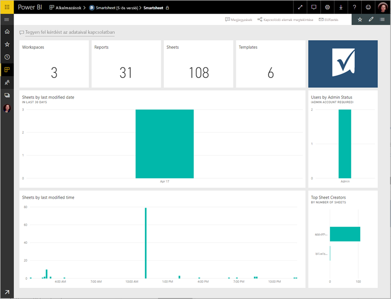
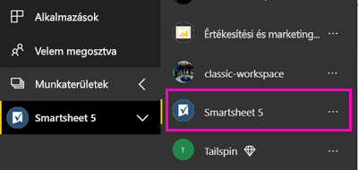
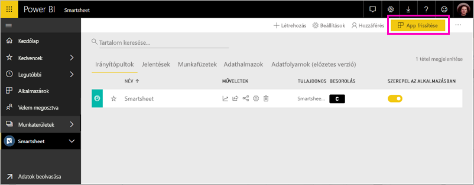

# Kapcsolódás a Smartsheethez a Power BI-jal
Ez a cikk végigvezeti a Power bi-ban sablon alkalmazás használatával a Smartsheet-fiók adatainak lekérése. A Smartsheet könnyen használható platformot kínál az együttműködéshez és fájlmegosztáshoz. A Power bi-hoz készült Smartsheet sablon alkalmazás tartalmaz egy irányítópultot, jelentéseket és adatkészletet a Smartsheet-fiók áttekintését megjelenítő. Is [Power BI Desktop](desktop-connect-to-data.md) , a fiók egyes lapjaihoz közvetlenül csatlakozhat. 

Ha már telepítette a sablonalapú alkalmazásként, módosíthatja az irányítópultot és jelentést. Majd terjesztheti azt munkatársainak alkalmazásként a szervezet.

Csatlakozás a [Smartsheet sablonalapú alkalmazásként](https://app.powerbi.com/groups/me/getdata/services/smartsheet) a Power bi-hoz.

>[!NOTE]
>A Smartsheet-rendszergazdai fiók részesíti előnyben a csatlakozás és betöltése a Power bi-ban sablon alkalmazást, mert további hozzáférési.

## Csatlakozás

[!INCLUDE [powerbi-service-apps-get-more-apps](./includes/powerbi-service-apps-get-more-apps.md)]

3. Válassza ki **Smartsheet** \> **Letöltés most**.
4. A **a Power BI-alkalmazás telepítése?** kiválasztása **telepítése**.
4. Az a **alkalmazások** panelen válassza a **Smartsheet** csempére.

    

6. A **az új alkalmazás használatának első lépései**válassza **adatok**.

    

4. A Hitelesítési módszernél válassza az **oAuth2 \> Bejelentkezés** lehetőséget.
   
   Amikor a rendszer kéri, adja meg saját Smartsheet-beli hitelesítő adatait, majd haladjon végig a hitelesítési folyamaton.
   
   
   
   

5. Miután a Power BI importálta az adatokat, a Smartsheet-irányítópult megnyitása.
   
   

## Módosíthatja, és az alkalmazás terjesztése

A Smartsheet-sablon alkalmazást telepítette. Ez azt jelenti, hogy a Smartsheet alkalmazás-munkaterület is létrehozott. A munkaterületen a jelentések és irányítópultok módosítsa, majd ezután osztja el, mint egy *alkalmazás* munkatársaknak a szervezetben. 

1. Az új Smartsheet-munkaterületen a tartalmát megtekintéséhez a bal oldali navigációs sávon válassza **munkaterületek** > **Smartsheet**. 

    

    Ez a nézet a munkaterület számára a tartalmak listája. A jobb felső sarokban látható **app frissítése**. Ha már készen áll az alkalmazást a munkatársai, ez az először lesz. 

    

2. Válassza ki **jelentések** és **adatkészletek** a munkaterület az egyéb elemek megtekintéséhez.

    További információ [alkalmazások terjesztése](service-create-distribute-apps.md) munkatársainak.

## Tartalom
Sablonalapú alkalmazásként Power bi-ban, a számát, például a Smartsheet-fiók áttekintését tartalmazza a jelentések és a lapok Smartsheet rendelkezik, hogy módosításakor stb. Rendszergazda felhasználók a felhasználók körül információk is megjelennek a rendszer, például a legtöbb lapot létrehozó.  

Egyéni lapokhoz való közvetlen kapcsolódáshoz a fiókban használhatja a Smartsheet-összekötőt a [Power BI Desktop](desktop-connect-to-data.md) alkalmazásban.  

## Következő lépések

* [Az új munkaterületek létrehozása a Power bi-ban](service-create-the-new-workspaces.md)
* [Alkalmazások telepítése és használata a Power BI-ban](consumer/end-user-apps.md)
* [Csatlakozás a Power BI alkalmazások külső szolgáltatásokhoz](service-connect-to-services.md)
* Kérdése van? [Kérdezze meg a Power BI közösségét](http://community.powerbi.com/)