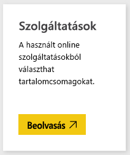
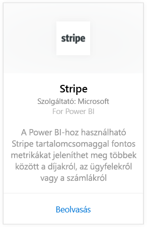
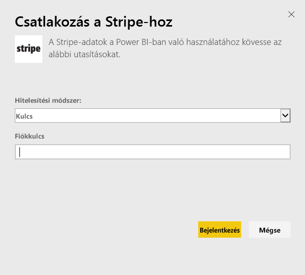
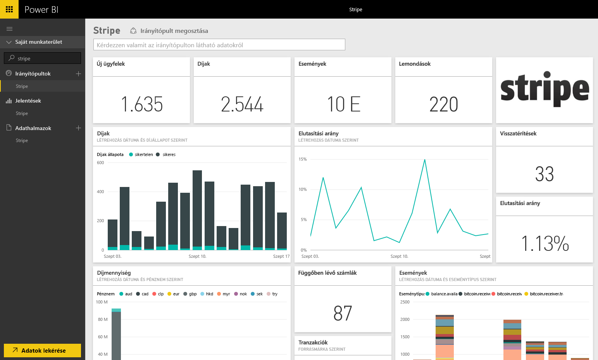

# Csatlakozás a Stripe-hoz a Power BI segítségével
A Power BI-tartalomcsomag segítségével megtekintheti és elemezheti Stripe-adatait. A Power BI Stripe-tartalomcsomag adatokat nyer ki ügyfelekről, díjakról, eseményekről és számlákról. Az adatok a legutóbbi tízezer eseményre és ötezer díjtételre vonatkoznak az utolsó 30 napra kiterjedően. A tartalom naponta egyszer automatikusan frissül az Ön által beállított ütemezés szerint. 

[!INCLUDE [include-short-name](./includes/service-deprecate-content-packs.md)]

Kapcsolódás a [Power BI Stripe-tartalomcsomaghoz](https://app.powerbi.com/getdata/services/stripe).

## A kapcsolódás menete
1. Válassza az Adatok lekérése elemet a bal oldalon lévő navigációs ablaktábla alján.  
   
    
2. A **Szolgáltatások** mezőben válasza a **Beolvasás** elemet.  
   
      
3. Válassza a **Stripe** &gt; **Letöltés most** elemet.  
   
      
4. A kapcsolódáshoz adja meg a Stripe-[API-kulcsát](https://dashboard.stripe.com/account/apikeys).  
   
    
5. Az importálás automatikusan megkezdődik. Amikor befejeződik, a navigációs ablaktáblán megjelenik az új irányítópult, jelentés és modell, egy csillaggal jelölve. Az importált adatok megtekintéséhez kattintson az irányítópultra.
   
    

**Mi a következő lépés?**

* [Kérdéseket tehet fel a Q&A mezőben](consumer/end-user-q-and-a.md) az irányítópult tetején.
* [Módosíthatja az irányítópult csempéit](service-dashboard-edit-tile.md).
* [Kiválaszthatja valamelyik csempét](consumer/end-user-tiles.md) a mögöttes jelentés megnyitásához.
* Noha az adatkészlet napi frissítésre van ütemezve, módosíthatja a frissítési ütemezést, vagy igény szerint frissíthet az **Azonnali frissítés** gombbal.

## Következő lépések
[Mi az a Power BI?](fundamentals/power-bi-overview.md)

[Power BI – Adatok lekérése](service-get-data.md)

