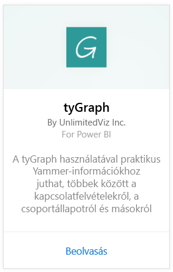
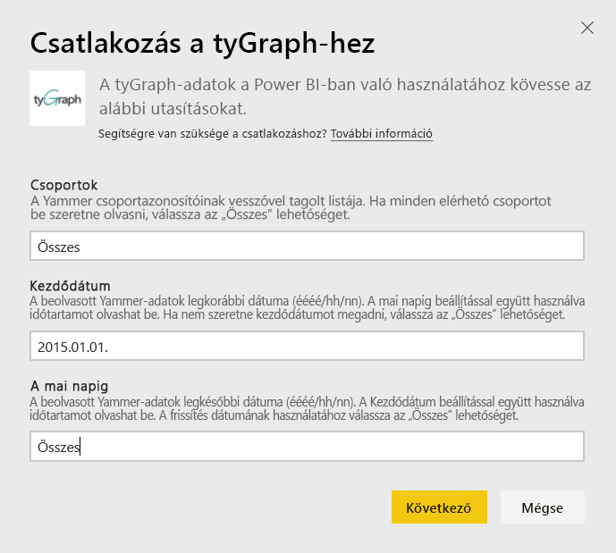
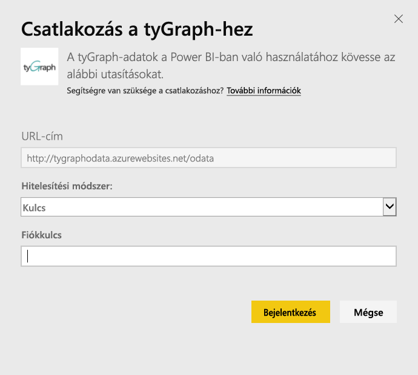
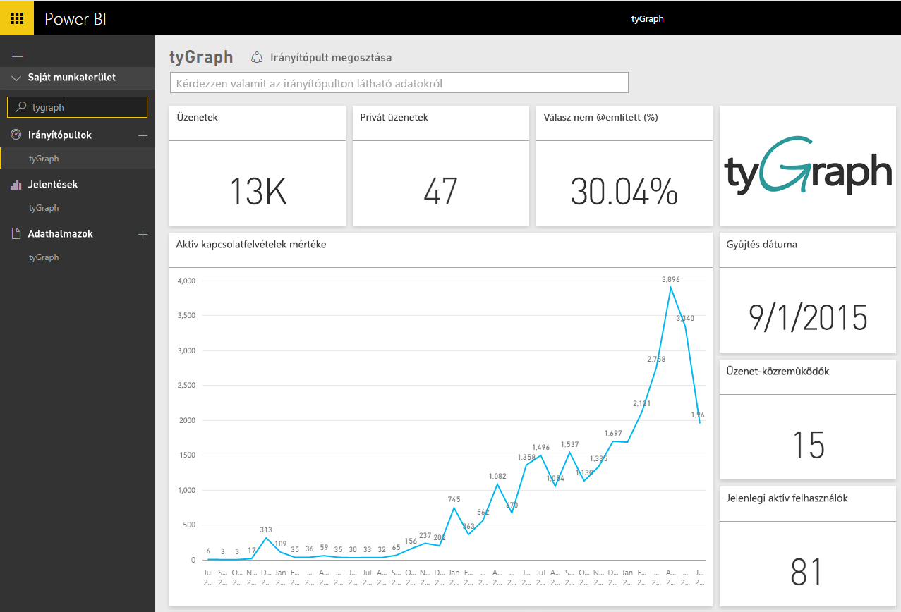

# Csatlakozás a tyGraph-hoz a Power BI-t használva
A Power BI-tartalomcsomag segítségével a Power BI-ban is megtekintheti és elemezheti tyGraph-adatait. Első lépésként csatlakozzon tyGraph-fiókjához, és töltse be az azokhoz tartozó irányítópultot, jelentéseket és adatkészletet. A kész tartalom olyan összefüggéseket tartalmaz, mint a Measure of Active Engagement (MAE pontszám, az aktív elköteleződés mértéke) és a Top Contributors (Legtöbbet hozzájárulók). A legfontosabb információk kiemelése érdekében testre szabhatja a betöltött vizualizációs elemeket.  A beállított ütemezésnek megfelelően a rendszer automatikusan frissíteni fogja az adatokat.

Csatlakozás a [Power BI-hoz készített tyGraph-hoz](https://app.powerbi.com/getdata/services/tygraph).

## A csatlakozás menete
1. A bal oldali navigációs ablaktábla alján kattintson az **Adatok lekérése** elemre.
   
   
2. A **Szolgáltatások** mezőben kattintson a **Beolvasás** lehetőségre.
   
   
3. Válassza ki **tyGraph** \> **Letöltés most** lehetőséget.
   
   
4. Adja meg azokat a csoportokat és azt az időtartományt, amelyhez és amikor csatlakozni szeretne, vagy adja meg az „All” (Összes) értéket az összes adat behozásához. Ügyeljen rá, hogy rendszer (éééé/hh/nn) formátumú dátumot vár. A [paraméterek megkereséséről](#FindingParams) alább olvashat részletesebben.
   
   
5. A csatlakozáshoz adja meg a tyGraph-kulcsot. Az érték megkeresésével kapcsolatban alább tájékozódhat.
   
    **Ha Ön Yammer által igazolt rendszergazda**  
    Az API-kulcsot a rendszer elküldte Önnek e-mailben, amikor létrehozta tyGraph-fiókját. Ha nem találja a kulcsot, a support@unlimitedviz.com címre írva kérhet egy újat. Ha még nem rendelkezik tyGraph-fiókkal, elkezdhet egy próbaidőszakot a [http://www.tygraph.com/](http://www.tygraph.com/) oldalon. 
   
    **Ha nem Yammer által igazolt rendszergazda**
   
    A tyGraph-tartalomcsomag használatához olyan tyGraph-fiókra van szükség, melyet egy Yammer által igazolt rendszergazda hozott létre. Létrehozása után kiegészítő kulcsok hozhatók létre az ugyanazon szervezeten belüli felhasználók részére. Ha az igazolt rendszergazda még nem hozott létre tyGraph-fiókot, kérje meg, hogy hozzon létre egyet. Ha már létrehozott egyet, e-mailben tud kulcsot kérni a <mailto:support@unlimitedviz.com> címre írva.
   
    
6. A sikeres hitelesítés után az importálási folyamat automatikusan elindul. Ha a csatlakozás létrejött, a Navigációs ablaktáblán megjelenik egy új irányítópult, jelentés és modell. Válassza ki az irányítópultot az importált adatok megtekintéséhez.
   
    

**Mi a következő lépés?**

* [Kérdéseket tehet fel a Q&A mezőben](power-bi-q-and-a.md) az irányítópult tetején.
* [Módosíthatja az irányítópult csempéit](service-dashboard-edit-tile.md).
* [Kiválaszthatja valamelyik csempét](service-dashboard-tiles.md) a mögöttes jelentés megnyitásához.
* Az adatkészlet az ütemezés szerint naponta frissül, de módosíthatja is a frissítési ütemezést, vagy igény szerint frissíthet bármikor, az **Azonnali frissítés** lehetőségre kattintva.

## Keresési paraméterek
Importálhatja az összes olyan csoporthoz tartozó adatot, amelyhez hozzáféréssel rendelkezik, de meghatározhatja az adatok egy részhalmazának az importálását is. Dátum szerinti részhalmazt is kialakíthat. Létrehozhat több tyGraph-irányítópultot is adott csoportokhoz és/vagy dátumokhoz tartozó adatkészletek figyeléséhez. Ezekről a paraméterekről alább olvashat további információt.

**Csoportok**

A tyGraph API-val adott csoportazonosítók alapján szűrhetők az adatok. Ezeket veszővel tagolt listában tartalmazza a tartalomcsomag. 

    Example: 2427647,946595,1154464

Az egy adott csoporthoz tartozó csoportazonosítót úgy állapíthatja meg a Yammerben, hogy a csoport csatornájára lép, és megvizsgálja az URL címet.

A fenti példában szereplő Yammer-csoport azonosítója 4054844

**Kezdődátum**

A kezdő dátumnál megadható az a legkorábbi dátum, amelytől kezdődően az adatok lekérendők. A rendszer csak az ekkor vagy ezután létrehozott adatokat fogja betölteni a tartalomcsomagba. A kezdődátumot ÉÉÉÉ/HH/NN formátumban kell megadni. 

    Example: 2013/10/29

A fenti példában szereplő érték szerint minden 2013. október 29-i vagy későbbi adatot betölt a rendszer. 

**Befejező dátum** A befejező dátummal megadható az a legkésőbbi dátum, amely dátumig az adatok lekérendők. A kezdődátummal együtt használva megadható egy dátumtartomány adatainak betöltése. Csak az ezen a napon vagy ezelőtt létrehozott adatokat tölti be a tartalomcsomagba a rendszer. A befejező dátum formátuma ÉÉÉÉ/HH/NN. 

    Example: 2014/10/20

A fenti példában szereplő érték alapján minden 2014. október 20-i és azt megelőzően létrejött adatot betölt a tartalomcsomagba a rendszer. 

## Következő lépések
[Első lépések a Power BI-ban](service-get-started.md)

[Adatok lekérése a Power BI-ban](service-get-data.md)

