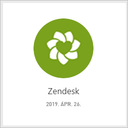
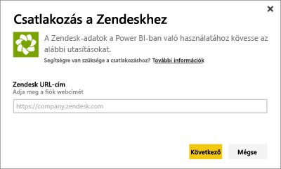
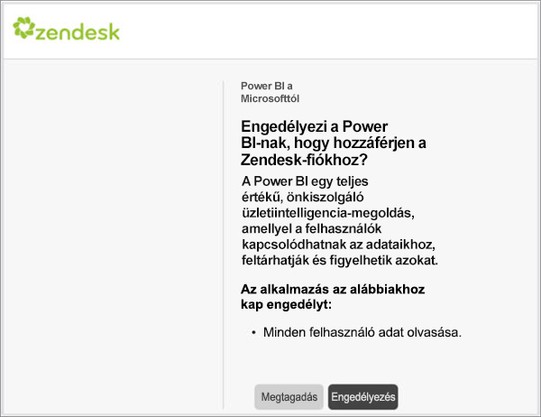
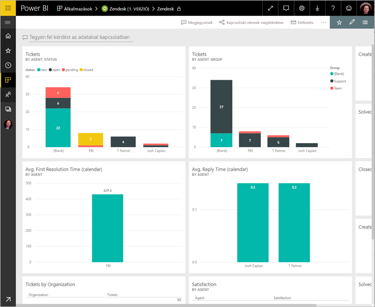
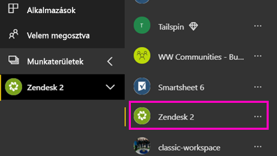
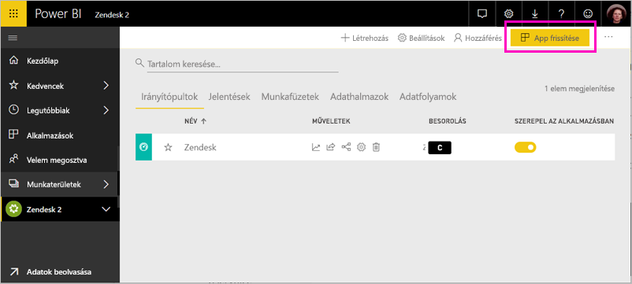

# Csatlakozás a Zendeskhez a Power BI segítségével

Ez a cikk végigvezeti az adatgyűjtés, a Zendesk-fiókja, a Power bi-ban sablon alkalmazással. A Zendesk alkalmazás kínál a Power BI-irányítópult és a Power BI-jelentések adnak a szolgáltatásjegyek mennyiségéről és az ügynök teljesítménye számos. Az adatokat naponta egyszer automatikusan frissíti a rendszer. 

A sablon alkalmazás telepítését követően testreszabhatja az irányítópult és jelentés segítségével az Önt leginkább érdeklő információk kiemeléséhez. Majd terjesztheti azt munkatársainak alkalmazásként a szervezet.

Csatlakozzon a [Zendesk-tartalomcsomaghoz](https://app.powerbi.com/getdata/services/zendesk), vagy olvasson még arról, hogy miképpen jön létre [a Zendesk integrációja](https://powerbi.microsoft.com/integrations/zendesk) a Power BI szolgáltatással.

Ha már telepítette a sablonalapú alkalmazásként, módosíthatja az irányítópultot és jelentést. Majd terjesztheti azt munkatársainak alkalmazásként a szervezet.

>[!NOTE]
>Egy való kapcsolódáshoz Zendesk-rendszergazdai fiók szükséges. A [követelményekkel](#system-requirements) kapcsolatos további információkat lásd alább.

## Csatlakozás

[!INCLUDE [powerbi-service-apps-get-more-apps](./includes/powerbi-service-apps-get-more-apps.md)]

3. Válassza ki **Zendesk** \> **Letöltés most**.
4. A **a Power BI-alkalmazás telepítése?** kiválasztása **telepítése**.
4. Az a **alkalmazások** panelen válassza a **Zendesk** csempére.

    

6. A **az új alkalmazás használatának első lépései**válassza **adatok**.

    

4. Adja meg a fiókjához társított URL-címet. Az URL-címnek az űrlap **https://company.zendesk.com** . A [paraméterek fellelhetőségével](#finding-parameters) kapcsolatos információt lásd alább.
   
   

5. Amikor a rendszer kéri, adja meg Zendesk-fiókja hitelesítő adatait.  Válassza ki az **oAuth 2** hitelesítési mechanizmust, és kattintson a **Bejelentkezés** elemre. Kövesse a Zendesk hitelesítési folyamatát. (Ha Ön már bejelentkezett a Zendesk a böngészőjében, akkor előfordulhat, hogy nem kell hitelesítő adatokat kér.)
   
   > [!NOTE]
   > A tartalomcsomag megköveteli, hogy egy Zendesk-rendszergazdai fiókkal csatlakozzon. 
   > 
   
   
6. Zendesk-adatai eléréséhez kattintson az **Engedélyezés** gombra.
   
   
7. Az importálás megkezdéséhez kattintson a **Csatlakozás** lehetőségre. 
8. Miután a Power BI importálta az adatokat, a tartalmak listája megjelenik a Zendesk-alkalmazáshoz: egy új irányítópult, jelentés és adatkészlet.
9. Válassza ki az irányítópultot a feltárás folyamat elindításához.

    
   
## Módosíthatja, és az alkalmazás terjesztése

A Zendesk-sablon alkalmazást telepítette. Ez azt jelenti, a Zendesk alkalmazás-munkaterület is létrehozott. A munkaterületen a jelentések és irányítópultok módosítsa, majd ezután osztja el, mint egy *alkalmazás* munkatársaknak a szervezetben. 

1. Az új Zendesk-munkaterületen a tartalmát megtekintéséhez a bal oldali navigációs sávon válassza **munkaterületek** > **Zendesk**. 

    

    Ez a nézet a munkaterület számára a tartalmak listája. A jobb felső sarokban látható **app frissítése**. Ha már készen áll az alkalmazást a munkatársai, ez az először lesz. 

    

2. Válassza ki **jelentések** és **adatkészletek** a munkaterület az egyéb elemek megtekintéséhez.

    További információ [alkalmazások terjesztése](service-create-distribute-apps.md) munkatársainak.

## Rendszerkövetelmények
A Zendesk-tartalomcsomaghoz való kapcsolódáshoz Zendesk-rendszergazdai fiók szükséges. Ha Ön ügynök vagy végfelhasználó, és szeretné megtekinteni Zendesk-adatait, adjon hozzá egy javaslatot, és tekintse át a Zendesk-összekötőjét a [Power BI Desktop](desktop-connect-to-data.md).

## Paraméterek helye
A Zendesk-URL-cím megegyezik azzal, amelyet a Zendesk-fiókjába való belépéshez használ. Ha nem biztos a Zendesk-URL-címében, használhatja a Zendesk [bejelentkezési súgóját](https://www.zendesk.com/login/).

## Hibaelhárítás
Ha csatlakozással kapcsolatos problémákat tapasztal, ellenőrizze a Zendesk-URL-CÍMÉT, és ellenőrizze, hogy egy Zendesk-rendszergazdai fiók használata.

## Következő lépések

* [Az új munkaterületek létrehozása a Power bi-ban](service-create-the-new-workspaces.md)
* [Alkalmazások telepítése és használata a Power BI-ban](consumer/end-user-apps.md)
* [Csatlakozás a Power BI alkalmazások külső szolgáltatásokhoz](service-connect-to-services.md)
* Kérdése van? [Kérdezze meg a Power BI közösségét](http://community.powerbi.com/)

