# Alkalmazás közzététele a Power BI-ban

A Power BI-ban hivatalos csomagolt tartalmat hozhat létre és terjeszthet széles körben *alkalmazásként*. Az alkalmazásokat a *munkaterületeken* hozza létre, ahol együttműködhet a Power BI-tartalmakon a munkatársaival. Ezután közzéteheti a kész alkalmazásokat a szervezet számos tagja számára. 

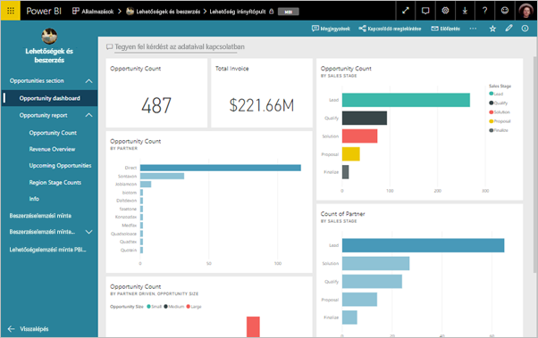

Üzleti felhasználóinak gyakran lehet szükségük több Power BI-irányítópultra vagy -jelentésre az üzletvitelükhöz. A Power BI alkalmazásokkal irányítópult- és jelentésgyűjteményeket hozhat létre, majd alkalmazásként közzéteheti ezeket a gyűjteményeket a teljes vállalat, vagy egy adott személy vagy csoport számára. A jelentés készítője vagy a rendszergazda számára az alkalmazásoknak köszönhetően egyszerűbbé válik a gyűjteményekre vonatkozó engedélyek kezelése.

Az üzleti felhasználók különböző módokon férhetnek hozzá az alkalmazásokhoz:

- Alkalmazását megtalálhatják a Microsoft AppSource-on, és onnan telepíthetik.
- Küldhet nekik közvetlen hivatkozást.
- Ha a Power BI rendszergazda engedélyezi, automatikusan telepítheti az alkalmazást a munkatársai Power BI-fiókjába.

Az alkalmazást saját beépített navigációval is létrehozhatja, hogy a felhasználók könnyen tájékozódhassanak a tartalmak között. Az alkalmazás tartalmát ők nem módosíthatják. Használhatják a Power BI szolgáltatásban vagy valamelyik mobilalkalmazásban is – maguk is szűrhetik, kiemelhetik és rendezhetik az adatokat. A rendszer automatikusan frissíti az alkalmazásokat, és szabályozható, milyen gyakran frissüljenek az adatok. Összeállítási engedélyt is adhat nekik, hogy csatlakozhassanak a mögöttes adathalmazhoz, és másolatokat hozhassanak létre az alkalmazásbeli jelentésekről. További információ: [Összeállítási engedély](service-datasets-build-permissions.md#build-permissions-for-shared-datasets).

## Licencek alkalmazásokhoz
Alkalmazás létrehozásához vagy frissítéséhez Power BI Pro-licenccel kell rendelkeznie. Az alkalmazás *fogyasztói* esetében két lehetőség van.

* **1. lehetőség** Az alkalmazás munkaterülete *nem* Power BI Premium-kapacitásban van: Minden üzleti felhasználónak Power BI Pro licencre van szüksége az alkalmazás megtekintéséhez. 
* **2. lehetőség** Az alkalmazás munkaterülete Power BI Premium-kapacitásban *van*: Az alkalmazás tartalmát a vállalaton belüli üzleti felhasználók Power BI Pro-licenc nélkül is megtekinthetik. A jelentéseket azonban nem másolhatják le, és nem hozhatnak létre jelentéseket a mögöttes adathalmaz alapján. Részletek: [Mi a Power BI Premium?](service-premium.md).

## Az alkalmazás közzététele
Ha a munkaterület irányítópultjai és jelentései elkészültek, kiválaszthatja a közzétenni kívánt irányítópultokat és jelentéseket, majd alkalmazásként közzéteheti. 

1. A munkaterület listanézetében határozhatja meg, mely irányítópultokat és jelentéseket szeretné **felvenni az alkalmazásba**.

     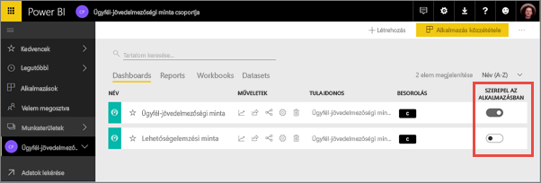

     Ha úgy dönt, hogy nem épít be egy irányítópulthoz tartozó jelentést, akkor a jelentés mellett figyelmeztetés jelenik meg. Az alkalmazást így is közzéteheti, de az érintett irányítópulton nem fognak megjelenni az ebből a jelentésből származó csempék.

     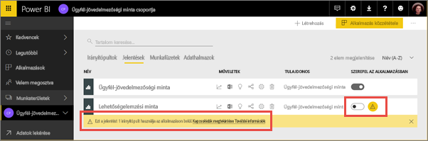

2. A munkaterületről a jobb felső **Alkalmazás közzététele** gombbal indíthatja el az alkalmazás létrehozásának és közzétételének folyamatát.
   
     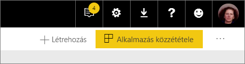

3. A **Beállításnál** töltse ki a nevet és a leírást, hogy mások könnyebben megtalálják az alkalmazást. A személyre szabásához beállíthat egy témaszínt. Felvehet egy támogatási webhelyre mutató hivatkozást is.
   
     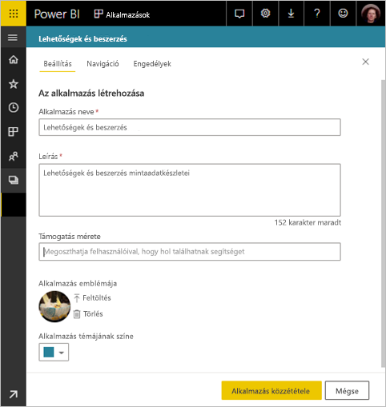

4. A **Navigáció** panelen jelölheti ki az alkalmazás részeként közzétenni kívánt tartalmat. Ez után adhat hozzá alkalmazásnavigációt, hogy szakaszokba szervezze a tartalmat. A részletes ismertetést ennek a cikknek [Az alkalmazás navigációs felületének megtervezése](#design-the-navigation-experience) című szakasza nyújt.
   
     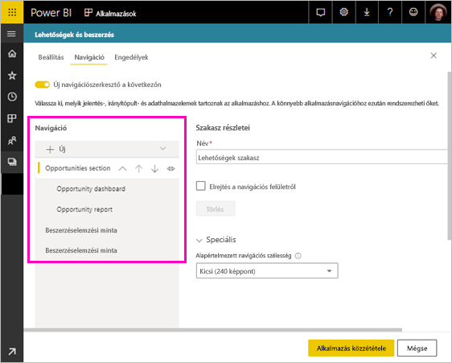

5. A **Jogosultságok** panelen adhatja meg, hogy ki férhet hozzá az alkalmazáshoz, és mit tehet vele. 
    - [Klasszikus munkaterületeken](service-create-workspaces.md): a vállalatnál mindenki, megadott személyek vagy Azure Active Directory (AAD) biztonsági csoportok.
    - [Új felületű munkaterületeken](service-create-the-new-workspaces.md): megadott személyek, AAD biztonsági csoportok és terjesztési listák, valamint Office 365-csoportok. A munkaterület minden felhasználója automatikusan hozzáférést kap az alkalmazáshoz a munkaterületen.
    - Az Összeállítási engedély megadásával engedélyezheti az alkalmazás felhasználóinak, hogy az alkalmazás mögöttes adathalmazaihoz csatlakozzanak. Így ők látni fogják ezeket az adathalmazokat, amikor megosztott adathalmazokat keresnek. Ebben a cikkben több információt is talál [az alkalmazás adathalmazaihoz való kapcsolódás engedélyezéséről felhasználók számára](#allow-users-to-connect-to-datasets).
    - Az összeállítási engedéllyel rendelkező felhasználóknak arra is lehet engedélye, hogy a jelentéseket az alkalmazásból egy másik munkaterületre másolják. Ebben a cikkben több információt is talál [az alkalmazásbeli jelentések másolásának engedélyezéséről felhasználók számára](#allow-users-to-copy-reports).
    
    >[!IMPORTANT]
    >Ha alkalmazása más munkaterületeken lévő adathalmazokra épül, akkor Önnek kell gondoskodnia arról, hogy az alkalmazás összes felhasználója rendelkezzen a mögöttes adathalmazokhoz való hozzáféréssel.
    >

6. Az alkalmazást automatikusan telepítheti a címzettek számára, ha Power BI-rendszergazdája engedélyezte Önnek ezt a beállítást a Power BI Felügyeleti portálon. Az [Alkalmazás automatikus telepítéséről](#automatically-install-apps-for-end-users) bővebben is szó lesz ebben a cikkben.

     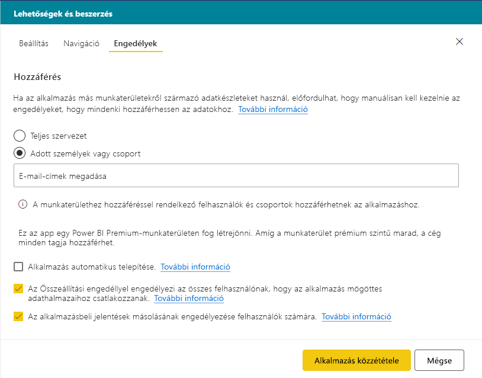

7. Amikor az **Alkalmazás közzététele** lehetőséget választja, a rendszer egy üzenetben kéri, hogy erősítse meg, tényleg készen áll-e a közzétételre. Az **Alkalmazás megosztása** párbeszédpanelről kimásolhatja a közvetlenül az alkalmazásra mutató URL-hivatkozást.
   
     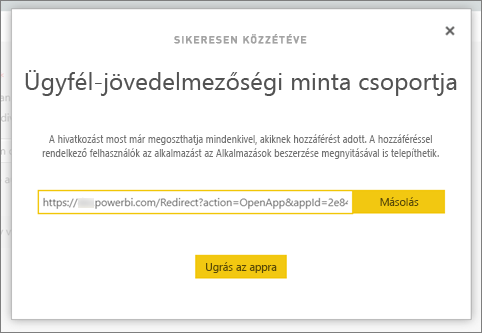

Azoknak, akikkel az alkalmazást megosztotta, elküldheti ezt a közvetlen hivatkozást, de megtalálhatják alkalmazását a **További alkalmazások felfedezése és letöltése az AppSource-ból** helyen az Alkalmazások lapon. További információk az [üzleti felhasználóknak elérhető alkalmazásélményről](consumer/end-user-apps.md).

## A közzétett alkalmazás módosítása
Előfordulhat, hogy módosítani vagy frissíteni szeretné az alkalmazást a közzététel után. A frissítés egyszerű, ha rendszergazda vagy tag az új munkaterületen. 

1. Nyissa meg az alkalmazáshoz tartozó munkaterületet. 
   
     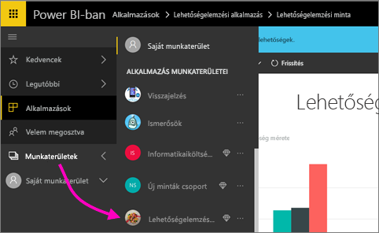

2. Bármilyen módosítást végrehajthat az irányítópultokon és a jelentéseken.
 
     A munkaterület a tervezési terület, tehát a módosításokat a rendszer nem küldi le élőben az alkalmazásba, amíg közzé nem teszi azokat. Ez lehetővé anélkül teszi lehetővé a módosításokat, hogy azok a közzétett alkalmazásokat érintenék.  
 
    > [!IMPORTANT]
    > Ha eltávolít egy jelentést, majd frissíti az alkalmazást, az alkalmazás fogyasztói akkor is elvesztik az összes személyre szabást, például a könyvjelzőket és megjegyzéseket, ha a jelentést újra hozzáadja.  
 
3. Térjen vissza a munkaterület tartalomjegyzékéhez, és válassza az **Alkalmazás frissítése** lehetőséget a jobb felső sarokban.
   
1. Ha szükséges, módosítsa a **Beállításokat**, a **Navigációt** és az **Engedélyeket**, majd válassza az **Alkalmazás frissítése** lehetőséget.
   
Azok, akikkel megosztotta az alkalmazást, automatikusan az alkalmazás frissített verzióját látják. 

## A navigációs felület megtervezése
Az **Új navigáció készítő** lehetőséggel egyéni navigációt készíthet alkalmazásához. Az egyéni navigáció megkönnyíti felhasználói számára az alkalmazásban lévő tartalom megkeresését és használatát. A meglévő alkalmazásokhoz ez a lehetőség ki van kapcsolva, az új alkalmazásokhoz pedig alapértelmezés szerint be van kapcsolva.

Amikor ez a lehetőség ki van kapcsolva, az **Alkalmazás kezdőlapja** lehet egy **Megadott tartalom**, például irányítópult vagy jelentés, vagy a **Nincs** beállítás, hogy a felhasználónak a tartalmak alapszintű listája jelenjen meg.

Az **Új navigáció készítése** bekapcsolásával egyéni navigációt tervezhet. Alapértelmezés szerint az alkalmazásba foglalt összes jelentés, irányítópult és Excel-munkafüzet egy egyszintű listában jelenik meg. 

Az alkalmazásbeli navigációt a következőkkel is testre szabhatja:
* Az elemek átrendezése a fel / le nyilak használatával. 
* A **Jelentés adatai**, az **Irányítópult adatai** és a **Munkafüzet adatai** elemeinek átnevezése.
* Egyes elemek elrejtése a navigációban.
* **Szakaszok** hozzáadása az összetartozó tartalmak csoportosításához az **Új** lehetőséggel.
* Külső forrás felvétele a bal oldali navigációhoz az **Új** lehetőséggel hozzáadott **hivatkozással**. 

**Hivatkozás** hozzáadásakor a **Hivatkozás adatai** között megadhatja, hogy hol nyíljon meg a hivatkozás. A hivatkozás alapértelmezés szerint az **aktuális lapon** nyílik meg, de választhatja az **Új lap** vagy a **Tartalomterület** lehetőséget is. 

### Az új navigáció készítésekor megfontolandó szempontok
Az alábbiakat általában érdemes szem előtt tartani az új navigáció készítése lehetőség használatakor:
* A jelentésoldalak kibontható szakaszként jelennek meg az alkalmazás navigációs területén.
* Ha kikapcsolja az új navigáció készítőt, majd közzéteszi vagy frissíti az alkalmazást, az elvégzett testreszabások elvesznek. Elvesznek például a szakaszok, a rendezés, a hivatkozások és a navigációs elemek egyéni nevei.

Amikor hivatkozásokat ad az alkalmazásnavigációhoz és a Tartalomterület lehetőséget választja:
* Ellenőrizze, hogy a hivatkozás beágyazható-e. Bizonyos szolgáltatások blokkolják a tartalmuk beágyazását olyan külső webhelyeken, amilyen a Power BI.
* Olyan Power BI-szolgáltatástartalmak, mint a jelentések és irányítópultok más munkaterületeken való beágyazása nem támogatott. 
* Power BI jelentéskészítő kiszolgáló-tartalmat annak natív beágyazási URL-tartalmával ágyazhat be annak helyszíni üzemelő példányából. Az URL beszerzéséhez hajtsa végre a [Power BI jelentéskészítő kiszolgálóval készült jelentés URL-címének létrehozása](https://docs.microsoft.com/power-bi/report-server/quickstart-embed#create-the-power-bi-report-url) című szakaszban leírt lépéseket. Tartsa szem előtt, hogy a szokásos hitelesítési szabályok érvényesek, így a tartalom megtekintéséhez a helyszíni kiszolgálóval való VPN-kapcsolat szükséges. 
* A beágyazott tartalom felső részén figyelmeztetés jelenik meg arról, hogy a tartalom nem Power BI-beli.

## Alkalmazások automatikus telepítése a végfelhasználók számára
Ha egy rendszergazda erre jogosultságot ad Önnek, automatikusan telepíthet alkalmazásokat úgy, hogy *leküldi* azokat a végfelhasználóknak. Ezzel a leküldési funkcióval egyszerűbben terjeszthető a megfelelő alkalmazás a megfelelő személyek vagy csoportok körében. Alkalmazása automatikusan megjelenik a végfelhasználók Alkalmazások tartalomlistájában. Nekik nem kell a Microsoft AppSource-on megkeresniük, vagy telepítési hivatkozást követniük. A Power BI Felügyeleti portál cikkéből megtudhatja, hogyan engedélyezhetik a rendszergazdák az [alkalmazások végfelhasználókhoz való leküldését](service-admin-portal.md#push-apps-to-end-users).

### Alkalmazás automatikus leküldése végfelhasználókhoz
Ha egy rendszergazda jogosultságot adott erre Önnek, **automatikusan telepítheti az alkalmazást**. Ha bejelöli a négyzetet, és kiválasztja az **Alkalmazás közzététele** (vagy az **Alkalmazás frissítése**) lehetőséget, az alkalmazás el lesz küldve a **Hozzáférés** lap **Engedélyek** szakaszában meghatározott felhasználóknak vagy csoportoknak.

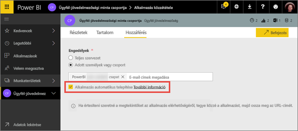

### A küldött alkalmazások felhasználói használatba vétele
Egy alkalmazás leküldéses továbbítása után az automatikusan megjelenik a felhasználók alkalmazásainak listájában. Ezen a módon az alkalmazásokat úgy válogathatja, hogy csak az egy adott felhasználói csoport vagy szervezeti szerepkör számára szükségesek jelenjenek meg.

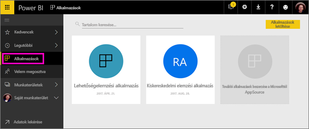

### Alkalmazások automatikus telepítése – megfontolandó szempontok
Az alkalmazások leküldéses továbbítása során az alábbiakra érdemes ügyelni:

* Az alkalmazások automatikus telepítése a felhasználók számára időbe telik. A legtöbb alkalmazás telepítése azonnal megtörténik, a leküldött alkalmazásoké azonban több időt vehet igénybe.  Ez az alkalmazás elemeinek és a hozzáféréssel rendelkező személyek számától függ. Azt javasoljuk, hogy az alkalmazásleküldést munkaidőn kívül, jóval azelőtt végezze el, hogy a felhasználóknak szükségük lenne az alkalmazásokra. Egyeztessen több felhasználóval, mielőtt mindenkinek bejelentené az alkalmazás elérhetőségét.

* Frissítse a böngészőt. Előfordulhat, hogy a felhasználóknak frissíteniük kell vagy újból meg kell nyitniuk a böngészőjüket.

* Ha az alkalmazás nem jelenik meg azonnal az alkalmazáslistában, a felhasználók frissítsék vagy nyissák meg újra a böngészőt.

* Lehetőleg ne terhelje túl a felhasználókat. Ne küldjön egyszerre túl sok alkalmazást, hogy a felhasználók az előtelepített alkalmazásokat is hasznosnak érezhessék. Célszerű megszabni, hogy ki küldhet alkalmazásokat a végfelhasználóknak, és együttműködni ennek időzítésében. A szervezeti alkalmazások végfelhasználóknak való leküldéséhez hozzon létre egy kapcsolatfelvételi pontot.

* Azoknál a vendégfelhasználóknál, akik nem fogadták el a meghívást, az alkalmazások nem lesznek automatikusan telepítve.  

## Adathalmazokhoz való kapcsolódás engedélyezése felhasználók számára

**A felhasználók csatlakozhatnak az alkalmazás mögöttes adathalmazaihoz** lehetőség bejelölésével *Összeállítási engedélyt* ad az alkalmazás felhasználóinak ezekre az adathalmazokra. Ennek az engedélynek a birtokában több fontos műveletet végrehajthatnak:

- [Használhatják az alkalmazás adathalmazait](service-datasets-across-workspaces.md) a saját jelentéseik alapjaként.
- Megkereshetik ezeket az adathalmazokat a Power BI Desktopban és a Power BI szolgáltatás adatlekérési felületén.
- Jelentéseket és irányítópultokat hozhatnak létre ezen adathalmazok alapján.

Ha kikapcsolja ezt a beállítást, az alkalmazáshoz felvett új felhasználók már nem kapnak Összeállítási engedélyt. Az alkalmazás meglévő felhasználóinak a mögöttes adathalmazra vonatkozó engedélyei viszont nem módosulnak. Manuálisan is megvonhatja az Összeállítási engedélyt azoktól a felhasználóktól, akiknek már nem kell rendelkezniük vele. További információ: [Összeállítási engedély](service-datasets-build-permissions.md#build-permissions-for-shared-datasets).

## Jelentések másolásának engedélyezése felhasználók számára

Ha bejelöli **A felhasználók másolatot készíthetnek az alkalmazásbeli jelentésekről** beállítást, akkor a felhasználók az alkalmazás bármelyik jelentését a saját munkaterületükre vagy más munkaterületre menthetik. Másolat készítéséhez a felhasználóknak Pro-licencre van szükségük, még akkor is, ha az eredeti jelentés egy Premium-kapacitásbeli munkaterületen található. Ez után egyéni igényeik szerint testreszabhatják a jelentéseket. Először be kell jelölnie a **Minden felhasználó csatlakozhat az alkalmazás mögöttes adathalmazaihoz az Összeállítási engedély használatával** beállítást. Ezeknek a beállításoknak a megadásával engedélyezi az új [jelentések másolása más munkaterületekről](service-datasets-copy-reports.md) képességet.

## Alkalmazás közzétételének visszavonása
Egy munkaterület bármely tagja visszavonhatja az alkalmazás közzétételét.

>[!IMPORTANT]
>Ha visszavonja egy alkalmazás közzétételét, az alkalmazás felhasználóinak testreszabásai elvesznek. Az alkalmazás tartalmához csatolt összes személyes könyvjelzőt, megjegyzést és előfizetést elveszítenek. Alkalmazás közzétételét csak akkor szüntesse meg, ha el szeretné távolítani az alkalmazást.
> 

* A munkaterületen válassza a jobb felső sarokban a három pontot ( **...** ), majd az **Alkalmazás közzétételének visszavonása** lehetőséget.
  
     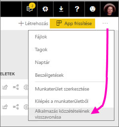

Ez a művelet törli az alkalmazás telepítését mindenkitől, akivel megosztotta, és ezután nem fognak hozzáférni. Ezzel nem törli a munkaterületet vagy annak tartalmát.

## A közzétett alkalmazás megtekintése

Amikor az alkalmazás fogyasztói megnyitják az alkalmazást, a Power BI szabványos bal oldali navigációs panelje helyett az Ön által létrehozott navigáció jelenik meg. Az alkalmazásnavigáció az Ön által megadott szakaszokban sorolja fel a jelentéseket és az irányítópultokat. Nem csak a jelentés neve jelenik meg, a jelentések egyes oldalait is külön listázza ki.

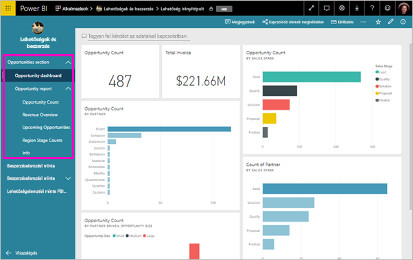

## Megfontolandó szempontok és korlátozások
Alkalmazás közzétételekor a következőket kell szem előtt tartani:

* Az alkalmazás hozzáférési listájában legfeljebb 100 felhasználó vagy csoport szerepelhet. Az alkalmazáshoz azonban 100-nál több felhasználónak is adhat hozzáférést. Ehhez használjon egy vagy több csoportot, amelyek ezeket a felhasználókat tartalmazzák.
* Az új munkaterület esetében azok az alkalmazás hozzáférési listájára felvett felhasználók, akik a munkaterületen keresztül már rendelkeznek hozzáféréssel, nem jelennek meg az alkalmazás hozzáférési listájában.  

## Következő lépések
* [Munkaterület létrehozása](service-create-workspaces.md)
* [Alkalmazások telepítése és használata a Power BI-ban](consumer/end-user-apps.md)
* [Power BI alkalmazások külső szolgáltatásokhoz](service-connect-to-services.md)
* [Power BI Felügyeleti portál](https://docs.microsoft.com/power-bi/service-admin-portal)
* Kérdése van? [Kérdezze meg a Power BI közösségét](http://community.powerbi.com/)
