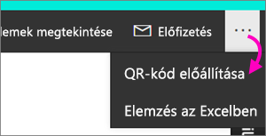
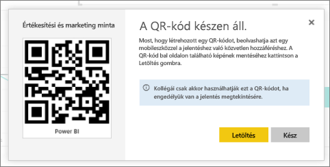

# QR-kód létrehozása jelentéshez a Power BI-ban a mobilalkalmazásokban való használathoz
A Power BI-ban a QR-kódok a való világból bármit képesek közvetlenül a hozzájuk kapcsolódó BI-információkhoz kapcsolni – nincs szükség keresésre vagy navigálásra.

Bármilyen jelentéshez létrehozhat QR-kódot a Power BI szolgáltatásban, még a nem szerkeszthető jelentésekhez is. Ezután elhelyezheti a QR-kódot a kívánt helyen. Beillesztheti például egy e-mailbe, vagy kinyomtathatja és elhelyezheti egy adott helyen. 

A munkatársak, akikkel megosztotta a jelentést, beolvashatják a QR-kódot, így a jelentést közvetlenül [a mobileszközükön](consumer/mobile/mobile-apps-qr-code.md) érhetik el. Ezt megtehetik a Power BI alkalmazásban található QR-kód leolvasóval, vagy bármilyen más QR-kód leolvasóval, amely telepítve van az eszközeiken. [A jelentés QR-kódját a Power BI vegyes valósághoz alkalmazással is beolvashatják](consumer/mobile/mobile-mixed-reality-app.md#scan-a-report-qr-code-in-holographic-view).

## QR-kód létrehozása jelentéshez
1. Nyisson meg egy jelentést a Power BI szolgáltatásban.
2. Kattintson a jobb felső sarokban lévő **További beállítások** (...) elemre, és válassza a **QR-kód előállítása** lehetőséget. 
   
    
3. Megjelenik egy párbeszédpanel a QR-kóddal. 
   
    
4. Innen beolvashatja a QR-kódot, vagy letöltheti és mentheti, hogy a következőket tehesse: 
   
   * QR-kód hozzáadása e-mail-üzenethez vagy más dokumentumhoz, illetve 
   * QR-kód kinyomtatása és adott helyre való elhelyezése. 

## A QR-kód kinyomtatása
A Power BI JPG-fájlként hozza létre a QR-kódot, nyomtatásra készen. 

1. Válassza a **Letöltés** elemet, majd nyissa meg a JPG-fájlt egy nyomtatóhoz csatlakoztatott számítógépen.  
   
   A JPG-fájl neve megegyezik a csempe nevével. Például „Értékesítési és marketing minta.jpg”.
   
1. A fájlt 100%-os vagy tényleges méretben nyomtassa ki.  
2. Vágja ki a QR-kódot az élei mentén, és ragassza fel a jelentés szempontjából alkalmas helyre. 

## További lépések
* [Power BI-információk elérése a való világból](consumer/mobile/mobile-apps-data-in-real-world-context.md) a mobilalkalmazásokkal
* [Power BI QR-kódjának beolvasása mobileszközről](consumer/mobile/mobile-apps-qr-code.md)
* [QR-kód létrehozása csempéhez](service-create-qr-code-for-tile.md)
* Kérdései vannak? [Kérdezze meg a Power BI-közösséget](https://community.powerbi.com/)

