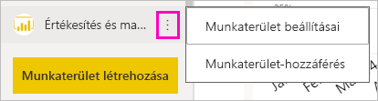
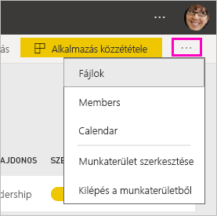
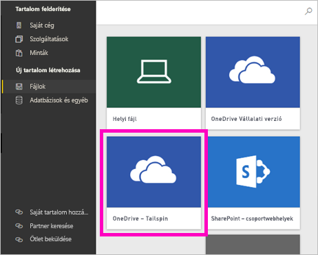
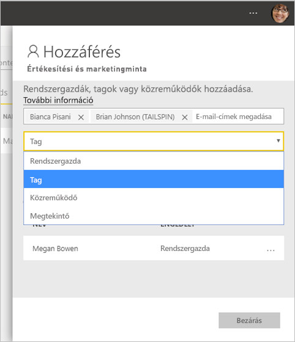

# Új munkaterületek létrehozása a Power BI-ban

A Power BI új munkaterületi felhasználói felületet mutat be. A munkaterületeken továbbra is együttműködhet munkatársaival irányítópult-, jelentés- és lapszámozott jelentésgyűjtemények létrehozásához. Egy ilyen gyűjteményt később egy *alkalmazásba* csomagolhat és terjesztheti azt a teljes szervezetben vagy meghatározott személyek és csoportok számára. 

A különbségek a következők. Az új munkaterületeken a következőket végezheti el:

- Munkaterület-szerepköröket rendelhet felhasználói csoportokhoz: biztonsági csoportokhoz, terjesztési listákhoz, Office 365-csoportokhoz és egyéni felhasználókhoz.
- Office 365-csoport létrehozása nélkül hozhat létre egy Power BI-munkaterületet.
- Részletesebb munkaterület-szerepköröket használhat, amelyekkel rugalmasabb engedélykezelést érhet el a munkaterületeken.

> [!NOTE]
> Ha sorszintű biztonságot (RLS) szeretne érvényesíteni a munkaterület tartalmát tallózó Power BI Pro-felhasználók számára, rendelje hozzá a felhasználókhoz a Megtekintő szerepkört.

További háttér-információkat talál az [új munkaterületekről](service-new-workspaces.md) szóló cikkben.

## Új típusú munkaterület létrehozása

1. Kezdjük a munkaterület létrehozásával. Válassza a **Munkaterületek** > **Munkaterület létrehozása** lehetőséget.
   
     

2. Automatikusan egy továbbfejlesztett munkaterületet fog létrehozni, ha nem a **Visszaállítás klasszikusra** beállítást választotta.
   
     
     
     Ha a **Visszaállítás klasszikusra** beállítást választja, egy [Office 365-csoport alapján hoz létre munkaterületet](service-create-workspaces.md). 

2. Nevezze el a munkaterületet. Ha a név nem használható, szerkesztéssel hozzon létre egy egyedi nevet.
   
     A munkaterülethez tartozó alkalmazás neve és ikonja ugyanaz lesz, mint a munkaterületé.
   
1. A munkaterülethez többek között az alábbi elemeket is beállíthatja:

    Feltölthet egy **képet a munkaterülethez**. A fájlok formátuma .png vagy .jpg lehet. A fájlméret nem haladhatja meg a 45 kilobájtot.
    
    [Felvehet egy **Címlistát**](#workspace-contact-list). Az alapértelmezett partnerek a munkaterület rendszergazdái. 
    
    [Megadhat egy **munkaterületi OneDrive-ot**](#workspace-onedrive). Ehhez elég egy meglévő Office 365-csoport nevét megadni, az URL-cím nem szükséges. Így a munkaterület használhatja az Office 365-csoport fájltárolási helyét. 

    

    A munkaterület **dedikált kapacitáshoz** rendeléséhez a **Prémium** lapon válassza a **Dedikált kapacitás** lehetőséget.
     
    

1. Kattintson a **Mentés** gombra.

    A Power BI létrehozza és megnyitja a munkaterületet. Megjelenik az olyan munkaterületek listájában, amelyeknek Ön a tagja. 

## Munkaterületi címlista

Az új munkaterületi címlistával meghatározhatja, hogy mely felhasználók kapjanak értesítést a munkaterületen felmerülő problémákról. Alapértelmezés szerint minden munkaterület-rendszergazdaként megadott felhasználó vagy csoport értesítést kap, de Ön testre szabhatja a listát. A címlistában felsorolt felhasználók vagy csoportok a felhasználói felületen is fel vannak tüntetve, megkönnyítve a felhasználók számára a munkaterülettel kapcsolatos segítségkérést.

1. Az új **Címlista** beállításai az alábbi módszerek egyikével érhetők el:

    A **Munkaterület létrehozása** panelen, amikor először létrehozza.

    A bal oldali navigációs panelen válassza a **Munkaterületek** elem melletti nyilat, majd a munkaterület neve melletti három pontot (...), végül a **Munkaterület beállításai** menüpontot. Megnyílik a **Beállítások** panel.

    

2. A **Speciális** > **Címlista** területen fogadja el az alapértelmezett **Munkaterület-rendszergazdák** beállítást, vagy vegye fel a **Megadott felhasználók vagy csoportok** saját listáját. 
3. Kattintson a **Mentés** gombra.

## Munkaterületi OneDrive

A munkaterületi OneDrive funkcióval olyan Office 365-csoportot konfigurálhat, amelynek SharePoint-dokumnetumtárbeli fájltárolója elérhető a munkaterület felhasználói számára. A csoportot először a Power BI-on kívül kell létrehoznia. 

A Power BI nem szinkronizálja azon felhasználók és csoportok jogosultságait, akik számára Office 365-csoporttagsággal van konfigurálva a munkaterülethez való hozzáférés. Annak az Office 365-csoportnak, amelynek a fájltárolóját ebben a beállításban konfigurálja, ajánlott [hozzáférést adni a munkaterülethez](#give-access-to-your-workspace). A munkaterület-hozzáférés ekkor az Office 365-csoport tagságán keresztül kezelhető. 

1. Az új **Munkaterületi OneDrive** beállítás két módon érhető el:

    A **Munkaterület létrehozása** panelen, amikor először létrehozza.

    A bal oldali navigációs panelen válassza a **Munkaterületek** elem melletti nyilat, majd a munkaterület neve melletti három pontot (...), végül a **Munkaterület beállításai** menüpontot. Megnyílik a **Beállítások** panel.

    

2. A **Speciális** > **Munkaterületi OneDrive** területen gépelje be a korábban létrehozott Office 365-csoport nevét. A Power BI automatikusan felveszi a csoporthoz tartozó OneDrive-ot.

    

3. Kattintson a **Mentés** gombra.

### Hozzáférés a munkaterületi OneDrive-helyhez

A OneDrive-hely konfigurálása után több helyről is elérheti azt a munkaterületen:

- Válassza a **Munkaterületek** > *munkaterület neve* > három pont ( **...** ) menü **Fájlok** pontját. 

    

- Válassza a munkaterület jobb felső sarkában a három pont ( **...** ) menüt, majd a **Fájlok** lehetőséget.

    
    
- Az **Adatok lekérése** > **Fájlok** felületen. A **OneDrive – Vállalati** elem a saját Vállalati OneDrive. A második OneDrive az, amelyet most vett fel.

    

## Tartalom hozzáadása a munkaterülethez

Az új felületű munkaterület létrehozása után ideje feltölteni azt tartalommal. A fájlok hozzáadása hasonlóan végezhető el az új és a klasszikus munkaterületeken. A Létrehozás gomb, vagy az Adatok lekérése lehetőség használatával is vehet fel tartalmat a munkaterületre.

1. Az új munkaterület **üdvözlőképernyőjén** is vehet fel tartalmat. 

    

1. Válassza például a **Minták** > **Ügyfél-jövedelmezőségi minta** lehetőséget.

> [!NOTE]
> Vállalati tartalomcsomagokat vagy külső tartalomcsomagokat nem vehet fel az új munkaterületekre. A korábban használt külső tartalomcsomagokhoz alkalmazások állnak rendelkezésre. Ha továbbra is tartalomcsomagokat kell használnia, használjon klasszikus munkaterületeket. A tartalomcsomagok elavultak, ezért ajánlott inkább alkalmazásokat használni.

Ha egy munkaterület tartalomlistájában tekint meg tartalmat, a munkaterület neve tulajdonosként lesz feltüntetve.

### Csatlakozás a külső szolgáltatásokhoz az új munkaterületeken

Az új munkaterületek felületén az *alkalmazásokra* helyezzük a hangsúlyt. A külső szolgáltatások alkalmazásaival a felhasználók könnyen lekérhetik a használt szolgáltatások, például a Microsoft Dynamics CRM, a Salesforce vagy a Google Analytics adatait.

Az új munkaterületi felületen nem lehet céges tartalomcsomagokat létrehozni vagy telepíteni. Ehelyett a megadott alkalmazásokkal csatlakozhat külső szolgáltatásokhoz, vagy megkérheti a belső csapatokat, hogy szolgáltassanak alkalmazásokat a jelenleg használt tartalomcsomagokhoz. 

## Munkaterület-hozzáférés megadása

1. A munkaterület tartalomlistájában rendszergazdaként egy új, **Hozzáférés** műveletet lát.

    

1. Válassza a **Hozzáférés** lehetőséget.

1. Adjon hozzá biztonsági csoportokat, terjesztési listákat, Office 365-csoportokat vagy egyéni felhasználókat a munkaterületekhez tagként, közreműködőként vagy rendszergazdaként. A különböző szerepkörök ismertetését [Az új munkaterületek szerepkörei](service-new-workspaces.md#roles-in-the-new-workspaces) című szakaszban találhatja.

    

9. Válassza a **Hozzáadás** > **Bezárás** lehetőséget.

## Alkalmazások terjesztése

Ha a szervezeten belül nagy közönség számára szeretne hivatalos tartalmat terjeszteni, közzétehet egy alkalmazást a munkaterületről.  Ha a tartalom elkészült, kiválaszthatja a közzétenni kívánt irányítópultokat és jelentéseket, amelyeket közzétehet *alkalmazásként*. Minden munkaterületről létrehozhat egy alkalmazást.

További tudnivalók [alkalmazás közzétételéről az új munkaterületeken](service-create-distribute-apps.md)

## Következő lépések
* Olvassa el a [munka rendszerezése az új munkaterületi felületen a Power BI-ban](service-new-workspaces.md) szakaszt
* [Klasszikus munkaterületek létrehozása](service-create-workspaces.md)
* [Alkalmazás közzététele a Power BI új munkaterületeiről](service-create-distribute-apps.md)
* Kérdése van? [Kérdezze meg a Power BI közösségét](http://community.powerbi.com/)
