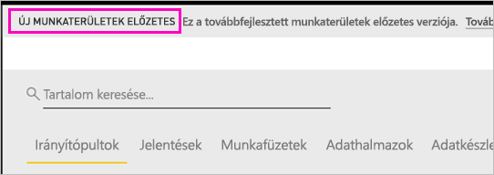
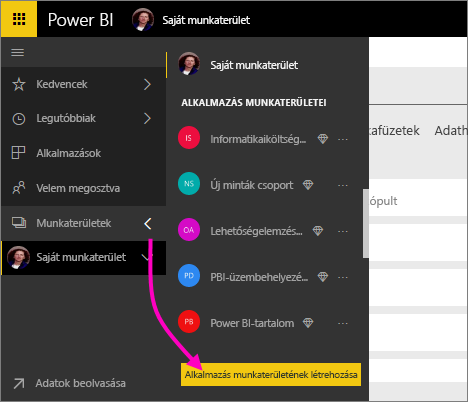
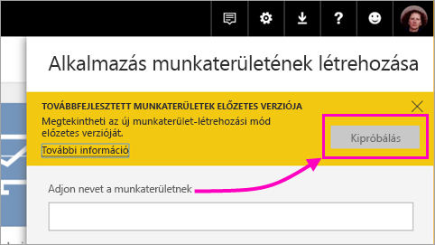
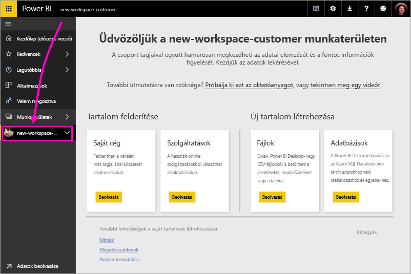
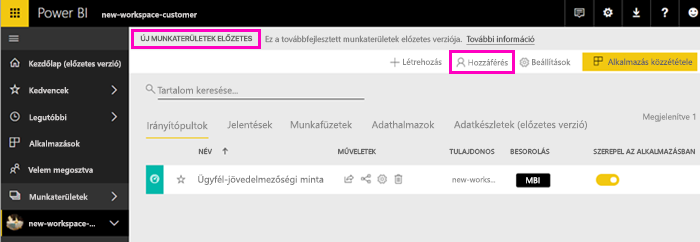
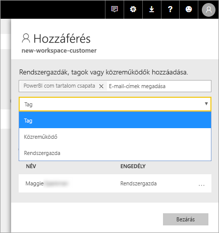
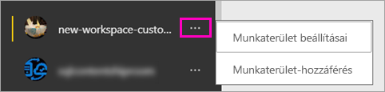

# Új munkaterületek létrehozása a Power BI-ban (előzetes verzió)

A Power BI egy előzetes verziójú, új munkaterületi felhasználói felületet mutat be. A munkaterületeken együttműködhet munkatársaival, hogy irányítópult- és jelentésgyűjteményeket hozzanak létre, amelyeket *alkalmazásokba* csomagolhatnak, majd közzétehetik a teljes vállalat, vagy egy adott személy vagy csoport számára. 

Az előzetes verziójú munkaterületekkel a következőket végezheti el:

- Munkaterület-szerepköröket rendelhet felhasználói csoportokhoz: biztonsági csoportokhoz, terjesztési listákhoz, Office 365-csoportokhoz és egyéni felhasználókhoz.
- Office 365-csoport létrehozása nélkül hozhat létre egy Power BI-munkaterületet.
- Részletesebb munkaterület-szerepköröket használhat, amelyekkel rugalmasabb engedélykezelést érhet el a munkaterületeken.

További háttér-információkért lásd az [Új munkaterületek (előzetes verzió)](service-new-workspaces.md) cikket.

## Új típusú alkalmazás-munkaterület létrehozása

1. Kezdje az alkalmazás-munkaterület létrehozásával. Válassza a **Munkaterületek** > **Alkalmazás munkaterületének létrehozása** lehetőséget.
   
     

2. A **Továbbfejlesztett munkaterületek** – előzetes verzió területen válassza a **Kipróbálás** lehetőséget.
   
     

2. Nevezze el a munkaterületet. Ha a név nem használható, szerkesztéssel hozzon létre egy egyedi azonosítót.
   
     Az alkalmazás neve meg fog egyezni a munkaterület nevével.
   
1. Ha kívánja, hozzáadhat egy képe. A fájlméret nem haladhatja meg a 45 kilobájtot.
 
    

1. Kattintson a **Mentés** gombra.

    Az új munkaterület **üdvözlőképernyőjén** adatokat adhat hozzá. 

    

1. Válassza például a **Minták** > **Ügyfél-jövedelmezőségi minta** lehetőséget.

    Ekkor a munkaterület tartalomlistájában megjelenik az **Új előzetes verziós munkaterületek** elem. Mivel Ön rendszergazda, egy új művelet is megjelenik, a **Hozzáférés**.

    

1. Válassza a **Hozzáférés** lehetőséget.

1. Adjon hozzá biztonsági csoportokat, terjesztési listákat, Office 365-csoportokat vagy egyéni felhasználókat a munkaterületekhez tagként, közreműködőként vagy rendszergazdaként. A különböző szerepkörök ismertetését [Az új munkaterületek szerepkörei](service-new-workspaces.md#roles-in-the-new-workspaces) című szakaszban találhatja.

    

9. Válassza a **Hozzáadás** > **Bezárás** lehetőséget.

1. A Power BI létrehozza és megnyitja a munkaterületet. Megjelenik az olyan munkaterületek listájában, amelyeknek Ön a tagja. Mivel adminisztrátori jogosultsággal rendelkezik, a három pontra (...) kattintva visszaléphet, és módosíthatja a munkaterület beállításait, például új tagokat adhat hozzá vagy módosíthatja a tagok jogosultságait.

     

## Tartalom hozzáadása az alkalmazás-munkaterülethez

Az új típusú alkalmazás-munkaterület létrehozása után ideje feltölteni azt tartalommal. A tartalom hozzáadása hasonlóan működik a régi és új típusú munkaterületeken is, egyetlen kivétellel. Amíg valamelyik alkalmazás-munkaterületen van, feltölthet tartalmat vagy csatlakozhat fájlokhoz, pont mintha a Saját munkaterületén lenne. Az új munkaterületeken azonban nem csatlakozhat szervezeti, valamint külső tartalomcsomagokhoz, például a Microsoft Dynamics CRM-hez, a Salesforce-hoz és a Google Analyticshez. A jelenlegi munkaterületen csatlakozhat tartalomcsomagokhoz.

Ha egy alkalmazás-munkaterület tartalomlistájában tekint meg tartalmat, az alkalmazás-munkaterület neve tulajdonosként lesz feltüntetve.

### Csatlakozás a külső szolgáltatásokhoz az új munkaterületeken (előzetes verzió)

Az új munkaterületek felületén az *alkalmazásokra* helyezzük a hangsúlyt. A külső szolgáltatások alkalmazásaival a felhasználók könnyen lekérhetik a használt szolgáltatások, például a Microsoft Dynamics CRM, a Salesforce vagy a Google Analytics adatait.
A szervezeti alkalmazásokkal a felhasználók megkaphatják a szükséges belső adatokat. Tervezzük szervezeti alkalmazásfunkciók hozzáadását is, így a felhasználók testreszabhatják az alkalmazások tartalmait. Ezekkel a funkciókkal nem lesz szükség tartalomcsomagokra. 

Az előzetes verziójú, új munkaterületekkel nem lehet létrehozni vagy telepíteni céges tartalomcsomagokat. Ehelyett a megadott alkalmazásokkal csatlakozhat külső szolgáltatásokhoz, vagy megkérheti a belső csapatokat, hogy szolgáltassanak alkalmazásokat a jelenleg használt tartalomcsomagokhoz. 

## Alkalmazások terjesztése

Ha a tartalom elkészült, kiválaszthatja a közzétenni kívánt irányítópultokat és jelentéseket, amelyeket közzétehet *alkalmazásként*. Minden munkaterületről létrehozhat egy alkalmazást. A munkatársai különböző módokon férhetnek hozzá az alkalmazáshoz. Ha a Power BI rendszergazda engedélyezi, automatikusan telepítheti az alkalmazást a munkatársai Power BI-fiókjába. Ha nem, megkereshetik az alkalmazást a Microsoft AppSource-ban, és telepíthetik, vagy küldhet nekik egy közvetlen hivatkozást. A rendszer automatikusan frissíti az alkalmazásokat, és szabályozható, milyen gyakran frissüljenek az adatok. További információ: [Irányítópultokból és jelentésekből álló alkalmazások közzététele a Power BI-ban](service-create-distribute-apps.md).

## Régi alkalmazás-munkaterületek konvertálása új alkalmazás-munkaterületekké

Az előzetes verzió időtartama alatt nem konvertálhat automatikusan régi típusú alkalmazás-munkaterületeket új típusúakká. Létrehozhat azonban egy új alkalmazás-munkaterületet, és közzéteheti rajta a tartalmait. 

Az új típusú munkaterületek általános elérhetővé válásakor igény szerint automatikusan migrálhatja a régi munkaterületeket. Az általános elérhetővé válás után egy idővel kötelező lesz a migrálás.

## Következő lépések
* Olvassa el a [munka rendszerezése az új munkaterületen (előzetes verzió) a Power BI-ban](service-new-workspaces.md) szakaszt.
* [Jelenlegi munkaterületek létrehozása](service-create-workspaces.md)
* [Alkalmazások telepítése és használata a Power BI-ban](service-create-distribute-apps.md)
* Kérdése van? [Kérdezze meg a Power BI közösségét](http://community.powerbi.com/)
