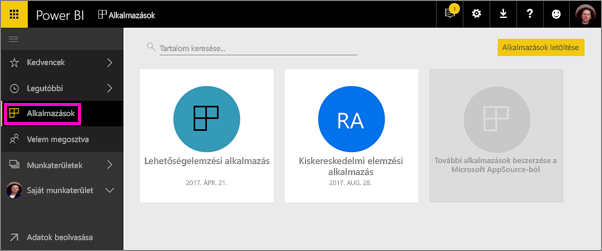
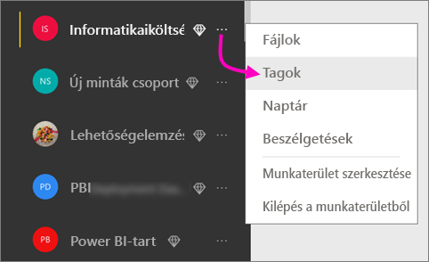
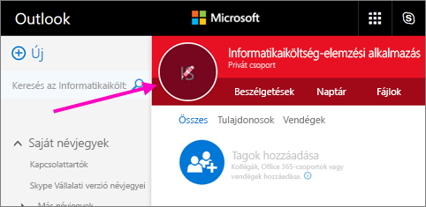
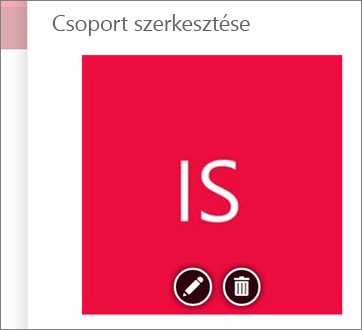
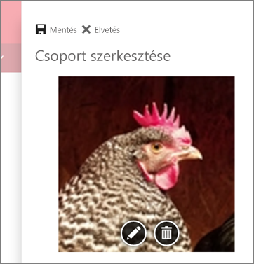
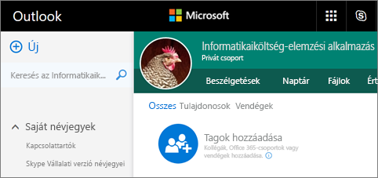
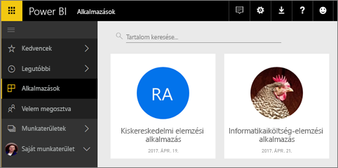

# Munkaterületek létrehozása munkatársakkal a Power BI-ban

A Power BI-ban létrehozhat *munkaterületeket*, amelyeken együttműködhet munkatársaival irányítópult- és jelentésgyűjtemények létrehozásán és finomításán. A kollekciót később olyan *alkalmazásokba* csomagolhatja, amelyeket a teljes szervezet vagy csak adott személyek vagy csoportok számára terjeszthet. 

Amikor létrehoz egy munkaterületet, egy mögöttes, társított Office 365-csoportot is létrehoz. A munkaterület felügyelete az Office 365-ben zajlik. A kollégákat hozzáadhatja tagként vagy rendszergazdaként ezekhez a munkaterületekhez. A munkaterületen együttműködhetnek az irányítópultokon, jelentéseken és más cikkeken, amelyeket a szélesebb közönség elé szeretne tárni. Az alkalmazás-munkaterületekhez adott tagoknak Power BI Pro-licencre van szüksége. 

**Tudta?** A Power BI előzetes verziójú, új munkaterületi felhasználói felületet kínál. Az új munkaterületekről a [Munka szervezése az új munkaterületeken (előzetes verzió)](service-new-workspaces.md) című cikkből tájékozódhat részletesen. 

## Videó: Alkalmazások és alkalmazás-munkaterületek
<iframe width="640" height="360" src="https://www.youtube.com/embed/Ey5pyrr7Lk8?showinfo=0" frameborder="0" allowfullscreen></iframe>

## Alkalmazás-munkaterület létrehozása egy Office 365-csoport alapján

A létrehozott alkalmazás-munkaterületek Office 365-csoportokon alapulnak.

[!INCLUDE [powerbi-service-create-app-workspace](./includes/powerbi-service-create-app-workspace.md)]

Az első létrehozáskor akár egy órát is kell várnia, hogy a rendszer propagálja a munkaterületet az Office 365 szolgáltatásba. 

### Kép hozzáadása az Office 365 alkalmazás-munkaterületéhez (nem kötelező)
A Power BI alapértelmezés szerint egy kis színes kört hoz létre az alkalmazáshoz, benne az alkalmazás kezdőbetűivel. Ha szeretné, ezt testreszabhatja egy képpel. A kép felvételéhez Exchange Online-licenc szükséges.

1. Válassza a **Munkaterületek** elemet, a három pontot (...) a munkaterület neve mellett, majd a **Tagok** lehetőséget. 
   
     
   
    Megnyílik a munkaterülethez tartozó Office 365 Outlook-fiók egy új böngészőablakban.
2. Ha a mutatót a bal felső területen lévő színes kör fölé viszi, az ceruza ikonná változik. Válassza ki.
   
     
3. Válassza ki újra a ceruzát, és keresse meg a használni kívánt képet.
   
     

4. Kattintson a **Mentés** gombra.
   
     
   
    A kép az Office 365 Outlook ablakban szereplő színes kör helyére kerül. 
   
     
   
    Néhány percen belül megjelenik az alkalmazásban is a Power BI-ban.
   
     

## Tartalom hozzáadása az alkalmazás-munkaterülethez

Az alkalmazás-munkaterület létrehozása után ideje feltölteni azt tartalommal. A tartalom hozzáadása úgy zajlik, mintha a Saját munkaterülethez adna hozzá tartalmat, azzal az eltéréssel, hogy mások is látják a munkaterületet, és használhatják is. A nagy különbség az, hogy amikor kész van, közzéteheti a tartalmakat alkalmazásként. Ha egy alkalmazás-munkaterület tartalomlistájában tekint meg tartalmat, az alkalmazás-munkaterület neve tulajdonosként lesz feltüntetve.

### Csatlakozás a külső szolgáltatásokhoz alkalmazás-munkaterületeken

Az alkalmazások a Power BI által támogatott összes külső szolgáltatással használhatók, így könnyen lekérheti az Ön által használt szolgáltatások, például a Microsoft Dynamics CRM, a Salesforce vagy a Google Analytics adatait. Szervezeti alkalmazások közzétételével eljuttathatja a szükséges adatokat a felhasználóihoz.

A jelenlegi munkaterületeken emellett szervezeti, valamint külső tartalomcsomagokkal, például a Microsoft Dynamics CRM-mel, a Salesforce-szal és a Google Analyticsszel is csatlakozhat. Célszerű megfontolnia a szervezeti tartalomcsomagok alkalmazásokba való migrálását.

## Alkalmazások terjesztése

Ha a tartalom elkészült, kiválaszthatja a közzétenni kívánt irányítópultokat és jelentéseket, amelyeket közzétehet *alkalmazásként*. A munkatársai különböző módokon férhetnek hozzá az alkalmazásokhoz. Ha a Power BI rendszergazda engedélyezi, automatikusan telepítheti őket a munkatársai Power BI-fiókjába. Ha nem, megkereshetik és telepíthetik az alkalmazást a Microsoft AppSource-ból, vagy küldhet nekik egy közvetlen hivatkozást. A rendszer automatikusan frissíti az alkalmazásokat, és szabályozható, milyen gyakran frissüljenek az adatok. További információ: [Irányítópultokból és jelentésekből álló alkalmazások közzététele a Power BI-ban](service-create-distribute-apps.md).

## Power BI alkalmazások – gyakori kérdések

### Miben különböznek az alkalmazások a vállalati tartalomcsomagoktól?
Az alkalmazások a vállalati tartalomcsomagokból fejlődtek ki. Ha már vannak vállalati tartalomcsomagjai, azok továbbra is működnek az alkalmazásokkal párhuzamosan. Az alkalmazások néhány fontos dologban eltérnek a tartalomcsomagoktól. 

* Miután az üzleti felhasználók telepítenek egy tartalomcsomagot, az elveszíti a csoportosított identitását: csupán más irányítópultokkal és jelentésekkel összekeveredett irányítópultok és jelentések listája. Az alkalmazások ezzel szemben telepítés után is megtartják a csoportosításukat és az identitásukat. Ezzel a csoportosítással az üzleti felhasználók egyszerűbben navigálhatnak közöttük az idők során.
* Létrehozhat több tartalomcsomagot is egy munkaterületről, az alkalmazás azonban egy-az-egyhez kapcsolatban áll a munkaterületével. 
* Terveink szerint a vállalati tartalomcsomagok idővel elavulttá válnak, ezért javasoljuk, hogy mostantól alkalmazásokat hozzon létre.  
* Az új munkaterület felhasználói felületének előzetes verziójában megtesszük az első lépéseket a szervezeti tartalomcsomagok elavulttá tétele felé. Az előzetes verziós munkaterületekben nem hozhat létre és használhat ilyen tartalomcsomagokat.

A kettő összehasonlításához tekintse meg a [Miben különböznek az új alkalmazás-munkaterületek a meglévőktől?](service-new-workspaces.md#how-are-the-new-workspaces-different-from-current-workspaces) című cikket. 

## Következő lépések
* [Alkalmazások telepítése és használata a Power BI-ban](service-create-distribute-apps.md)
- [Új munkaterületek létrehozása (előzetes verzió)](service-create-the-new-workspaces.md)
* Kérdése van? [Kérdezze meg a Power BI közösségét](http://community.powerbi.com/)
