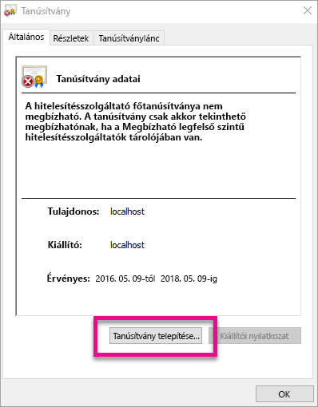
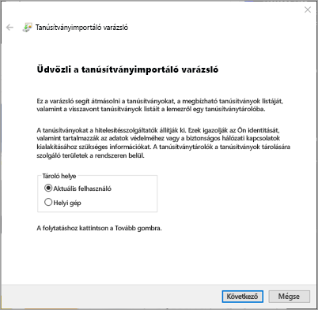
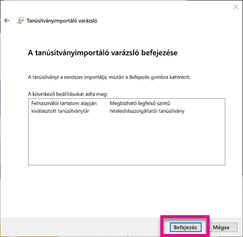
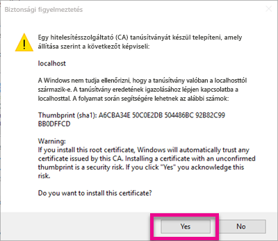
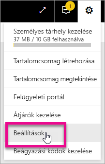
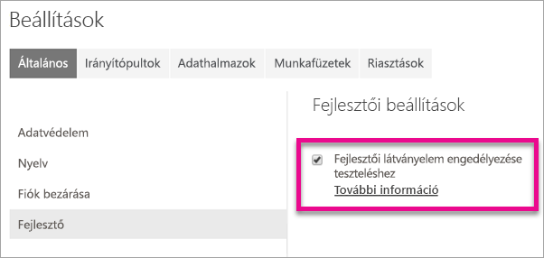

# <a name="use-developer-tools-to-create-custom-visuals"></a>Egyéni vizualizációk létrehozása fejlesztőeszközökkel

Egyéni vizualizációk segítségével megfelelhet a felhasználók igényeinek, és igazodhat saját alkalmazásának felületéhez. Cikkünk bemutatja, hogy miképpen hozhat létre egyéni Power BI-vizualizációt a fejlesztőeszközökkel.

> [!NOTE]
> Ez a dokumentum csak bevezetésül szolgál. Alaposabb tájékoztatást a [Power BI-vizualizációk Git-tárházában](https://github.com/Microsoft/PowerBI-visuals) talál.

## <a name="requirements"></a>Követelmények

* NodeJS 4.0 vagy újabb szükséges (5.0-s vagy újabb verzió ajánlott) [A NodeJS letöltése](https://nodejs.org)

## <a name="install-nodejs-and-the-power-bi-tools"></a>A NodeJS és a Power BI-eszközök telepítése

Ahhoz, hogy egyéni vizualizációt tudjon létrehozni, telepítenie kell a NodeJS-t. A NodeJS a parancssori eszközök futtatásához szükséges.

1. Töltse le és telepítse a [NodeJS](https://nodejs.org)-t. A követelmény a 4.0-s vagy újabb verzió, de az 5.0-s vagy újabb verzió ajánlott.
2. Telepítse a parancssori eszközöket. Futtassa a következő parancsot egy parancssorból.

        npm install -g powerbi-visuals-tools
3. A következő parancs paraméter nélküli kiadásával ellenőrizheti, hogy megtörtént-e az eszközök telepítése.

        pbiviz

    Ekkor a súgónak kell megjelennie.

    <pre><code>
         +syyso+/
    oms/+osyhdhyso/
    ym/       /+oshddhys+/
    ym/              /+oyhddhyo+/
    ym/                     /osyhdho
    ym/                           sm+
    ym/               yddy        om+
    ym/         shho /mmmm/       om+
     /    oys/ +mmmm /mmmm/       om+
    oso  ommmh +mmmm /mmmm/       om+
   ymmmy smmmh +mmmm /mmmm/       om+
   ymmmy smmmh +mmmm /mmmm/       om+
   ymmmy smmmh +mmmm /mmmm/       om+
   +dmd+ smmmh +mmmm /mmmm/       om+
         /hmdo +mmmm /mmmm/ /so+//ym/
               /dmmh /mmmm/ /osyhhy/
                 //   dmmd
                       ++

       PowerBI Custom Visual Tool

    Usage: pbiviz [options] [command]

    Commands:

    new [name]        Create a new visual
    info              Display info about the current visual
    start             Start the current visual
    package           Package the current visual into a pbiviz file
    update [version]  Updates the api definitions and schemas in the current visual. Changes the version if specified
    help [cmd]        display help for [cmd]

    Options:

    -h, --help      output usage information
    -V, --version   output the version number
    --install-cert  Install localhost certificate
    </code></pre>

<a name="ssl-setup"></a>

### <a name="server-certificate-setup"></a>A kiszolgálótanúsítvány telepítése

Ahhoz, hogy élőben láthassa a vizualizáció előnézetét, egy megbízható HTTPS-kiszolgáló szükséges. Mielőtt munkához lát, telepítenie kell egy SSL-tanúsítványt, amely lehetővé teszi a vizualizáció elemeinek betöltését a webböngészőbe. 

> [!NOTE]
> Ezt egyszer kell telepítenie a fejlesztői munkaállomásán.

A tanúsítvány *létrehozásához* futtassa a következő parancsot.

    pbiviz --create-cert

> [!NOTE]
> Ekkor meg kell jelennie egy üzenetnek, mely tartalmazza a tanúsítvány elérési útját és a frissen generált hozzáférési kódot.

A tanúsítvány *telepítéséhez* futtassa a következő parancsot.

    pbiviz --install-cert

> [!NOTE]
> Ekkor meg kell jelennie egy üzenetnek, mely felkéri, hogy telepítsen egy PFX-tanúsítványt a frissen generált hozzáférési kóddal.

**Windows operációs rendszer**

1. Válassza a **Tanúsítvány telepítése** gombot.

    
2. Válassza az **Aktuális felhasználó** lehetőséget, majd a **Tovább** gombot.

    
3. Jelölje be a **Minden tanúsítvány tárolása ebben a tárolóban** választógombot, majd válassza a **Tallózás** gombot.
4. Válassza a **Megbízható legfelső szintű hitelesítésszolgáltatók** tárolót, majd kattintson az **OK** gombra. Válassza a **Tovább** gombot.

    
5. Válassza a **Befejezés** gombot.

    
6. Válassza az **Igen** gombot a biztonsági figyelmeztetést tartalmazó párbeszédpanelen.

    
7. Ha van nyitva böngésző, zárja be.

> [!NOTE]
> Ha a rendszer nem ismeri fel a tanúsítványt, valószínűleg újra kell indítani a számítógépet.

**OSX**

1. Ha a bal felső sarokban látható lakat zárva van, kattintással vagy koppintással nyissa ki. Keressen rá a *localhost* szóra, és kattintson duplán a tanúsítványra.

    
2. Válassza a **Mindig legyen megbízható** lehetőséget, és zárja be az ablakot.

    
3. Adja meg a felhasználónevét és a jelszavát. Válassza a **Beállítások frissítése** gombot.

    
4. Ha van nyitva böngésző, zárja be.

> [!NOTE]
> Ha a rendszer nem ismeri fel a tanúsítványt, valószínűleg újra kell indítani a számítógépet.

## <a name="enable-a-live-preview-of-the-developer-visual"></a>A fejlesztői vizualizáció élő előnézetének engedélyezése

Engedélyezze az egyéni vizualizáció élő előnézetét a következő lépésekkel. Ezzel lehetővé teszi, hogy használhassa a vizualizációt a Power BI szolgáltatásban a jelentések szerkesztésekor.

1. Nyissa meg az [app.powerbi.com](https://app.powerbi.com) webhelyet, és jelentkezzen be.
2. Válassza a **fogaskerék ikont**, majd a **Beállítások** elemet.

    
3. Válassza a **Fejlesztő** elemet, majd a **Fejlesztői vizualizáció engedélyezése teszteléshez** lehetőséget.

    
4. Válassza a **Megjelenítések** panelen a **Fejlesztői látványelem** lehetőséget.

    

   > [!NOTE]
   > Ehhez futtatnia kell a `pbiviz start` parancsot a vizualizációnak a fejlesztői gépen található mappájából. A vizualizáció létrehozásáról a cikk [Új vizualizáció létrehozása](#create-a-new-visual) című része nyújt részletes tájékoztatást.

5. Jelölje ki a vizualizációt a jelentésvásznon. Ugyanúgy kötheti adatokhoz, mint a többi vizualizációt.

Most hozzáláthat a vizualizáció fejlesztéséhez.

## <a name="create-a-new-visual"></a>Új vizualizáció létrehozása

A következő paranccsal hozhatja létre egy új vizualizáció projektjét.

```powershell
pbiviz new MyVisualName
```

A *MyVisualName* helyére azt írja, ahogyan el szeretné nevezni a vizualizációt. Ez később megváltoztatható a generált `pbiviz.json` fájl `name` és `displayName` mezőjének módosításával.

Ez a parancs egy új mappát hoz létre abban a könyvtárban, ahol futtatta. Ezenkívül generálja a vizualizáció alapszintű kiindulási sablonját. A parancs befejeződése után megnyithatja a könyvtárat, és tetszőleges szerkesztőeszközzel elkezdhet dolgozni a vizualizáción.

## <a name="testing-your-visual-in-power-bi"></a>A vizualizáció tesztelése a Power BI-ban

A vizualizációt tesztelheti a Power BI szolgáltatásban, jelentésekben és irányítópultokban felhasználva.

<a name="running-your-visual"></a>

### <a name="running-your-visual"></a>A vizualizáció futtatása

A vizualizációt a következő eljárással futtathatja.

1. Nyisson meg egy parancssort.
2. Váltson át a vizualizáció mappájára. Ez az a mappa, amelyben a `pbiviz.json` fájl található.
3. Futtassa a következő parancsot.

    ```powershell
    pbiviz start
    ```

    

Ha nem a jó helyen van, akkor a következőhöz hasonló hibaüzenet jelenik meg.

```powershell
    error  LOAD ERROR Error: pbiviz.json not found. You must be in the root of a visual project to run this command.
        at e (C:\Users\[user]\AppData\Roaming\npm\node_modules\powerbi-visuals-tools\lib\VisualPackage.js:67:35)
        at Function.loadVisualPackage (C:\Users\[user]\AppData\Roaming\npm\node_modules\powerbi-visuals-tools\lib\VisualPackage.js:62:16)
        at Object.<anonymous> (C:\Users\[user]\AppData\Roaming\npm\node_modules\powerbi-visuals-tools\bin\pbiviz-start.js:43:15)
        at Module._compile (module.js:556:32)
        at Object.Module._extensions..js (module.js:565:10)
        at Module.load (module.js:473:32)
        at tryModuleLoad (module.js:432:12)
        at Function.Module._load (module.js:424:3)
        at Module.runMain (module.js:590:10)
        at run (bootstrap_node.js:394:7)
```

### <a name="viewing-your-visual-in-power-bi"></a>A vizualizáció megtekintése a Power BI-ban

Ha egy jelentésben szeretné megnézni a vizualizációt, nyissa meg a jelentést, és válassza ki a vizualizációt a **Megjelenítések** panelen.

> [!NOTE]
> Ezt megelőzően futtatnia kell a `pbiviz start` parancsot [A vizualizáció futtatása](#running-your-visual) című résznek megfelelően.


Ekkor megjelenik a vizualizáció kiindulási sablonja.


| Eszköztár eleme | Leírás |
| --- | --- |
| Vizualizáció frissítése |A vizualizáció manuális frissítésére szolgál, ha az automatikus újratöltés le van tiltva. |
| Átváltás automatikus újrabetöltésre |Ha be van kapcsolva, akkor a vizualizáció automatikusan frissül a vizualizáció fájljának minden mentésekor. |
| Adatnézet megjelenítése |Megjeleníti a vizualizáció alapját alkotó adatokat hibakeresés céljára. |
| Segítség kérése |A GitHubon belüli dokumentáció. |
| Visszajelzés küldése |Itt tudathatja velünk, hogyan fejleszthetjük tovább az eszközt. (GitHub-fiók szükséges hozzá.) |

## <a name="package-your-visual-for-use-in-power-bi-desktop-and-distribution"></a>Itt csomagolhatja be a vizualizációt a Power BI Desktopban való használatra, illetve terjesztésre.

Ahhoz, hogy betölthesse a vizualizációt a [Power BI Desktopba](https://powerbi.microsoft.com/desktop/), vagy megoszthassa a közösséggel a [Power BI-vizualizációk katalógusában](https://visuals.powerbi.com), generálnia kell egy `pbiviz` fájlt.

A vizualizációt a következő eljárással csomagolhatja be.

1. Nyisson meg egy parancssort.
2. Váltson át a vizualizáció mappájára. Ez az a mappa, amelyben a `pbiviz.json` fájl található.
3. Futtassa a következő parancsot.

    ```powershell
    pbiviz package
    ```

Ez a parancs létrehoz egy `pbiviz` fájlt a vizualizáció projektjének `dist/` könyvtárában. Ha már van a könyvtárban `pbiviz` fájl, azt felülírja.

## <a name="updating-the-visuals-api-version"></a>A vizualizáció API-verziójának frissítése

Amikor létrehoz egy vizualizációt a `pbiviz new` paranccsal, az eszköz bemásolja a vizualizáció könyvtárába az API-típusdefinícióinak és json-sémáinak egy példányát. Szükség esetén a `pbiviz update` paranccsal frissítheti ezeket. Ez akkor lehet hasznos, ha kibocsátjuk egy régebbi API-verzió javítását, vagy ha a legújabb API-verzióra szeretne frissíteni.

### <a name="updating-your-existing-api-version"></a>A meglévő API-verzió frissítése

Ha frissítést adunk ki egy meglévő API-hoz, a következő eljárással juthat hozzá a legújabb verzióhoz.

```powershell
#Update your version of pbiviz
npm install -g powerbi-visuals-tools

#Run update from the root of your visual project, where pbiviz.json is located
pbiviz update
```

Ennek hatására letöltődnek az npm-ről a legújabb eszközök, köztük a frissített típusdefiníciók és sémák is. A `pbiviz update` parancs átírja a *pbiviz.json* fájlban az `apiVersion` tulajdonságot a legújabb verzióra.

### <a name="upgrading-to-a-different-api-version"></a>Frissítés más API-verzióra

A fenti lépésekkel más API-verzióra is lehet frissíteni. Meg is adhatja, hogy konkrétan melyik API-verziót szeretné használni.

```powershell
#Update your version of pbiviz
npm install -g powerbi-visuals-tools

#Run update from the root of your visual project, where pbiviz.json is located
pbiviz update 1.2.0
```

Ez a parancs az 1.2.0-s API-verzióra frissítené a vizualizációt. Az `1.2.0` helyére beírhatja annak a verziónak a számát, amelyet használni szeretne.

> [!WARNING]
> Az eszközök alapértelmezés szerint mindig az API stabil verzióját használják. Az alapértelmezettnél későbbi API-verziók nem stabilak, és módosulhatnak. Rendellenességek mutatkozhatnak bennük, és eltérően működhetnek a Power BI szolgáltatásban és a Power BI Desktopban. Az aktuális stabil API-verzióról a [változási napló](https://github.com/Microsoft/PowerBI-visuals/blob/master/ChangeLog.md) nyújt tájékoztatást. A kiadás előtti verziókról az [ütemtervből](https://github.com/Microsoft/PowerBI-visuals/blob/master/Roadmap/README.md) tájékozódhat.

## <a name="inside-the-visual-project"></a>A vizualizáció projektjének tartalma

A vizualizáció projektje az a mappa, amely létrejön a `pbiviz new` parancs futtatásakor. 

### <a name="file-structure"></a>Fájlstruktúra

| Elem | Leírás |
| --- | --- |
| assets/ |A vizuális elemek (ikonok, képernyőképek stb.) tárolására használatos. |
| dist/ |A `pbiviz package` futtatásakor itt jön létre a pbiviz fájl. |
| src/ |A vizualizáció TypeScript-kódja. |
| style/ |A vizualizáció Less-stílusai. |
| .gitignore |Arra utasítja a Gitet, hogy hagyja figyelmen kívül azokat a fájlokat, amelyeket nem kell nyomon követni az adattárban. |
| capabilities.json |A vizualizáció [képességeinek](https://github.com/Microsoft/PowerBI-visuals/blob/master/Capabilities/Capabilities.md) definiálására szolgál. |
| package.json |Az [npm](https://www.npmjs.com/) használja a modulok kezelésére. |
| pbiviz.json |A fő konfigurációs fájl. |
| tsconfig.json |A TypeScript-fordítóprogram beállításai. További információ: [tsconfig.json](https://www.typescriptlang.org/docs/handbook/tsconfig-json.html). |

### <a name="pbivizjson"></a>pbiviz.json

Ez a vizualizáció fő konfigurációs fájlja. A fájlokra vonatkozó metaadatokat és információkat tárolja, a vizualizáció buildjének elkészítéséhez szükséges.

```
{
    "visual": {
        "name": "myVisual", // internal visual name (should not contain spaces)
        "displayName": "My Visual!", // visual name displayed to user (used in gallery)
        "guid": "PBI_CV_xxxxxxx", // a unique id for this visual MUST BE UNIQUE
        "visualClassName": "Visual" // the entry class for your visual
        "version": "1.0.0", // visual version. Should be semantic version (increment if you update the visual)
        "description": "", // description used in gallery
        "supportUrl": "", // url to where users can get support for this visual
        "gitHubUrl": "" // url to the source in github (if applicable)
    },
    "apiVersion": "1.0.0", //API version this visual was created with
    "author": {
        "name": "", // your name
        "email": "" // your e-mail
    },
    "assets": {
        "icon": "assets/icon.png" // relative path to your icon file (20x20 png)
    },
    "style": "style/visual.less", // relative path to your less file
    "capabilities": "capabilities.json" // relative path to your capabilities definition 
}
```

### <a name="visual-source-typescript"></a>A vizualizáció forráskódja (TypeScript)

A vizualizáció forráskódját TypeScript nyelven kell megírni. Ez a nyelv a JavaScriptet is magában foglalja, de komplexebb funkciókat biztosít, és lehetővé teszi az ES6/ES7 specifikáció funkcióinak korai elérését.

Minden TypeScript-fájlt a `src/` könyvtárban kell tárolni, és fel kell venni a `tsconfig.json` fájl `files` tömbjébe. Ez jelzi a TypeSript-fordítóprogram számára, hogy be kell töltenie őket, és a sorrendjüket is közli.

Amikor a fordítóprogram elkészíti a vizualizáció buildjét, minden TypeScript-kódot egyetlen JavaScript-fájlban egyesít. Ennek köszönhetően anélkül lehet hivatkozni a más fájlokból exportált elemekre, hogy manuálisan a `require` függvényt kellene használni (azzal az előfeltétellel, hogy mindkét fájl szerepel a tsconfig listájában).

Annyi fájlt és osztályt hozhat létre, ahányra csak szüksége van a vizualizáció elkészítéséhez.

További információ: [TypeScript](http://www.typescriptlang.org/).

### <a name="visual-style-less"></a>A vizualizáció stílusa (Less)

A vizualizáció stílusainak kezelése egymásra épülő stíluslapok (CSS) segítségével történik. A fejlesztők munkájának megkönnyítésére a Less előfordító programot használjuk. Ez támogat bizonyos összetettebb funkciókat, például a beágyazást, a változókat, a mixineket, a feltételeket és a ciklusokat. Ha egyik ilyen funkciót sem szeretné használni, egyszerű CSS-kódot is írhat a Less-fájlba.

Minden Less-fájlt a `style/` könyvtárban kell tárolni. A `pbiviz.json` fájl `style` mezőjében megadott fájl betöltődik. A további fájlokat az `@import` szabály segítségével kell betölteni.

További információ: [Less](http://lesscss.org/).

## <a name="debugging"></a>Hibakeresés

Az egyéni vizualizációban végzett hibakereséssel kapcsolatban a [hibakeresési útmutató](https://github.com/Microsoft/PowerBI-visuals/blob/master/tools/debugging.md) szolgál hasznos tanácsokkal.

## <a name="submit-your-visual-to-appsource"></a>Vizualizáció beküldése az AppSource-ba

Vizualizációit elérhetővé teheti mások számára, ha beküldi őket az AppSource-ba. Erről az eljárásról az [Egyéni vizualizáció közzététele az AppSource-ban](developer/office-store.md) című cikk nyújt részletesebb tájékoztatást.

## <a name="troubleshooting"></a>Hibaelhárítás

**A pbiviz parancs nem található (vagy ehhez hasonló hibaüzenetek)**

Ha a terminálon/parancssorból kiadja a `pbiviz` parancsot, akkor meg kell jelennie a súgóképernyőnek. Ha nem jelenik meg, nincs jól telepítve az eszköz. Ellenőrizze, hogy telepítve van-e a NodeJS 4.0-s vagy újabb verziója.

Ezzel kapcsolatban [A NodeJS és a Power BI-eszközök telepítése](#install-nodejs-and-the-power-bi-tools) című cikk nyújt részletesebb tájékoztatást.

**Nem látható a Vizualizációk lapon a vizualizációk hibakeresését indító ikon**

A **Megjelenítések** panelen egy olyan ikon jelzi a vizualizáció hibakeresését, amelyen egy parancssor grafikája látható.


Ha ez nincs ott, akkor valószínűleg engedélyeznie kell a Power BI beállításai között. 

> [!NOTE]
> A vizualizáció hibakeresése jelenleg csak a Power BI szolgáltatásban érhető el, a Power BI Desktopban és a mobilappan nem. A csomagolt vizualizáció ennek ellenére minden platformon működik.

Erről [A fejlesztői vizualizáció élő előnézetének engedélyezése](#enable-live-preview-of-developer-visual) című cikk nyújt részletesebb tájékoztatást.

**Nem lehet kapcsolatot létesíteni a vizualizáció kiszolgálójával**

Futtassa a vizualizáció kiszolgálóját. Ehhez adja ki a terminálon/parancsorból a `pbiviz start` parancsot a vizualizáció projektjének gyökérmappájából. Ha fut a kiszolgáló, akkor valószínűleg nincsenek helyesen telepítve az SSL-tanúsítványok.

További tájékoztatást [A vizualizáció futtatása](#running-your-visual) és [A kiszolgálótanúsítvány telepítése](#ssl-setup) című részben talál.

## <a name="next-steps"></a>Következő lépések

[Vizualizációk a Power BI-ban](visuals/power-bi-report-visualizations.md)  
[Egyéni vizualizációk a Power BI-ban](power-bi-custom-visuals.md)  
[Egyéni vizualizáció közzététele az Office Áruházban](developer/office-store.md)  
[TypeScript](http://www.typescriptlang.org/)  
[Less CSS](http://lesscss.org/)  

További kérdései vannak? [Kérdezze meg a Power BI közösségét](http://community.powerbi.com/) 