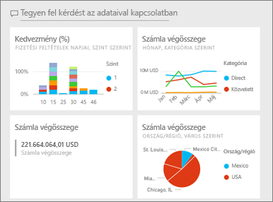
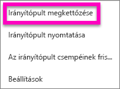
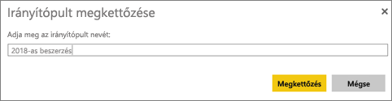
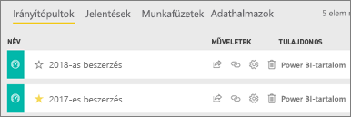

# Irányítópult másolatának létrehozása a Power BI szolgáltatásban

 Számos különféle oka lehet, hogy másolatot készítsen egy irányítópultról. Lehet, hogy módosításokat szeretne végrehajtani, és tesztelni a teljesítményt az eredetivel összevetve, vagy kismértékben eltérő változatokat készíteni az egyes munkatársak, régiók vagy csoportok számára. Lehet, hogy egy munkatársa kedveli az Ön irányítópult-kialakítását, és használni szeretné saját feletteseinek készítendő jelentéseihez. Egy másik ok lehet, ha új adatbázissal rendelkezik, ugyanazzal az adatszerkezettel és adattípusokkal, és újra szeretné használni a már létrehozott irányítópultot – ez is megtehető, de a Power BI Desktopban némi munkát igényelne. 

Az irányítópultokat a Power BI szolgáltatás használatával lehet létrehozni (és másolni), és a Power BI Mobile-ban vagy a Power BI Embeddedben lehet megtekinteni őket.  Az irányítópultok a Power BI Desktopban nem érhetők el. 

Az irányítópultról csak az irányítópult *létrehozója* készíthet másolatot. Az Önnel alkalmazásként megosztott irányítópultok nem duplikálhatók.

1. Nyissa meg az irányítópultot.
2. A jobb felső sarokban kattintson a folytatást jelző pontokra (...), és válassza az **Irányítópult megkettőzése** parancsot.
   
   
3. Adjon egy nevet az irányítópultnak, és válassza a **Másolat készítése** parancsot. 
   
   
4. Az új irányítópult ugyanazon a munkaterületen található, mint az eredeti kerül. 
   
   

5.    Nyissa meg az új irányítópultot, és végezze el a szükséges módosításokat. A következő lépésekben az alábbi műveleteket végezheti el:    
    a. [Áthelyezhet, átnevezhet, méretezhet vagy törölhet is csempéket](service-dashboard-edit-tile.md).  
    b. A három pont (...), majd a **Részletek szerkesztése** lehetőséget választva szerkesztheti a csempét és a hivatkozásokat.  
    c. [Új csempe hozzáadása az irányítópult menüsávjából](service-dashboard-add-widget.md) (**Csempe hozzáadása**)  
    d. Új csempéket rögzíthet a [Q&A-ből](service-dashboard-pin-tile-from-q-and-a.md) vagy [jelentésekből](service-dashboard-pin-tile-from-report.md).  
    e. Az irányítópult beállítások paneljén átnevezheti az irányítópultot, be- vagy kikapcsolhatja a Q&A-t, és beállíthatja a csempefolyamot.  (válassza az irányítópulthoz tartozó három pont (...) legördülő menüjét, majd válassza a **Beállítások** lehetőséget)  
    f. Az irányítópultot megoszthatja közvetlenül a munkatársaival, vagy egy Power BI alkalmazás részeként is. 

## Következő lépések
* [Tippek a tökéletes irányítópult megtervezéséhez](service-dashboards-design-tips.md) 

További kérdései vannak? [Kérdezze meg a Power BI közösségét](http://community.powerbi.com/)

