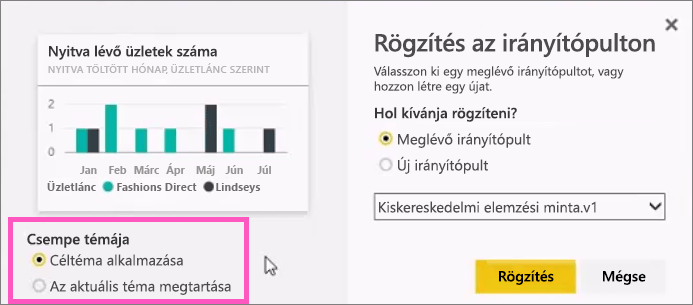

# Csempe rögzítése Power BI-irányítópultra jelentésből

[Irányítópult-csempét](consumer/end-user-tiles.md)egyrészt [Power BI-jelentésből](consumer/end-user-reports.md) vehet fel. Amikor kiválaszt egy csempét, az megnyílik a jelentésben.

A teljes jelentésoldal rögzíthető egy irányítópulton, amit *élő* csempe rögzítésének nevezünk. Azért ezt a nevet kapta, mert az irányítópulton használhatja. Az egyéni vizualizációs csempéktől eltérően a jelentésben végrehajtott módosítások az irányítópulttal is automatikusan szinkronizálódnak. További információ: [Teljes jelentésoldal rögzítése](#pin-an-entire-report-page).

Az Önnel megosztott jelentésekből és a Power BI Desktopról nem rögzíthet csempéket. 

> [!TIP]
> Mivel egyes vizualizációk háttérképeket használnak, előfordulhat, hogy a rögzítés nem sikerül, ha a háttérkép túl nagy. Próbálkozzon a kép méretének csökkentésével vagy a kép tömörítésével.  
> 
> 

## Csempe rögzítése jelentésből
Figyelje meg, hogyan hoz létre Amanda egy irányítópultot Power BI-jelentésből származó vizualizációk és képek rögzítésével.
    

<iframe width="560" height="315" src="https://www.youtube.com/embed/lJKgWnvl6bQ" frameborder="0" allowfullscreen></iframe>

Most készítse el saját irányítópultját a Power BI-jelentésminták egyikének felhasználásával.

1. A jelentésben vigye a kurzort a rögzíteni kívánt vizualizáció fölé, és kattintson a gombostű ikonra. . A Power BI megnyitja a **Rögzítés az irányítópulton** képernyőt.
   
     
2. Döntse el, hogy meglévő vagy új irányítópulton kíván rögzíteni.
   
   * **Meglévő irányítópult**: Válassza ki az irányítópult nevét a legördülő listából. Az Önnel megosztott irányítópultok nem jelennek meg a legördülő listában.
   * **Új irányítópult**: Írja be az új irányítópult nevét.
3. Bizonyos esetekben megtörténhet, hogy az éppen rögzített elemen már alkalmazva van egy *téma*. Ilyen lehet például egy Excel-munkafüzetből rögzített vizualizáció. Ilyen esetben válassza ki a csempére alkalmazandó témát.
4. Válassza a **Rögzítés** lehetőséget.
   
   A jobb felső sarokban megjelenik a sikert jelző üzenet, amely tájékoztatja, hogy a vizualizáció csempeként hozzá lett adva az irányítópulthoz.
   
   
5. Jelölje ki az új csempét tartalmazó irányítópultot a navigációs panelen. A jelentéshez való visszatéréshez [szerkessze a csempe megjelenítését és viselkedését](service-dashboard-edit-tile.md), vagy válassza ki a csempét.

## Teljes jelentésoldal rögzítése
Másik lehetőségként egy teljes jelentésoldalt rögzíthet az irányítópulton, így egyszerre több vizualizációt is rögzíthet. Egy teljes oldal rögzítésekor a csempék *élőben* jelennek meg. Azaz az irányítópulton használhatja őket. A vizualizációk jelentésszerkesztőben végrehajtott módosítása, például egy szűrő hozzáadása vagy a diagramon használt mezők megváltoztatása is megjelenik az irányítópulton lévő csempén.  

További információ: [Teljes jelentésoldal rögzítése](service-dashboard-pin-live-tile-from-report.md).

## Következő lépések
- [Irányítópultok a Power BI szolgáltatás felhasználói számára](consumer/end-user-dashboards.md)
- [Irányítópult-csempék a Power BI-ban](consumer/end-user-tiles.md)
- [Power BI-jelentések](consumer/end-user-reports.md)
- [Adatfrissítés a Power BI-ban](refresh-data.md)
- [A Power BI szolgáltatás alapfogalmai tervezők számára](service-basic-concepts.md)

További kérdései vannak? [Kérdezze meg a Power BI közösségét](https://community.powerbi.com/)

