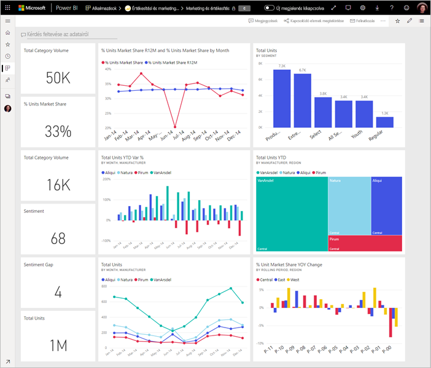
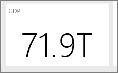

# Tippek a tökéletes Power BI-irányítópult megtervezéséhez
Most, hogy létrehozta az irányítópultot, és hozzáadott néhány csempét is, gondolja át, hogyan tehetné irányítópultját egyszerre ízlésessé és célratörővé. Ennek a legjobb módja, ha a legfontosabb információ a legfeltűnőbb, amelynek megjelenése letisztult és rendezett.

> [!TIP]
> Elnyerte a tetszését az irányítópult? Ezt és a kapcsolódó jelentéseket letöltheti az AppSource-ból. Lépjen az **Adatok lekérése** > **Szolgáltatások** lehetőségre. Válassza a **Microsoft Sample - Sales & Marketing** > **Letöltés most** lehetőséget.

Íme, néhány tipp az irányítópultokhoz.

## Irányítópult-tervezési ajánlott eljárások videója

Tekintse meg a [Power BI irányítópult-tervezési ajánlott eljárásairól](https://www.youtube.com/watch?v=-tdkUYrzrio) szóló videót, amelyben Marco Russótól ( SQLBI.com) kaphat tervezési tippeket.

## Mindig gondoljon a közönségére
Mely kulcsfontosságú mérőszámok segítik őket leginkább a döntéshozatalban? Hogy fogják használni az irányítópultot? Milyen tanult vagy kulturális előfeltevések befolyásolhatják a tervezés során hozott döntéseket? Milyen információkra van szüksége a közönségének a sikerhez?

Ne feledje, hogy az irányítópult az áttekintés eszköze, amelynek segítségével egy helyen követheti nyomon az adatok aktuális állapotát. Az irányítópult az alapul szolgáló jelentéseken és adatkészleteken alapszik, és ezek rengeteg részletet tartalmaznak. Az olvasók az irányítópulton keresztül érhetik el a jelentéseket. Ezért hacsak nem a részleteket monitorozzák az olvasók, ne az irányítópulton jelenítse azokat meg.

Hol fog megjelenni az irányítópult? Ha egy nagyobb képátmérőjű monitoron jeleníti meg, akkor több tartalmat is elhelyezhet rajta. Ha azonban az olvasók a táblagépükön tekintik meg az irányítópultot, az olvashatóság érdekében használjon kevesebb csempét.

## Történetmesélés egy képernyőn
Mivel az irányítópultok célja, hogy egyetlen pillantás alatt leolvashassuk a legfontosabb információkat, a legjobb, ha minden csempét egyetlen képernyőn jelenít meg. El tudja kerülni a görgetősávok használatát az irányítópulton?

Túlságosan zsúfolt az irányítópult?  A legfontosabb, könnyen olvasható és értelmezhető információk kivételével távolítson el minden további adatot.

## Használja a teljes képernyős módot
Irányítópultját minden felesleges információ nélkül, [teljes képernyős módban](consumer/end-user-focus.md) jelenítse meg.

## Emelje ki a legfontosabb információt
Ha az irányítópulton található szövegek és a vizualizációk azonos méretűek, az olvasóknak nehezére esik majd a legfontosabb információra összpontosítani. A kártyavizualizációk segítségével például hatásosan tudja megjeleníteni a fontos számokat:  

De ügyeljen arra, hogy a kontextust is megadja.  

Olvassa el a [csupán egyetlen számmal ellátott csempe létrehozására](visuals/power-bi-visualization-card.md) vonatkozó részt.

## Helyezze el a legfontosabb információt
A legtöbb ember fentről lefelé kezd olvasni. Így célszerű a képernyő bal felső sarkában elhelyezni a legfontosabb részletet, és a közönség olvasási irányának megfelelően növelni a részletsűrűséget (balról jobbra, fentről lefelé).

## Használja az adatoknak leginkább megfelelő vizualizációt
Pusztán a változatosság kedvéért ne változtasson a vizualizáción.  A vizualizáció célja egy adott kép könnyen „olvasható” és értelmezhető ábrázolása.  Bizonyos adatok és vizualizációk esetében egy egyszerű grafikus vizualizáció is elegendő. Más esetekben azonban összetettebb vizualizációkra lehet szükség, ezért a csempék és címkék használatával, illetve további testreszabással igyekezzen segíteni az olvasót.  

* Legyen óvatos az olyan vizualizációk használatával, amelyek szépek, de nehezen olvashatók, például a három dimenziós diagramok. 
* Sajnos a tortadiagramok, fánkdiagramok, mérőműszerek és egyéb kör alakú diagramok használata az adatvizualizáció szempontjából nem ajánlott eljárás. Az ideális tortadiagramok kevesebb mint nyolc kategóriát tartalmaznak. Mivel a tortadiagramban nem tudunk két értéket egymás mellett összehasonlítani, ezért jóval nehezebb az értékek összehasonlítása, mint egy oszlopdiagramon. A tortadiagramok alkalmasabbak a rész-egész viszonyok szemléltetésére, mint az egyes részek összehasonlítására. A mérőműszer-diagramokkal rendkívül jól lehet szemléltetni egy aktuális állapotot az adott cél tekintetében.
* A diagramokon belül használja következetesen a tengelyeken található diagramméreteket, a diagramméret-elrendezést és a diagramértékekhez használt színeket.
* Ügyeljen arra, hogy ízlésesen kódolja a mennyiségi adatokat. A számok megjelenítésénél három vagy négy számjegynél ne használjon többet. A tizedesvesszőtől egy vagy két hellyel balra található számjegyeket jelenítse meg, és léptékezze a számokat ezres vagy milliós nagyságrendre, tehát 3,4 millió 3 400 000 helyett.
* A pontosság és az időpont szintjét soha ne keverje. Győződjön meg róla, hogy az időkeretek jól értelmezhetők. Ne helyezzen egy, a múlt hónapot és az év egy más hónapját szemléltető szűrt diagramot egymás mellé.
* Ne keverje a kis és nagy értékeket ugyanazon a skálán, tehát például egy vonal- vagy oszlopdiagramon. Vegyük például azt az esetet, amikor az egyik érték milliós, a másik pedig ezres nagyságrendben van. A skála nagysága miatt ebben az esetben nehéz lenne látni az ezres nagyságrendű értékek különbségeit. Ha kevernie kell az értékek nagyságrendjeit, válasszon olyan vizualizációt, amely lehetővé teszi egy második tengely használatát.
* Feleslegesen ne tűzdelje tele adatcímkékkel a diagramokat. Az oszlopdiagramokon szereplő értékek általában a konkrét számok megjelenítése nélkül is könnyen értelmezhetőek.
* Ügyeljen a [diagramok rendezési](consumer/end-user-change-sort.md) módjára. A legmagasabb vagy legalacsonyabb számok kiemeléséhez rendezze az adatokat a mértékek szerint. Ha azt szeretné, hogy a felhasználók könnyedén megtaláljanak egy adott kategóriát a többi között, rendezze az adatokat a tengelyek szerint.  

A vizualizációval kapcsolatos további segítségért olvassa el a következő részt: [Vizualizációtípusok a Power BI-ban](visuals/power-bi-visualization-types-for-reports-and-q-and-a.md).  

## További információk az irányítópult-tervezésről
A tökéletes irányítópult-tervezés elsajátításához érdemes megismerkedni a vizuális érzékelés alapvető Gestalt-elveivel, valamint a gyakorlatban is használható információk kontextusban történő, egyértelmű kommunikációjával. Szerencsére számtalan széles körben, többek között a blogjainkon is elérhető forrásanyag áll rendelkezésre. Itt van néhány kedvenc könyveink közül:

* Stephen Few *Information Dashboard Design* című könyve  
* Stephen Few *Show Me the Numbers* című könyve  
* Stephen Few *Now You See It* című könyve  
* Edward Tufte *Envisioning Information* című könyve  
* Andrew Abela *Advanced Presentations* című könyve   

## További lépések
[Irányítópult létrehozása jelentésből](service-dashboard-create.md)  
[A Power BI szolgáltatás alapfogalmai tervezők számára](service-basic-concepts.md)  
Több kérdése van? [Kérdezze meg a Power BI közösségét](https://community.powerbi.com/)
