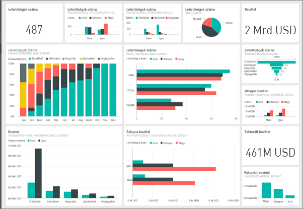
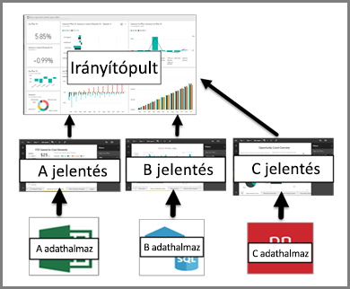

# Irányítópultok a Power BI szolgáltatás tervezői számára – bevezetés

A ***Power BI-irányítópult*** egy gyakran vászonnak is nevezett oldal, amely vizualizációk segítségével mutat be információkat. Mivel egyetlen lapon jelenik meg, ezért a jól megtervezett irányítópult csak a történet legfontosabb elemeit tartalmazza. Az olvasók a kapcsolódó jelentésekben tekinthetik meg a részleteket.

Az irányítópult a Power BI szolgáltatás egyik funkciója. A Power BI Desktopban nem érhetők el. Mobileszközön nem hozhat létre irányítópultokat, azonban [megtekintheti és megoszthatja](mobile-apps-view-dashboard.md) őket.

## Irányítópult – alapok 

Az irányítópulton látható vizualizációkat *csempéknek* nevezik. Ezek jelentésekből *rögzíthetők* az irányítópultra. Ha csak most kezdte el használni a Power BI-t, a [Power BI alapfogalmait](service-basic-concepts.md) elolvasva egyszerűen elsajátíthatja az alapokat.

> [!IMPORTANT]
> Irányítópult létrehozásához [Power BI Pro-licencre](service-free-vs-pro.md) van szüksége.

Az irányítópulton megjelenő vizualizációk a jelentéseken, az egyes jelentések pedig egy-egy adatkészleten alapulnak. Az irányítópultok az alapjául szolgáló jelentésekhez és adatkészletekhez való hozzáférési útnak is tekinthetők. Egy vizualizáció kiválasztásával hozzáférhet az alapjául szolgáló jelentéshez (és adatkészlethez).

## Az irányítópultok előnyei
Az irányítópultok segítségével nagyszerűen nyomon követheti üzletmenetét, és egyetlen pillantással megtekintheti a legfontosabb mérőszámokat. Az irányítópulton található vizualizációk egy vagy több adatkészletből vagy jelentésből is származhatnak. Az irányítópult a helyi és a felhőben keletkezett adatokat ötvözi, és egyesített nézetet biztosít függetlenül attól, hogy az adatok hol találhatók.

Az irányítópult nem csak egy tetszetős kép. Egy interaktív funkció, amelyben az egyes csempék az alapul szolgáló adatok változásának megfelelően frissülnek.

## Irányítópultok és jelentések
A [jelentések](service-reports.md) hasonlítanak az irányítópultokra, mivel mind a kettő egy vizualizációkkal teli vászon. Azonban van köztük néhány alapvető különbség.

| **Képesség** | **Irányítópultok** | **Jelentések** |
| --- | --- | --- |
| Oldalak |Egy oldal |Egy vagy több oldal |
| Adatforrások |Egy vagy több jelentés és egy vagy több adatkészlet irányítópultonként |Egyetlen adatkészlet jelentésenként |
| Elérhető a Power BI Desktopban |Nem | Létrehozhatnak és megtekinthetnek jelentéseket a Power BI Desktopban |
| Előfizetés |Feliratkozhat irányítópultra |Előfizethet jelentésoldalakra |
| Szűrés |Nem lehet szűrni és szeletelni |Számos szűrési, kiemelési és szeletelési móddal rendelkezik |
| Kiemelt |Kiválaszthat és beállíthat egy „kiemelt” irányítópultot |Nem hozhat létre kiemelt jelentést |
| Kedvenc | Irányítópultokat *kedvencként* jelölhet meg | Jelentéseket *kedvencként* jelölhet meg
| Riasztások beállítása |Bizonyos helyzetekben elérhető irányítópultok csempéihez |Nem érhető el a jelentésekből |
| Természetes nyelven történő lekérdezések (Q&A) |Elérhető az irányítópultokon | Elérhető a jelentésekben |
| Láthatja az alapul szolgáló adatkészlet-táblázatokat és -mezőket |Nem. Exportálhatja az adatokat, de magán az irányítópulton nem fogja látni a táblázatokat és a mezőket. |Igen. Láthatja az adatkészlet-táblázatokat, -mezőket és -értékeket. |

## Következő lépések
* [Minta-irányítópultjaink](sample-tutorial-connect-to-the-samples.md) egyikének megtekintése révén megismerkedhet az irányítópultok használatával.
* Információ az [irányítópult csempéiről](service-dashboard-tiles.md).
* Szeretne nyomon követni egy adott irányítópult-csempét, és e-mailes értesítést kapni, ha elér egy bizonyos küszöbértéket? [Riasztások létrehozása a csempéken](service-set-data-alerts.md).
* Fedezze fel, hogyan teheti fel az adatokkal kapcsolatos kérdéseit és szerezheti meg a válaszokat vizualizáció formájában a [Power BI Q&A](power-bi-tutorial-q-and-a.md) segítségével.
