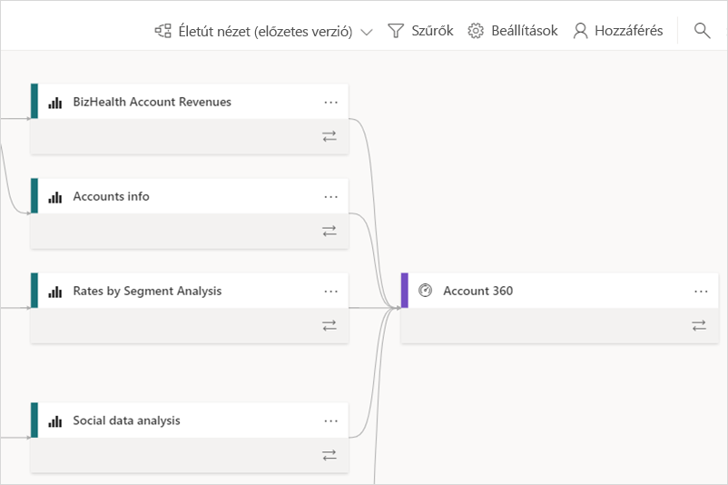
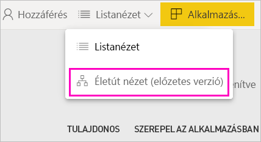
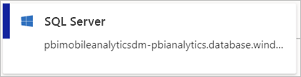
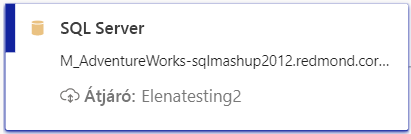
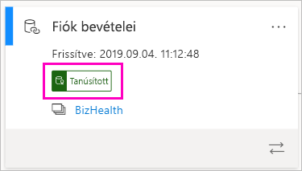
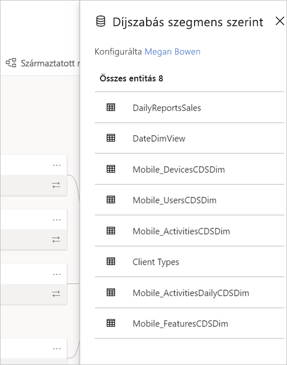
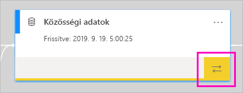
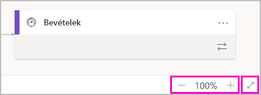

# Adatéletút (előzetes verzió)
A modern üzletiintelligencia-projektekben az adatok adatforrásból a célba történő eljutásának megértése kihívást jelenthet. A kihívás még nagyobb a több adatforráson, összetevőn és függőségen átívelő speciális elemzési projektek esetén.  Nehéz választ adni az olyan kérdésekre, hogy például mi történik egy adat módosításakor, vagy hogy miért nem naprakész egy jelentés. Ezek megértéséhez szakértői csapatokra vagy mélyreható vizsgálatra van szükség. A származtatott nézetet azért hoztuk létre, hogy segítsünk megválaszolni ezeket a kérdéseket.

 
A Power BI számos különböző összetevőtípussal rendelkezik, például irányítópultokkal, jelentésekkel, adatkészletekkel és adatfolyamokkal. Számos adatkészlet és adatfolyam külső adatforrásokhoz (például SQL Server), illetve más munkaterületeken megtalálható külső adatkészletekhez csatlakozik. Az Ön tulajdonában álló munkaterületen kívüli adatkészletek az IT-részleg egy tagja vagy egy másik elemző birtokában lévő munkaterületen lehetnek. A külső adatforrások és adatkészletek végső soron megnehezíthetik az adatok származási helyének kiderítését. Ezért bevezettük az összetett és egyszerűbb projektekhez is használható származtatott nézetet. 

A származtatott nézetben az egy munkaterületen lévő összes összetevő közötti adatéletút-kapcsolat látható, valamint azok minden külső függősége is. A származtatott nézet kibővíti az adatfolyamok már eddig is létező diagramnézetét. A nézetben az összes munkaterület-összetevő közötti kapcsolatok láthatók, a felfelé és lefelé irányuló adatfolyamokkal létesített kapcsolatokat is beleértve. Az adatfolyamokat külön-külön ábrázoló diagramnézet novembertől kezdve meg fog szűnni.

## A származtatott nézet felfedezése

A Saját munkaterületen kívül minden munkaterülethez, akár új, akár klasszikus, automatikusan tartozik egy származtatott nézet. Megtekintéséhez legalább Közreműködő szerepkörrel kell rendelkeznie az adott munkaterületen. Erről részletesen a jelen cikk [Engedélyek](#permissions) című szakaszában tájékozódhat. 

- A származtatott nézet eléréséhez lépjen a munkaterület listanézetébe. Koppintson a **Listanézet** elemre, és válassza a **Származtatott nézet** lehetőséget.

    

    Ebben a nézetben az összes munkaterület-összetevő és az adatok egyikből másikba való áramlása is látható.

**Adatforrások**

Láthatja azokat az adatforrásokat, amelyekből az adatkészletek és az adatfolyamok nyerik az adatokat. Az adatforráskártyákon további információk jelennek meg, amelyek segítenek a forrás azonosításában. Az Azure SQL Server esetében például az adatbázis neve is látható.

 
**Átjárók**

Ha egy adatforrás egy helyszíni átjárón keresztül csatlakozik, az átjáró adatai is megjelennek az adatforráskártyán. Ha vannak átjáró-rendszergazdaként vagy adatforrás-felhasználóként kapott engedélyei, további információkat, például az átjáró nevét is láthatja.

**Adatkészletek és adatfolyamok**
 
Az adatkészleteken látható a legutóbbi frissítés ideje, és hogy az adatkészlet minősített vagy meghirdetett-e.

 
Ha a munkaterületen egy jelentés egy másik munkaterület adatkészletére épül, akkor láthatja a forrásként működő munkaterület nevét az adatkészletkártyán. Válassza a forrás-munkaterület nevét az adott munkaterület megnyitásához.
 
- Egy tetszőleges összetevőnél válassza a **További lehetőségek** (...) elemet a beállítások menüjének megnyitásához. Itt ugyanazok a műveletek érhetők el, mint a listanézetben.
  
Ha több metaadatot szeretne megjeleníteni az adatkészletekről, válassza ki magát az adatkészletkártyát. Az adatkészlettel kapcsolatos további információk egy oldalsó panelen tekinthetők meg.

 
## Egy tetszőleges összetevő adatéletútjának megjelenítése 

Tegyük fel, hogy meg szeretné tekinteni egy adott összetevő adatéletútját.

- Válassza a kívánt összetevő alatti dupla nyilat.

    

    A Power BI kiemeli az adott összetevőhöz kapcsolódó összetevőket, a többit pedig elhalványítja. 

## Navigálás és teljes képernyő 

A származtatott nézet egy interaktív vászon. Az egér és az érintőpad használatával lépegethet a vásznon, illetve nagyíthat vagy kicsinyíthet rajta.  

- A nagyításhoz vagy kicsinyítéshez a jobb alsó sarokban lévő menüt, illetve az egeret vagy az érintőpadot használhatja. 

- Ha több helyet szeretne magának a diagramnak, használja a jobb alsó sarokban elérhető teljes képernyős lehetőséget. 

    

## Engedélyek

- A származtatott nézet megjelenítéséhez Power BI Pro-licencre van szüksége.
- A származtatott nézetet csak a munkaterülethez hozzáféréssel rendelkező felhasználók érhetik el.
- A felhasználóknak Rendszergazda, Tag vagy Közreműködő szerepkörrel kell rendelkeznie a munkaterületen. A Megtekintő szerepkörrel rendelkező felhasználók nem válthatnak adatéletút nézetre.

## Megfontolandó szempontok és korlátozások

- A származtatott nézet nem érhető el az Internet Explorerben. További információt [A Power BI használatát támogató böngészők](power-bi-browsers.md) című cikkben talál.
- A származtatott nézet saját munkaterületen nem érhető el.

## Következő lépések

- [Adathalmazok használata több munkaterületen (előzetes verzió)](service-datasets-across-workspaces.md)
