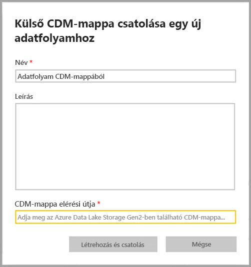
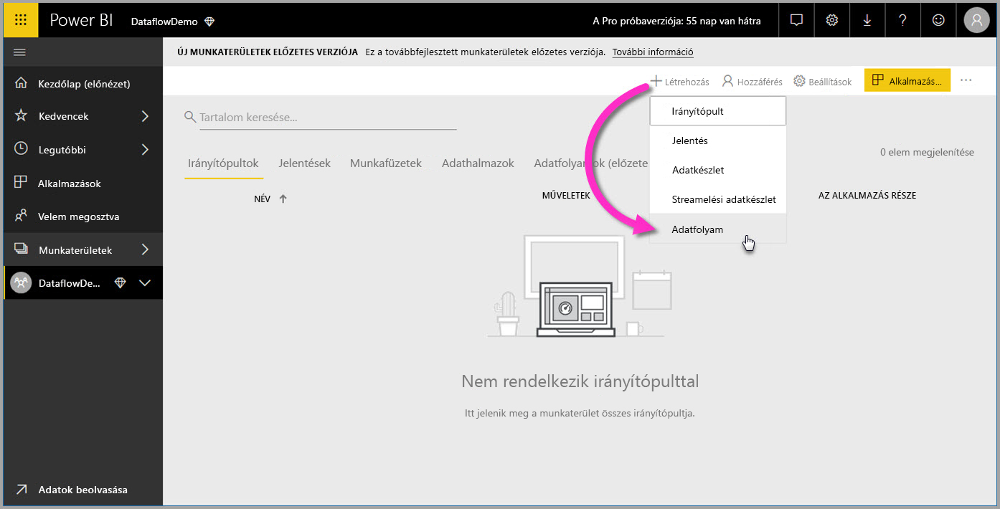
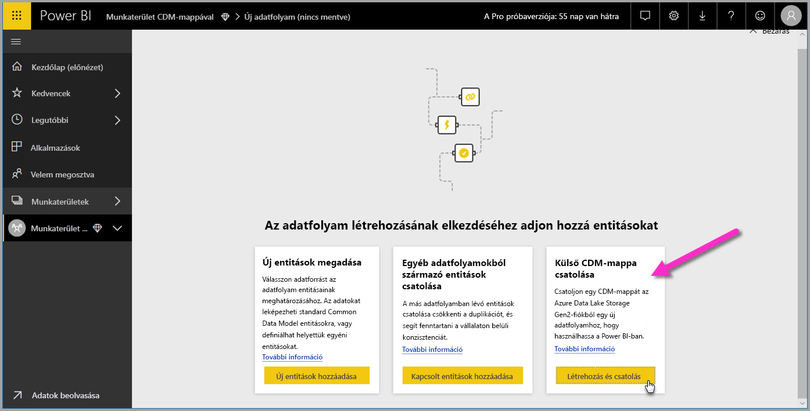

# CDM-mappa hozzáadása a Power BI-hoz adatfolyamként (előzetes verzió)

A Power BI-ban a vállalati Azure Data Lake Storage Gen2-ben tárolt Common Data Model-mappák (CDM-mappák) felvehetők adatfolyamokként. Miután létrehoz egy adatfolyamot egy CDM-mappából, a **Power BI Desktop** és a **Power BI szolgáltatás** használatával a CDM-mappákban elhelyezett adatokon alapuló adathalmazokat, jelentéseket és alkalmazásokat hozhat létre.

Adatfolyamok CDM-mappákból való létrehozására az alábbi felsorolásban ismertetett korlátozások érvényesek:

* Adatfolyamok CDM-mappákból való létrehozása *csak* az [új munkaterületi felületen](service-create-the-new-workspaces.md) érhető el. 
* CDM-mappa Power BI-hoz adásához a mappát az eljáró felhasználónak [a CDM-mappára és annak fájljaira vonatkozó jogosultsággal](https://go.microsoft.com/fwlink/?linkid=2029121) kell rendelkeznie.
* Ahhoz, hogy a Power BI-hoz adhassa őket, olvasási és végrehajtási jogosultsággal kell rendelkeznie a CDM-mappában lévő minden fájlra és mappára.

A következő bekezdések adatfolyamok CDM-mappából való létrehozását ismertetik.

## Adatfolyam létrehozása CDM-mappából

Egy adatfolyam CDM-mappából való létrehozásának első lépéseként indítsa el a **Power BI szolgáltatást**, és válasszon **munkaterületet** a navigációs panelen. Új munkaterületet is létrehozhat, amelyben aztán létrehozhatja új adatfolyamát.

A megjelenő képernyőn válassza a **Létrehozás és csatolás** lehetőséget, ahogyan az alábbi képen látható.

Az ezután megjelenő képernyőn nevet adhat adatfolyamának, megadhat hozzá egy leírást és a CDM-mappa elérési útját a vállalat Azure Data Lake Gen2-fiókjában. Olvassa el a cikk [A CDM-mappa elérési útjának megállapítása](service-dataflows-configure-workspace-storage-settings.md#get-the-uri-of-stored-dataflow-files) című szakaszát. 

Az információk megadása után hozza létre az adatfolyamot a **Létrehozás és csatolás** lehetőséget választva.

A CDM-mappákból létrehozott adatfolyamok a *külső* ikonnal megjelölve jelennek meg a Power BI-ban. A következő szakasz a hagyományos és a CDM-mappákból létrehozott adatfolyamok közötti különbségeket ismerteti.

Az engedélyeknek a cikk korábbi részében leírtak szerinti, megfelelő beállítása után már csatlakozhat adatfolyamához a **Power BI Desktopban**.

## Megfontolandó szempontok és korlátozások

A CDM-mappákból létrehozott adatfolyamokra vonatkozó engedélyek hasonló eljárással kezelhetők, mint a külső adatforrások a Power BI-ban. Az engedélyek kezelése nem a Power BI-on belül, hanem az adatforrásban történik. Ahhoz, hogy megfelelően működjenek a Power BI-jal, az engedélyeket magában az adatforrásban, például a CDM-mappából létrehozott adatfolyamban kell helyesen beállítani.

Az alábbi lista segít tisztázni, hogyan működnek a CDM-mappából létrehozott adatfolyamok a Power BI-jal.

Power BI Pro-, Premium- és Embedded-munkaterületek:
* A CDM-mappákból létrehozott adatfolyamok nem szerkeszthetők
* A CDM-mappából létrehozott adatfolyam olvasására vonatkozó engedélyeket nem a Power BI, hanem a CDM-mappa tulajdonosa kezeli

Power BI Desktop:
* Az adatfolyam adataihoz csak azok a felhasználók férnek hozzá a Power BI Dataflows összekötőből, akik hozzáféréssel rendelkeznek a munkaterülethez, amelyben az adatfolyam létre lett hozva, és a CDM-mappához

Az alábbiakban felsorolt szempontokat is érdemes figyelembe venni:

* Adatfolyamok CDM-mappákból való létrehozása *csak* az [új munkaterületi felületen](service-create-the-new-workspaces.md) lehetséges
* Csatolt entitások CDM-mappából létrehozott adatfolyamokhoz nem érhetők el

**Power BI Desktop**-ügyfél csak akkor fér hozzá az Azure Data Lake Storage Gen2-tárfiókokban tárolt adatfolyamhoz, ha az adatfolyam tulajdonosa, vagy ha külön megadott jogosultsággal rendelkezik az adatfolyam CDM-mappájához. Figyelje meg a következő példát:

1.  Anna új munkaterületet hoz létre, amelyet CDM-mappából létrehozott adatfolyamok tárolására konfigurál.
2.  Dávid, aki szintén tagja az Anna által létrehozott munkaterületnek, a Power BI Desktop és az adatfolyam-összekötő használatával szeretne adatokhoz jutni az Anna által létrehozott adatfolyamból.
3.  Dávid hibajelenséget tapasztal, ugyanis nem adták hozzá jogosult felhasználóként az adatfolyam data lake-beli CDM-mappájához.

    

A probléma megoldásához Dávidnak olvasási jogot kell adni a CDM-mappára és annak fájljaira. A CDM-mappákhoz való hozzáférés megadásáról [ez a cikk](https://go.microsoft.com/fwlink/?linkid=2029121) tartalmaz további információt.

## Következő lépések

Ez a cikk munkaterület-tárolók adatfolyamokhoz való konfigurálásához nyújtott útmutatást. További információt a következő cikkekben találhat:

Az adatfolyamokról, a CDM-ről és az Azure Data Lake Storage Gen2-ről az alábbi cikkekből tájékozódhat:

* [Adatfolyamok és az Azure Data Lake integrációja (előzetes verzió)](service-dataflows-azure-data-lake-integration.md)
* [Munkaterület adatfolyam-beállításainak konfigurálása (előzetes verzió)](service-dataflows-configure-workspace-storage-settings.md)
* [Azure Data Lake Storage Gen2 csatlakoztatása adatfolyam-tároláshoz (előzetes verzió)](service-dataflows-connect-azure-data-lake-storage-gen2.md)

Az adatfolyamokról általánosságban a következő cikkek szólnak:

* [Adatfolyamok létrehozása és használata a Power BI-ban](service-dataflows-create-use.md)
* [Számított entitások használata a Power BI Premiumban](service-dataflows-computed-entities-premium.md)
* [Adatfolyamok használata helyszíni adatforrásokkal](service-dataflows-on-premises-gateways.md)
* [Fejlesztői erőforrások Power BI-adatfolyamokhoz](service-dataflows-developer-resources.md)

Az Azure Storage szolgáltatással kapcsolatban az alábbi cikkeket érdemes elolvasni:
* [Azure Storage – biztonsági útmutató](https://docs.microsoft.com/azure/storage/common/storage-security-guide)
* [Ütemezett frissítés beállítása](refresh-scheduled-refresh.md)
* [Első lépések az Azure Data Servicesből származó github-mintákkal](https://aka.ms/cdmadstutorial)

A Common Data Modellel kapcsolatos további információt a témát áttekintő cikkben talál:
* [Common Data Model – áttekintés](https://docs.microsoft.com/powerapps/common-data-model/overview)
* [CDM-mappák](https://go.microsoft.com/fwlink/?linkid=2045304)
* [CDM-modellfájl definiálása](https://go.microsoft.com/fwlink/?linkid=2045521)

[Kérdéseit mindig felteheti a Power BI-közösségben](https://community.powerbi.com/) is.

