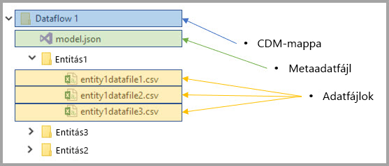
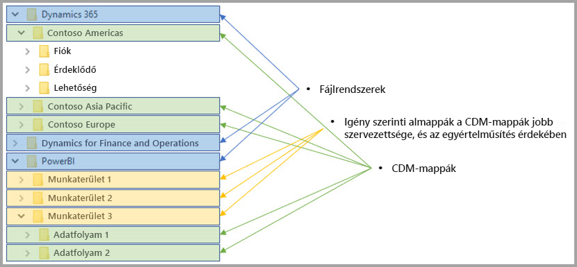

# Adatfolyamok és az Azure Data Lake integrációja (előzetes verzió)

A Power BI-jal használt adatok alapértelmezés szerint a Power BI által biztosított belső tárolóban helyezkednek el. Az adatfolyamok és az Azure Data Lake Storage Gen2 (ADLS Gen2) integrációjának köszönhetően adatfolyamait vállalata Azure Data Lake Storage Gen2-fiókjában is tárolhatja. 

> [!NOTE]
> Az adatfolyamok előzetes verzióban állnak rendelkezésre, és az általánosan elérhetővé válás előtt módosulhatnak és frissülhetnek.

## A CDM-mappák és az adatfolyamok kapcsolata

**Adatfolyamokkal** a felhasználók és vállalatok egységesíthetik a különféle forrásokból származó adatokat, valamint előkészíthetik azokat modellezésre. A Common Data Model (CDM) által a vállalatok az összes alkalmazásban és üzemelő példányban szemantikai konzisztenciát biztosító formában használhatják az adatokat. A Azure Data Lake Storage Gen2 (ADLS Gen2) használatával viszont rendkívül részletes hozzáférési és hitelesítési szabályozás alkalmazható a data lake-jellegű, Azure-beli adatokra. Ezek együttesen kitűnően biztosítják az adatok központosítását, strukturáltságát, a részletes hozzáférés-vezérlést, valamint az alkalmazások és kezdeményezések szemantikai konzisztenciáját az egész vállalatnál.

A CDM-formában tárolt adatok egy vállalaton belül az összes alkalmazásban és üzemelő példányban biztosítják a szemantikai konzisztenciát. A CDM és az ADLS Gen2 integrációjával ugyanez az egységes szerkezet és szemantikai jelentés alkalmazható az ADLS Gen2-ben tárolt adatokra, a sematizált adatokat szabványos CDM-formátumban tartalmazó CDM-mappák használatával. Az Azure Data Lake-beli szabványos metaadatok és önleíró adatok lehetővé teszik a metaadatok egyszerű felderítését, és az együttműködést az olyan adatelőállítók és -fogyasztók között, mint a Power BI, az Azure Data Factory, az Azure Data Lake, a Databricks és az Azure Machine Learning (ML). 

Az adatfolyamok CDM-mappákban tárolják definíciójukat és adataikat, az alábbi formátumokban:

**Model.json**
* A **Model.json** metaadatleíró fájl szemantikai információt tartalmaz az entitásrekordokról és tulajdonságokról, és hivatkozásokat a mögöttes adatfájlokra. A model.json fájl megléte a CDM metaadat-formátumnak való megfelelőséget jelzi, és szabványos entitásokat is tartalmazhat, amelyek az alkalmazások által használható további bőséges gyári szemantikai metaadatokkal rendelkeznek.
* A Power BI az összes adatforrás információit tartalmazza a Power BI szolgáltatásban, az Adatforrásszerkesztő felületen generált **lekérdezésekkel és átalakításokkal** együtt. Az adatforrások jelszavai nem a modellfájlban vannak tárolva.

**Adatfájlok**
* Az adatfájlok jól meghatározott struktúrában és formátumban helyezkednek el a CDM-mappában (az almappák használata nem kötelező; erről a cikk későbbi része ír bővebben), és a model.json fájl hivatkozik rájuk. Az adatfájloknak egyelőre .csv formátumúnak kell lenniük, de a későbbi frissítések további formátumokat is támogathatnak. 

Az alábbi ábrán látható minta egy Power BI-adatfolyam által létrehozott CDM-mappát mutat be, amely három entitást tartalmaz:

A fenti ábrán a model.json vagy a metaadat-fájl a CDM-mappában lévő entitás-adatfájlokra mutatna.

## A data lake-beli CDM-mappákat a Power BI szervezi

Power BI-adatfolyamokkal és az ADLS Gen2-vel való integrációval a Power BI adatokat képes előállítani egy data lake-ben. Adatelőállítóként a Power BI-nak minden adatfolyamhoz létre kell hoznia egy CDM-mappát, amely a model.json fájlt és az ahhoz tartozó adatfájlokat tartalmazza. A Power BI *fájlrendszerek* segítségével különíti el adatait más adatelőállítókéitól a data lake-ben. Az Azure Data Lake Storage Gen2 fájlrendszeréről és hierarchikus névteréről [az azokat ismertető cikkben](https://docs.microsoft.com/azure/storage/data-lake-storage/namespace) olvashat bővebben.

A Power BI almappákat használ az egyértelműség, és a **Power BI szolgáltatásban** bemutatott adatok nagyobb szervezettsége érdekében. A mappák elnevezése és struktúrája a munkaterületek (Mappák) és adatfolyamok (CDM-mappák) leképezése. Az alábbi ábra egy Power BI-jal és más adatelőállítókkal megosztott data lake egy lehetséges felépítését mutatja be. Minden szolgáltatás, ebben az esetben a Dynamics 365, a Dynamics for Finance and Operation, és a Power BI is saját fájlrendszert hoz létre és tart fenn. Az egyes szolgáltatási felületektől függően almappák lesznek létrehozva a CDM-mappáknak a fájlrendszeren belüli rendszerezéséhez. 

## A Power BI megvédi a data lake-beli adatokat

A Power BI az Azure Data Lake Storage Gen2 által biztosított *Active Directory OAuth Bearer* tulajdonosi jogkivonatokat és *POSIX ACL-eket* használja. Ezek a funkciók teszik lehetővé a Power BI hozzáférésének kiterjesztését az általa kezelt, data lake-beli fájlrendszerre, és biztosítja, hogy mindenki csak az általa létrehozott adatfolyamokhoz vagy CDM-mappákhoz férjen hozzá. 

A Power BI-fájlrendszeren belüli CDM-mappák létrehozásához és kezeléséhez a fájlrendszerhez való olvasási, írási és végrehajtási jogosultság szükséges. A Power BI-ban létrehozott adatfolyamok saját CDM-mappájukban vannak tárolva, az adatfolyam létrehozója pedig csak olvasási hozzáféréssel rendelkezik a CDM-mappára és annak tartalmára. Ezen a módon a Power BI által generált adatok integritása védve van, a rendszergazdák pedig az auditnaplók használatával figyelni tudják, hogy melyik felhasználók fértek hozzá a CDM-mappához. 

### CDM-mappákra vonatkozó jogosultságok kiosztása felhasználóknak vagy szolgáltatásoknak

Az A Active Directory OAuth Bearer tulajdonosi jogkivonatok POSIX ACL-ek egyszerűbbé teszik a CDM-mappák megosztását azokkal az adatfogyasztókkal, például felhasználókkal vagy szolgáltatásokkal, amelyeknek olvasniuk kell az adatokat. Ezen a módon a rendszergazdák figyelni tudják, hogy ki fért hozzá a CDM-mappához. Az egyetlen szükséges művelet a hozzáférés biztosítása a választott Active Directory-objektum (például felhasználói csoport vagy szolgáltatás) számára a CDM-mappához. Ajánlott az adatelőállítón kívül minden identitásnak csak olvasható hozzáférést adni a CDM-mappához. Ezzel megvédhető az előállító által generált adatok integritása.

Ahhoz, hogy CDM-mappákat vehessen fel a Power BI-ba, a CDM-mappát hozzáadó felhasználónak *olvasási* hozzáférési ACL-ekkel kell rendelkeznie magára a CDM-mappára, és az abban lévő fájlokra és mappákra is. Ezen felül *végrehajtási* hozzáférési ACL-ek is szükségesek a CDM-mappára és az abban lévő mappákra. A további tájékozódáshoz ajánlott a [Hozzáférés-vezérlési listák fájlokhoz és könyvtárakhoz](https://docs.microsoft.com/azure/storage/blobs/data-lake-storage-access-control#access-control-lists-on-files-and-directories) és [Az Azure Data Lake Storage Gen2 használatához ajánlott eljárások](https://docs.microsoft.com/azure/storage/blobs/data-lake-storage-best-practices) című cikkek áttekintése.

### Más hitelesítési formák

A Power BI-on kívüli személyek és szolgáltatások a hitelesítés más formáit is kihasználhatják. Ezek a kulcs birtokosának biztosítanak hozzáférést a fiók *összes* erőforrásához, teljes hozzáférést a data lake-beli összes forráshoz, és nem szűkíthetők fájlrendszerekre vagy CDM-mappákra. Ezekkel az alternatívákkal egyszerű hozzáférést adni, de korlátozzák a data lake-beli adott források megosztásának lehetőségeit, és nem biztosítanak módot a tárolóhoz való hozzáférés naplózására. Az elérhető hitelesítési sémákat a [Hozzáférés-vezérlés az Azure Data Lake Storage Gen2-ben](https://docs.microsoft.com/azure/storage/blobs/data-lake-storage-access-control
) című cikk ismerteti teljes részletességgel.

## Következő lépések

Ez a cikk a Power BI-adatfolyamok, a CDM-mappák, és az Azure Data Lake Storage Gen2 integrációját tekintette át. További információt a következő cikkekben találhat:

Az adatfolyamokról, a CDM-ről és az Azure Data Lake Storage Gen2-ről az alábbi cikkekből tájékozódhat:

* [Munkaterület adatfolyam-beállításainak konfigurálása (előzetes verzió)](service-dataflows-configure-workspace-storage-settings.md)
* [CDM-mappa hozzáadása a Power BI-hoz adatfolyamként (előzetes verzió)](service-dataflows-add-cdm-folder.md)
* [Azure Data Lake Storage Gen2 csatlakoztatása adatfolyam-tároláshoz (előzetes verzió)](service-dataflows-connect-azure-data-lake-storage-gen2.md)

Az adatfolyamokról általánosságban a következő cikkek szólnak:

* [Adatfolyamok létrehozása és használata a Power BI-ban](service-dataflows-create-use.md)
* [Számított entitások használata a Power BI Premiumban (előzetes verzió)](service-dataflows-computed-entities-premium.md)
* [Adatfolyamok használata helyszíni adatforrásokkal (előzetes verzió)](service-dataflows-on-premises-gateways.md)
* [Fejlesztői erőforrások a Power BI-adatfolyamokhoz (előzetes verzió)](service-dataflows-developer-resources.md)

Az Azure Storage szolgáltatással kapcsolatban az alábbi cikkeket érdemes elolvasni:
* [Azure Storage biztonsági útmutató](https://docs.microsoft.com/azure/storage/common/storage-security-guide)
* [Első lépések az Azure Data Servicesből származó github-mintákkal](https://aka.ms/cdmadstutorial)

A Common Data Modellel kapcsolatos további információt a témát áttekintő cikkben talál:
* [Common Data Model – áttekintés](https://docs.microsoft.com/powerapps/common-data-model/overview)
* [CDM-mappák](https://go.microsoft.com/fwlink/?linkid=2045304)
* [CDM-modellfájl definiálása](https://go.microsoft.com/fwlink/?linkid=2045521)

Mindig érdemes [feltenni kérdéseit a Power BI-közösségnek](http://community.powerbi.com/).
