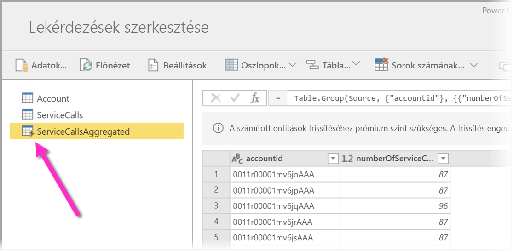
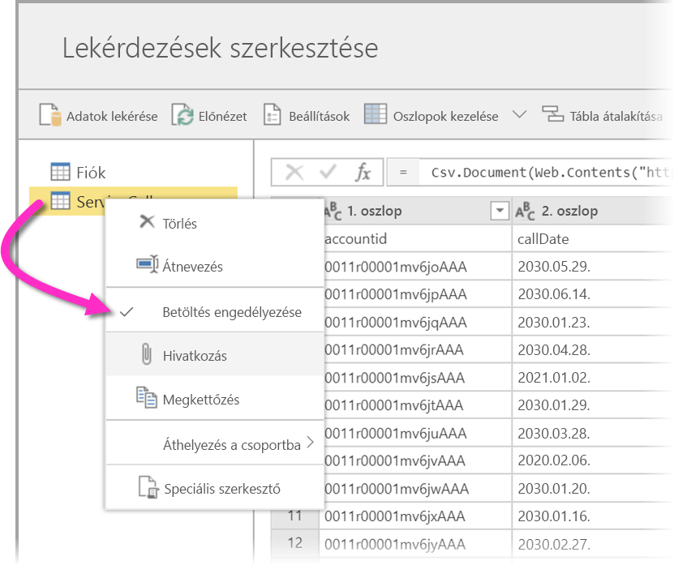
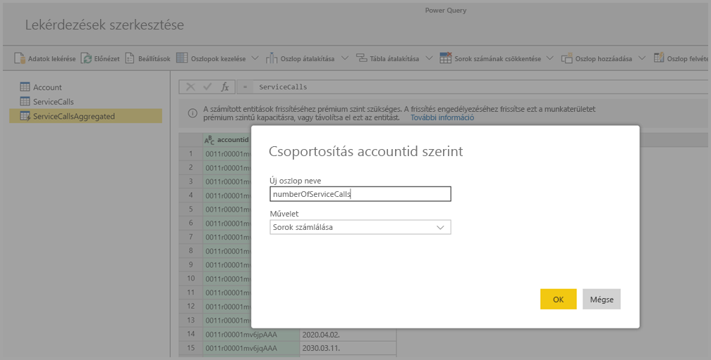
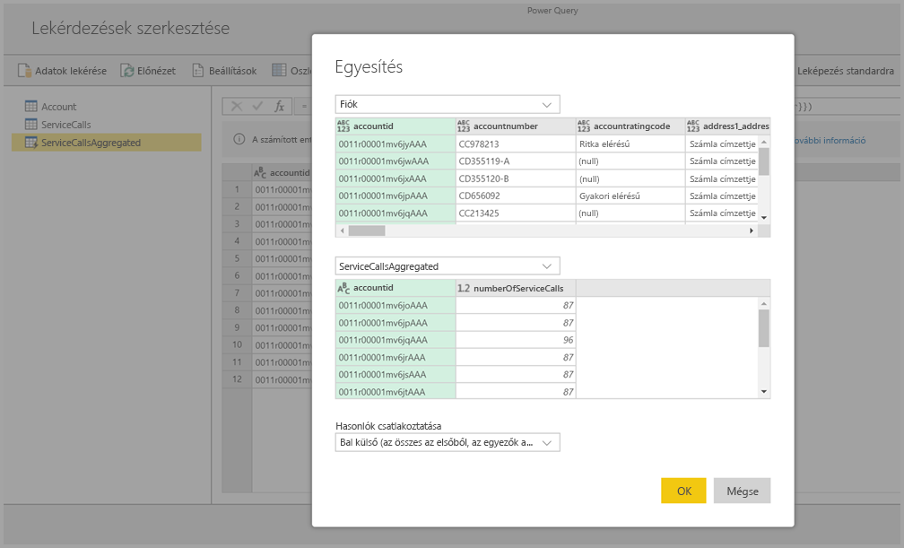
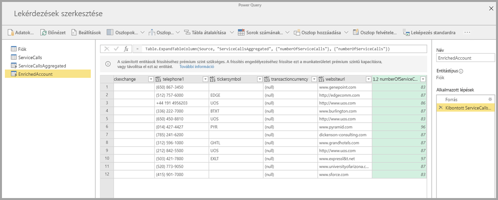

# Számított entitások használata a Power BI Premiumban (előzetes verzió)

Ha Power BI Premium-előfizetéssel használ **adatfolyamokat**, **tárolón belüli számításokat** hajthat végre. Ezáltal meglévő adatfolyamain végezhet számításokat, az általuk visszaadott eredmények pedig lehetővé teszik, hogy Ön a jelentéskészítésre és az elemzésekre összpontosítson. 

**Tárolón belüli számításokhoz** először az adatfolyamot kell létrehoznia, majd az adatokat kell elhelyeznie ebben a Power BI-adatfolyam-tárolóban. Ha már rendelkezik adatokat tartalmazó adatfolyammal, **számított entitásokat** hozhat létre. Ezek tárolón belüli számításokat végző entitások. 

Adatfolyambeli adatokat két módon csatlakoztathat a Power BI-hoz:

* [Egy adatfolyam önkiszolgáló tartalomkészítésének felhasználásával](service-dataflows-create-use.md)
* Külső adatfolyam használatával

A következő szakaszok számított entitások adatfolyambeli adatok alapján történő létrehozását ismertetik.

> [!NOTE]
> Az adatfolyamok előzetes verzióban állnak rendelkezésre, és az általánosan elérhetővé válás előtt módosulhatnak és frissülhetnek.

## Számított entitások létrehozása 

Ha már rendelkezik entitások listáját tartalmazó adatfolyammal, ezeken az entitásokon számításokat végezhet.

A Power BI szolgáltatás adatfolyam-szerkesztő eszközében válassza az **Entitások szerkesztése** lehetőséget, majd kattintson a jobb gombbal a számított entitás alapjául szánt entitásra, amelyen számításokat szeretne végezni. A helyi menüből válassza a **Hivatkozás** lehetőséget.

Ahhoz, hogy az entitás számított entitás lehessen, a **Betöltés engedélyezése** lehetőségnek az alábbi ábrán látható módon bejelölve kell lennie. Kattintson jobb gombbal az entitáson ennek a helyi menünek a megjelenítéséhez.

A **Betöltés engedélyezése** beállítással új entitást hoz létre, amelynek forrása a hivatkozott entitás. Az ikon megváltozik, és az alábbi ábrán látható **számított** ikonná alakul át.

Az ezen az újonnan létrehozott entitáson végrehajtott összes átalakítás azokon az adatokon lesz futtatva, amelyek már a Power BI-adatfolyam-tárolóban helyezkednek el. Ennek köszönhetően a lekérdezés nem azon a külső adatforráson fog futni, amelyből az adatok importálva lettek (például azon az SQL-adatbázison, amelyről az adatok le lettek kérve), hanem az adatfolyam tárolójában elhelyezkedő adatokon lesz végrehajtva.

### Használati példák
Milyen átalakítások hajthatók végre számított entitásokkal? A tárolón belüli számítások végrehajtása során minden olyan átalakítás támogatott, amelyet általában a Power BI átalakításra szolgáló felhasználói felületén, vagy az M-szerkesztőben adna meg. 

Lássuk a következő példát: van egy *Account* (Fiók) nevű entitása, amely minden ügyfél nyers adatait tartalmazza az Ön Dynamics 365-előfizetéséből. Rendelkezik továbbá szolgáltatási központtól származó *ServiceCalls* (Segélykérő hívások) entitással, amely a különböző fiókok által az év egyes napjain kezdeményezett segélykérő hívások nyers adatait tartalmazza.

Tegyük fel, hogy az *Account* entitást a *ServiceCalls* entitásból nyert adatokkal szeretné kiegészíteni. 

Először összesítenie kell a ServiceCalls entitás adatait, hogy kiszámíthassa az egyes fiókok általi hívások előző évi számát. 

Ezután egyesítenie kell az *Account* entitást a *ServiceCallsAggregated* (Hívások összesen) entitással, hogy kiszámíthassa a kiegészített **Account** tábla értékeit.

Ekkor már látni fogja az eredményt, amely az alábbi ábrán az *EnrichedAccount* entitás.

Ennyi az egész – az átalakítást nem a forrásadatokon, hanem az adatfolyambeli adatokon hajtotta végre, amelyek saját Power BI Premium-előfizetésében helyezkednek el.

## Megfontolandó szempontok és korlátozások

Fontos megjegyezni, hogy ha a munkaterületet eltávolítja a Power BI Premium-kapacitásból, a vele társított adatfolyam többé nem frissül. 

A kifejezetten a vállalat Azure Data Lake Storage Gen2-fiókjában létrehozott adatfolyamok esetében a csatolt entitások és a számított entitások csak akkor működnek helyesen, ha ugyanabban a tárfiókban helyezkednek el. További információ: [Azure Data Lake Storage Gen2 csatlakoztatása adatfolyam-tároláshoz (előzetes verzió)](service-dataflows-connect-azure-data-lake-storage-gen2.md).

Csatolt entitások a CDM-mappából létrehozott adatfolyamokhoz sem érhetők el. Lásd: [CDM-mappa hozzáadása a Power BI-hoz adatfolyamként (előzetes verzió)](service-dataflows-add-cdm-folder.md).

## Következő lépések

Ez a cikk a Power BI szolgáltatásban elérhető számított entitásokat és adatfolyamokat ismertette. Az alábbi cikkek szintén hasznosak lehetnek.

* [Önkiszolgáló adatelőkészítés adatfolyamokkal](service-dataflows-overview.md)
* [Adatfolyamok létrehozása és használata a Power BI-ban](service-dataflows-create-use.md)
* [Adatfolyamok használata helyszíni adatforrásokkal (előzetes verzió)](service-dataflows-on-premises-gateways.md)
* [Fejlesztői erőforrások a Power BI-adatfolyamokhoz (előzetes verzió)](service-dataflows-developer-resources.md)
* [Munkaterület adatfolyam-beállításainak konfigurálása (előzetes verzió)](service-dataflows-configure-workspace-storage-settings.md)
* [CDM-mappa hozzáadása a Power BI-hoz adatfolyamként (előzetes verzió)](service-dataflows-add-cdm-folder.md)
* [Azure Data Lake Storage Gen2 csatlakoztatása adatfolyam-tároláshoz (előzetes verzió)](service-dataflows-connect-azure-data-lake-storage-gen2.md)

A Power Queryvel és az ütemezett frissítésekkel kapcsolatos további információt a következő cikkekben talál:
* [Lekérdezések áttekintése a Power BI Desktopban](desktop-query-overview.md)
* [Ütemezett frissítés beállítása](refresh-scheduled-refresh.md)

A Common Data Modellel kapcsolatos további információt a témát áttekintő cikkben talál:
* [Common Data Model – áttekintés](https://docs.microsoft.com/powerapps/common-data-model/overview)

