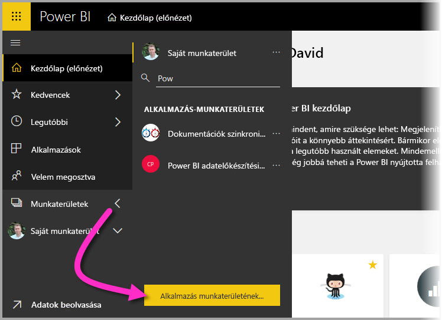
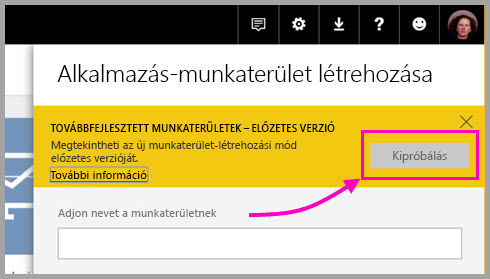
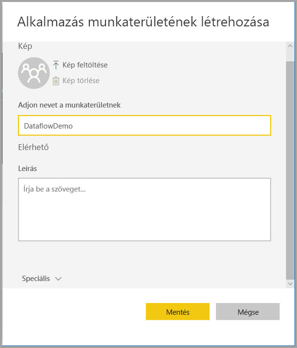
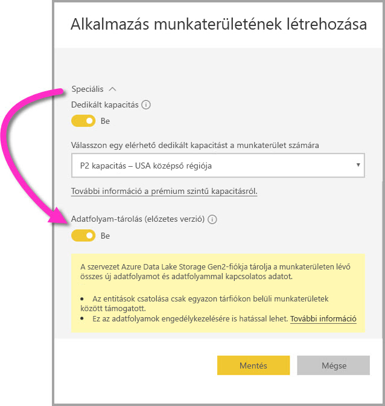
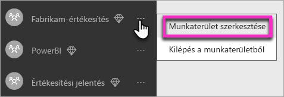
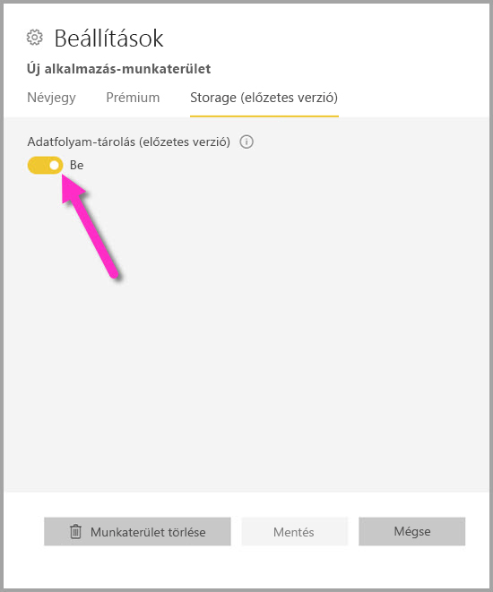
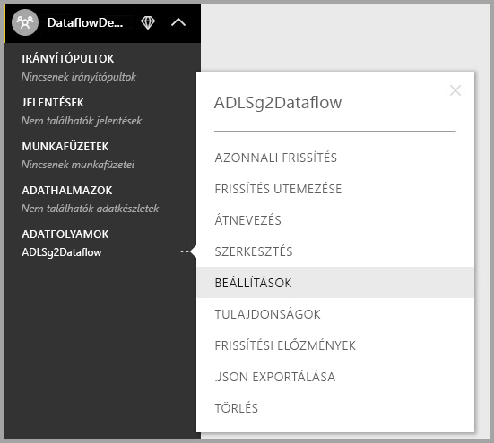
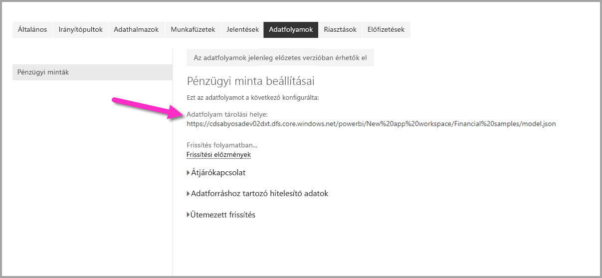

# Munkaterület adatfolyam-beállításainak konfigurálása (előzetes verzió)

A Power BI és adatfolyamok használatával egy munkaterület adatfolyam-definíciós fájljait és adatfájljait saját Azure Data Lake Storage Gen2-fiókjában tárolhatja. Erre a munkaterületek rendszergazdái konfigurálhatják a Power BI-t, aminek a lépéseit ez a cikk ismerteti. 

Egy munkaterület adatfolyam-tárolási helyének konfigurálása előtt a vállalat globális rendszergazdájának csatlakoztatnia kell a vállalat tárfiókját a Power BI-hoz, és engedélyeznie kell a tároló-hozzárendelési jogosultságokat erre a tárfiókra. *[Azure Data Lake Storage Gen2 csatlakoztatása adatfolyam-tároláshoz (előzetes verzió)](service-dataflows-connect-azure-data-lake-storage-gen2.md)* 

A munkaterület adatfolyam-tárolási beállításai két módon konfigurálhatók: 

* A munkaterület létrehozása során
* Meglévő munkaterület szerkesztésével

Az alábbi bekezdések mindkettőt tárgyalják. 

> [!IMPORTANT]
> A munkaterület adatfolyam-tárolási beállításai csak akkor módosíthatók, ha a munkaterület nem tartalmaz adatfolyamot. Ez a funkció csak az új munkaterületi felületen érhető el. Az új munkaterületekről az [Új munkaterületek (előzetes verzió) létrehozása a Power BI-ban](service-create-the-new-workspaces.md) című cikkből tájékozódhat bővebben.

## Új munkaterület létrehozása, és az adatfolyam-tároló konfigurálása

Új munkaterület létrehozásához a Power BI szolgáltatásban válassza a **Munkaterületek > Új munkaterület létrehozása** lehetőséget.

A Munkaterület létrehozása párbeszédpanelen megjelenhet egy **Továbbfejlesztett munkaterületek – előzetes verzió** című sárga mező. Ezen a területen válassza a **Kipróbálás** lehetőséget.

A megjelenő párbeszédpanelen egyedi nevet adhat munkaterületének. Egyelőre ne válassza a **Mentés** lehetőséget, mert speciális beállításokat kell elvégeznie.

Ezután bontsa ki a **Munkaterület létrehozása** párbeszédpanel **Speciális** területét, ahol bekapcsolható az **Adatfolyam-tárolás (előzetes verzió)** beállítás.

Az új munkaterület létrehozásához válassza a **Mentés** lehetőséget. Az ezen a munkaterületen létrehozott új adatfolyamok már a vállalati Azure Data Lake Storage Gen2-fiókban fogják tárolni definíciós fájljukat (a Model.json fájlt) és adataikat. 

## Adatfolyam-tárolás frissítése meglévő munkaterület esetén

Új munkaterület létrehozása helyett egy meglévőt is frissíthet úgy, hogy a definíciós fájlokat és az adatokat a vállalat Azure Data Lake Storage Gen2-fiókjában tárolja. Fontos tudnivaló, hogy az adatfolyam-tárolási beállítások csak akkor módosíthatók, ha a munkaterület nem tartalmaz adatfolyamot.

Munkaterület szerkesztéséhez válassza a három pont **(...)** , majd a **Munkaterület szerkesztése** lehetőséget. 

A megjelenő **Munkaterület szerkesztése** ablakban bontsa ki a **Speciális** területet, majd kapcsolja **Be** az **Adatfolyam-tárolás (előzetes verzió)** beállítást. 

Ezután válassza a **Mentés** lehetőséget, és az ezen a munkaterületen létrehozott új adatfolyamok már a vállalati Azure Data Lake Storage Gen2-fiókban fogják tárolni definíciós fájljukat és adataikat.

## Tárolt adatfolyamfájlok URI-jának megállapítása

Miután létrehozott egy adatfolyamot egy, a vállalata Azure Data Lake-fiókjához rendelt munkaterületen, közvetlenül is elérheti annak definíciós és adatfájljait. A helyük az **Adatfolyam beállításai** oldalon látható. Ide a következő lépésekkel juthat el:

Válassza a munkaterületen az **Adatfolyamok** alatti listában szereplő adatfolyamok egyike melletti három pontot **(...)** . A megjelenő menüben válassza a **Beállítások** lehetőséget.

A megjelenő információk között megtalálható az adatfolyam CDM-mappájának helye az **Adatfolyam-tárolási hely** területen, ahogyan az alábbi ábrán látható.

> [!NOTE]
> A Power BI olvasási jogosultsággal ruházza fel az adatfolyam tulajdonosát arra a CDM-mappára, amelyben az adatfolyam fájljai tárolva vannak. Az adatfolyam tárolási helyéhez más személyeknek vagy szolgáltatásoknak csak akkor adható hozzáférés, ha a tárfiók tulajdonosa hozzáférést ad az Azure-ban.

## Megfontolandó szempontok és korlátozások

Bizonyos funkciók nem támogatottak akkor, ha az adatfolyam-tároló az Azure Data Lake Storage Gen2-ben helyezkedik el: 

Power BI Pro-, Premium- és Embedded-munkaterületek:
* Az **entitások csatolása** funkció csak egyazon tárfiókon belüli munkaterületek között támogatott
* A munkaterületre vonatkozó engedélyek nem érvényesek az Azure Data Lake Storage Gen2-ben tárolt adatfolyamokra. Ehhez csak az adatfolyam tulajdonosa fér hozzá.
* Ezen kívül az összes adat-előkészítési funkció megegyezik a Power BI-tárolóban tárolt adatfolyamokéval

Az alábbiakban felsorolt szempontokat is érdemes figyelembe venni:

* Az adatfolyam-tároló helye a konfigurálás után már nem módosítható.
* Csak az Azure Data Lake Storage Gen2-ben tárolt adatfolyam tulajdonosa férhet hozzá annak adataihoz.
* Megosztott Power BI-kapacitásokban lévő helyszíni adatforrások nem támogatottak a vállalati Azure Data Lake Storage Gen2-ben tárolt adatfolyamokban.

**Power BI Desktop**-ügyfél csak akkor fér hozzá az Azure Data Lake Storage Gen2-fiókban tárolt adatfolyamhoz, ha az adatfolyam tulajdonosa. Figyelje meg a következő példát:

1.  Anna új munkaterületet hoz létre, amelyet úgy konfigurál, hogy a vállalati adattóban tárolja az adatfolyamokat.
2.  Dávid, aki szintén tagja az Anna által létrehozott munkaterületnek, a Power BI Desktop és az adatfolyam-összekötő használatával szeretne adatokhoz jutni az Anna által létrehozott adatfolyamból.
3.  Dávid hibajelenséget tapasztal, ugyanis nem adták hozzá jogosult felhasználóként az adatfolyam data lake-beli CDM-mappájához.

    

## Következő lépések

Ez a cikk munkaterület-tárolók adatfolyamokhoz való konfigurálásához nyújtott útmutatást. További információt a következő cikkekben találhat:

Az adatfolyamokról, a CDM-ről és az Azure Data Lake Storage Gen2-ről az alábbi cikkekből tájékozódhat:

* [Adatfolyamok és az Azure Data Lake integrációja (előzetes verzió)](service-dataflows-azure-data-lake-integration.md)
* [CDM-mappa hozzáadása a Power BI-hoz adatfolyamként (előzetes verzió)](service-dataflows-add-cdm-folder.md)
* [Azure Data Lake Storage Gen2 csatlakoztatása adatfolyam-tároláshoz (előzetes verzió)](service-dataflows-connect-azure-data-lake-storage-gen2.md)

Az adatfolyamokról általánosságban a következő cikkek szólnak:

* [Adatfolyamok létrehozása és használata a Power BI-ban](service-dataflows-create-use.md)
* [Számított entitások használata a Power BI Premiumban (előzetes verzió)](service-dataflows-computed-entities-premium.md)
* [Adatfolyamok használata helyszíni adatforrásokkal (előzetes verzió)](service-dataflows-on-premises-gateways.md)
* [Fejlesztői erőforrások a Power BI-adatfolyamokhoz (előzetes verzió)](service-dataflows-developer-resources.md)

Az Azure Storage szolgáltatással kapcsolatban az alábbi cikkeket érdemes elolvasni:

* [Azure Storage – biztonsági útmutató](https://docs.microsoft.com/azure/storage/common/storage-security-guide)
* [Első lépések az Azure Data Servicesből származó github-mintákkal](https://aka.ms/cdmadstutorial)

A Common Data Modellel kapcsolatos további információt a témát áttekintő cikkben talál:

* [Common Data Model – áttekintés](https://docs.microsoft.com/powerapps/common-data-model/overview)
* [CDM-mappák](https://go.microsoft.com/fwlink/?linkid=2045304)
* [CDM-modellfájl definiálása](https://go.microsoft.com/fwlink/?linkid=2045521)

[Kérdéseit mindig felteheti a Power BI-közösségben](http://community.powerbi.com/) is.
