# Azure Data Lake Storage Gen2 csatlakoztatása adatfolyam-tároláshoz (előzetes verzió)

A Power BI-munkaterületeket konfigurálhatja úgy, hogy az adatfolyamokat a szervezeti Azure Data Lake Storage Gen2-fiókban tárolják. Ez a cikk az ehhez szükséges általános lépéseket útmutatással és az ajánlott eljárásokkal együtt ismerteti. A munkaterületek Data Lake-beli adatfolyam-definíciók és adatfájlok tárolására való konfigurálása egyebek mellett az alábbi előnyökkel jár:

* Az Azure Data Lake Storage Gen2 kitűnően méretezhető tárolási lehetőséget kínál az adatokhoz
* Az adatfolyam-adatokat és a definíciós fájlokat az informatikai fejlesztők is felhasználhatják az Azure Data és a mesterséges intelligencia (AI) kiaknázására az [Azure Data Servicesből származó github-mintákat](https://aka.ms/cdmadstutorial) ismertető cikkben leírtak szerint
* A vállalati fejlesztők a belső alkalmazásokba és üzletági megoldásokba integrálhatják az adatfolyamok adatait, az adatfolyamokhoz és az Azure-hoz készült fejlesztői források használatával

Az Azure Data Lake Storage Gen2 adatfolyamokhoz való felhasználásához az alábbiak szükségesek:

* **Power BI-bérlő** – Az Azure Active Directory-bérlő (AAD-bérlő) legalább egy fiókjának Power BI-regisztrációval kell rendelkeznie
* **Globális rendszergazdafiók** – ez a fiókra akkor van szükség, ha csatlakozni szeretne a Power BI-hoz, és úgy szeretné konfigurálni a Power BI-t, hogy az Azure Data Lake Storage Gen2-fiókjában tárolja az adatfolyam-definíciót és az -adatokat
* **Azure-előfizetés** – az Azure Data Lake Storage Gen2 használatához Azure-előfizetés szükséges
* **Erőforráscsoport** – használhat meglévő erőforráscsoportot, vagy létrehozhat egy újat
* **Azure Storage-fiók a Data Lake Storage Gen2 (előzetes verzió) funkció engedélyezésével** – az Azure Data Lake Storage Gen2-höz való csatlakozáshoz regisztrálnia kell a nyilvános előzetes verzióra

> [!TIP]
> Ha még nincs Azure-előfizetése, kezdés előtt hozzon létre egy [ingyenes fiókot](https://azure.microsoft.com/free/).

## Az Azure Data Lake Storage Gen2 előkészítése a Power BI-hoz

Mielőtt Azure Data Lake Storage Gen2-fiókkal konfigurálná a Power BI-t, először tárfiókot kell létrehoznia és konfigurálnia. A Power BI-ra vonatkozó követelmények az alábbiak:

1. A tárfiókot ugyanabban az AAD-bérlőben kell létrehozni, mint a Power BI-bérlőt.
2. A tárfiókot ugyanabban a régióban kell létrehozni, mint a Power BI-bérlőt. A Power BI-bérlő helyének meghatározását a [Power BI-bérlő helyének megállapításáról](service-admin-where-is-my-tenant-located.md) szóló cikk ismerteti.
3. A tárfiókban engedélyeznie kell a *hierarchikus névtér* funkciót.
4. A Power BI szolgáltatásnak *Olvasó* szerepkört kell adni a tárfiókban.
5. Létre kell hozni egy **powerbi** nevű fájlrendszert.
6. A Power BI-szolgáltatásoknak engedéllyel kell rendelkezniük a létrehozott **powerbi** fájlrendszerre.

Az alábbi szakaszok az Azure Data Lake Storage Gen2-fiók konfigurálásához szükséges lépéseket írják le részletesen.

> [!NOTE]
> Az adatfolyamok előzetes verzióban állnak rendelkezésre, és az általánosan elérhetővé válás előtt módosulhatnak és frissülhetnek.

### A tárfiók létrehozása

Kövesse az [Azure Data Lake Storage Gen2-tárfiók létrehozása](https://docs.microsoft.com/azure/storage/blobs/data-lake-storage-quickstart-create-account) című cikkben leírt lépéseket.

1. Mindenképpen a Power BI-bérlőével azonos helyet válasszon, a tároló beállítása pedig legyen **StorageV2 (általános célú v2)**
2. Engedélyezze a hierarchikus névtér funkciót
3. A replikációs beállítást érdemes **georedundáns írásvédett társzolgáltatásra (RA-GRS)** beállítani

### Olvasó szerepkör megadása a Power BI szolgáltatásnak

Ezután olvasószerepkört kell adnia a Power BI szolgáltatásnak a létrehozott tárfiókban. Ez egy beépített szerepkör, tehát a lépések maguktól értetődnek. 

Kövesse a [Beépített RBAC-szerepkör hozzárendelése](https://docs.microsoft.com/azure/storage/common/storage-auth-aad-rbac#assign-a-built-in-rbac-role) című témakör lépéseit.

A **Szerepkör-hozzárendelés megadása** ablakban válassza az **Olvasó** szerepkört, hogy ez legyen a Power BI szolgáltatáshoz rendelve. Keresse meg a **Power BI szolgáltatást**. Az alábbi ábra az **Olvasó** szerepkörnek a Power BI szolgáltatáshoz rendelését mutatja be.

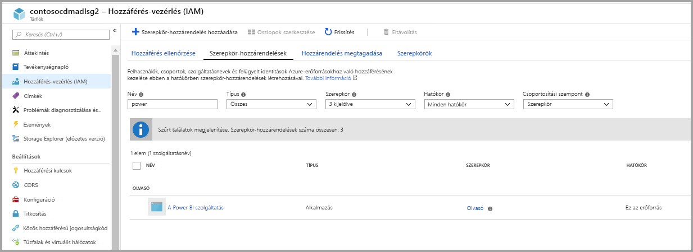

Megjegyzés: Legalább 30 percig tart, amíg az engedély a Power BI-ból átkerül a Portalra. A Portalon végzett bármilyen módosítás esetén 30 percig tarthat, amíg a módosítás megjelenik a Power BI-ban. 

### Fájlrendszer létrehozása a Power BI-hoz

Ahhoz, hogy a tárfiókot a Power BI-hoz adhassa, létre kell hoznia egy *powerbi* nevű fájlrendszert. Ilyen fájlrendszer sokféleképpen létrehozható, például az Azure Databricks, a HDInsight, az AZCopy vagy az Azure Storage Explorer használatával. Ez a szakasz a fájlrendszer létrehozásának egy kézenfekvő módját mutatja be az Azure Storage Explorer használatával.

Ez a lépés megköveteli az Azure Storage Explorer 1.6.2 vagy újabb verziójának telepítését. Az Azure Storage Explorer Windows, Macintosh vagy Linux rendszeren végzett telepítését az [Azure Storage Explorer](https://azure.microsoft.com/features/storage-explorer/) című cikk ismerteti.

1. Az Azure Storage Explorer sikeres telepítését követően, az első indításakor megjelenik a Microsoft Azure Storage Explorer – Csatlakozás ablaka. Bár a Storage Explorer több módot is kínál a tárfiókokhoz való csatlakozásra, a kívánt beállításhoz jelenleg egyetlen módszer támogatott. 

2. Keresse meg és bontsa ki a fentiekben létrehozott tárfiókot a bal oldali panelen.

3. Kattintson a jobb gombbal a Blobtárolók elemre, majd – a helyi menüben – válassza a Blobtároló létrehozása lehetőséget.

   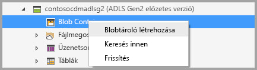

4. A Blobtárolók mappa alatt megjelenik egy szövegmező. Adja meg a *powerbi* nevet 

   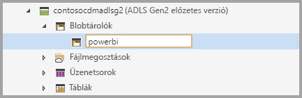

5. Ha kész, nyomja le az Enter billentyűt a blobtároló létrehozásához

   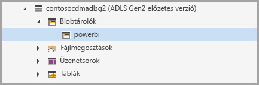

A következő szakaszban teljes hozzáférést ad a Power BI-szolgáltatáscsaládnak a létrehozott fájlrendszerhez. 

### Power BI-engedélyek megadása a fájlrendszerre

A fájlrendszerre vonatkozó engedélyek megadása hozzáférés-vezérlési lista (ACL) beállítások alkalmazásával biztosít hozzáférést a Power BI-szolgáltatások számára. Ennek első lépése a Power BI-szolgáltatások identitásának megállapítása a bérlőben. Az Azure Active Directory-alkalmazások (AAD-alkalmazások) az Azure Portal **Vállalati alkalmazások** szakaszában tekinthetők meg.

Bérlői alkalmazásait az alábbi lépésekkel találhatja meg:

1. Az [Azure Portal](https://portal.azure.com/) bal oldali navigációs paneljén válassza az **Azure Active Directory** lehetőséget.
2. Az Azure **Active Directory** panelen válassza a **Vállalati alkalmazások** lehetőséget.
3. Az **Alkalmazástípus** legördülő menüből válassza a **Minden alkalmazás** elemet, majd válassza az **Alkalmaz** lehetőséget. Megjelenik a bérlői alkalmazásnak az alábbi ábrához hasonló mintája.

    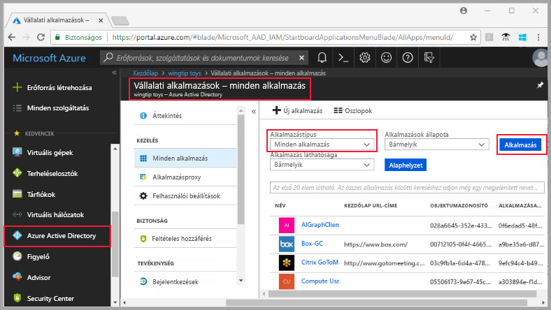

4. A keresősávon gépelje be a *Power* szót, és megjelenik a Power BI- és Power Query-alkalmazások objektumazonosítóinak katalógusa. A következő lépésekben mindhárom értékre szükség lesz.  

    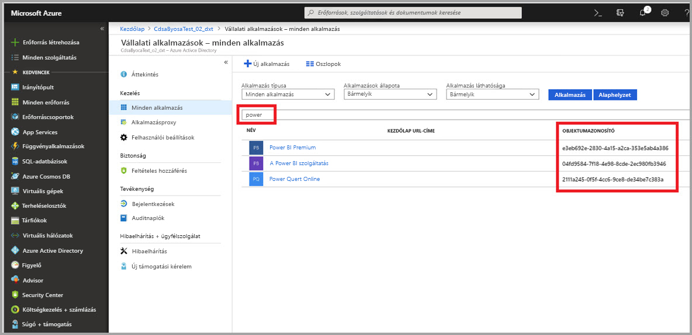

5. Jelölje ki és másolja ki a Power BI szolgáltatás és a Power BI prémium mindkét objektumazonosítóját a keresési eredmények közül. Ezeket az értékeket a következő lépések során fogja beilleszteni.

7. Ezután az **Azure Storage Explorer** használatával navigáljon az előző szakaszban létrehozott *powerbi* fájlrendszerhez. Hajtsa végre a [Fájl- és könyvtárszintű engedélyek kezelése az Azure Storage Explorerrel](https://docs.microsoft.com/azure/storage/blobs/data-lake-storage-how-to-set-permissions-storage-explorer) című cikk [Hozzáférés-kezelés](https://docs.microsoft.com/azure/storage/blobs/data-lake-storage-how-to-set-permissions-storage-explorer#managing-access) szakaszának utasításait.

8. Az 5. lépésben begyűjtött Power BI-objektumazonosítók mindegyikéhez rendelje hozzá az **olvasási**, **írási** és **végrehajtási** hozzáférést, valamint az alapértelmezett ACL-eket a *powerbi* fájlrendszerre.

   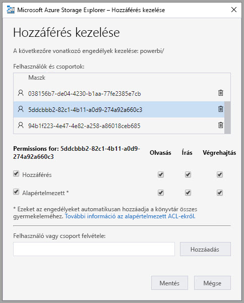

9. A 4. lépésben beszerzett Power Query-objektumazonosítóhoz rendelje hozzá az **írási** és **végrehajtási** hozzáférést, valamint az alapértelmezett ACL-eket a *powerbi* fájlrendszerre.

   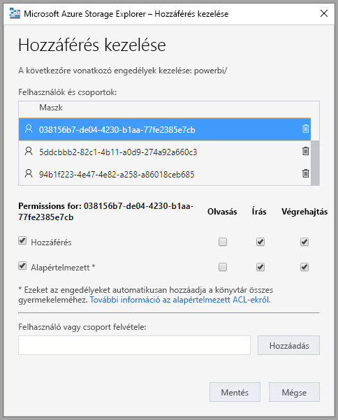

10. Ezen kívül rendelje hozzá a **végrehajtási** hozzáférést és az alapértelmezett ACL-eket az **Egyéb** elemhez is.

    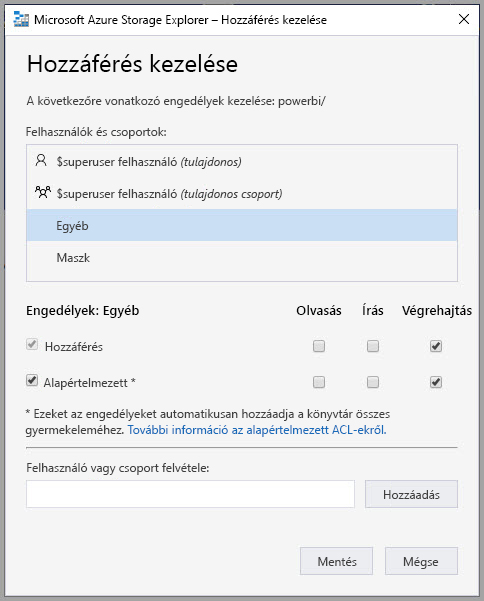

## Az Azure Data Lake Storage Gen2 csatlakoztatása a Power BI-hoz

Miután beállította Azure Data Lake Storage Gen2-fiókját az Azure Portalon, a **Power BI felügyeleti portálon** csatlakoztassa a Power BI-hoz. A Power BI-adatfolyamok tárolóját is kezelheti a Power BI felügyeleti portál **Adatfolyam-tároló (előzetes verzió)** beállításainak szakaszában. Az indításról és az alapszintű használatról [A felügyeleti portál elérése](service-admin-portal.md) című cikk nyújt részletes útmutatást.

**Azure Data Lake Storage Gen2**-fiókjához az alábbi lépésekben kapcsolódhat:

1. Nyissa meg az **Adatfolyam-beállítások (előzetes verzió)** lapot a **Power BI felügyeleti portálon**

    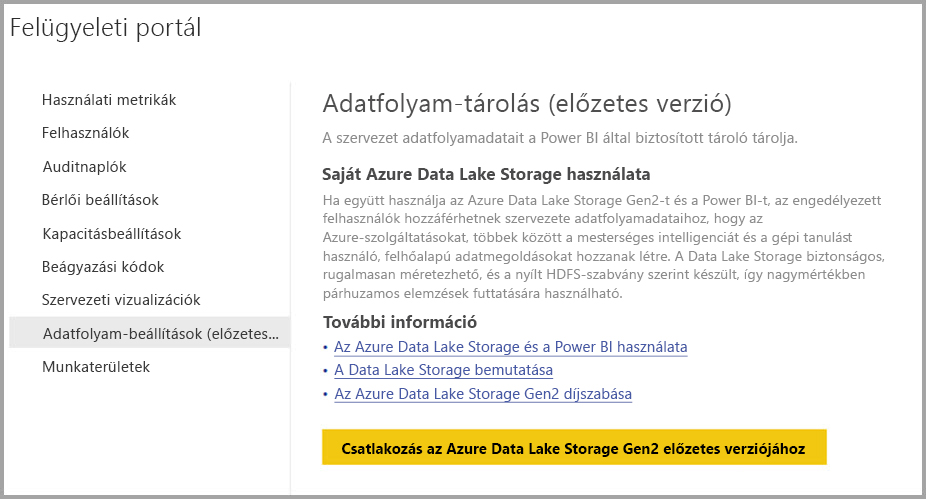 

2. Válassza a **Csatlakozás az Azure Data Lake Storage Gen2 előzetes verziójához** gombot. Az alábbi ablak jelenik meg.

     

3. Adja meg a tárfiók **előfizetés-azonosítóját**.
4. Adja meg annak az **erőforráscsoportnak a nevét**, amelyben a tárfiókot létrehozta.
5. Adja meg a **tárfiók nevét**.
6. Kattintson a **Csatlakozás** gombra.

Miután végrehajtotta ezeket a lépéseket, Azure Data Lake Storage Gen2-fiókja csatlakoztatva lesz a Power BI-hoz. 

> [!NOTE]
> Ahhoz, hogy kapcsolatot tudjon konfigurálni az Azure Data Lake Storage Gen2-höz a Power BI felügyeleti portálján, globális rendszergazdai jogosultságokkal kell rendelkeznie. A globális rendszergazdák azonban nem csatlakoztathatnak külső tárhelyeket a felügyeleti portálon.  

Ezután engedélyt kell adnia a vállalaton belüli személyeknek munkaterületeik konfigurálására, hogy használni tudják ezt a tárfiókot adatfolyamok definiálására és adattárolásra. Erre a következő szakaszban kerül sor. 

## Munkaterületek hozzárendelésének engedélyezése rendszergazdák számára

Az adatfolyam-definíciók és az adatfájlok alapértelmezés szerint a Power BI által biztosított tárolóban helyezkednek el. A saját tárfiókban lévő adatfolyamfájlok eléréséhez a munkaterület rendszergazdáinak először konfigurálnia kell a munkaterület úgy, hogy lehetővé tegye adatfolyamok hozzárendelését és tárolását az új tárfiókban. Ahhoz, hogy konfigurálni tudja az adatfolyam tárolási beállításait, a munkaterület rendszergazdájának tároló-hozzárendelési jogosultságot kell adni a **Power BI felügyeleti portálján**.

Tároló-hozzárendelési jogosultság megadásához nyissa meg az **Adatfolyam-beállítások (előzetes verzió)** lapot a **Power BI felügyeleti portálján**. Az *Annak engedélyezése, hogy a munkaterület-rendszergazdák munkaterületeket rendelhessenek hozzá ehhez a tárfiókhoz* választógombot az **engedélyezés** lehetőségre kell állítani. Az engedély megadása után válassza az **Alkalmaz** gombot a módosítások érvénybe léptetéséhez. 

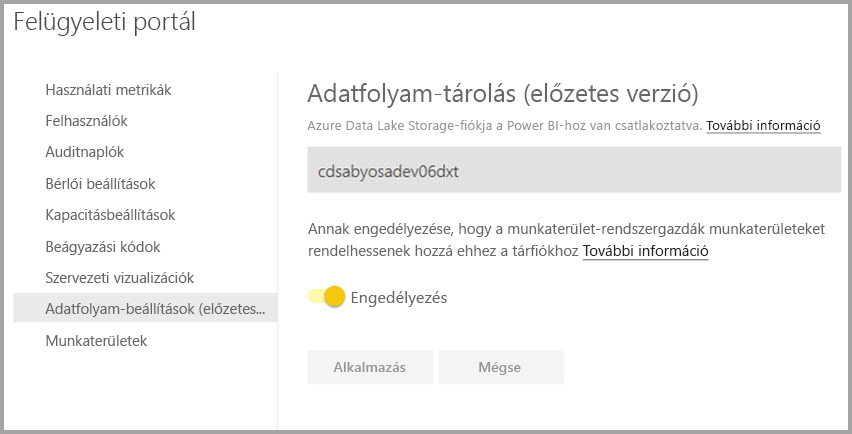 

Ennyi az egész. A Power BI-munkaterület rendszergazdái ezt követően munkaterületeket rendelhetnek az Ön által létrehozott fájlrendszerhez.

## Megfontolandó szempontok és korlátozások

Ez a funkció előzetes verziójú, és a viselkedése a megjelenés időpontjához közeledve változhat. Az adatfolyam-tároló használatakor figyelembe kell vennie néhány tényezőt és korlátozást:

* Az adatfolyam-tároló helye a konfigurálás után már nem módosítható.
* Alapértelmezés szerint csak az Azure Data Lake Storage Gen2-ben tárolt adatfolyam tulajdonosa férhet hozzá az adatfolyam adataihoz. Az Azure-ban tárolt adatfolyamokhoz további személyeknek úgy adhat hozzáférést, hogy hozzáadja őket az adatfolyam CDM-mappájához 
* Hivatkozott entitásokkal csak akkor hozható létre adatfolyam, ha ugyanabban a tárfiókban vannak tárolva
* Megosztott Power BI-kapacitásokban lévő helyszíni adatforrások nem támogatottak a vállalati data lake-ben tárolt adatfolyamokban

Létezik néhány ismert probléma is. Ezeket az alábbi szakasz ismerteti.

Power BI Desktop-ügyfél csak akkor fér hozzá az **Azure Data Lake-tárfiókokban** tárolt adatfolyamokhoz, ha az adatfolyam tulajdonosa, vagy ha jogosultsággal rendelkezik a lake-beli CDM-mappához. A helyzet a következőnek felel meg:

1. Anna új alkalmazás-munkaterületet hozott létre, amelyet úgy konfigurált, hogy a vállalati data lake-ben tárolja az adatfolyamokat. 
2. Dávid, aki szintén tagja az Anna által létrehozott munkaterületnek, a Power BI Desktop és az adatfolyam-összekötő használatával szeretne adatokhoz jutni az Anna által létrehozott adatfolyamból.
3. Dávid az alábbi ábrához hasonló hibajelenséget tapasztal, ugyanis nem rendelkezik jogosultsággal az adatfolyam lake-beli CDM-mappájára

Gyakori kérdések és válaszok többek között az alábbiak:

**Kérdés:** Mi a teendő, ha korábban adatfolyamokat hoztam létre egy munkaterületen, és szeretném módosítani a tárolási helyüket?

**Válasz:** Az adatfolyamok tárolási helye a létrehozásuk után már nem módosítható. 

**Kérdés:** Mikor módosíthatom egy munkaterület adatfolyam-tárolási helyét?

**Válasz:** Egy munkaterület adatfolyam-tárolási helyének módosítása csak akkor megengedett, ha a munkaterület nem tartalmaz adatfolyamokat.

## Következő lépések

Ez a cikk Azure Data Lake Gen2-adatfolyamok tárolása érdekében végzett csatlakoztatásához nyújtott útmutatást. További információt a következő cikkekben találhat:

Az adatfolyamokról, a CDM-ről és az Azure Data Lake Storage Gen2-ről az alábbi cikkekből tájékozódhat:

* [Adatfolyamok és az Azure Data Lake integrációja (előzetes verzió)](service-dataflows-azure-data-lake-integration.md)
* [Munkaterület adatfolyam-beállításainak konfigurálása (előzetes verzió)](service-dataflows-configure-workspace-storage-settings.md)
* [CDM-mappa hozzáadása a Power BI-hoz adatfolyamként (előzetes verzió)](service-dataflows-add-cdm-folder.md)

Az adatfolyamokról általánosságban a következő cikkek szólnak:

* [Adatfolyamok létrehozása és használata a Power BI-ban](service-dataflows-create-use.md)
* [Számított entitások használata a Power BI Premiumban (előzetes verzió)](service-dataflows-computed-entities-premium.md)
* [Adatfolyamok használata helyszíni adatforrásokkal (előzetes verzió)](service-dataflows-on-premises-gateways.md)
* [Fejlesztői erőforrások a Power BI-adatfolyamokhoz (előzetes verzió)](service-dataflows-developer-resources.md)

Az Azure Storage szolgáltatással kapcsolatban az alábbi cikkeket érdemes elolvasni:
* [Azure Storage – biztonsági útmutató](https://docs.microsoft.com/azure/storage/common/storage-security-guide)

A Common Data Modellel kapcsolatos további információt a témát áttekintő cikkben talál:
* [Common Data Model – áttekintés](https://docs.microsoft.com/powerapps/common-data-model/overview)
* [CDM-mappák](https://go.microsoft.com/fwlink/?linkid=2045304)
* [CDM-modellfájl definiálása](https://go.microsoft.com/fwlink/?linkid=2045521)

[Kérdéseit mindig felteheti a Power BI-közösségben](http://community.powerbi.com/) is.
