# Adatfolyamok létrehozása és használata a Power BI-ban (előzetes verzió)

A **Power BI-ban** elérhető fejlett adat-előkészítéssel létrehozhatja az adatok adatfolyamnak nevezett gyűjteményét, amelyet aztán különböző forrásokból származó üzleti adatokhoz való csatlakozásra, azok tisztítására, átalakításra, és Power BI-tárolóba való betöltésre használhat.

Az **adatfolyamok** a táblákhoz hasonló *entitásokból* álló gyűjtemények, amelyek a Power BI szolgáltatáson belüli alkalmazás-munkaterületekben vannak létrehozva és felügyelve. Adatfolyamában entitásokat vehet fel és kezelhet, valamint kezelni tudja az adatfrissítés ütemezését, közvetlenül arról a munkaterületről, amelyben az adatfolyam létre lett hozva.

Miután létrehoz egy adatfolyamot, a **Power BI Desktop** és a **Power BI szolgáltatás** használatával olyan adathalmazokat, jelentéseket és alkalmazásokat hozhat létre, amelyek a Power BI-adatfolyamokban elhelyezett adatokon alapulnak, ezáltal betekintést nyújtanak üzleti tevékenységeibe.

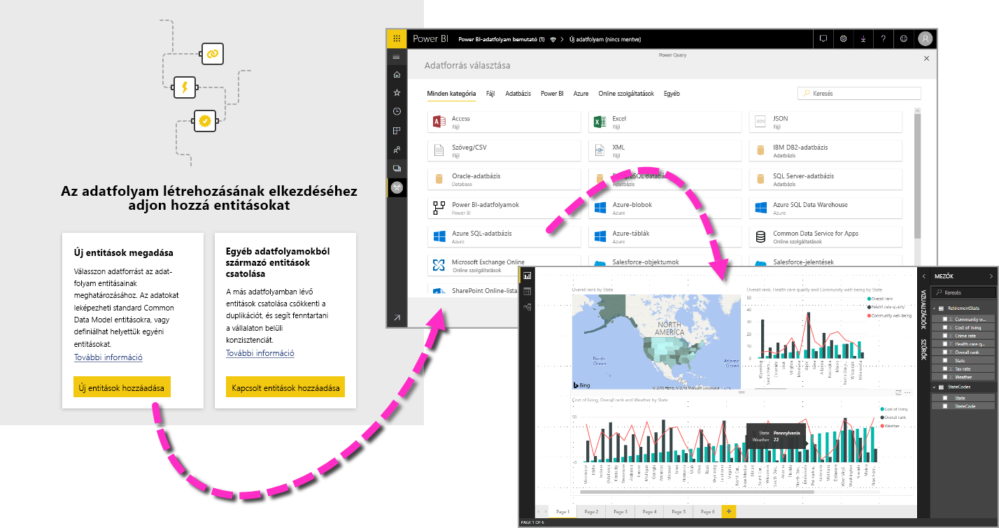

Egy adatfolyam használata három fő lépésből áll:

1. Az adatfolyam elkészítése olyan Microsoft-eszközök használatával, amelyek ennek egyszerű végrehajtására vannak tervezve
2. Az adatfolyamba behozni kívánt adatok frissítési gyakoriságának ütemezése
3. Az adathalmaz kiépítése az adatfolyam és a Power BI Desktop használatával 

A következő fejezetek sorra veszik ezeket a lépéseket, és ismertetik az egyes lépések végrehajtásához kínált eszközöket. Kezdjünk hozzá.

> [!NOTE]
> Az adatfolyamok előzetes verzióban állnak rendelkezésre, és az általánosan elérhetővé válás előtt módosulhatnak és frissülhetnek.

## Adatfolyam létrehozása
Adatfolyam létrehozásához nyissa meg a Power BI szolgáltatást egy böngészőben, majd válasszon egy **alkalmazás-munkaterületet** a bal oldali navigációs panelen (a *saját munkaterületen* nem érhetők el adatfolyamok a Power BI szolgáltatásban), ahogy az alábbi ábrán is látható. Új munkaterületet is létrehozhat, amelyben aztán létrehozhatja új adatfolyamát. 

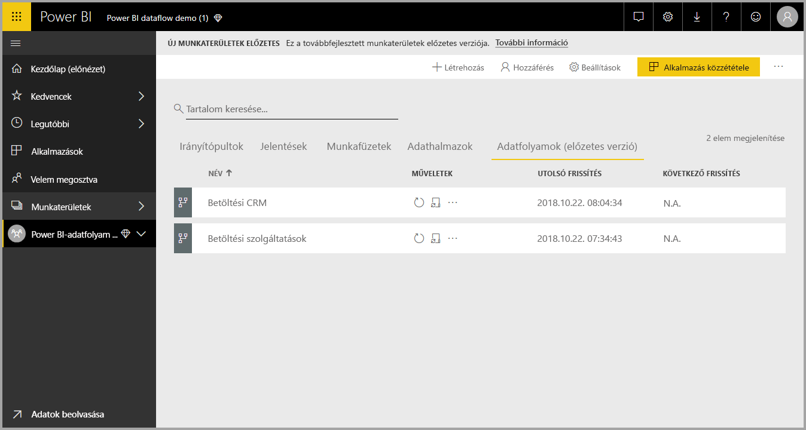

Miután létrehozott egy **alkalmazás-munkaterületet**, amelyben létrehozhat egy adatfolyamot, a vászon jobb felső részén megjelenik a **+ Létrehozás** gomb. Válassza a **+ Létrehozás** gombot, majd a legördülő lista **Adatfolyam** elemét. 

Fontos tudni, hogy minden adatfolyamnak csak *egy tulajdonosa* lehet: az, aki létrehozza. Az adatfolyamot csak a tulajdonosa szerkesztheti. Az **alkalmazás-munkaterületnek** azok a felhasználói, akik olvasási vagy írási jogosultsággal rendelkeznek arra az alkalmazás-munkaterületre, ahol az adatfolyam létre lett hozva, a **Power BI Desktopon** belül csatlakozhatnak az adatfolyamhoz, a cikk későbbi részében leírt módon.

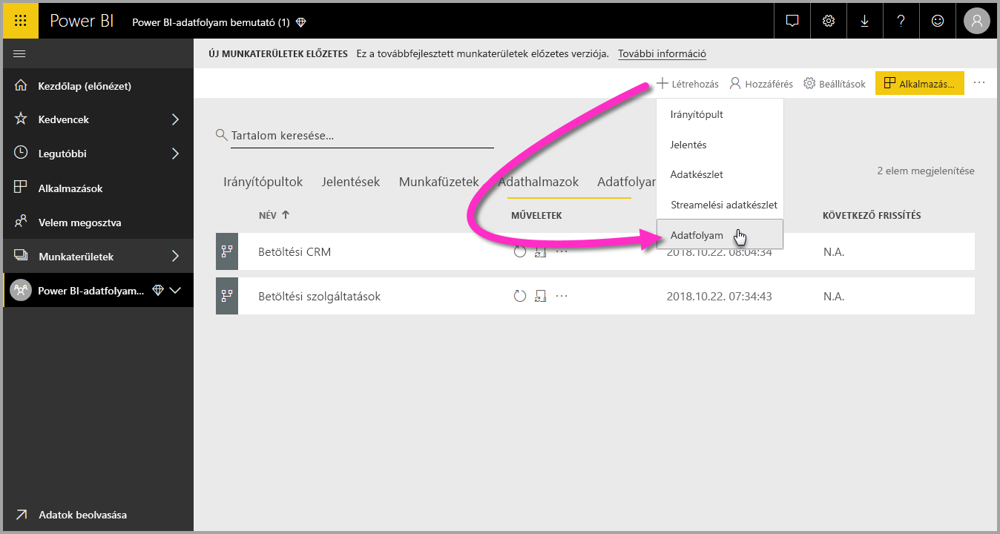

Ezen a felületen **Entitásokat** vehet fel, a következő szakaszban leírt módon.

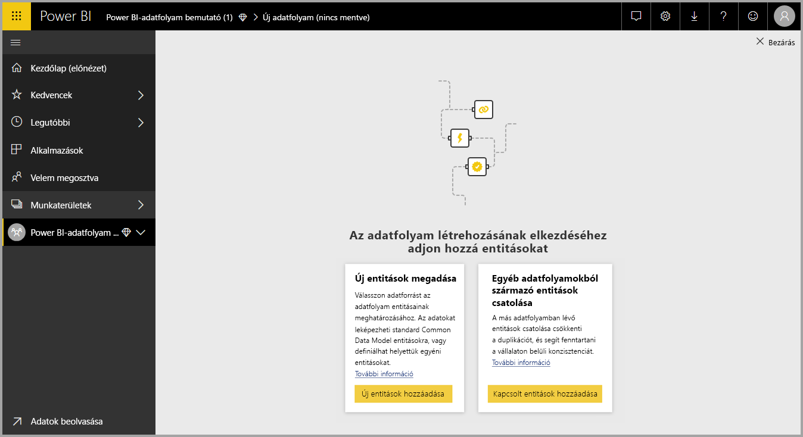

### Entitások felvétele

Az **entitás** egy olyan mezőhalmaz, amelyben a rendszer egy adatbázistáblához hasonlóan tárolja az adatokat. Az alábbi ábrán azok az adatforrások láthatók, amelyekből adatokat tölthet be a Power BI-ba.

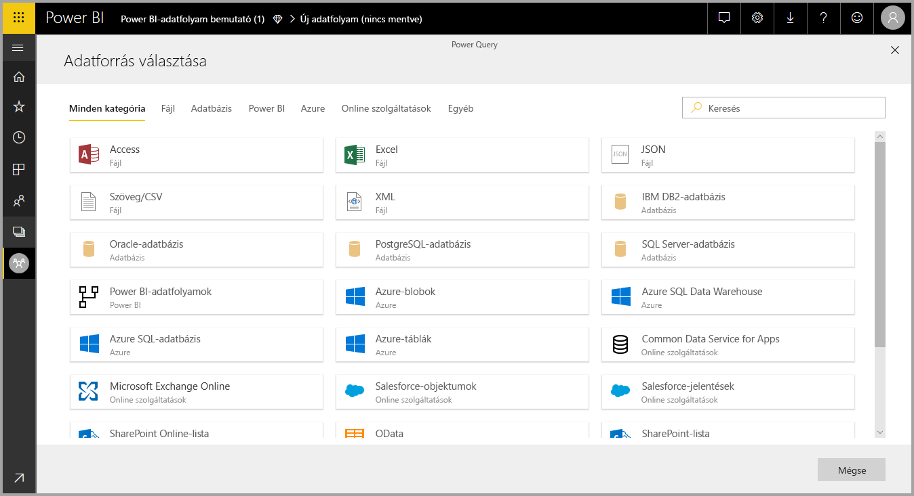

Amikor adatforrást választ, a rendszer felkéri, hogy adja meg a kapcsolati beállításokat, köztük az adatforráshoz való kapcsolódáshoz használandó fiókot, ahogy az alábbi ábrán is látható.

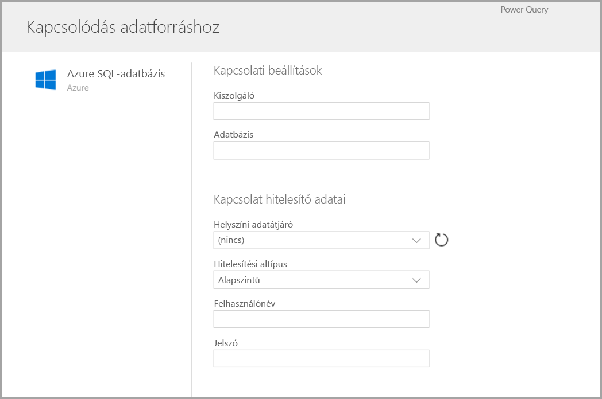

Kapcsolódás után kiválaszthatja az entitáshoz használandó adatokat. Az adatok és a forrás kiválasztása után a Power BI a beállítási folyamat későbbi részében megadott gyakorisággal kapcsolódik újra az adatforráshoz az adatfolyambeli adatok frissítéséhez.

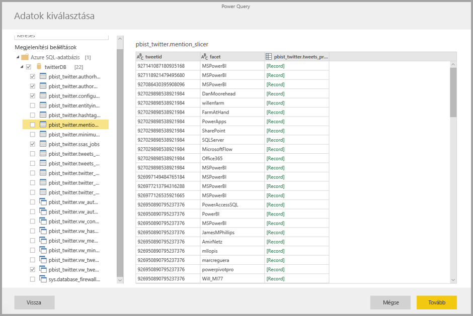

Az entitáshoz használandó adatok kijelölése után az adatfolyam-szerkesztő használatával alakíthatja át az adatokat az adatfolyamban való felhasználásukhoz szükséges formátumra.

### Az adatfolyam-szerkesztő használata

Miután kijelölte, hogy a forrásból mely adatok legyenek használva az entitáshoz, a kijelölt adatokat az entitásnak leginkább megfelelő formára alakíthatja a Power Query szerkesztőfelületén, amely a **Power BI Desktop** **Power Query-szerkesztőjéhez** hasonló. A Power Query jobb megismerése érdekében (a Power Query be van építve a Power BI Desktopba Power Query-szerkesztőként) olvassa el a Power BI Desktophoz írt, a [Queryt ismertető cikket](desktop-query-overview.md). 

Ha szeretné látni a kódot, amelyet a Lekérdezésszerkesztő az egyes lépésekkel létrehoz, vagy egyéni formázási kódot szeretne létrehozni, használhatja a **Speciális szerkesztőt**. 

### Adatfolyamok a Common Data Modelben (CDM)

Az adatfolyam-entitások új eszközöket tartalmaznak, amelyekkel üzleti adatai egyszerűen leképezhetők a Common Data Modelre (a Microsoft szabványos sémájára), kiegészíthetők a Microsofttól és külső felektől származó adatokkal, és egyszerűbb hozzáférést kínálnak a gépi tanuláshoz. Ezeket az új képességeket kiaknázva intelligens és gyakorlatban hasznosítható elemzési eredményeket adhat üzleti adataihoz. Miután elvégezte az átalakításokat a Lekérdezések szerkesztése lépésben, az adatforrástáblák oszlopait standard entitásmezőkre képezheti le a Common Data Modelben meghatározott módon. A standard entitások a Common Data Modelben definiált, ismert sémával rendelkeznek.

Erről a módszerről és a Common Data Modelről [A Common Data Service ismertetése](https://docs.microsoft.com/powerapps/common-data-model/overview) című cikkből tájékozódhat.

Ha adatfolyamával a Common Data Modelt szeretné használni, kattintson a **Leképezés standardra** átalakításra a **Lekérdezések szerkesztése** párbeszédpanelben. A megjelenő **Entitások leképezése** képernyőn kiválaszthatja azt a standard entitást, amelyre leképezni kíván.

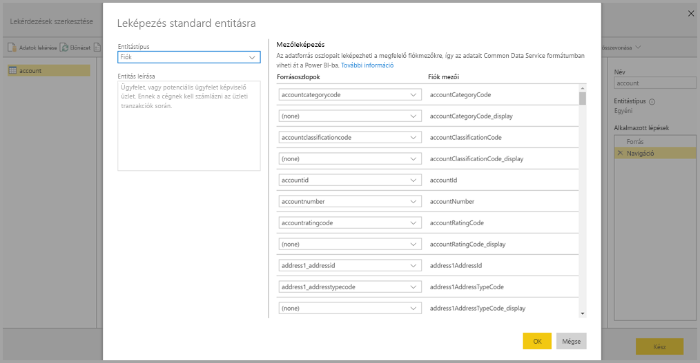

Amikor egy forrás egy oszlopát standard mezőre képezi le, a következő történik:

1. A forrásbeli oszlop felveszi a standard mező nevét (ha a nevek eltérnek, az oszlop át lesz nevezve)
2. A forrásbeli oszlop átveszi a standard mező adattípusát

A Common Data Model standard entitásának megőrzése érdekében a le nem képezett standard mezők *Null* értéket vesznek fel.

A leképezésben nem szereplő forrásoszlopok változatlanok maradnak, hogy a leképezés eredménye egyéni mezőkkel rendelkező standard entitás legyen.

Ha végzett a kijelölésekkel, entitása és az adatok beállításai pedig készen állnak a mentésre, kattintson a menü **Mentés** elemére. Fontos tudni, hogy az **Entitások hozzáadása** gombbal több entitást is létrehozhat, és hogy a létrehozott lekérdezések és entitások finomításához szerkesztheti is az entitásokat.

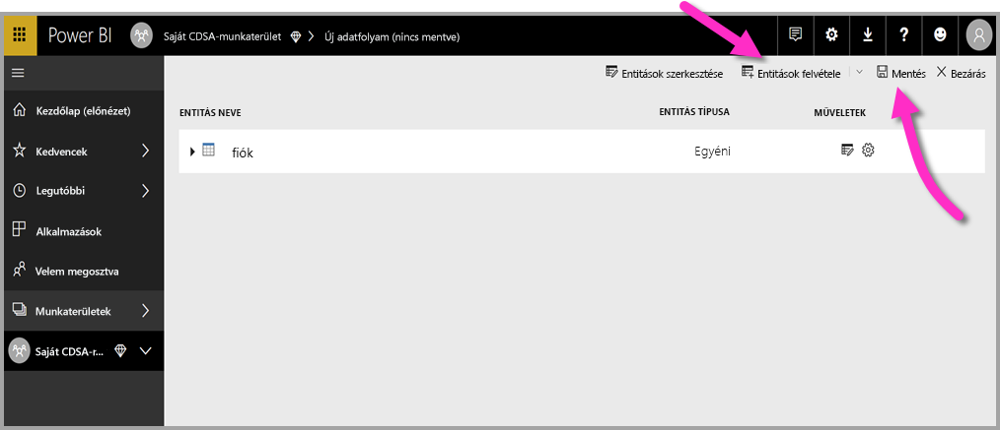

Amikor a **Mentés** lehetőséget választja, a rendszer megkéri, hogy adja meg az adatfolyam nevét és leírását.

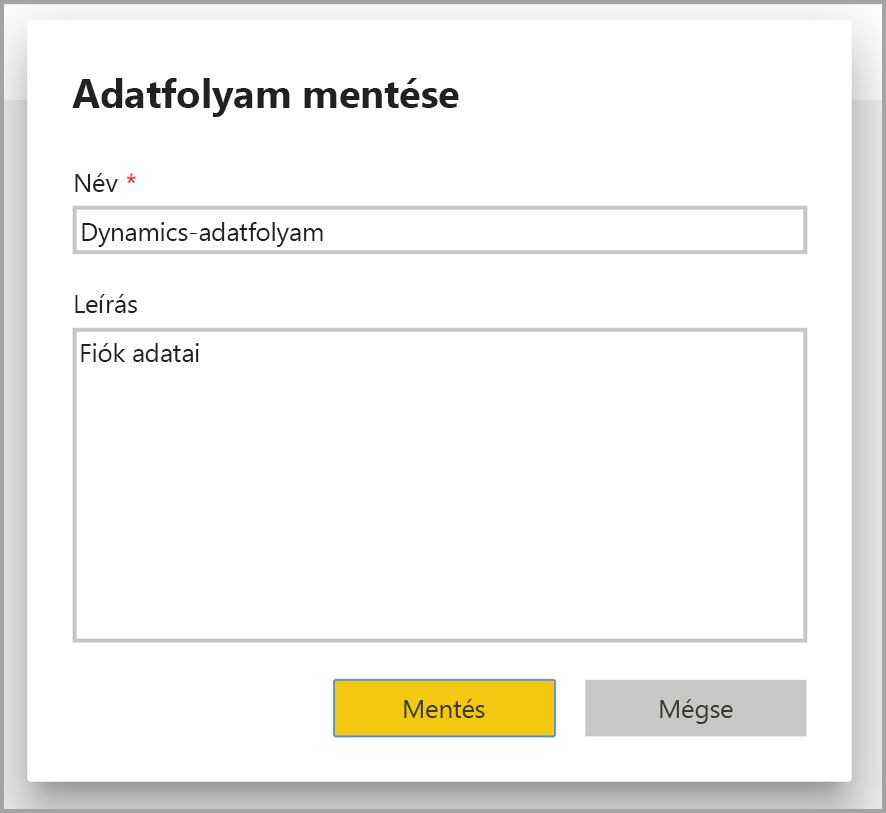

Miután végzett, és a **Mentés** gombot választja, megjelenik egy ablak, amely az **adatfolyam** létrejöttéről tájékoztatja. 

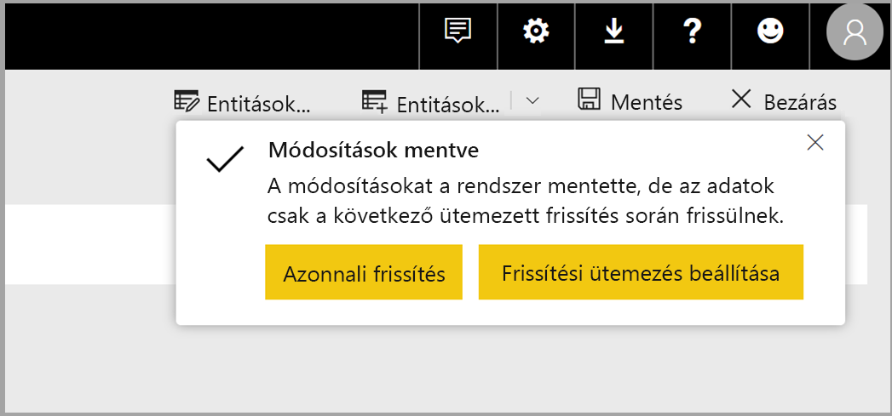

Nagyszerű! Jöhet a következő lépés, az adatforrások frissítési gyakoriságának ütemezése.

## A frissítés gyakoriságának ütemezése

Miután az adatfolyam mentve lett, érdemes ütemezni az összes csatlakoztatott adatforrás frissítési gyakoriságát.

A Power BI-adatfolyamok a Power BI adatfrissítési folyamatával tartják naprakészen az adatokat. A **Power BI szolgáltatásban**, az **alkalmazás-munkaterület** szakasz több részből áll, ahol többféle, például adatfolyamokkal kapcsolatos információ listázható az alábbi ábrán látható módon.

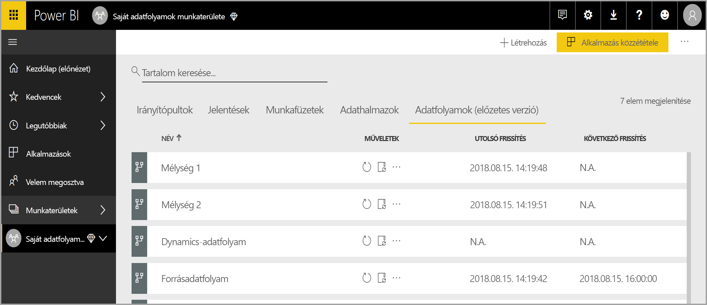

A fenti ábrán látható *Dynamics-adatfolyam* bejegyzés az előző szakaszban létrehozott adatfolyamra vonatkozik. A frissítés ütemezéséhez válassza a **Frissítés ütemezése** ikont a **Műveletek** oszlopban, ahogyan az alábbi ábrán látható. 

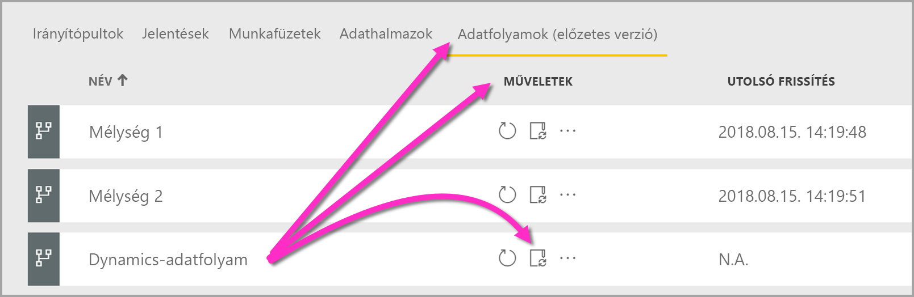

A **Frissítés ütemezése** ikont választva megnyitja a **Frissítés ütemezése** panelt, amelyen beállíthatja az adatfolyam frissítésének gyakoriságát és időpontját.

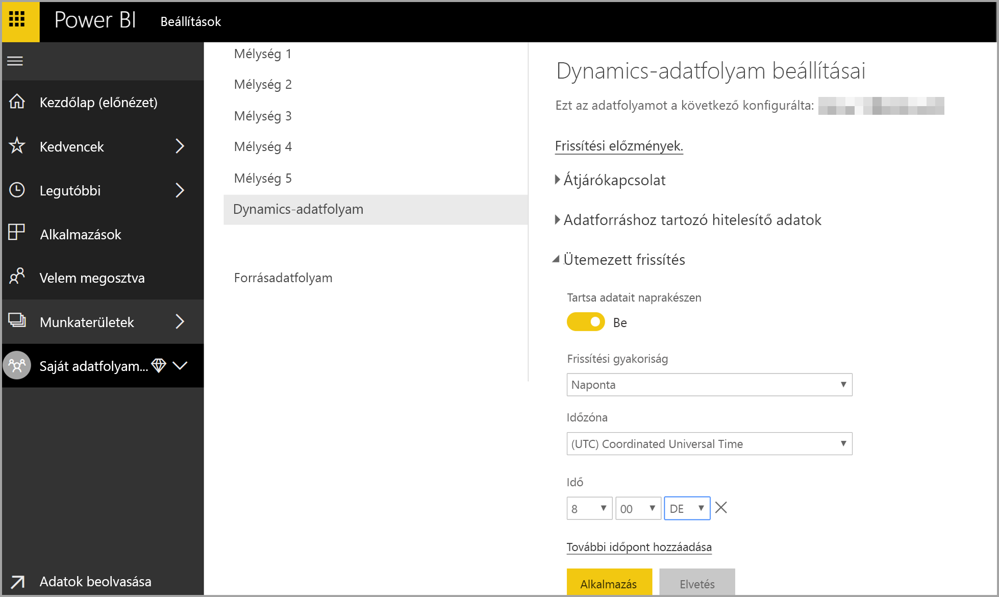

A frissítések ütemezéséről az [ütemezett frissítések konfigurálásáról](refresh-scheduled-refresh.md) szóló cikkből tájékozódhat, amely a Power BI-adathalmazok frissítési viselkedését ismerteti. Az adatfolyamok frissítési beállításokkal kapcsolatos viselkedése megegyezik a Power BI-adathalmazokéval. 

## Csatlakozás az adatfolyamhoz a Power BI Desktopban

Miután létrehozta adatfolyamát, és megadta a modellben szereplő összes adatforrás frissítési gyakoriságát, készen áll a harmadik, utolsó lépésre, az adatfolyamhoz való csatlakozásra a **Power BI Desktopban**. 

Az adatfolyamhoz a Power BI Desktopban az **Adatok betöltése > Power BI > Power BI-adatfolyamok (bétaverzió)** lehetőséggel kapcsolódhat, az ábrán látható módon.

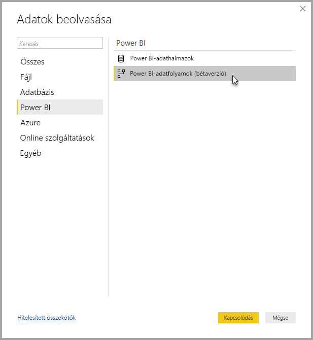

Innen navigáljon arra az **alkalmazás-munkaterületre**, ahol adatfolyamát mentette, jelölje ki az adatfolyamot, majd válassza ki a létrehozott entitásokat a listából.

Az ablak tetején található **keresősáv** használatával is gyorsan megtalálhatja adatfolyama vagy az entitások nevét a számos adatfolyam-entitás között.

Ha a kijelölte az entitást, és a **Betöltés** gombra kattintott, az entitások a **Mezők** panelen tekinthetők meg a **Power BI Desktopban**. Megjelenésük és viselkedésük is megegyezik a más adathalmazokból származó **táblákéval**.

## Azure Data Lake Storage Gen2-ben tárolt adatfolyamok használata

Néhány vállalat szívesebben használ saját tárolót adatfolyamok létrehozására és kezelésére. Az adatfolyamok a követelmények betartása és a jogosultságok megfelelő kezelése mellett integrálhatók az Azure Data Lake Storage Gen2-vel. Rendelkezésre áll az ennek minden követelményét felölelő dokumentáció, kezdve az áttekintést nyújtó [Adatfolyamok és az Azure Data Lake integrációja (előzetes verzió)](service-dataflows-azure-data-lake-integration.md) című dokumentummal.

## Adatkapcsolat-hibák elhárítása

Előfordulhat, hogy az adatfolyamok adatforrásaihoz való kapcsolódás problémába ütközik. Ez a szakasz az ilyen problémák elhárításához kínál ötleteket. 

* **Salesforce-összekötő** – Salesforce-próbafiók adatfolyamokkal való használata csatlakozási hibát eredményez, amely nem ad meg további információt. A probléma elkerülhető, ha éles vagy fejlesztői Salesforce-fiókot használ a teszteléshez.

* **SharePoint-összekötő** – A SharePoint-webhely legfelső szintű címét kell megadnia, almappák és dokumentumok nélkül. Használhat például a következőhöz hasonló hivatkozást: https://microsoft.sharepoint.com/teams/ObjectModel/ 

## Következő lépések

Ez a cikk arról szólt, hogyan hozhat létre saját **adatfolyamot**, illetve egy rá épülő adathalmazt és jelentést a **Power BI Desktopban**. Az alábbi cikkek további információkkal és példákkal segítik Önt az adatfolyamok használatában:

* [Önkiszolgáló adatelőkészítés adatfolyamokkal](service-dataflows-overview.md)
* [Számított entitások használata a Power BI Premiumban (előzetes verzió)](service-dataflows-computed-entities-premium.md)
* [Adatfolyamok használata helyszíni adatforrásokkal (előzetes verzió)](service-dataflows-on-premises-gateways.md)
* [Fejlesztői erőforrások a Power BI-adatfolyamokhoz (előzetes verzió)](service-dataflows-developer-resources.md)
* [Adatfolyamok és az Azure Data Lake integrációja (előzetes verzió)](service-dataflows-azure-data-lake-integration.md)

A Common Data Modellel kapcsolatos további információt a témát áttekintő cikkben talál:
* [Common Data Model – áttekintés](https://docs.microsoft.com/powerapps/common-data-model/overview)
* [További információ a Common Data Model-sémáról és -entitásokról a Githubon](https://github.com/Microsoft/CDM)

A témához kapcsolódó Power BI Desktop-cikkek:

* [Kapcsolódás a Power BI szolgáltatásban lévő adathalmazokhoz a Power BI Desktopból](desktop-report-lifecycle-datasets.md)
* [Lekérdezések áttekintése a Power BI Desktopban](desktop-query-overview.md)

Kapcsolódó, Power BI-témájú cikkek:
* [Ütemezett frissítés beállítása](refresh-scheduled-refresh.md)
