# Adatforrásokhoz való csatlakozás Power BI-adatfolyamokkal

Power BI-adatfolyamokkal sokféle adatforráshoz csatlakozhat, hogy új adatforrásokat hozzon létre, vagy új entitásokat adjon egy meglévő adatfolyamhoz.

Ez a cikk felsorolja az adatfolyamok létrehozásához vagy a hozzáadáshoz elérhető számos adatforrást, és leírja, hogyan hozhatók létre ezek az adatfolyamok a használatukkal.

Adatfolyamok létrehozásáról és használatáról a [Adatfolyamok létrehozása és használata a Power BI-ban](service-dataflows-create-use.md) című cikk nyújt áttekintést.

## Adatfolyam létrehozása adatforrásból

Az adatokhoz való csatlakozáshoz a **Power BI szolgáltatásból** válassza a **+ Létrehozás** menüelemet, majd a megjelenő menü **adatfolyam** elemét. Ennek kiválasztásakor az alábbi kép jelenik meg a vásznon a Power BI szolgáltatásban. 

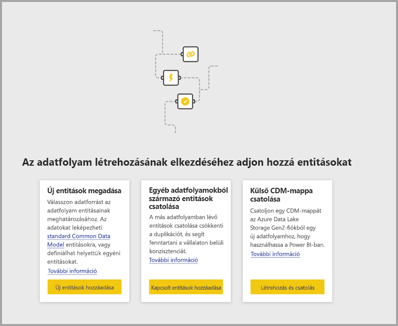

Ha adatfolyama már létezik, új entitásokat adhat hozzá az alábbi ábrán látható módon, az **Entitások hozzáadása** lehetőséggel, vagy az **Adatok beolvasása** lehetőséget választva az adatfolyam szerkesztőeszközében.

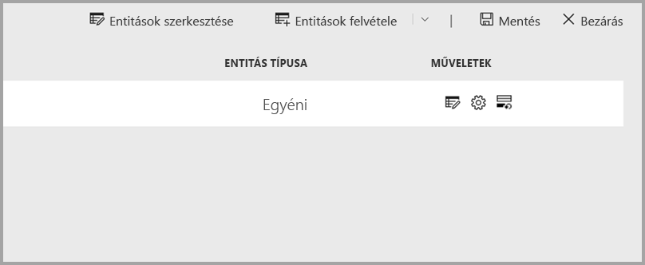

Az alábbi ábrán az **Adatok beolvasása** gomb látható az adatfolyam szerkesztőeszközében. 

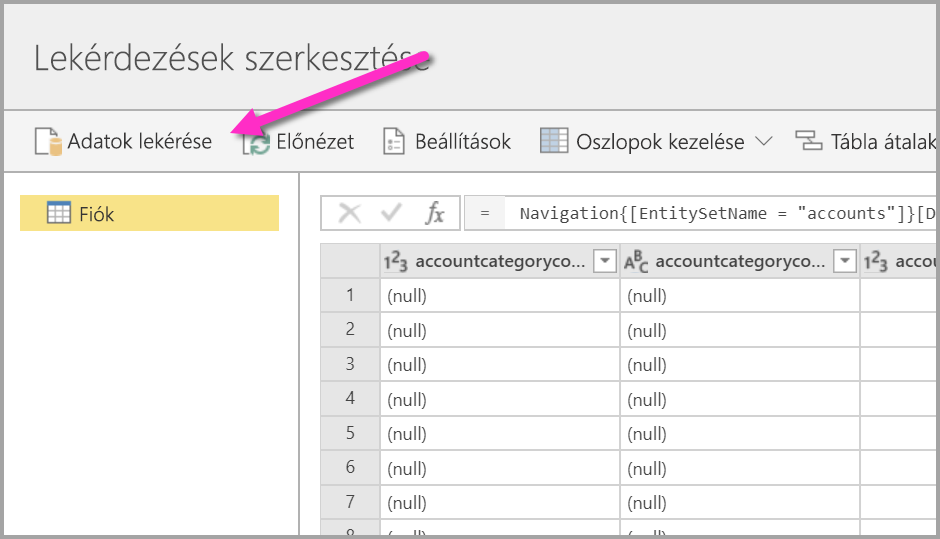

## Adatfolyamok adatforrásai

Az elérhető adatforrásokat az adatfolyam szerkesztőeszközének **Adatok beolvasása** lehetőségével tekintheti meg, amely az alábbi ábrán látható párbeszédpanelt jeleníti meg a kategóriák és az egyes adatforrások kijelöléséhez.

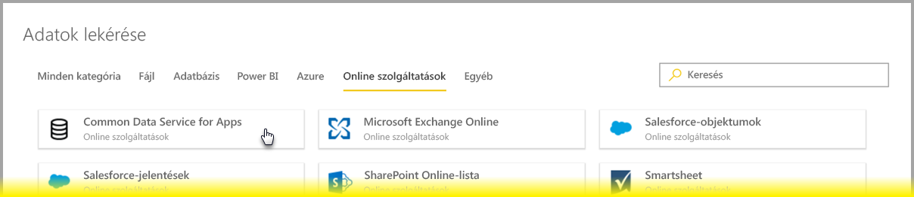

Az adatfolyamok adatforrásai az alábbi kategóriákba vannak sorolva. Ezek az **Adatok beolvasása** párbeszédpanel tetején jelennek meg:

* Minden kategória
* Fájl
* Adatbázis
* Power BI
* Azure
* Online szolgáltatások
* Egyéb

Az **Összes kategória** kategória az összes adatforrást tartalmazza, minden kategóriából. 

A **Fájl** kategória az alábbi, adatfolyamokhoz elérhető adatkapcsolatokat tartalmazza:

* Hozzáférés
* Excel
* JSON
* Szöveg/CSV
* XML

Az **Adatbázis** kategória az alábbi, adatfolyamokhoz elérhető adatkapcsolatokat tartalmazza:

* IBM DB2-adatbázis
* MySQL-adatbázis
* Oracle Database
* PostgreSQL-adatbázis
* SQL Server-adatbázis
* Sybase-adatbázis
* Teradata
* Vertica

A **Power BI** kategória az alábbi, adatfolyamokhoz elérhető adatkapcsolatokat tartalmazza:

* Power BI-adatfolyamok

Az **Azure** kategória az alábbi, adatfolyamokhoz elérhető adatkapcsolatokat tartalmazza:

* Azure-blobok
* Azure Data Explorer
* Azure SQL Data Warehouse
* Azure SQL Database
* Azure-táblák

Az **online szolgáltatások** közé az alábbi, adatfolyamokhoz elérhető adatkapcsolatok tartoznak:

* Amazon Redshift
* Common Data Service for Apps
* Microsoft Exchange Online
* Salesforce-objektumok
* Salesforce-jelentések
* SharePoint Online-lista
* Smartsheet

Az **Egyéb** kategória az alábbi, adatfolyamokhoz elérhető adatkapcsolatokat tartalmazza:

* Active Directory
* OData
* SharePoint-lista
* Web API
* Weblap
* Üres tábla
* Üres lekérdezés

## Csatlakozás adatforráshoz

Az adatforráshoz való csatlakozáshoz válassza ki az adatforrást. A folyamat működését egy példán mutatjuk meg, de az adatfolyamok összes adatkapcsolata hasonló eljárást kíván. Különböző összekötők adott hitelesítő adatokat vagy más információkat igényelhetnek, de a folyamat hasonló. Példánkban, amint az alábbi ábrán látható, a **Common Data Service for Apps** van kiválasztva az **online szolgáltatások** adatkapcsolat-kategóriából.

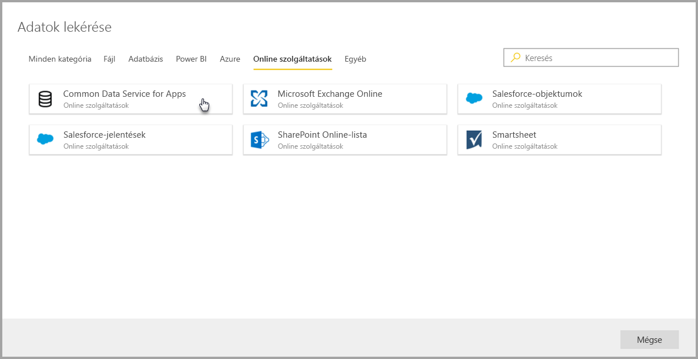

Megjelenik a kiválasztott adatkapcsolat csatlakozási ablaka. Ha hitelesítő adatok szükségesek, a rendszer ezek megadására kéri. A következő ábra egy kiszolgálói URL-cím bevitelét mutatja be egy Common Data Service for Apps-kiszolgálóhoz való csatlakozáshoz.

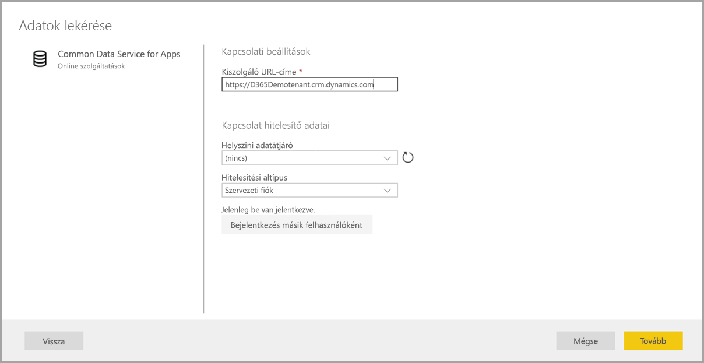

A kiszolgálói URL-cím vagy az erőforrás kapcsolati adatai megadása után válassza a **Bejelentkezés** lehetőséget az adatok eléréséhez használandó hitelesítő adatok megadásához, majd válassza a **Tovább** lehetőséget.

A **Power Query Online** kezdeményezi és létrehozza a kapcsolatot az adatforrással, majd az ebből az adatforrásból elérhető táblákat a **Kezelő** ablakban mutatja meg, az alábbi képen látható módon.

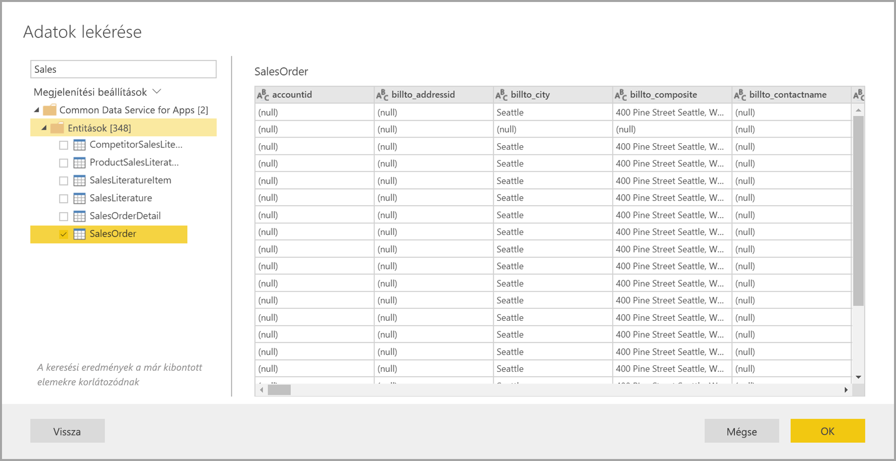

A betöltendő táblákat és adatokat a hozzájuk tartozó jelölőnégyzetekkel választhatja ki a bal oldali panelen. Az adatok betöltéséhez válassza a **Kezelő** panel alján lévő **OK** gombot. Megjelenik egy Power Query Online párbeszédpanel, amelyen lekérdezéseket szerkeszthet, és a kiválasztott adatokon végrehajtani kívánt más átalakításokat végezhet el.

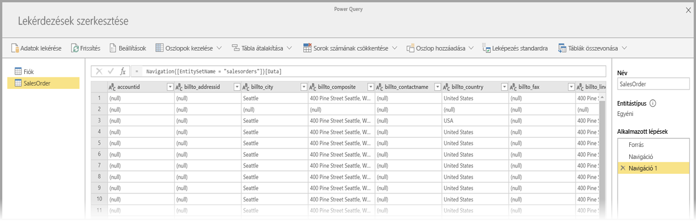

Ennyi az egész. A folyamat, és a Power Query Online használata az adatfolyamba beolvasott adatok szerkesztésére és átalakítására más adatforrások esetén is ehhez hasonló.

## Csatlakozás további adatforrásokhoz

Léteznek más adatösszekötők, amelyek nem jelennek meg a Power BI-adatfolyamok felhasználói felületén, de néhány további lépéssel már támogatottak. 

A felhasználói felületen nem megjelenő összekötővel az alábbi lépésekben tudja létrehozni a kapcsolatot:

1. Indítsa el a **Power BI Desktopot**, majd válassza az **Adatok beolvasása** lehetőséget.
2. A Power BI Desktopban nyissa meg a **Power Query-szerkesztőt**, majd kattintson a jobb gombbal a megfelelő lekérdezésre, és az alábbi ábrán látható módon nyissa meg **Speciális szerkesztőt**. Innen másolhatja ki a Speciális szerkesztőben megjelenő M-szkriptet.

    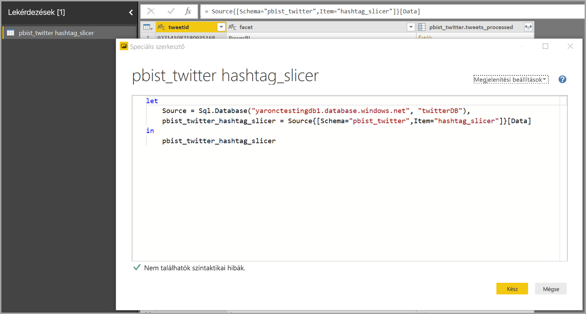 

3. Nyissa meg a Power BI-adatfolyamot, majd válassza az **Adatok beolvasása** lehetőséget egy üres lekérdezéshez, ahogyan a következő képen látható.

    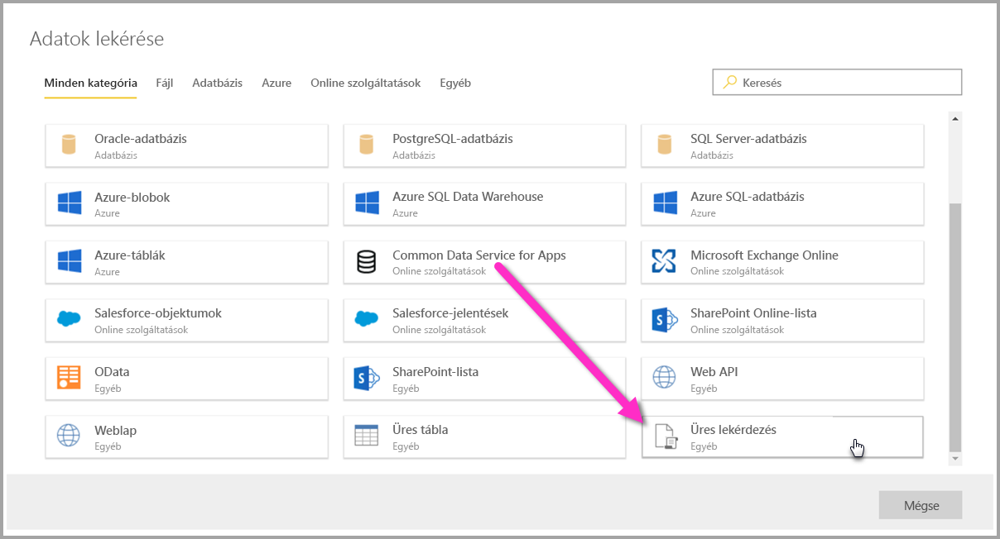 

4. Illessze be a kimásolt lekérdezést az adatfolyamhoz tartozó üres lekérdezésbe.

    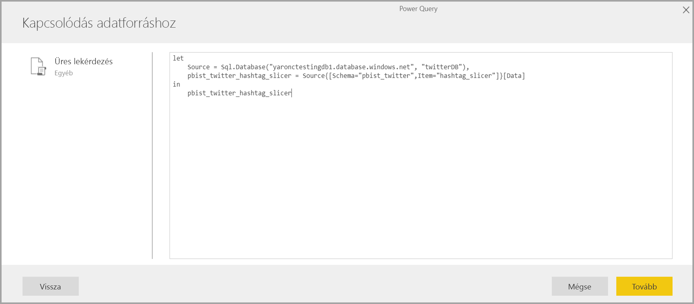 

Ez után a szkript csatlakozik a megadott adatforráshoz. 

Az alábbi lista azokat az összekötőket sorolja fel, amelyek jelenleg használhatók az M-szkript üres lekérdezésbe másolásával:

* Azure Analysis Services
* Adobe Analytics
* ODBC
* OLE DB
* Mappa
* SharePoint Online-mappa
* SharePoint-mappa
* Hadoop HDFS
* Azure HDInsight (HDFS)
* Hadoop-fájl HDFS
* Informix (bétaverzió)

Ilyen egyszerűen csatlakozhat adatforrásokhoz Power BI-adatfolyamokkal.

## Következő lépések

Ez a cikk azokat az adatforrásokat ismertette, amelyekhez adatfolyamokkal csatlakozhat. A következő cikkekben részletes információkat találhat az adatfolyamok gyakori használati forgatókönyveiről. 

* [Önkiszolgáló adat-előkészítés a Power BI-ban](service-dataflows-overview.md)
* [Adatfolyamok létrehozása és használata a Power BI-ban](service-dataflows-create-use.md)
* [Számított entitások használata a Power BI Premiumban](service-dataflows-computed-entities-premium.md)
* [Adatfolyamok használata helyszíni adatforrásokkal](service-dataflows-on-premises-gateways.md)
* [Fejlesztői erőforrások Power BI-adatfolyamokhoz](service-dataflows-developer-resources.md)
* [Adatfolyamok és az Azure Data Lake integrációja (előzetes verzió)](service-dataflows-azure-data-lake-integration.md)

A Power Queryvel és az ütemezett frissítésekkel kapcsolatos további információt a következő cikkekben talál:
* [Lekérdezések áttekintése a Power BI Desktopban](desktop-query-overview.md)
* [Ütemezett frissítés beállítása](refresh-scheduled-refresh.md)

A Common Data Modellel kapcsolatos további információt a témát áttekintő cikkben talál:
* [Common Data Model – áttekintés](https://docs.microsoft.com/powerapps/common-data-model/overview)

