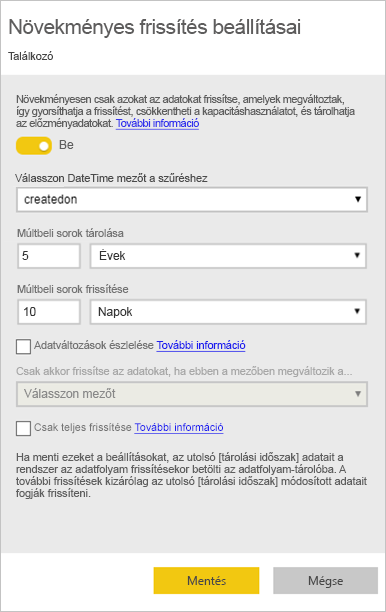
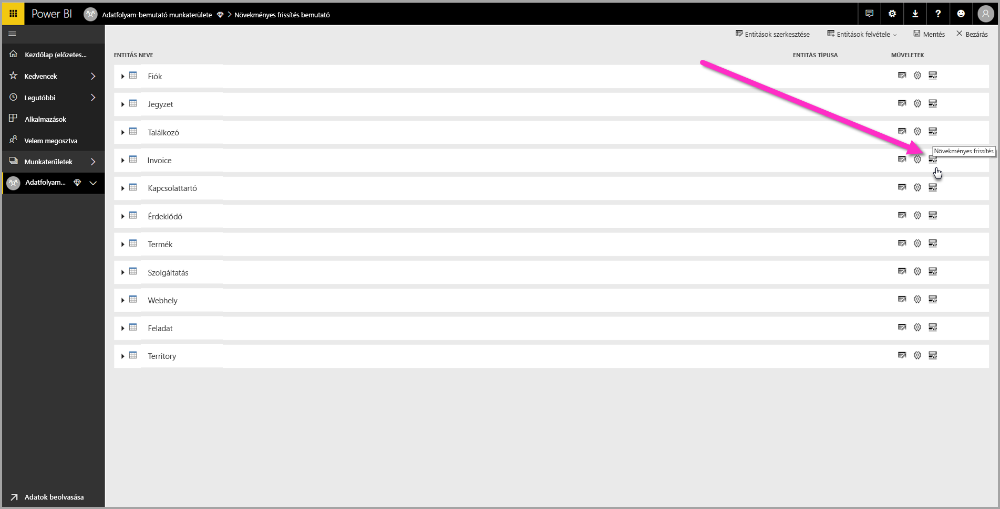
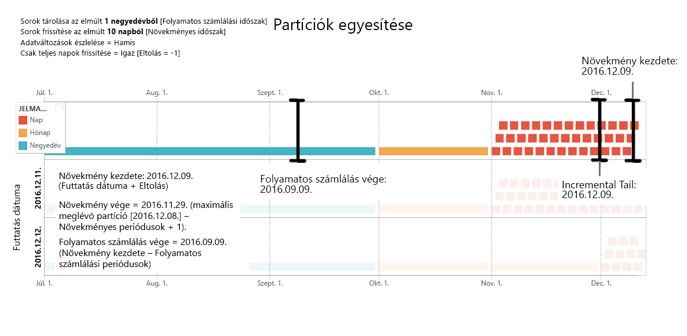
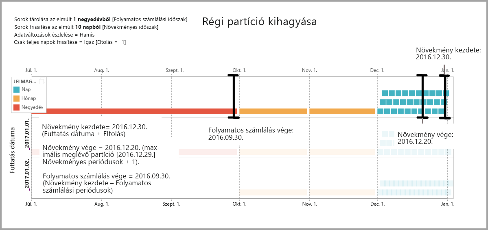
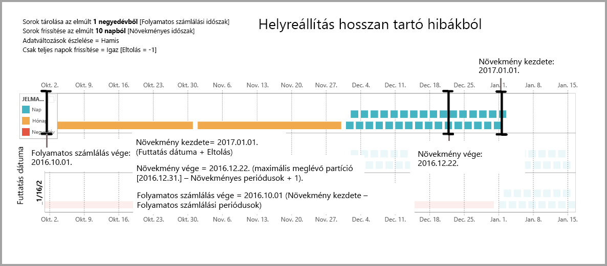

# Növekményes frissítések használata Power BI-adatfolyamokkal

Az adatfolyamokkal nagy mennyiségű adatot tölthet be a Power BI-ba, így meggyőző jelentéseket és elemzéseket készíthet. Bizonyos esetekben azonban nem érdemes az összes forrásadatot frissíteni minden frissítés alkalmával. Ennek jó alternatívája a **növekményes frissítés**, amely az alábbi előnyöket nyújtja az adatfolyamokhoz:

* **Gyorsabb frissítés** – Csak a módosult adatokat szükséges frissíteni. Frissítheti például egy 10 éves adatfolyamnak csak az utolsó öt napját.
* **Megbízhatóbb frissítés** – Nem szükséges például hosszú futású kapcsolatokat fenntartani alacsony megbízhatóságú forrásrendszerekkel.
* **Csökkentett erőforrás-felhasználás** – A kevesebb frissítendő adat csökkenti a frissítési művelet által igényelt memóriamennyiséget és más erőforrásokat.

A növekményes frissítés Power BI-adatfolyamokkal történő használatához az adatfolyamot tartalmazó munkaterületnek egy [Prémium szintű kapacitásban](service-premium-what-is.md) kell lennie, az adatfolyamba betöltött adatforrásnak pedig egy *datetime* mezővel kell rendelkeznie, amelyet szűrhet a növekményes frissítés. 

## Növekményes frissítés konfigurálása adatfolyamokhoz

Egy adatfolyam számos entitást tartalmazhat. A növekményes frissítés az entitások szintjén működik, egy adatfolyam így teljes mértékben frissített s növekményesen frissített entitásokat is tartalmazhat.

Növekményesen frissített entitás beállításához először konfigurálnia kell az entitást, ahogyan azt egyébként is tenné. További információ az adatfolyamok beállításáról: [Önkiszolgáló adat-előkészítés a Power BI-ban](service-dataflows-overview.md).

Az adatfolyam létrehozása és mentése után válassza a **növekményes frissítés** ikont az entitásnézetben, ahogyan azt a következő képen is láthatja:

Az ikonra kattintva megjelenik a **Növekményes frissítés beállításai** ablak. A növekményes frissítés **bekapcsolásával** konfigurálhatja azt.

A következő lista ismerteti a **Növekményes frissítés beállításai** ablak beállításait. 

1. **A növekményes frissítést be- vagy kikapcsoló váltógomb** – Ez a csúszka be- vagy kikapcsolja a növekményes frissítést az entitás számára
2. **Mező szűrése legördülő lista** – Kiválasztja a lekérdezésmezőt, amely alapján növekményekre szűri az entitást. Ez a mező csak *datetime* mezőket tartalmaz. Nem alkalmazhat növekményes frissítést, ha az entitás nem tartalmaz *datetime* mezőt.
3. **Múltbeli sorok tárolása** – Az alábbi példa segít elmagyarázni a következő néhány beállítást.

    Ez példa definiál egy frissítési szabályzatot 10 évnyi adat tárolásához, illetve 10 napnyi adat növekményes frissítéséhez. Az entitás napi frissítése esetén az alábbi műveletek zajlanak le minden egyes frissítési művelet során:

    * Új napnyi adatok hozzáadása.
    * Az adatok frissítése az aktuális dátumtól számított 10 napra visszamenőleg.
    * Az aktuális dátumtól számított öt évnél régebbi naptári évek eltávolítása. Ha például az aktuális dátum 2019. január 1., a 2013-as évet eltávolítja a rendszer.

    Az első adatfolyam-frissítés során mind az öt év importálása eltarthat egy ideig, az ezt követő frissítések azonban már ennek töredéke alatt elkészülnek.

4. **Adatváltozások észlelése** – 10 napnyi adat növekményes frissítése sokkal hatékonyabb, mint 5 évnyi adat teljes frissítése, de még akár ennél is többre képesek lehetünk. Az **Adatváltozások észlelése** jelölőnégyzet bejelölésével megadhat egy dátum/idő oszlopot, amely alapján a rendszer azonosítani tudja, hogy mely napokon történt adatváltozás, és csak ezeket a napokat frissíti. Ez azt feltételezi, hogy található ilyen oszlop a forrásrendszerben (mely jellemzően megtalálható, naplózási célokból). Ennek az oszlopnak a maximális értékét a rendszer kiértékeli a növekményes tartományban lévő minden egyes időszak esetében. Ha az adatok nem változtak az utolsó frissítés óta, akkor nem szükséges frissíteni az időszakot. A jelen példában ez tovább csökkentheti a növekményesen frissített napok számát 10-ről akár 2-re.

> [!TIP]
> A jelenlegi architektúra megköveteli az adatváltozás-észlelési oszlop megőrzését és memóriában való gyorsítótárazását. A számosság és a memóriahasználat csökkentéséhez tanácsos lehet megfontolnia az alábbi technikák egyikének használatát:
>
>    * Csak az oszlop maximális értékét őrizze meg frissítéskor, például egy Power Query-függvénnyel.
>    * Csökkentse a pontosságot egy olyan szintre, amely a frissítési gyakorisággal kapcsolatos követelmények vonatkozásában még elfogadható.

5. **Csak teljes időszakok frissítése** – Tegyük fel, hogy a frissítés mindennap hajnali 4 órára van ütemezve. Ha a forrásrendszerbe a nap első 4 órája során adat kerül be, akkor elképzelhető, hogy azt nem szeretné figyelembe venni. Egyes üzleti mérőszámok – például a hordók száma naponta az olaj- és gáziparban – nem praktikusak vagy értelmezhetők részleges naponként.

    Egy másik jó példa a teljes időszakok frissítésére egy pénzügyi rendszer adatainak frissítése. Tegyük fel, hogy az adatokat egy pénzügyi rendszerből frissítjük, ahol az elmúlt hónapra vonatkozó adatok a hónap 12. napján vannak jóváhagyva. Ilyen esetben beállíthatja a növekményes tartományt 1 hónapra, és a frissítést ütemezheti úgy, hogy a hónap 12. napján fusson le. Ennek a jelölőnégyzetnek a bejelölése esetén a januári adatokat (a legfrissebb lezárult havi időszakot) a rendszer csak február 12-én frissíti.

> [!NOTE]
> Az adatfolyam növekményes frissítése a következő logikát használja a dátumok meghatározásához: ha frissítés van ütemezve, az adatfolyamok növekményes frissítése a frissítési szabályzatban meghatározott időzónát használja. Ha nincs megadva frissítési ütemezés, a növekményes frissítés a frissítést futtató gép időbeállítását használja.

## Növekményes frissítési lekérdezés

A növekményes frissítés konfigurálása után az adatfolyam automatikusan módosítja a lekérdezést, hogy az magában foglalja a dátumszűrőt. Az automatikusan létrehozott lekérdezést a **speciális Power Query-szerkesztővel** szerkesztheti a frissítés finomhangoláshoz vagy testreszabásához. A növekményes frissítésről és annak működéséről többet megtudhat a következő szakaszban.

## Növekményes frissítés és számított entitások

A *csatolt* entitások esetében a növekményes frissítés a forrásentitást frissíti. Mivel a csatolt entitások csak az eredeti entitások mutatói, a növekményes frissítés ezekre nincs hatással. A forrásentitás a definiált frissítési szabályzat szerinti frissítésekor annak csatolt entitásai feltételezik, hogy a forrás adatai frissültek.

A *számított* entitások adattáron futó lekérdezéseken alapulnak, amely adattárak önmagukban lehetnek adatfolyamok is. A számított entitások így a csatolt entitásokkal megegyező módon viselkednek.

Mivel a számított és a csatolt entitások hasonlóan viselkednek, azok követelményei és konfigurációs lépései is megegyeznek. Az egyetlen különbség, hogy a számított entitások esetén egyes konfigurációkban nem futtatható növekményes frissítés optimalizált módon a partíciók kialakítása miatt. 

## Váltás növekményes és teljes frissítés között

Az adatfolyamok támogatják a növekményes és a teljes frissítési szabályzat közötti váltást. Ha bármelyik irányba módosul a szabályzat (teljesről növekményesre vagy fordítva), a módosítás a következő frissítés után az adatfolyamra is érvényes lesz.

Adatfolyam teljesről növekményes frissítésre váltásakor az új frissítési logika a frissítési ablak és a növekményes frissítési beállítások szerint frissíti az adatfolyamot.

Adatfolyam növekményesről teljes frissítésre váltásakor a növekményes frissítésben összegyűlt adatokat felülírja a teljes frissítés szabályzata. Ezt a műveletet jóvá kell hagynia.

## Adatfolyamok növekményes frissítése és adatkészletek

Az adatfolyamok és az adatkészletek növekményes frissítése közös működéshez lett kialakítva. Igény szerint növekményesen frissítheti egy adatfolyam entitását, amelyet teljes mértékben egy adathalmazba tölt be, vagy egy adatfolyam teljes mértékben beöltött entitását, amelyet növekményesen tölt be egy adathalmazba. 

Mindkét módszernél a saját frissítési beállításdefinícióit használhatja.
További információ a növekményes frissítésről: [Növekményes frissítés a Power BI Premium szolgáltatásban](service-premium-incremental-refresh.md).

## Időzóna-támogatás a növekményes frissítésben

Az adatfolyamok növekményes frissítése a futtatás idejétől függ. A lekérdezés szűrése pedig a futás napjától.

Az ezen függőségeknek való megfelelés és az adatkonzisztencia megőrzése érdekében az adatfolyamok növekményes frissítése a következő heurisztikát alkalmazzák az *azonnali frissítési* forgatókönyvekhez:

* Ha ütemezett frissítés van meghatározva a rendszerben – A növekményes frissítés az ütemezett frissítés időzóna-beállításait használja. Ez biztosítja, hogy az adatfolyamot frissítő személy időzónája mindig konzisztens lesz a rendszer definíciójával.

* Ha nincs meghatározott frissítésütemezés, az adatfolyamok a frissítő felhasználó számítógépének időzónáját használják.

A növekményes frissítés API-k használatával is meghívható. Ebben az esetben az API-hívás a frissítés időzóna-beállítását használhatja. API-kat teszteléshez és ellenőrzéshez használhat.

## A növekményes frissítés megvalósítási részletei

Az adatfolyamok particionálást használnak a növekményes frissítéshez. Ha az XMLA-végpontok elérhetők a Power BI Premiumban, a partíciók láthatóvá válnak. Az adatfolyamok növekményes frissítése a frissítési szabályzat minimális követelményeinek megfelelő partíciómennyiséget tart meg. A tartományon kívül eső, régi partíciókat nem tartja meg, így biztosítva a folyamatos számlálást. A partíciók esetenként összevonhatók, ami csökkenti a szükséges partíciók összegét. Ez javítja a tömörítést, és egyes esetekben a lekérdezés teljesítményét is növelheti.

A szakasz példái a következő frissítési szabályzatot alkalmazzák:

* Sorok tárolása az elmúlt 1 negyedévből
* Sorok frissítése az elmúlt 10 napból
* Adatváltozások észlelése = Hamis
* Csak teljes napok frissítése = Igaz

### Partíciók egyesítése

Ebben a példában a napok partíciói automatikusan egyesülnek havi szinten, amint kikerülnek a növekményes tartományból. A növekményes tartományon belüli partíciókat napi részletességi szinten kell tartani, így csak ezek a napok frissülnek majd.
A *12/11/2016 futtatási dátumú* frissítési műveletet egyesíti a novemberi napokat, mivel azok a növekményes tartományon kívülre esnek.

### Régi partíciók kihagyása

A teljes tartományon kívül eső régi partíciókat a rendszer eltávolítja. A *1/2/2017 futtatási dátumú* frissítési művelet kihagyja 2016. 3. negyedévének partícióját, mivel az a teljes tartományon kívülre esik.

### Helyreállítás hosszan tartó hibákból

Ez a példa azt szimulálja, hogy a rendszer hogyan áll helyre egy hosszan tartó hibából. Tegyük fel, hogy a frissítés sikertelen, mivel az adatforrás hitelesítő adatai lejártak, a probléma megoldása pedig 13 napot vesz igénybe. A növekményes tartomány csak 10 nap.

A következő sikeres frissítés műveletnek (*futtatás dátuma: 1/15/2017*) fel kell töltenie a hiányzó 13 napot, majd frissítenie őket. Emellett az előz 9 napot is frissítenie kell, mivel azok nem frissültek a normál ütemezés szerint. A növekményes tartomány tehát 10-ről 22 napra emelkedett.

A következő frissítési művelet *futtatás dátuma: 1/16/2017* egyesíti a decemberi napokat és 2016. 4. negyedévét.

## Következő lépések

Ez a cikk az adatfolyamok növekményes frissítését ismertette. Az alábbi cikkek szintén hasznosak lehetnek.

* [Önkiszolgáló adatelőkészítés adatfolyamokkal](service-dataflows-overview.md)
* [Adatfolyamok létrehozása és használata a Power BI-ban](service-dataflows-create-use.md)
* [Adatfolyamok használata helyszíni adatforrásokkal](service-dataflows-on-premises-gateways.md)
* [Fejlesztői erőforrások Power BI-adatfolyamokhoz](service-dataflows-developer-resources.md)

A Power Queryvel és az ütemezett frissítésekkel kapcsolatos további információt a következő cikkekben talál:
* [Lekérdezések áttekintése a Power BI Desktopban](desktop-query-overview.md)
* [Ütemezett frissítés beállítása](refresh-scheduled-refresh.md)

A Common Data Modellel kapcsolatos további információt a témát áttekintő cikkben talál:
* [Common Data Model – áttekintés](https://docs.microsoft.com/powerapps/common-data-model/overview)

