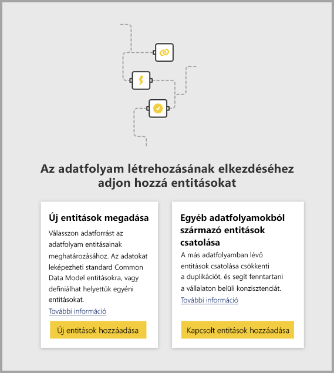
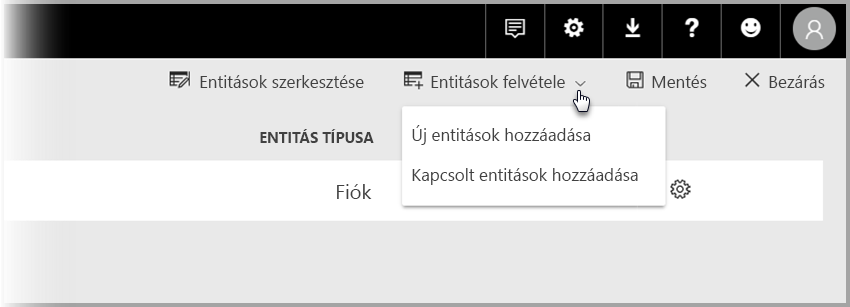

# Entitások csatolása adatfolyamok között a Power BI-ban (előzetes verzió)

A Power BI-beli adatfolyamok használata esetén elég egyetlen vállalati forrásadattárral rendelkeznie, ahol az üzleti elemzők egyszer készítik elő és kezelik az adatokat, amelyeket aztán a vállalaton belüli különböző elemzőalkalmazások többször is felhasználhatnak. 

Amikor adatfolyamok között csatol entitásokat, akkor többször, adatkarbantartás nélkül használhat fel olyan entitásokat, amelyeket mások tulajdonában lévő más adatfolyamok már betöltöttek, megtisztítottak és átalakítottak. A csatolt entitások egyszerűen más adatfolyamokban lévő entitásokra mutatnak úgy, hogy az adatokat *nem* másolják le vagy duplikálják.

A csatolt entitások **csak olvashatók**. Ha átalakításokat akar létrehozni egy csatolt entitáshoz, akkor a csatolt entitásra hivatkozó új, számított entitást kell létrehoznia.

## Csatolt entitás elérhetősége

A csatolt entitások frissítéséhez [Power BI Premium](service-premium.md) előfizetés szükséges. Csatolt entitások a Power BI Premium-kapacitásokban üzemeltetett munkaterületek bármely adatfolyamában elérhetők. A forrásadatfolyamra nem vonatkoznak korlátozások.

A csatolt entitások csak új Power BI-munkaterületeken működnek megfelelően. Az [új Power BI-munkaterületekről](service-create-the-new-workspaces.md) további információ is rendelkezésére áll. A megfelelő működéshez minden csatolt adatfolyamnak új munkaterületen kell elhelyezkednie.

> [!NOTE]
> Az entitások meg vannak különböztetve az szerint, hogy standard, vagy számított entitások. A (többnyire egyszerűen entitásoknak nevezett) standard entitások egy külső adatforrást, például SQL-adatbázist kérdeznek le. A számított entitások prémium szintű kapacitást igényelnek a Power BI-ban, átalakításaikat pedig olyan adatokon futtatják, amelyek már a Power BI-tárolóban vannak. 
>
>Ekkor is hivatkozhat lekérdezésre, vagy kombinálhat több lekérdezést, ha adatfolyama nem prémium kapacitású munkaterületen van, de csak ha az átalakítások nem tárolón belüli átalakításként vannak definiálva. Az ilyen hivatkozásokat nevezzük standard entitásnak. Ehhez kapcsolja ki a hivatkozott lekérdezések **Betöltés engedélyezése** beállítását, hogy az adatok ne jelenjenek meg ténylegesen, és ne legyenek betöltve a tárolóba. Ettől kezdve hivatkozni tud a **Betöltés engedélyezése = hamis** lekérdezésekre, és csak azokra az eredményként előállt lekérdezésekre kell **Be** értékre állítania a **Betöltés engedélyezése** lehetőséget, amelyeket materializálni szeretne.

## Entitások csatolása adatfolyamok között

Entitások a Power BI-ban több módon is csatolhatók adatfolyamok között. Választhatja az adatfolyam-szerkesztőeszköz **Csatolt entitások hozzáadása** lehetőségét, ahogyan az alábbi ábrán látható. 

A **Csatolt entitások hozzáadása** lehetőség a Power BI szolgáltatásban, az **Entitások hozzáadása** menüelemből is kiválasztható.

Entitások csatolásához be kell jelentkeznie Power BI hitelesítő adataival.

Megnyílik egy **Kezelő** ablak, amelyben kijelölheti az összekapcsolni kívánt entitásokat. Itt azok az entitások jelennek meg, amelyekhez jogosultsággal rendelkezik Power BI-bérlője bármely munkaterületén. 

A csatolt entitások kijelölése után az entitások megjelennek a szerkesztőeszközben az adatfolyamhoz tartozó entitások listájában, a csatolt entitásokat jelölő különleges ikonnal.

A forrásadatfolyam a csatolt entitás adatfolyam-beállításainál is megtekinthető.

## A csatolt entitások frissítési logikája
A csatolt entitások alapértelmezett frissítési logikája eltérő lehet aszerint, hogy a forrásadatfolyam a céladatfolyammal azonos munkaterületen helyezkedik-e el. A következő szakaszok mindkét változat viselkedését ismertetik.

### Csatolások munkaterületek között

Külső munkaterületen lévő entitások csatolásának frissítése úgy működik, mint külső adatforrások esetén. Amikor az adatfolyam frissül, a forrásadatfolyamból veszi át az entitás legfrissebb adatait. A forrásadatfolyam frissítése nem érinti automatikusan a céladatfolyamban lévő adatokat.

### Csatolások egy munkaterületen belül

Amikor a forrásadatfolyam adatai frissülnek, az esemény automatikusan kiváltja a függő entitások frissítési folyamatát az adott munkaterületen belüli összes céladatfolyamban, az azok alapján számított entitásokra vonatkozóan is. A céladatfolyam összes további entitása az adatfolyamra vonatkozó ütemezés szerint lesz frissítve. A több forrástól függő entitások adatai mindig frissítve lesznek, ha forrásaik bármelyike sikeresen frissül.

Hasznos tudnivaló, hogy a teljes frissítési folyamat egyszerre lesz véglegesítve. Ennek következtében, ha a céladatfolyam frissítése sikertelen, akkor a forrásadatfolyam frissítése is sikertelen lesz.

## Engedélyek szerepe az adatfolyamokból származó jelentések megtekintésében

Adatfolyamokon alapuló adatokat is tartalmazó Power BI-jelentésekben a felhasználók csak akkor láthatják a csatolt entitásokat, ha hozzáféréssel rendelkeznek a forrásadatfolyamhoz.

## Korlátozások és szempontok

A csatolt entitásokkal végzett munka során tekintetbe kell venni néhány korlátozást:

* A hivatkozási hurkok száma legfeljebb öt lehet
* Csatolt entitások körkörös függősége nem megengedett
* Az adatfolyamnak [új Power BI-munkaterületen](service-create-the-new-workspaces.md) kell elhelyezkednie

## Következő lépések

Az alábbi cikkek hasznosak lehetnek adatfolyamok létrehozása, vagy a velük végzett munka során. 

* [Önkiszolgáló adat-előkészítés a Power BI-ban (előzetes verzió)](service-dataflows-overview.md)
* [Adatfolyamok létrehozása és használata a Power BI-ban](service-dataflows-create-use.md)
* [Számított entitások használata a Power BI Premiumban (előzetes verzió)](service-dataflows-computed-entities-premium.md)
* [Adatfolyamok használata helyszíni adatforrásokkal (előzetes verzió)](service-dataflows-on-premises-gateways.md)
* [Fejlesztői erőforrások a Power BI-adatfolyamokhoz (előzetes verzió)](service-dataflows-developer-resources.md)

A Power Queryvel és az ütemezett frissítésekkel kapcsolatos további információt a következő cikkekben talál:
* [Lekérdezések áttekintése a Power BI Desktopban](desktop-query-overview.md)
* [Ütemezett frissítés beállítása](refresh-scheduled-refresh.md)

A Common Data Modellel kapcsolatos további információt a témát áttekintő cikkben talál:
* [Common Data Model – áttekintés](https://docs.microsoft.com/powerapps/common-data-model/overview)

