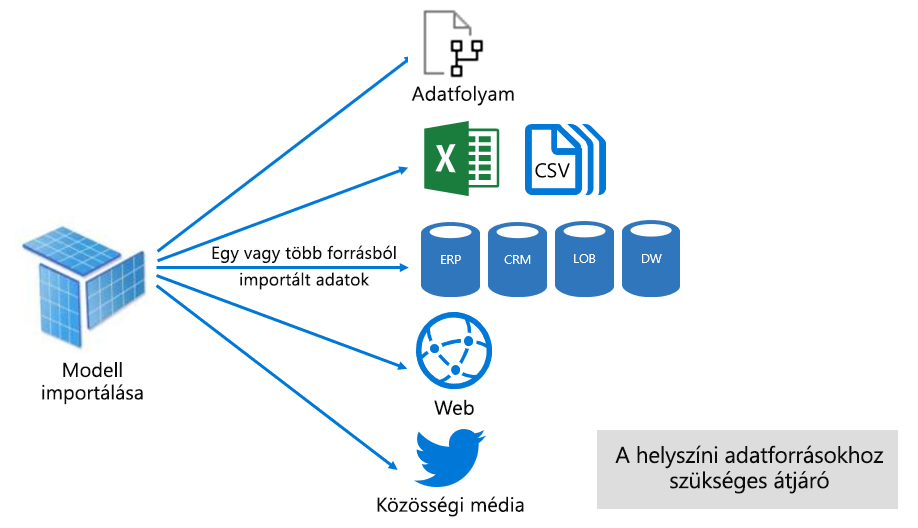
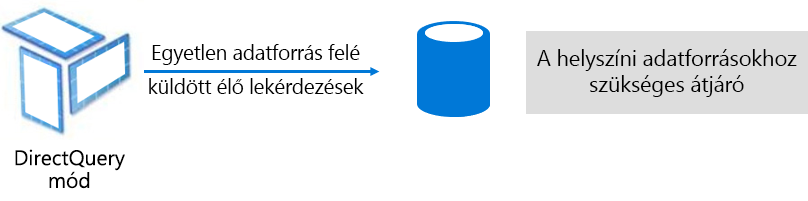
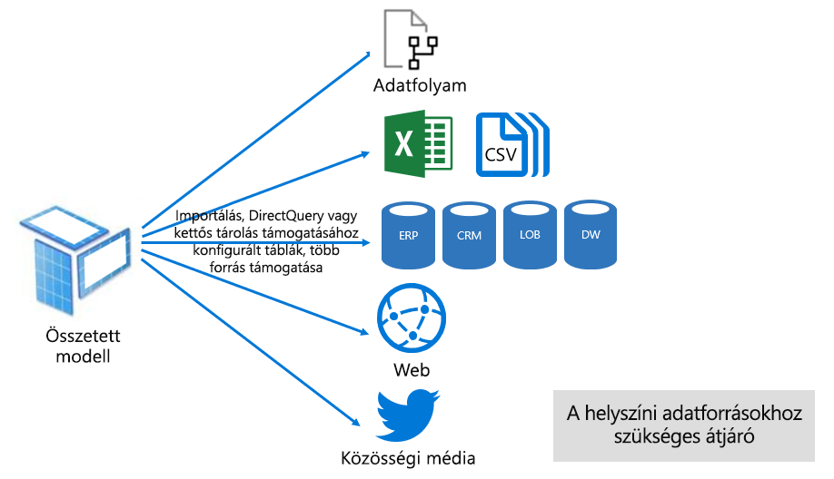

# Adathalmaz-módok a Power BI szolgáltatásban

Ez a cikk a Power BI-adathalmazok módjainak technikai magyarázatát kínálja. Olyan adathalmazokra vonatkozik, amelyek külső üzemeltetésű Analysis Services-modell, vagy a Power BI Desktopban kifejlesztett modell élő kapcsolatát képviselik. A cikk kiemelten foglalkozik az egyes módok használatának indokaival és a Power BI-kapacitás erőforrásaira gyakorolt esetleges hatásaikkal.

A három adathalmaz-mód a következő:

- [Importálás](#import-mode)
- [DirectQuery](#directquery-mode)
- [Összetett](#composite-mode)

## Importálás mód

Az _Importálás_ mód a modellek fejlesztésére leggyakrabban használt mód. Ez a mód a memóriában végzett lekérdezések miatt rendkívül gyors teljesítményt biztosít. Rugalmas tervezési lehetőségeket is kínál a modellezőknek, és támogatja a Power BI szolgáltatás bizonyos funkcióit (Q&A, gyors elemzések stb.). Ezen előnyei miatt ez az alapértelmezett mód az új Power BI Desktop-megoldások létrehozásakor.

Fontos tudni, hogy az importált adatok mindig lemezen vannak tárolva. Lekérdezéskor vagy frissítéskor mindig az adatok egészét be kell tölteni a Power BI-kapacitás memóriájába. A memóriában lévő Importálás módú modellek már nagyon gyorsan megadják a lekérdezések eredményeit. Azzal is fontos tisztában lenni, hogy az Importálás módú modellek nem tölthetők be részlegesen a memóriába.

Frissítéskor az adatok tömörítve és optimalizálva lesznek, majd a VertiPaq tárolási összetevővel vannak lemezen tárolva. A lemezről a memóriába való betöltéskor tízszeres tömörítés is előfordulhat. Ésszerű elvárás, hogy 10 GB-nyi forrásadat körülbelül 1 GB méretűre lesz tömöríthető. A lemezes tárolás a tömörített méret 20%-os csökkentését érheti el. (A méretkülönbség megállapítható a Power BI Desktop-fájl méretének és a fájl Feladatkezelőben látható memóriahasználatának összehasonlításával.)

A tervezési rugalmasság három módon valósítható meg. Az adatmodellezők megtehetik a következőket:

- Integrálhatják az adatokat az adatfolyamokból és külső adatforrásokból származó adatok gyorsítótárazásával, az adatforrás típusától és formátumtól függetlenül
- A [Power Query-képletnyelv](/powerquery-m/) (nem hivatalos nevén: M) összes függvényét felhasználhatják az adatelőkészítési lekérdezések létrehozásakor
- Felhasználhatják az összes [adatelemzési kifejezés (DAX)](/dax/) függvényt a modell üzleti logikával való kibővítésére. Támogatott a számított oszlopok, számított táblák és mértékek használata.

Amint az alábbi ábrán látható, egy Importálás módú modell tetszőleges számú támogatott adatforrás-típus adatait integrálhatja.

Az Importálás módú modellek használata azonban a meggyőző előnyök mellett hátrányokkal is jár:

- Ahhoz, hogy a Power BI lekérdezhesse a modellt, a teljes modellt be kell tölteni a memóriába, ez pedig megterhelheti a kapacitás rendelkezésre álló erőforrásait, különösen az Importálás módú modellek számának és méretének növekedése esetén
- A modelladatok csak a legutóbbi frissítésnek megfelelően naprakészek, ezért az Importálás módú modelleket frissíteni kell, általában ütemezetten
- A teljes frissítések eltávolítják az táblák összes adatát, majd újra betöltik azokat az adatforrásból. Ez a művelet idő- és erőforrás-igényes lehet a Power BI szolgáltatás és az adatforrás(ok) szempontjából.

    > [!NOTE]
    > A Power BI képes növekményes frisstést végezni a teljes táblák csonkításának és újratöltésének elkerülése érdekében. Ez a funkció azonban csak akkor támogatott, ha az adathalmaz Prémium szintű kapacitásban lévő munkaterületeken van üzemeltetve. Erről a [Növekményes frissítés a Power BI Premium szolgáltatásban](service-premium-incremental-refresh.md) című cikkben talál további információt.

A Power BI szolgáltatás erőforrásainak szempontjából az Importálás módú modellek a következőket igénylik:

- A modell betöltéséhez elegendő memória annak lekérdezésekor vagy frissítésekor
- Feldolgozási erőforrások és további memória-erőforrások az adatfrissítéshez

## DirectQuery mód

A _DirectQuery_ mód az Importálás mód alternatívája. A DirectQuery módban fejlesztett modellek nem importálnak adatokat. Ezek csak a modellstruktúrát meghatározó metaadatokból állnak. A modell lekérdezésekor az adatok natív lekérdezésekkel vannak beolvasva a mögöttes adatforrásból.

A DirectQuery módú modellek fejlesztése mellett két fő érv szól:

- Ha az adatmennyiség – még [adatcsökkentési módszerek](guidance/import-modeling-data-reduction.md) alkalmazásával is – túl nagy ahhoz, hogy egy modellbe legyen betöltve, vagy használható módon legyen frissítve
- Ha a jelentéseknek és irányítópultoknak „közel valós idejű” adatokat kell nyújtaniuk, az ütemezett frissítések korlátait meghaladó mértékben. (Az ütemezett frissítés megosztott kapacitásban napi 8, Prémium szintű kapacitásban napi 48 alkalomra van korlátozva.)

A DirectQuery módú modellek használata számos előnnyel jár:

- Ezekre nem vonatkoznak az Importálás módú modellek méretkorlátai
- A modellek nem igényelnek frissítést
- A jelentések felhasználói a legfrissebb adatokat látják a jelentés szűrőinek és szeletelőinek kezelésekor. A jelentések felhasználói a teljes jelentést is frissíthetik az aktuális adatok lekéréséhez.
- Valós idejű jelentések készíthetők az [Automatikus oldalfrissítés](desktop-automatic-page-refresh.md) funkcióval
- A DirectQuery módú modelleken alapuló irányítópult-csempék akár 15 percenként is frissülhetnek automatikusan

A DirectQuery-modellek használata azonban hátrányokkal és korlátozásokkal is jár:

- A modell csak egyetlen támogatott adatforrásra épülhet. Ez az oka annak, hogy az adatintegrációt előre meg kell valósítani az adatforrásban. A támogatott adatforrás relációs és elemzési rendszerek, amelyek számos népszerű adattárat támogatnak.

    > [!TIP]
    > Számos Microsoft-adatforrás is támogatott. Microsoft-adatforrás többek között az SQL Server, az Azure Data Bricks, az Azure HDInsight Spark (bétaverzió), az Azure SQL Database és az Azure SQL Data Warehouse. További információ: [A DirectQuery által támogatott adatforrások a Power BI-ban](desktop-directquery-data-sources.md).

- A működés lassú lehet, ani negatívan befolyásolhatja a Power BI szolgáltatást. Ez a probléma azért merülhet fel, mert egyes lekérdezések CPU-igényesek a Power BI szolgáltatás számára. Ezt az is okozhatja, hogy az adatforrás nincs a Power BI által küldött lekérdezésekre optimalizálva.
- A Power Query-lekérdezéseknek átadhatóknak kell lenniük. Ez a követelmény azt jelenti, hogy a Power Query logikája nem lehet túlságosan összetett. A logikának továbbá olyan M-kifejezések és -függvények használatára kell korlátozódnia, amelyek az adatforrás által érthető natív lekérdezésekre transzponálhatók.
- A DAX-kifejezések csak az adatforrás által érthető natív lekérdezésekre transzponálható függvényeket használhatnak. A számított táblák és a DAX időintelligencia-függvények sem támogatottak.
- A modell egymilliónál több sor lekérését igénylő lekérdezései sikertelenek lesznek
- A több vizualizációt tartalmazó jelentések és irányítópultok következetlen eredményeket jeleníthetnek meg, különösen akkor, ha az adatforrás gyorsan változik
- A Q&A és a gyors elemzések funkció nem támogatott

A Power BI szolgáltatás erőforrásainak szempontjából a DirectQuery módú modellek a következőket igénylik:

- Minimális memória a modell (csak metaadatok) betöltéséhez lekérdezéskor
- A Power BI szolgáltatás időnként jelentős processzor-erőforrásokat használhat az adatforráshoz küldött lekérdezések generálásához és feldolgozásához. Ha ilyen helyzet áll elő, az befolyásolhatja az átviteli sebességet, különösen akkor, ha több felhasználó egy időben kérdezi le a modellt.

További információt a [DirectQuery használata a Power BI Desktopban](desktop-use-directquery.md) című cikkben talál.

## Összetett mód

Az _Összetett_ módban Importálás és DirectQuery használható vegyesen, vagy több DirectQuery-adatforrás integrálható. Az Összetett módban fejlesztett modellek támogatják az egyes modelltáblák tárolási módjának konfigurálását. Ez a mód a számított (DAX használatával definiált) táblákat is támogatja.

A tábla tárolási módja Importálás, DirectQuery vagy Kettős módra konfigurálható. Egy Kettős tárolási módra konfigurált tábla egyszerre Importálás és DirectQuery, így ez a beállítás lehetővé teszi, hogy lekérdezésenként a Power BI szolgáltatás határozza meg a leghatékonyabb módot.

Az Összetett modellek az Importálás és a DirectQuery módú modellek legjobb tulajdonságait igyekeznek nyújtani. Megfelelően konfigurálva kombinálni tudja a memóriabeli modellek magas lekérdezési teljesítményét azzal a képességgel, hogy közel valós idejű adatokat kér le az adatforrásokból.

Az Összetett modelleket fejlesztő adatmodellezők a dimenzió típusú táblákat valószínűleg Importálás vagy Kettős módban, a tény típusú táblákat pedig DirectQuery módban konfigurálják. A modelltáblák szerepköreiről [A csillagséma és a Power BI-ban játszott szerepének a bemutatása](guidance/star-schema.md) című cikkben talál további információt.

Tegyük fel például, hogy egy modell egy **Termék** nevű, Kettős módú dimenziótáblát, és egy **Értékesítések** nevű, DirectQuery módú ténytáblát tartalmaz. A **Termék** tábla hatékonyan és gyorsan lekérdezhető a memóriából egy jelentésbeli szeletelő rendereléséhez. Az **Értékesítések** tábla szintén lekérdezhető DirectQuery módban, a kapcsolódó **Termék** táblával. Az utóbbi lekérdezés egyetlen hatékony natív SQL-lekérdezés generálását teheti lehetővé, amely a **Termék** és az **Értékesítés** táblákat kapcsolja össze és szűri a szeletelő értékei szerint.

Az Összetett modellekben az Importálás és DirectQuery mód előnyei és hátrányai általában az egys táblák konfigurációjától függően érvényesülnek.

További információ: [Összetett modellek használata a Power BI Desktopban](desktop-composite-models.md).

## Következő lépések

- [Adathalmazok a Power BI szolgáltatásban](service-dataset-modes-understand.md)
- [Tárolási mód a Power BI Desktopban](desktop-storage-mode.md)
- [DirectQuery használata a Power BI-ban](desktop-directquery-about.md)
- [Összetett modellek használata a Power BI Desktopban](desktop-composite-models.md)
- További kérdései vannak? [Kérdezze meg a Power BI közösségét](https://community.powerbi.com/)
