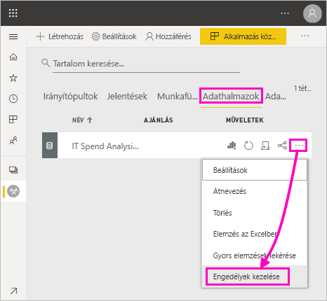
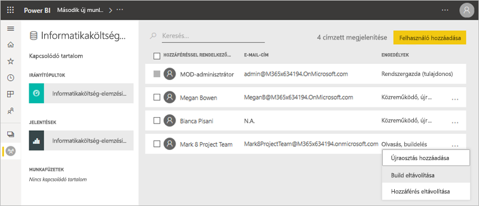
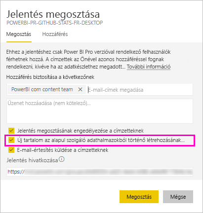
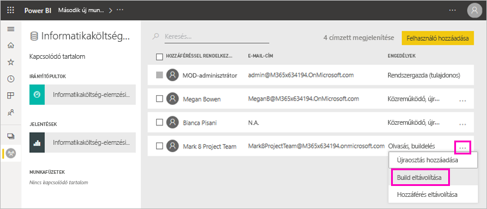
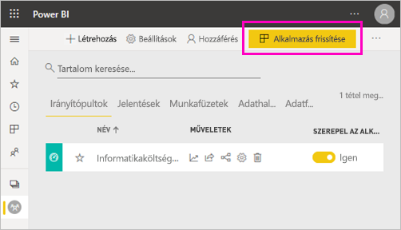
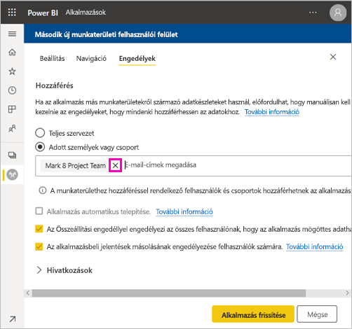
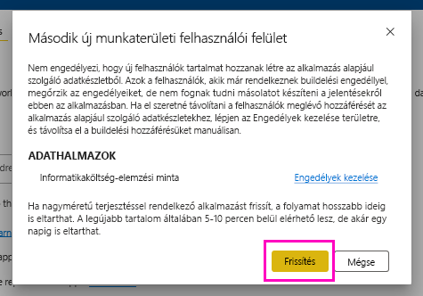

# Megosztott adathalmazokra vonatkozó összeállítási engedély (előzetes verzió)

Amikor jelentést hoz létre a Power BI Desktopban, a jelentésbeli adatok egy *adatmodellben* vannak tárolva. Amikor közzéteszi jelentéseit a Power BI szolgáltatásban, egyben az adatokat is közzéteszi *adathalmazként*. *Összeállítási engedélyt* adhat másoknak a jelentéshez, hogy felfedezhessék és újra felhasználhassák a megosztott adathalmazt. Ez a cikk azt írja le, hogy hogyan szabályozhatja Összeállítási engedély használatával az adatokhoz való hozzáférést.

Az Összeállítási engedély adathalmazokra vonatkozik. Azok a felhasználók, akiknek megadja az Összeállítási engedélyt új tartalmat, például jelentéseket, irányítópultokat, a Q&A-ból rögzített csempéket és Insights-felfedezéseket állíthatnak össze az adathalmaz alapján. 

A felhasználóknak ahhoz is Összeállítás engedély szükséges, hogy a Power BI-on *kívül* dolgozzanak az adatokkal:

- A mögöttes adatok exportálásához.
- Új tartalom készítéséhez az adathalmaz alapján, például az [Elemzés az Excelben](service-analyze-in-excel.md) funkcióval.
- Az adatok XMLA-végpont általi eléréséhez.

## Az Összeállítási engedély megadásának módjai

Egy adathalmazra többféleképpen adható Összeállítási engedély:

- Egy munkaterület legalább Közreműködő szerepkörrel rendelkező tagjai automatikusan Összeállítási engedéllyel rendelkeznek a munkaterületen lévő adathalmazokhoz, és jogosultak a jelentések másolására.
 
- Annak a munkaterületek a tagjai, ahol az adathalmaz található, adott személyekhez vagy biztonsági csoportokhoz rendelhetik az engedélyt az Engedélykezelési központban. Ha tagja a munkaterületnek, válassza az adathalmaz melletti **További lehetőségek** (...) elemet, majd az **Engedélyek kezelése** menüpontot.

    

    Ezzel megnyitja az adathalmaz Engedélykezelési központját, ahol beállíthatja és módosíthatja az engedélyeket.

    

- Egy rendszergazda, vagy annak a munkaterületek egy tagja, ahol az adathalmaz található, az alkalmazás közzététele során eldöntheti, hogy az alkalmazásra vonatkozó engedéllyel rendelkező felhasználók a mögöttes adathalmazokra vonatkozó Összeállítási engedéllyel is rendelkezzenek-e. Részleteket az [Adathalmaz megosztása](service-datasets-share.md) című cikkben talál.

- Tegyük fel, hogy Újraosztási és Összeállítási engedéllyel rendelkezik egy adathalmazhoz. Amikor egy erre az adathalmazra épülő jelentést vagy irányítópultot oszt meg, beállíthatja, hogy a címzettek a mögöttes adathalmazra vonatkozó Összeállítási engedélyt is megkapják-e.

    

Az adathalmazra vonatkozó Összeállítási engedélyt vissza is vonhatja. Ha ezt teszi, az érintettek továbbra is látni fogják a megosztott adathalmazra épülő jelentést, de többé nem szerkeszthetik azt. A részleteket a következő szakaszban találhatja meg.

## Adathalmazra vonatkozó Összeállítási engedély visszavonása

Előfordulhat, hogy egyes felhasználóknak egy megosztott adathalmazra vonatkozó Összeállítási engedélyét vissza kell vonnia. 

1. Nyissa meg az **Adathalmazok** listaoldalt egy munkaterületen. 
1. Válassza az adathalmaz melletti **További lehetőségek** (...) elemet, majd az **Engedélyek kezelése** lehetőséget.

    

1. Válassza az egyik név melletti **További lehetőségek** (...) elemet, majd az **Összeállítás megvonása** menüpontot.

    

    Az érintettek továbbra is látni fogják a megosztott adathalmazra épülő jelentést, de többé nem szerkeszthetik azt.

### Adathalmazra vonatkozó Összeállítási engedély visszavonása alkalmazásban

Tegyük fel, hogy egy munkaterületről egy alkalmazást terjesztett egy csoport számára. Később úgy határoz, hogy egyes személyektől megvonja az alkalmazáshoz való hozzáférést. Az alkalmazáshoz való hozzáférés megvonása nem vonja vissza automatikusan az összeállítási és újraosztási engedélyeket. Ez egy további lépést igényel. 

1. A munkaterület listaoldalán válassza az **Alkalmazás frissítése** lehetőséget. 

    

1. Az **Engedélyek** lapon válassza az **X** jelet a személy vagy csoport eltávolításához. 

    
1. Válassza az **App frissítése** lehetőséget.

    Megjelenik egy üzenet, amely szerint a meglévő hozzáféréssel rendelkező felhasználók Összeállítási engedélyének visszavonásához az **Engedélyek kezelése** lapot kell megnyitnia. 

    

1. Válassza a **Frissítés** lehetőséget.

1. Nyissa meg az **Adathalmazok** listaoldalt a munkaterületen. 
1. Válassza az adathalmaz melletti **További lehetőségek** (...) elemet, majd az **Engedélyek kezelése** lehetőséget.

    

1. Válassza a név melletti **További lehetőségek** (...) elemet, majd az **Összeállítás megvonása** menüpontot.

    

    Az érintettek továbbra is látni fogják a megosztott adathalmazra épülő jelentést, de többé nem szerkeszthetik azt.

## Részletesebb engedélyek

A Power BI-ban 2019 júniusában bevezetett Összeállítási engedély a meglévő Olvasási és Újraosztási engedélyt egészíti ki. Azok a felhasználók, akik ekkor alkalmazásengedélyen, megosztáson vagy munkaterület-hozzáférésen keresztül már Olvasási engedéllyel rendelkeztek, az Összeállítási engedélyt is megkapták ugyanazokra az adathalmazokra. Az Összeállítási engedélyt azért kapták meg automatikusan, mert az Olvasási engedélyük addig is lehetővé tette számukra új tartalom összeállítását az adathalmaz alapján az Elemzés az Excelben funkció vagy exportálás használatával.

A részletesebben beállítható Összeállítás engedéllyel megadhatja, hogy ki az, aki csak megtekintheti a meglévő jelentés vagy irányítópult tartalmát, és ki hozhat létre a mögöttes adathalmazhoz kapcsolódó tartalmat.

Ha az adathalmazt egy annak munkaterületén kívüli jelentés használja, akkor az adathalmazt nem törölheti. Ehelyett hibaüzenet jelenik meg.

Az Összeállítási engedélyt el is távolíthatja. Ilyen esetben azok, akiknek az engedélyét visszavonta, továbbra is látni fogják a jelentést, de már nem szerkeszthetik azt, és nem exportálhatják a mögöttes adatokat. A csak olvasási engedéllyel rendelkező felhasználók továbbra is exportálhatják az összegzett adatokat. 

## További lépések

- [Adathalmazok használata több munkaterületen (előzetes verzió)](service-datasets-across-workspaces.md)
- Kérdései vannak? [Kérdezze meg a Power BI-közösséget](https://community.powerbi.com/)
