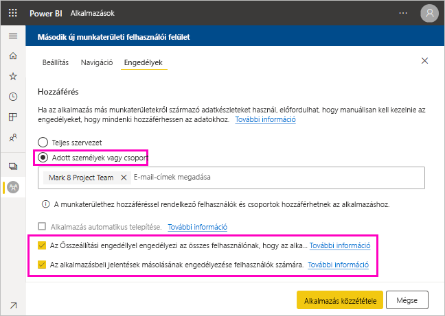

# Adathalmaz megosztása (előzetes verzió)

Ha *adatmodelleket* készít a Power BI Desktopban, a Power BI szolgáltatásban terjeszthető *adathalmazokat* hoz létre. Más jelentéskészítők így saját jelentéseik alapjául használhatják fel ezeket az adathalmazokat. Ebből a cikkből az adathalmazok megosztását sajátíthatja el. Ha a megosztott adathalmazokhoz való hozzáférés megadását és visszavonását szeretné megismerni, olvassa el az [Összeállítási engedélyről](service-datasets-build-permissions.md) szóló cikket.

## Az adathalmaz megosztásának lépései

1. Először egy .pbix-fájlt hoz létre egy adatmodellel a Power BI Desktopban. Ha azt tervezi, hogy ezt az adathalmazt másoknak kínálja fel jelentések készítéséhez, akkor talán már nem is tervez jelentést a .pbix-fájlban.

    A .pbix-fájlt ajánlott egy Office 365-csoportba menteni.

1. Tegye közzé a .pbix-fájlt egy [új felületű munkaterületen](service-create-the-new-workspaces.md) a Power BI szolgáltatásban.
    
    Ennek a munkaterületnek a többi tagja máris készíthet ezen az adathalmazon alapuló jelentéseket más munkaterületeken.

1. Erről a munkaterületről [alkalmazást is közzétehet](service-create-distribute-apps.md). Ennek során az **Engedélyek** oldalon megadhatja, hogy ki rendelkezik engedélyekkel, és mit tehetnek meg.

    > [!NOTE]
    > Ha a **Teljes vállalat** lehetőséget választja, akkor a vállalatnál senki sem fog Összeállítási engedéllyel rendelkezni. Ez a probléma már ismert. Ehelyett adjon meg e-mail-címeket az **Adott személyek vagy csoportok** beállításnál.  Ha azt szeretné, hogy a vállalatnál mindenki rendelkezzen Összeállítási engedéllyel, adja meg a teljes vállalat egy e-mail-aliasát.

    

1. Válassza az **Alkalmazás közzététele** lehetőséget, vagy az **Alkalmazás frissítése** lehetőséget, ha az már közzé lett téve.

## Adathalmaz használatának nyomon követése

Ha munkaterületén megosztott adathalmazzal rendelkezik, érdemes lehet tudni, hogy más munkaterületeken milyen jelentések épülnek rá.

1. Az Adathalmazlista nézetben válassza a **Kapcsolódók megtekintése** lehetőséget.

    

1. A **Kapcsolódó tartalom** párbeszédpanelen az összes kapcsolódó elem megjelenik. A listában megtekintheti az ezen a munkaterületen, és a **Más munkaterületeken** lévő kapcsolódó elemeket.
 
    

## További lépések

- [Adathalmazok használata több munkaterületen (előzetes verzió)](service-datasets-across-workspaces.md)
- Kérdései vannak? [Kérdezze meg a Power BI-közösséget](https://community.powerbi.com/)
