# Beágyazás jelentéskijelzővel a SharePoint Online-ban

A Power BI új beágyazás jelentéskijelzővel a SharePoint Online-ban funkciójának használatával interaktív Power BI-jelentéseit könnyedén SharePoint Online-oldalakba illesztheti.

Az új **Beágyazás a SharePoint Online-ban** funkció használatával a beágyazott jelentések teljes biztonságban vannak, így könnyedén hozhat létre biztonságos belső portálokat.

## Követelmények

Ahhoz, hogy a **Beágyazás a SharePoint Online-ban** funkció működjön, teljesülnie kell néhány követelménynek.

* Power BI Pro-licenc vagy Power BI-licenccel rendelkező [Power BI Premium-kapacitás (EM vagy P termékváltozat)](service-premium.md#premium-capacity-nodes) szükséges.
* A Power BI-jelentéskijelző a SharePoint Online-hoz csak [Modern weblapokkal](https://support.office.com/article/Allow-or-prevent-creation-of-modern-site-pages-by-end-users-c41d9cc8-c5c0-46b4-8b87-ea66abc6e63b) működik.

## A jelentés beágyazása

Ahhoz, hogy a jelentést beágyazza a SharePoint Online-ba, először is szükség van a jelentés URL-címére, amelyet majd a Power BI-kijelzőben kell megadni a SharePoint Online-ban.

### A jelentésre mutató URL-cím beszerzése

1. Nyissa meg a jelentést a Power BI szolgáltatásban.

2. Válassza ki a **Fájl** menüpont.

3. Válassza a **Beágyazás a SharePoint Online-ban** lehetőséget.

    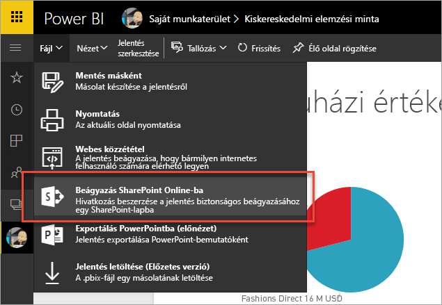

4. Másolja be az URL-címet a párbeszédpanelről.

    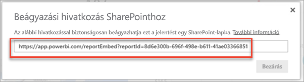

### A Power BI-jelentés hozzáadása a SharePoint Online laphoz

1. Nyissa meg a kívánt lapot a SharePoint Online-ban, és válassza ki a **Szerkesztés** lehetőséget.

    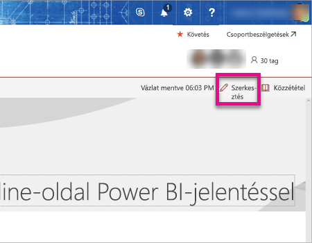

    Vagy hozzon létre egy új modern weblapot a SharePoint Online-ban a **+ Új** lehetőség kiválasztásával.

    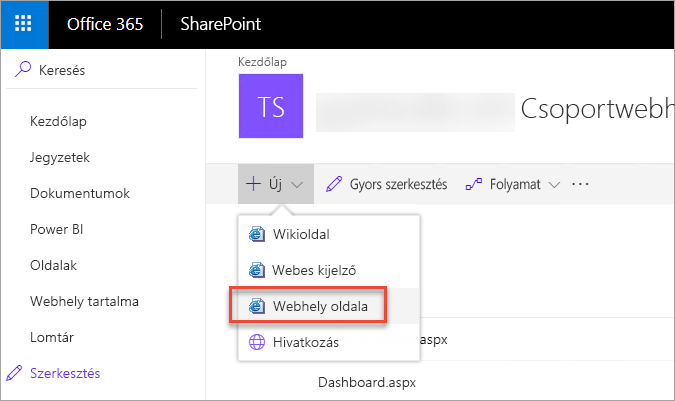

2. Válassza a **+** lehetőséget, ezután pedig a **Power BI**-kijelzőt.

    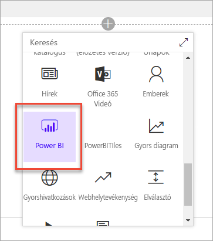

3. Válassza ki a **Jelentés hozzáadása** lehetőséget.

    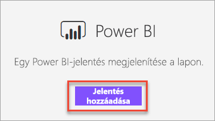

4. Illessze be a jelentés URL-címét a tulajdonság ablaktáblába. Ennek a jelentésnek az URL-címe az az URL-cím, amelyet a korábbi lépéseknél kimásolt. A jelentés automatikusan betöltődik.

    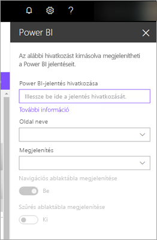

5. Válassza a **Közzététel** lehetőséget ahhoz, hogy a változtatásokat a többi SharePoint Online-felhasználó is megtekinthesse.

    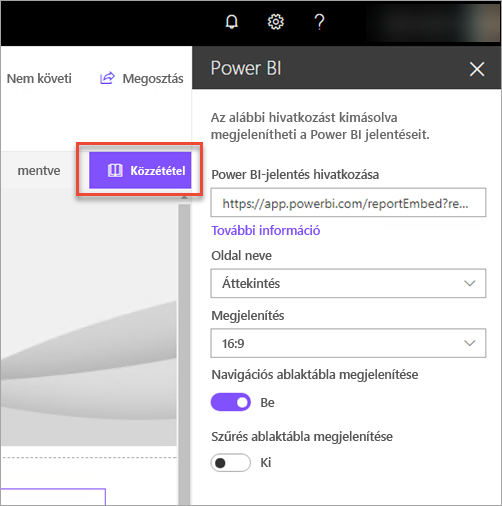

## Hozzáférés biztosítása a jelentésekhez

Egy jelentés beágyazása a SharePoint Online-ba még nem ad automatikusan engedélyt a felhasználóknak arra, hogy megtekinthessék a jelentést. A megtekintési engedélyeket a Power BI szolgáltatásban kell beállítani.

> [!IMPORTANT]
> Tekintse át kik láthatják a jelentést a Power BI szolgáltatásban, és adjon hozzáférést azoknak, akik még nem szerepelnek a listában.

A Power BI szolgáltatásban kétféleképpen lehet egy jelentéshez hozzáférést adni. Ha a SharePoint Online-csoportwebhely létrehozásához Office 365-csoportot használ, akkor a felhasználót hozzáadhatja az **alkalmazás-munkaterülethez a Power BI szolgáltatásban** és a **SharePoint-oldalon**. További információkért lásd: [Alkalmazás-munkaterület kezelése](service-manage-app-workspace-in-power-bi-and-office-365.md).

Másik lehetőségként úgy is megoszthatja közvetlenül a felhasználókkal, ha a jelentést beágyazza egy alkalmazásba. A jelentés néhány lépésben beágyazható az alkalmazásba.  

1. Az alkalmazás szerzője Pro felhasználó.

2. A szerző jelentést hoz létre egy alkalmazás-munkaterületen. *Ahhoz, hogy az alkalmazás-munkaterület megosztható legyen az **ingyenes Power BI-felhasználókkal**, az alkalmazás-munkaterületet **Premium munkaterületként** kell beállítani.*

3. A szerző közzéteszi, majd telepíti az alkalmazást. *A szerzőnek telepítenie kell az alkalmazást, hogy hozzáférhessen a jelentés URL-címéhez, amely a SharePoint Online-on való beágyazáshoz szükséges.*

4. Mostantól az összes végfelhasználónak is telepítenie kell az alkalmazást. Az alkalmazás előtelepítettként is beállítható a végfelhasználók számára az **Alkalmazás automatikus telepítése** funkcióval, amely a [Power BI felügyeleti portálján](service-admin-portal.md) engedélyezhető.

   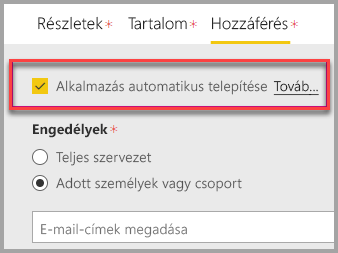

5. A szerző megnyitja az alkalmazást és a jelentést.

6. A szerző bemásolja a jelentés beágyazásának URL-címét az alkalmazás által telepített jelentésből. *Ne használja az eredeti jelentés URL-címét az alkalmazás-munkaterületről.*

7. Hozzon létre egy új csoportwebhelyet a SharePoint Online-ban.

8. Adja hozzá a Power BI webes részéhez a 6. lépésben kimásolt URL-címet.

9. Vegye fel az összes olyan felhasználót és/vagy csoportot, akik dolgozni fognak a létrehozott SharePoint Online oldalon és a Power BI alkalmazásban.

    > [!NOTE]
    > **Ahhoz, hogy a felhasználók és a csoportok a SharePoint Online-oldalon láthassák a jelentést, hozzá kell férniük a SharePoint Online-oldalhoz és a Power BI-ban lévő jelentéshez.**

10. Mostantól a végfelhasználó hozzáfér a SharePoint Online-on lévő csoportwebhelyhez, és láthatja rajta a jelentést.

## Többtényezős hitelesítés

Ha a Power BI-környezetbe való bejelentkezéshez többtényezős hitelesítésre van szükség, akkor előfordulhat, hogy a rendszer arra kéri, hogy személyazonossága igazolásához jelentkezzen be egy biztonsági eszközzel. Ez olyankor fordul elő, amikor a SharePoint Online-ba nem többtényezős hitelesítés használatával jelentkezik be, a Power BI-környezetbe való belépéshez viszont biztonsági eszközzel igazolt fiók szükséges.

> [!NOTE]
> A többtényezős hitelesítést az Azure Active Directory 2.0 még nem támogatja. A felhasználók egy *Hiba* feliratú üzenetet fognak kapni. Ha a felhasználó egy biztonsági eszköz használatával újból bejelentkezik a SharePoint Online-ba, akkor megtekintheti a jelentést.

## A jelentéskijelző beállításai

Alább megtekintheti a SharePoint Online Power BI-kijelzőjének módosítható beállításait és azok leírását.

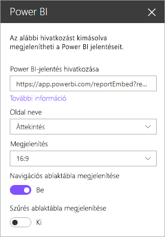

| Tulajdonság | Leírás |
| --- | --- |
| Oldal neve |Beállítja a jelentéskijelzőn alapértelmezetten megjelenő oldalt. Válasszon ki egy értéket a legördülő listából. Ha nem jelenik meg egyetlen oldal sem a listában, akkor vagy csak egyetlen oldalból áll a jelentés, vagy a bemásolt URL-cím már tartalmazza az egyik oldal nevét. Ahhoz, hogy a listából választhasson ki egy adott oldalt, el kell távolítani a jelentésre hivatkozó szakaszt az URL-címből. |
| Megjelenítés |A jelentés SharePoint Online-oldalon belüli igazítására szolgáló beállítás. |
| Navigációs ablaktábla megjelenítése |Megjeleníti vagy elrejti az oldal navigációs ablaktábláját. |
| Szűrés ablaktábla megjelenítése |Megjeleníti vagy elrejti a szűrés ablaktábláját. |

## Nem betöltődő jelentések

Előfordulhat, hogy a jelentés nem töltődik be a Power BI-kijelző felületén, hanem a következő hibaüzenet olvasható:

*Ez a tartalom nem érhető el.*

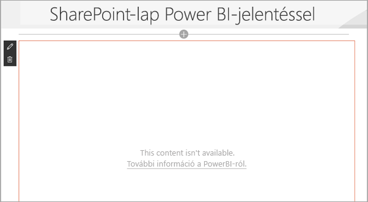

Ennek általában két oka lehet:

1. Nem rendelkezik hozzáféréssel az adott jelentéshez.
2. A jelentést időközben törölték.

A probléma elhárításához lépjen kapcsolatba a SharePoint Online-oldal tulajdonosával.

## Licencelés

Egy jelentést SharePointban megtekintő felhasználónak vagy **Power BI Pro**-licencre van szüksége, vagy a tartalomnak kell **[Power BI Premium-kapacitáson (EM vagy P termékváltozat)](service-admin-premium-purchase.md)** lévő munkaterületen lennie.

## Ismert problémák és korlátozások

* Hiba: „Hiba történt, kérjük jelentkezzen ki, és újból be, majd nyissa meg ismét az oldalt. Korrelációs azonosító: nincs definiálva, HTTP-válasz állapota: 400, kiszolgálói hibakód 10001, üzenet: Hiányzó frissítési token”
  
  Ha ez a hibaüzenet jelenik meg, próbálkozzon az alábbi hibaelhárítási lépések egyikével.
  
  1. Jelentkezzen ki a SharePointból, majd jelentkezzen be ismét. Ügyeljen rá, hogy az összes böngészőablakot bezárja az újbóli bejelentkezés előtt.

  2. Ha a felhasználói fiókba való belépéshez többtényezős hitelesítés szükséges, ügyeljen rá, hogy a többtényezős hitelesítéshez használt eszközzel jelentkezzen be a SharePoint Online-ba (telefonalkalmazás, intelligens kártya stb.).
  
  3. Az Azure B2B-vendégfelhasználói fiókok nem támogatottak. A felhasználók a kijelző betöltését mutató Power BI-logót látják, de a jelentés nem jelenik meg.

* A Power BI nem ugyanazokat a honosított nyelveket támogatja mint a SharePoint Online. Emiatt előfordulhat, hogy a beágyazott jelentés nem megfelelően honosított nyelven jelenik meg.

* Ha Internet Explorer 10-es böngészőt használ, előfordulhat, hogy problémákba ütközik. Tekintse át mely [böngészők használatát támogatja a Power BI](consumer/end-user-browsers.md) és az [Office 365](https://products.office.com/office-system-requirements#Browsers-section).

* A Power BI webes kijelző nem érhető el [szuverén felhő](https://powerbi.microsoft.com/en-us/clouds/) esetén.

* A klasszikus SharePoint-kiszolgáló nincs támogatva ehhez a webes kijelzőhöz.

* Az [URL-szűrőket](service-url-filters.md) nem támogatja a SPO webes kijelző.

## Következő lépések

[Modern weboldalak végfelhasználók általi létrehozásának engedélyezése vagy letiltása](https://support.office.com/article/Allow-or-prevent-creation-of-modern-site-pages-by-end-users-c41d9cc8-c5c0-46b4-8b87-ea66abc6e63b)  
[Alkalmazások létrehozása és terjesztése a Power BI-ban](service-create-distribute-apps.md)  
[Irányítópult megosztása munkatársakkal és másokkal](service-share-dashboards.md)  
[Mi a Power BI Premium?](service-premium.md)  

További kérdései vannak? [Kérdezze meg a Power BI közösségét](http://community.powerbi.com/)