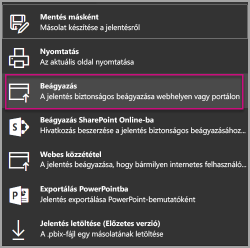
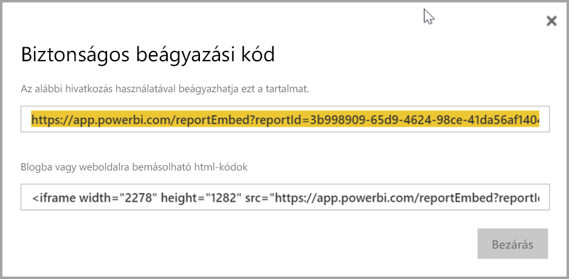
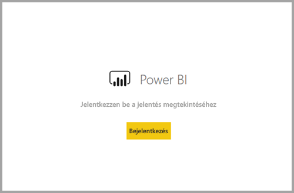
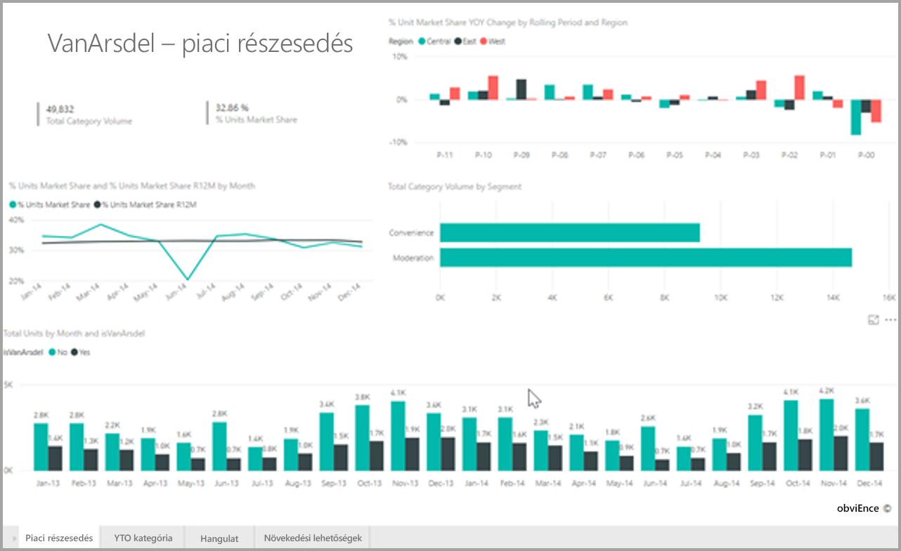

# <a name="embed-a-report-in-a-secure-portal-or-website"></a>Jelentés beágyazása egy biztonságos portálon vagy webhelyen

A Power BI jelentések új **Beágyazás** beállításával egyszerűen és biztonságosan ágyazhat be jelentéseket belső webportálokon. Ezek a portálok lehetnek **felhőalapúak** vagy **helyszínen üzemeltetettek**, mint a SharePoint 2019. A beágyazott jelentések minden elemengedélyt tiszteletben tartanak, az adatbiztonsággal együtt egészen a [sorszintű biztonságig (RLS)](service-admin-rls.md). Kód nélküli beágyazást kínálnak bármilyen portálon, amely elfogad URL-eket vagy iFrame-eket. 

A **Beágyazás** lehetőség az [URL-szűrőket](service-url-filters.md) és az URL-beállításokat is támogatja. Kevés kódot használó, csupán alapszintű HTML- és JavaScript-szakértelmet kívánó megközelítéssel integrálhat portálokkal.

## <a name="how-to-embed-power-bi-reports-into-portals"></a>Power BI-jelentések **beágyazása** portálokba

1. Az új **beágyazás** lehetőség a Power BI szolgáltatás jelentéseinek **Fájl** menüjében érhető el.

    

2. Válassza a **Beágyazás** lehetőséget, amellyel megnyit egy párbeszédpanelt, ahol egy, a jelentés biztonságos beágyazásához használható hivatkozás és iFrame található.

    

3. Akár közvetlenül az URL-címmel, akár egy webportálon beágyazva nyit meg egy felhasználó egy jelentést, a hozzáférés hitelesítést követel. Ha a felhasználó a böngészőbeli munkamenet során nem jelentkezett be a Power BI-ba, a következő képernyő jelenik meg. Amikor a **Bejelentkezés** gombot választják, új böngészőablak vagy -lap nyílhat meg. Ha nem látják a bejelentkezési felszólítást, ellenőriztesse velük a felugró ablakok tiltását.

    

4. Miután a felhasználó bejelentkezett, a jelentés megnyílik, és megjelennek az adatok lehetővé téve az oldalak közötti navigációt és szűrők beállítását. A jelentést csak megtekintési engedéllyel rendelkező felhasználók láthatják a Power BI-ban. Minden [sorszintű biztonsági (RLS)](service-admin-rls.md) szabály érvényben van. Végül a felhasználónak rendelkeznie kell a megfelelő licenccel. Vagy Power BI Pro-licencre van szüksége, vagy a jelentésnek kell Power BI Premium-kapacitáson lévő munkaterületen lennie. A felhasználóknak minden új böngészőablak megnyitásakor be kell jelentkezniük. Bejelentkezés után azonban automatikusan be lesz töltve a többi jelentés.

    

5. iFrame használata esetén esetleg módosítania kell annak **magasságát** és **szélességét**, hogy elférjen a portál weboldalán.

    

## <a name="granting-report-access"></a>A jelentéshez való hozzáférés megadása

A **Beágyazás** lehetőség nem engedélyezi automatikusan a felhasználóknak a jelentés megtekintését. A megtekintési engedélyek a Power BI szolgáltatásban vannak meghatározva.

A Power BI szolgáltatásban megoszthatja a beágyazott jelentéseket a hozzáférést igénylő felhasználókkal. Office 365-csoport használata esetén felveheti a felhasználót alkalmazás-munkaterület tagjaként. Részletesebb információ: [Az alkalmazás-munkaterület kezelése a Power BI-ban és az Office 365-ben](service-manage-app-workspace-in-power-bi-and-office-365.md).

## <a name="licensing"></a>Licencelés

Ahhoz, hogy a beágyazott jelentést megtekinthesse, a felhasználónak vagy Power BI Pro-licencre van szüksége, vagy a tartalomnak kell [Power BI Premium-kapacitáson (EM vagy P termékváltozat)](service-admin-premium-purchase.md) lévő munkaterületen lennie.

## <a name="customize-your-embed-experience-using-url-settings"></a>A beágyazás testreszabása URL-beállításokkal

A felhasználói felületet a beágyazási URL-cím bemeneti beállításaival szabhatja testre. A megadott iFrame-ben frissítheti az URL-cím **scr** beállítását.

| Tulajdonság  | Leírás  |  |  |  |
|--------------|-----------------------------------------------------------------------------------------------------------------------------------------------------------------------------------------------------------------------|---|---|---|
| pageName  | A lekérdezési sztring **pageName** paraméterével beállíthatja, hogy melyik jelentésoldal nyíljon meg. Ez az érték a jelentés URL-címének végének található, ha a jelentést a Power BI szolgáltatásban tekinti meg, a lenti ábrához hasonlóan. |  |  |  |
| URL-szűrők  | A beágyazás tartalmának szűréséhez használhatja a Power BI felhasználói felületén kapott beágyazási URL-cím [URL-szűrőit](service-url-filters.md). Így alacsony kódigényű integrációkat fejleszthet, csupán alapszintű HTML- és JavaScript-tapasztalattal.  |  |  |  |

## <a name="set-which-page-opens-for-an-embedded-report"></a>Beágyazott jelentés megnyitandó oldalának beállítása 

A **pageName** érték a jelentés URL-címének végének található, ha a jelentést a Power BI szolgáltatásban tekinti meg.

1. Nyissa meg a jelentést a Power BI szolgáltatásból a böngészőben, és másolja a vágólapra a címsorban látható URL-címet.

    

2. Fűzze a **pageName** beállítást az URL-címhez.

    

## <a name="filter-report-content-using-url-filters"></a>Jelentés tartalmának szűrése URL-szűrőkkel 

[URL-szűrők](service-url-filters.md) használatával különböző jelentésnézeteket kínálhat. Az alábbi URL például úgy szűri a jelentést, hogy az az energiaipar adatait jelenítse meg.

A **pageName** és az [URL-szűrők](service-url-filters.md) együttes használata rendkívül hatékony lehet. Megoldásokat alapszintű HTML- és JavaScript-szakértelemmel is fejleszthet.

Az alábbi példában egy HTML-oldalhoz adható gomb látható:

```html
<button class="textLarge" onclick='show("ReportSection", "Energy");' style="display: inline-block;">Show Energy</button>
```

A gomb a kiválasztásakor meghív egy függvényt, amely frissíti az iFrame-et egy új URL-címmel, amely tartalmazza az energiaiparra vonatkozó szűrőt.

```javascript
function show(pageName, filterValue)

{

var newUrl = baseUrl + "&pageName=" + pageName;

if(null != filterValue && "" != filterValue)

{

newUrl += "&$filter=Industries/Industry eq '" + filterValue + "'";

}

//Assumes there’s an iFrame on the page with id=”iFrame”

var report = document.getElementById("iFrame")

report.src = newUrl;

}
```


Tetszőleges számú gombot hozzáadhat, így alacsony kódigényű megoldást készíthet. 

## <a name="considerations-and-limitations"></a>Megfontolandó szempontok és korlátozások

* Nem támogatja az Azure vállalatközi megoldásait használó külső vendégfelhasználókat.

* A biztonságos beágyazás a Power BI szolgáltatásban közzétett jelentésekkel működik.

* A felhasználónak be kell jelentkeznie a jelentés megtekintéséhez minden alkalommal, amikor megnyit egy új böngészőablakot.

* Egyes böngészőkben előfordulhat, hogy frissíteni kell a lapot a bejelentkezést követően, kifejezetten InPrivate vagy inkognitó módban való használatkor.

* Egyszeri bejelentkezéses használathoz használja a Beágyazás SharePoint Online-ban lehetőséget, vagy fejlesszen egyéni integrációt a [felhasználó az adatok tulajdonosa](developer/embed-sample-for-your-organization.md) beágyazási módszerrel. 

* A **Beágyazás** lehetőség automatikus hitelesítés funkciója nem működik a Power BI JavaScript API-jával. A Power BI JavaScript API-hoz a [felhasználó az adatok tulajdonosa](developer/embed-sample-for-your-organization.md) beágyazási módszert kell használnia. 

* A hitelesítési jogkivonat élettartama az AAD-beállítások alapján van szabályozva. Amikor a hitelesítési jogkivonat lejár, a felhasználónak frissítenie kell a böngésző tartalmát, hogy friss hitelesítési jogkivonatot kapjon. Az alapértelmezett élettartam egy óra, de az Ön vállalatánál ennél rövidebb vagy hosszabb is lehet.

## <a name="next-steps"></a>Következő lépések

* [A munka megosztásának módjai a Power BI-ban](service-how-to-collaborate-distribute-dashboards-reports.md)

* [Jelentés szűrése lekérdezésisztring-paraméterek URL-címben való használatával](service-url-filters.md)

* [Beágyazás jelentéskijelzővel a SharePoint Online-ban](service-embed-report-spo.md)

* [Webes közzététel a Power BI-ból](service-publish-to-web.md)
