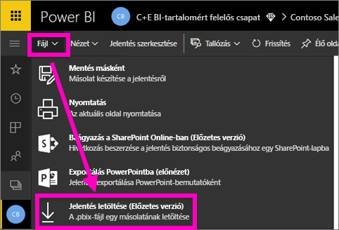
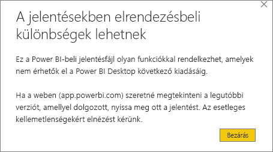
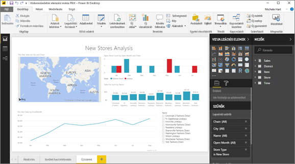

# Jelentés letöltése a Power BI szolgáltatásból Power BI Desktop-fájlba (Előzetes verzió)
A Power BI Desktopban közzétehet egy jelentést ( *.pbix*-fájlt) a helyi számítógépről a Power BI szolgáltatásban. A Power BI-jelentések az ellenkező irányban is működnek: Letöltheti őket a Power BI szolgáltatásból a Power BI Desktopba. A Power BI-jelentések kiterjesztése mindkét esetben .pbix.

Néhány korlátozást és szempontot figyelembe kell venni – ezekről a cikk későbbi szakaszában lesz szó.

## Jelentés letöltése .pbix-fájlként

Csak a [Power BI Desktop használatával létrehozott](/learn/modules/publish-share-power-bi/2-publish-reports), 2016. november 23. utáni – és azóta frissített – jelentéseket töltheti le. Ha a jelentést korábban hozták létre, a Power BI szolgáltatás **Jelentés letöltése** menüpontja halványítva jelenik meg.

A .pbix-fájl letöltéséhez kövesse az alábbi lépéseket:

1. A Power BI szolgáltatásban nyissa meg a letölteni kívánt jelentést [Szerkesztési nézetben](https://docs.microsoft.com/power-bi/service-interact-with-a-report-in-editing-view).

2. A felső menüsávon válassza a **Fájl > Jelentés letöltése** lehetőséget.
   
3. A jelentés letöltése közben egy állapotsáv jelzi a folyamat előrehaladását. Amikor a fájl elkészül, a rendszer megkérdezi, hogy hová szeretné menteni a .pbix-fájlt. A fájl alapértelmezett neve megegyezik a jelentés címével.
   
4. Ha még nem tette, [telepítse a Power BI Desktopot](desktop-get-the-desktop.md), majd nyissa meg benne a .pbix-fájlt.
   
    Előfordulhat, hogy amikor megnyitja a jelentést a Power BI Desktopban, figyelmeztető üzenetet kap arról, hogy a Power BI szolgáltatásbeli jelentés egyes funkciói esetleg nem elérhetők a Power BI Desktopban.
   
    

5. A Power BI Desktop és a Power BI szolgáltatás jelentésszerkesztője hasonló.  
   
    

## Megfontolandó szempontok és hibaelhárítás
A .pbix-fájlnak a Power BI szolgáltatásból történő letöltésekor figyelembe kell venni néhány lényeges szempontot és korlátozást.

* A fájl letöltéséhez szerkesztési jogosultsággal kell hozzáférnie a jelentéshez.
* Fontos, hogy a jelentés Power BI Desktoppal legyen létrehozva, és *közzé legyen téve* a Power BI szolgáltatásban, vagy a .pbix-fájl legyen *feltöltve* a szolgáltatásba.
* A jelentéseknek 2016. november 23. után közzétett – vagy azóta frissített – jelentéseknek kell lenniük. A korábban közzétett jelentéseket nem lehet letölteni.
* Ez a funkció nem működik az eredetileg a Power BI szolgáltatással létrehozott jelentésekkel és tartalomcsomagokkal.
* Letöltött fájlok megnyitásához mindig a Power BI Desktop legújabb verzióját használja. A letöltött .pbix-fájlok olykor nem nyílnak meg a Power BI Desktop régebbi verzióiban.
* Ha a rendszergazdája kikapcsolta az adatok letöltésének lehetőségét, akkor ez a funkció nem jelenik meg a Power BI szolgáltatásban.
* Növekményes frissítéssel rendelkező adathalmazt nem lehet .pbix-fájlba letölteni.

## Következő lépések
Tekintse meg a **Guy in a Cube** csatorna erről a funkcióról szóló egyperces videóját:

<iframe width="560" height="315" src="https://www.youtube.com/embed/ymWqU5jiUl0" frameborder="0" allowfullscreen></iframe>

Néhány további cikk is segíthet elsajátítani a Power BI szolgáltatás használatát:

* [Power BI-jelentések](consumer/end-user-reports.md)
* [A Power BI szolgáltatás alapfogalmai tervezők számára](service-basic-concepts.md)

A Power BI Desktop telepítése után a következő cikkek segíthetnek a használatának gyors megkezdésében:

* [Első lépések a Power BI Desktopban](desktop-getting-started.md)

További kérdései vannak? [Kérdezze meg a Power BI közösségét](http://community.powerbi.com/).

