# Excel-munkafüzettől egy lenyűgöző jelentésig a Power BI szolgáltatásban
A főnöke azt szeretné, hogy még ma készítsen el egy kombinált jelentést a tavalyi év értékesítési mutatóiról és az előző kampánnyal kapcsolatos benyomásairól. A legutóbbi adatok azonban különböző külső gyártók rendszerein és a saját laptopján lévő fájlokban találhatók. Korábban több óráig is eltartott egy vizualizáció létrehozása és egy jelentés formázása, ami aggodalommal töltheti el.

Nincs miért aggódnia. A Power BI-jal villámgyorsan létrehozhat egy lenyűgöző jelentést.

Ebben a példában feltöltünk egy Excel-fájlt egy helyi rendszerről, létrehozunk egy új jelentést, és megosztjuk a munkatársakkal – mindezt a Power BI-ban.

## Adatok előkészítése
Vegyünk példaként egy egyszerű Excel-fájlt. 

1. Mielőtt betöltené az Excel-fájlt a Power BI-ba, előbb rendszereznie kell az adatokat egy egyszerű táblában. Egy egyszerű táblában minden oszlopnak azonos adattípusú értékeket, például szöveget, dátumokat, számokat vagy pénznemeket kell tartalmaznia. A táblában egy fejléc sorra is szükség van, ugyanakkor egyetlen sor vagy oszlop sem jeleníthet meg összesített értékeket.

   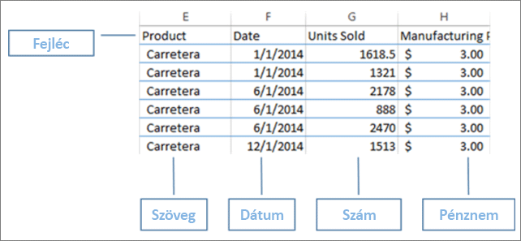

2. Ezután formázza az adatokat táblázatként. Az Excelben a **Kezdőlap** **Stílusok** csoportjában válassza a **Formázás táblázatként** lehetőséget. 

3. Válassza ki a táblázat stílusát, hogy alkalmazza a formázást a munkafüzetén. 

   Az Excel-munkafüzete ekkor már betölthető a Power BI-ba.

   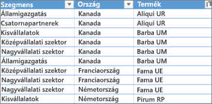

## Excel-fájlok feltöltése a Power BI szolgáltatásba
A Power BI szolgáltatás több adatforráshoz is képes csatlakozni, köztük a számítógépén található Excel-fájlokhoz. 

 > [!NOTE] 
 > Hogy követni tudja az oktatóanyag következő részeiben leírtakat, használja a [pénzügyi mintát tartalmazó munkafüzetet](sample-financial-download.md).

1. Első lépésként jelentkezzen be a Power BI szolgáltatásba. Ha még nem regisztrált, [akkor ezt ingyen megteheti](https://powerbi.com).

2. Érdemes létrehozni egy új irányítópultot. Nyissa meg a **Saját munkaterületet**, majd válassza a **Létrehozás** ikont.

   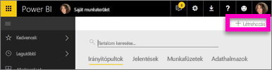

3. Válassza az **Irányítópult** lehetőséget, adjon meg egy nevet, majd válassza a **Létrehozás** gombot. 

   Ekkor megjelenik az új irányítópult, de még nem tartalmaz adatokat.

   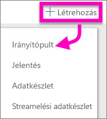

4. A bal oldalon lévő navigációs ablaktáblán válassza az **Adatok lekérése** elemet. 

5. Az **Adatok lekérése** lap **Fájl** mezőjében, az **Új tartalom létrehozása** területen válassza a **Beolvasás** lehetőséget.

   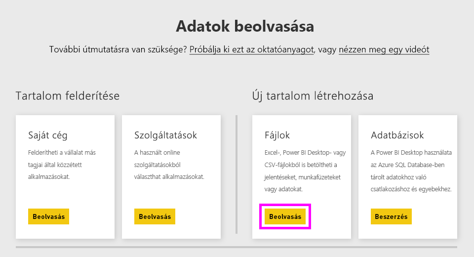

6. A **Fájlok** lapon válassza a **Helyi fájl** lehetőséget. Keresse meg a számítógépén az Excel-munkafüzetet, majd a **Megnyitás** lehetőséggel töltse be a Power BI szolgáltatásba. 

   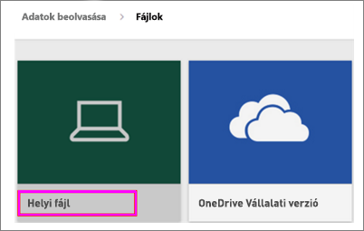

7. A **Helyi fájl** lapon válassza az **Importálás** elemet.

## Jelentés készítése
Miután a Power BI szolgáltatás befejezte az Excel-fájl importálását, nekiláthat a jelentés készítésének. 

1. Amikor megjelenik az **Adatkészlet készen áll** üzenet, válassza az **Adatkészlet megtekintése** lehetőséget.  

   Ekkor a Power BI megnyitja a Szerkesztő nézetet, és megjelenít egy üres jelentésvásznat. A jobb oldalon találhatók a **Vizualizációk**, a **Szűrők** és a **Mezők** paneljei. Az Excel-munkafüzet táblázatadatai a **Mezők** panelen jelennek meg. A Power BI a táblázat neve alatt egyéni mezőkként listázza az oszlopok fejléceit.

   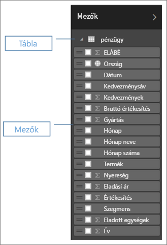

2. Most már nekiláthat a vizualizáció létrehozásának. Tegyük fel, hogy a főnöke szeretné látni a nyereséget az idő függvényében. A **Mezők** panelről húzza a **Profit** (Nyereség) elemet a jelentésvászonra. 

   A Power BI ekkor alapértelmezés szerint egy oszlopdiagramot jelenít meg. 

3. Húzza a **Date** (Dátum) elemet a jelentésvászonra. 

   A Power BI frissíti az oszlopdiagramot, és a nyereséget dátum szerint jeleníti meg.

   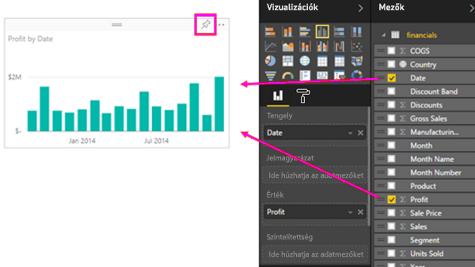

   > [!TIP]
   > Ha a diagramja nem úgy néz ki, mint ahogy gondolta, ellenőrizze az összesítéseit. Például az **Érték** gyűjtőben kattintson a jobb gombbal az imént hozzáadott mezőre, és ellenőrizze, hogy az adatok összesítése úgy történik-e, ahogyan Ön szeretné. Ebben a példában az **Összeg** lehetőséget használjuk.
   > 

A főnöke tudni szeretné, hogy melyek a leginkább nyereséges országok. Nyűgözze le egy térkép-vizualizációval. 

1. Jelöljön ki egy üres területet a jelentésvásznon. 

2. A **Mezők** panelről húzza a **Country** (Ország) és a **Profit** mezőt a jelentésvászonra.

   A Power BI ekkor létrehoz egy térkép-vizualizációt, amelyen buborékok jelölik az egyes helyek relatív nyereségét.

   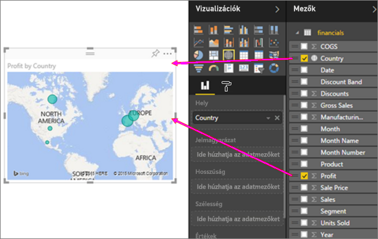

Megjelenítene még egy olyan vizualizációt is, amelyen az értékesítések a termékek és a piaci szegmensek szerint láthatók? Nem nehéz. 

1. A **Mezők** panelen jelölje ki a **Sales** (Értékesítés), **Product** (Termék) és **Segment** (Szegmens) mezőket. 
   
   A Power BI ekkor azonnal létrehoz egy oszlopdiagramot. 

2. A **Vizualizációk** menü egy ikonját kiválasztva módosítsa a diagram típusát. Módosítsa például **Halmozott oszlopdiagram** típusúra. 

3. A diagram rendezéséhez válassza a három pontot (...), majd a **Rendezés szempontja:** elemet.

   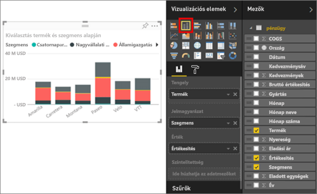

Rögzítse az összes vizualizációt az irányítópulton. Készen áll arra, hogy megossza az irányítópultját a munkatársaival.

   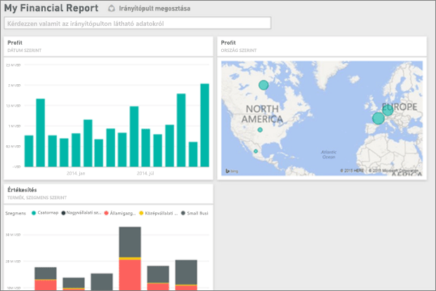

## Irányítópult megosztása
Tegyük fel, hogy meg szeretné osztani az irányítópultját a főnökével. Az irányítópultját és az alapjául szolgáló jelentést megoszthatja bármelyik munkatársával, aki rendelkezik Power BI-fiókkal. Használhatják a jelentéseket, azonban nem tudják menteni a módosításokat.

1. A jelentés megosztásához válassza a **Megosztás** lehetőséget az irányítópult tetején.

   

   A Power BI ekkor megjeleníti az **Irányítópult megosztása** oldalt. 

2. Adja meg a címzettek e-mail-címeit az **E-mail címek-megadása**mezőben, majd adjon hozzá egy üzenetet a lenti mezőben. 

3. Jelölje be az **Irányítópult megosztásának engedélyezése a címzetteknek** lehetőséget, hogy a címzettek megoszthassák másokkal az irányítópultját. Válassza a **Megosztás** gombot.

   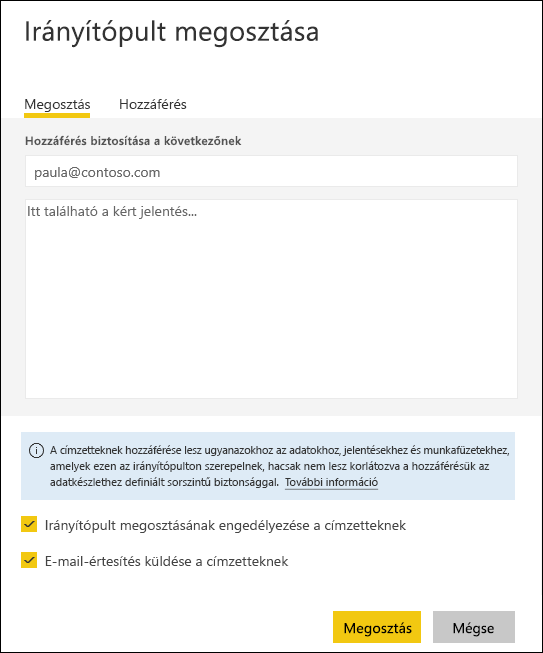

## Következő lépések

* [Első lépések a Power BI szolgáltatással](service-get-started.md)
* [Első lépések a Power BI Desktopban](desktop-getting-started.md)
* [A Power BI szolgáltatás alapfogalmai tervezők számára](service-basic-concepts.md)

További kérdései vannak? [Kérdezze meg a Power BI közösségét](http://community.powerbi.com/).

