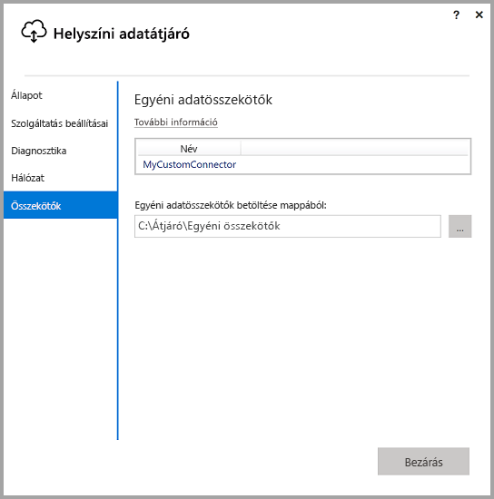
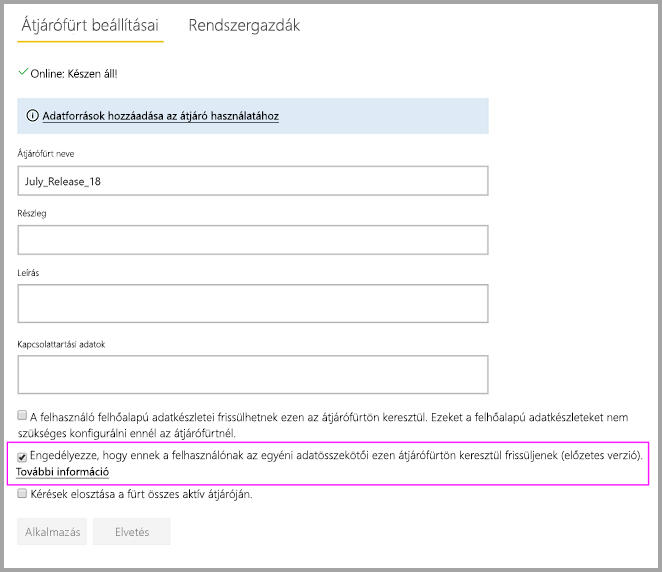
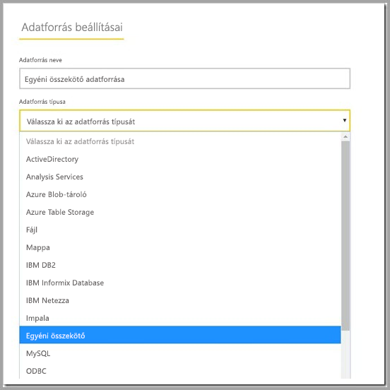

# Egyéni adatösszekötők használata a helyszíni adatátjáróval

[!INCLUDE [gateway-rewrite](includes/gateway-rewrite.md)]

A Power BI-beli adatösszekötők lehetővé teszik az alkalmazásból, szolgáltatásból vagy adatforrásból származó adatokhoz való csatlakozást és hozzáférést. Egyéni adatösszekötőket készíthet, és használhatja azokat a Power BI Desktopban.

Egyéni adatösszekötők Power BI-hoz való fejlesztéséről a [Data Connector SDK GitHub-oldalán](http://aka.ms/dataconnectors) olvashat. Ez a webhely az első lépésekre vonatkozó információkat, valamint a Power BI-hoz és a Power Queryhez készült mintákat tartalmazza.

Ha egyéni adatösszekötőket használó jelentéseket készít a Power BI Desktopban, akkor azokat a helyszíni adatátjáró használatával frissítheti a Power BI szolgáltatásból.

## A képesség engedélyezése és használata

A helyszíni adatátjáró 2018. júliusi vagy újabb verziójának telepítése során egy **Összekötők** lapot talál a helyszíni adatátjáró alkalmazásban. Itt megadhat egy mappát, amelyből az egyéni összekötők be lesznek töltve. Mindenképpen olyan mappát kell választania, amelyhez az átjárószolgáltatást futtató felhasználó (alapértelmezés szerint *NT SERVICE\PBIEgwService*) hozzáférhet. Az átjáró automatikusan betölti az ebben a mappában lévő összekötőfájlokat, és azok megjelennek az adatösszekötők listájában.

Ha a (privát) helyszíni adatátjárót használja, akkor fel tudja tölteni Power BI-jelentését a Power BI szolgáltatásba, és frissítheti azt az átjáró használatával.

A helyszíni adatátjáró esetén az egyéni összekötőhöz még létre kell hozni egy adatforrást. A Power BI szolgáltatás Átjáróbeállítások oldalán az átjárófürt kijelölésekor meg kell jelennie egy új lehetőségnek, amellyel engedélyezheti egyéni összekötők használatát a fürthöz. Ez a beállítás csak akkor lesz elérhető, ha a fürthöz tartozó összes átjáró rendelkezik a 2018. júliusi vagy annál újabb frissítéssel. A lehetőség bejelölésével engedélyezi az egyéni összekötők használatát a fürthöz.

Ha ezt a beállítást engedélyezte, akkor egyéni összekötői megjelennek az átjárófürt alatt létrehozható adatforrásként. Miután létrehoz egy adatforrást az új egyéni összekötővel, már használhatja ezt az egyéni összekötőt a Power BI szolgáltatásban a Power BI-jelentések frissítésére.

## Megfontolandó szempontok és korlátozások

* Gondoskodjon arról, hogy háttérbeli átjárószolgáltatás hozzáférjen a létrehozott mappához. A felhasználók Windows-mappáin belüli mappák és a rendszermappák általában nem lesznek hozzáférhetők. A helyszíni adatátjáró alkalmazás üzenetet jelenít meg, ha a mappa nem érhető el (az átjáró személyes verziójára ez nem vonatkozik)
* Ahhoz, hogy egy egyéni összekötő működjön a helyszíni adatátjáróval, a kódjában lennie kell egy „TestConnection” szakasznak. Ez nem szükséges akkor, ha az egyéni összekötő a Power BI Desktoppal van használva. Éppen ezért létezhet olyan, amely a Desktoppal működik, az átjáróval viszont nem. A TestConnection szakasz megírásáról [ebből a dokumentációból](https://github.com/Microsoft/DataConnectors/blob/master/docs/m-extensions.md#implementing-testconnection-for-gateway-support) tájékozódhat.

## Következő lépések

* [Adatforrások kezelése – Analysis Services](service-gateway-enterprise-manage-ssas.md)  
* [Az adatforrás kezelése – SAP HANA](service-gateway-enterprise-manage-sap.md)  
* [Adatforrások kezelése – SQL Server](service-gateway-enterprise-manage-sql.md)  
* [Adatforrások kezelése – Oracle](service-gateway-onprem-manage-oracle.md)  
* [Az adatforrás kezelés – Importálás/Ütemezett frissítés](service-gateway-enterprise-manage-scheduled-refresh.md)  

* [Helyszíni adatátjáró proxybeállításainak konfigurálása](/data-integration/gateway/service-gateway-proxy)  
* [Kerberos használata egyszeri bejelentkezéshez (SSO) a Power BI-ból a helyszíni adatforrásokhoz](service-gateway-sso-kerberos.md)  

További kérdései vannak? [Kérdezze meg a Power BI közösségét](http://community.powerbi.com/)
