# Adatforrások kezelése

[!INCLUDE [gateway-rewrite](includes/gateway-rewrite.md)]

A Power BI sokféle [helyszíni adatforrást](power-bi-data-sources.md) támogat, és ezek mindegyikéhez saját követelmények tartoznak. Egy átjáró használható egyetlen adatforráshoz vagy több adatforráshoz. Az itt tárgyalt példában adatforrásként SQL Server hozzáadását mutatjuk be. A lépések más adatforrások esetén is hasonlók.

Az adatforrás-kezelési műveletek többsége API-k használatával is végrehajtható. További információ: [REST API-k (Átjárók)](/rest/api/power-bi/gateways).

## Adatforrások felvétele

1. Válassza a Power BI szolgáltatás jobb felső sarkában lévő fogaskerék ikont  > **Átjárók kezelése**.

    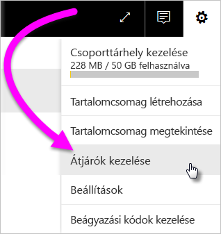

2. Válasszon ki egy átjárót, majd válassza az **Adatforrás hozzáadása** lehetőséget. Másik lehetőségként lépjen az **Átjárók** > **Adatforrás hozzáadása** területre.

    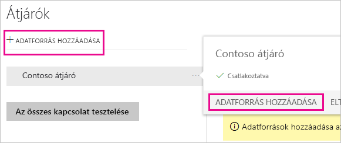

3. Válassza ki az **Adatforrás típusát**.

    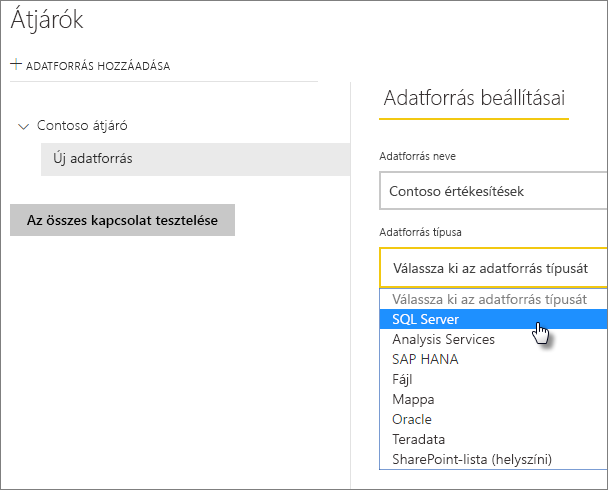

4. Adja meg az adatforrás adatait. Itt adható meg például a **Kiszolgáló**, az **Adatbázis** és több más információ is. 

    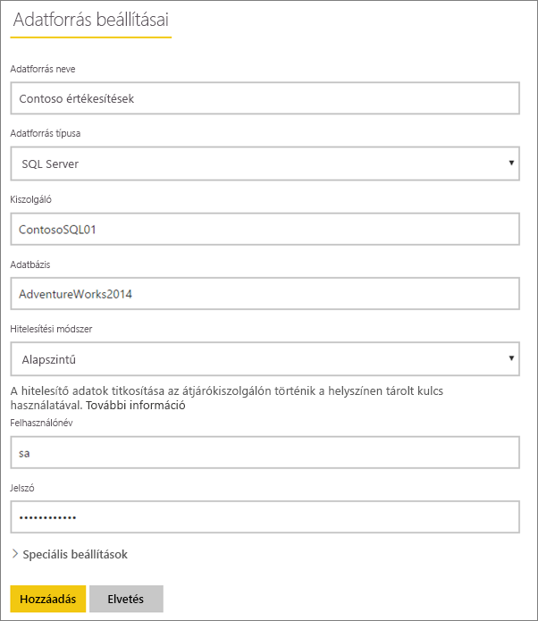

5. Az SQL Serverhez a **Windows** vagy az **Alapszintű** (SQL-hitelesítés) **Hitelesítési módszer** választható. Ha az **Alapszintűt** választja, akkor meg kell adnia az adatforrás eléréséhez szükséges hitelesítő adatokat.

6. A **Speciális beállítások** alatt beállíthatja az adatforráshoz alkalmazandó [adatvédelmi szintet](https://support.office.com/article/Privacy-levels-Power-Query-CC3EDE4D-359E-4B28-BC72-9BEE7900B540) (a [DirectQuery](desktop-directquery-about.md)-re nem érvényes).

    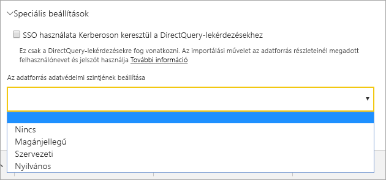

7. Válassza a **Hozzáadás** elemet. Ha a folyamat sikerrel zárult, megjelenik a *Sikeres csatlakozás* üzenet.

    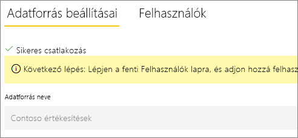

Most már használhatja az adatforrást, hogy az SQL Server adatait felhasználja Power BI-irányítópultjain és -jelentéseiben.

## Adatforrás eltávolítása

A már nem használt adatforrást el is távolíthatja. Egy adatforrás eltávolítása után az arra épülő irányítópultok és jelentések nem működnek megfelelően.

Az eltávolításához lépjen az adatforráshoz, és válassza az **Eltávolítás** lehetőséget.

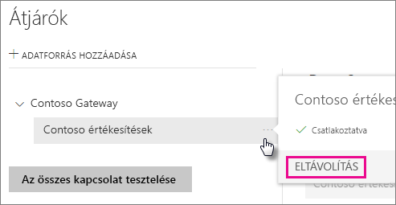

## Az adatforrás használata ütemezett frissítéshez vagy DirectQueryhez

Miután létrehozta az adatforrást, használhatja azt DirectQuery-kapcsolatokkal vagy ütemezett frissítéssel is.

> [!NOTE]
>A kiszolgáló és az adatbázis nevének egyeznie kell a Power BI Desktopban és az adatforrásban a helyszíni adatátjárón belül.

Az adathalmaz és az adatforrás közötti kapcsolat az átjáróban a kiszolgáló nevén és az adatbázis nevén alapul. A neveknek egyezniük kell. Ha például egy IP-címet ad meg a kiszolgáló nevének a Power BI Desktopban, ezt az IP-címet kell használnia az adatforráshoz az átjáró konfigurációjában. Ha a Power BI Desktopban a *KISZOLGÁLÓ\PÉLDÁNY* formát használta, az átjáró konfigurációjában is ezt kell megadnia az adatforráshoz.

Ha szerepel az átjárón belül konfigurált adatforrás **Felhasználók** lapján, és a kiszolgáló és az adatbázis neve egyezik, az átjáró megjelenik lehetőségként az ütemezett frissítésnél.

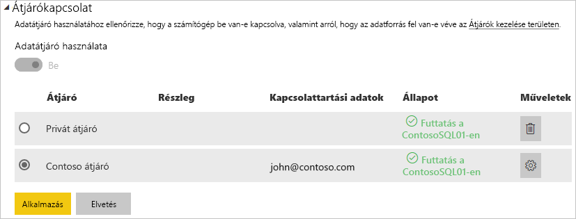

> [!WARNING]
> Ha az adathalmaz több adatforrást tartalmaz, az egyes adatforrásokat hozzá kell adni az átjáróban. Ha egy vagy több adatforrást nem ad hozzá az átjáróhoz, az átjáró nem lesz elérhető ütemezett frissítésre.

### Korlátozások

Az OAuth csak egyéni összekötőkhöz támogatott hitelesítési séma a helyszíni adatátjáróval. Nem vehet fel további olyan adatforrásokat, amelyekhez OAuth szükséges. Ha az adathalmaz egy adatforrásához OAuth szükséges, és ez az adatforrás nem egyéni összekötő, nem fogja tudni ütemezett frissítéshez használni az átjárót.

## Felhasználók kezelése

Miután hozzáadott egy adatforrást az átjáróhoz, felhasználóknak és levelezési biztonsági csoportoknak adhat hozzáférést az adott adatforráshoz (nem a teljes átjáróhoz). Az adatforrás felhasználóinak listája csak azt szabja meg, hogy ki tehet közzé az adatforrásból származó adatokat tartalmazó jelentést. A jelentéstulajdonosok létrehozhatnak irányítópultokat, tartalomcsomagokat és alkalmazásokat, és megoszthatják azokat más felhasználókkal.

Felhasználóknak és biztonsági csoportoknak rendszergazdai hozzáférést is adhat az átjáróhoz.

### Felhasználók hozzáadása adatforráshoz

1. Válassza a Power BI szolgáltatás jobb felső sarkában lévő fogaskerék ikont  > **Átjárók kezelése**.

2. Jelölje ki az adatforrást, amelyhez felhasználókat kíván adni.

3. Válassza a **Felhasználók** lehetőséget, majd adjon meg egy vállalati felhasználót, akinek hozzáférést kíván adni a kijelölt adatforráshoz. A következő ábrán például Maggie és Adam van hozzáadva.

    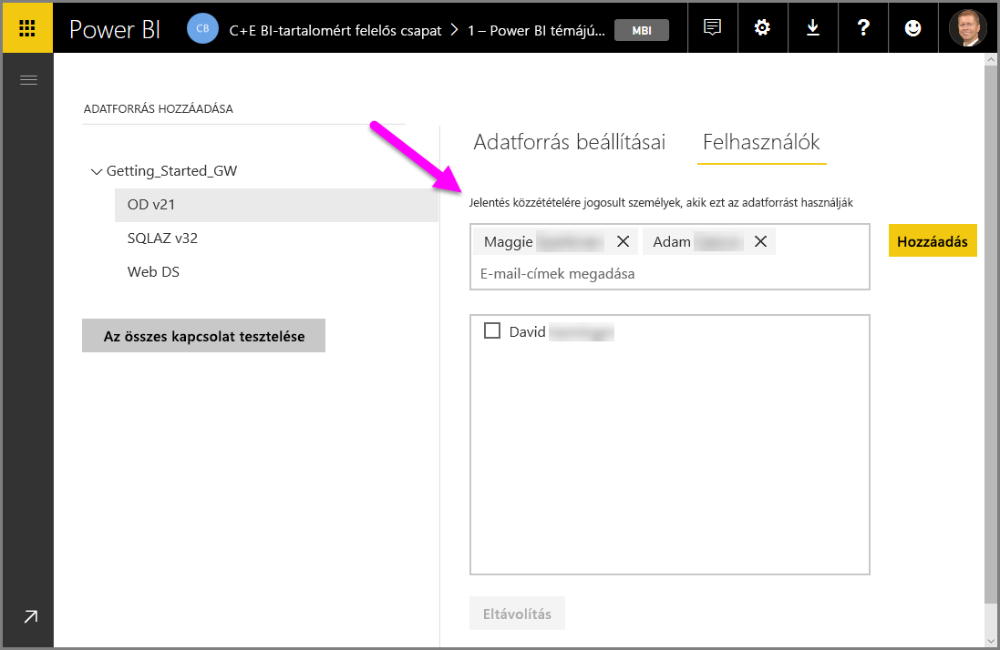

4. Válassza a **Hozzáadás** lehetőséget, és az új tag neve megjelenik az ablakban.

    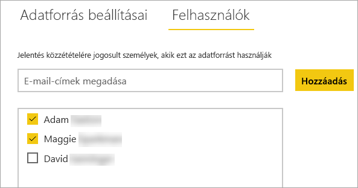

Ne feledje, hogy a felhasználókat minden adatforráshoz hozzá kell adnia, amelyhez hozzáférést kíván adni nekik. Minden adatforrás külön felhasználói listával rendelkezik. A felhasználókat külön adja hozzá az egyes adatforrásokhoz.

### Felhasználók eltávolítása egy adatforrásból

Az adatforráshoz tartozó **Felhasználók** lapon eltávolíthat az adatforrás használatára jogosult felhasználókat vagy biztonsági csoportokat.

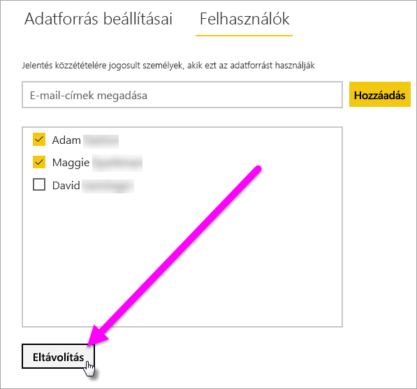

## Titkosított hitelesítő adatok felhőbeli tárolása

Amikor hozzáad egy adatforrást az átjáróhoz, meg kell adnia az adatforrás hitelesítő adatait. Az adatforrás felé irányuló összes lekérdezés ezen hitelesítő adatok segítségével fut. A hitelesítő adatok titkosítása biztonságos. Ez szimmetrikus titkosítással, még a felhőbe kerülésük előtt megtörténik, így az adatokat a felhőben nem lehet visszafejteni. Amikor az adatforráshoz hozzáférnek, a hitelesítő adatok visszafejtését a helyszíni átjárót futtató számítógép végzi.

## Elérhető adatforrástípusok listája

Tudnivalók a helyszíni adatátjáró által támogatott adatforrásokról: [Power BI-adatforrások](power-bi-data-sources.md).

## Következő lépések

* [Adatforrások kezelése – Analysis Services](service-gateway-enterprise-manage-ssas.md)
* [Az adatforrás kezelése – SAP HANA](service-gateway-enterprise-manage-sap.md)
* [Adatforrások kezelése – SQL Server](service-gateway-enterprise-manage-sql.md)
* [Adatforrások kezelése – Oracle](service-gateway-onprem-manage-oracle.md)
* [Adatforrások kezelése – Importálás/ütemezett frissítés](service-gateway-enterprise-manage-scheduled-refresh.md)
* [Útmutató adatátjáró üzembe helyezéséhez](service-gateway-deployment-guidance.md)

További kérdései vannak? Kérdezze meg [a Power BI közösségét](https://community.powerbi.com/).
