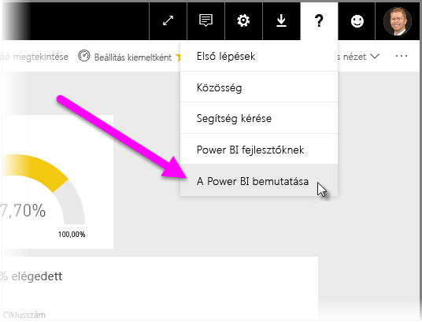

# Útmutató adatátjáró üzembe helyezéséhez a Power BI számára

[!INCLUDE [gateway-rewrite](includes/gateway-rewrite.md)]

A cikk útmutatást nyújt a Power BI-hoz használható adatátjáró hálózati környezetben történő telepítéséhez, és ismerteti a telepítés szempontjait.

A helyszíni adatátjáró letöltéséről, telepítéséről, konfigurálásáról és kezeléséről a [Mi az a helyszíni adatátjáró](/data-integration/gateway/service-gateway-onprem) című cikkben olvashat részletesen. A helyszíni adatátjáróról és a Power BI-ról további információt talál a [Microsoft blogján](https://powerbi.microsoft.com/blog/) és a [Microsoft Power BI-közösség](https://community.powerbi.com/) webhelyén is.

## A helyszíni átjáró telepítésének szempontjai

Mielőtt telepítené a helyszíni adatátjárót a Power BI felhőszolgáltatáshoz, néhány szempontot figyelembe kell vennie. A következő szakaszok ezeket a szempontokat ismertetik.

### Felhasználók száma

Az átjárót használó jelentéssel dolgozó felhasználók száma lényeges metrika az átjáró telepítési helyéről hozott döntéshez. Néhány szempont, amelyet érdemes figyelembe venni:

* A felhasználók eltérő napszakokban használják ezeket a jelentéseket?
* Milyen típusú kapcsolatot használnak (DirectQueryt vagy importálást)?
* Minden felhasználó ugyanazt a jelentést használja?

Ha az összes felhasználó ugyanabban a napszakban fér hozzá egy adott jelentéshez, akkor az átjárót olyan gépre kell telepíteni, amely képes kiszolgálni ezeket a kéréseket. A következő szakaszokban azokról a teljesítményszámlálókról és minimális követelményekről olvashat, amelyek alapján eldöntheti, hogy egy gép megfelelő-e.

A Power BI-ban érvényes korlátozás *jelentésenként* csak *egy* átjáró használatát teszi lehetővé. Akkor is minden adatforrásnak ugyanazon az átjárón kell áthaladnia, ha a jelentés több adatforráson alapul. Ha egy jelentés *több* jelentésre épül, akkor minden ahhoz tartozó jelentéshez dedikált átjárót használhat. Így megosztja az egyetlen irányítópulthoz tartozó több jelentés által az átjáróra rótt terhelést.

### Kapcsolat típusa

A Power BI-ban kétféle kapcsolattípus áll rendelkezésre: A DirectQuery és az Importálás. Nem minden adatforrás támogatja mindkét kapcsolattípust. Számos tényező befolyásolhatja a választást, például a biztonsági követelmények, a teljesítmény, az adatkorlátok és az adatmodellek mérete. A kapcsolattípusokról és a támogatott adatforrásokról bővebben az [elérhető adatforrástípusok listájában](service-gateway-data-sources.md#list-of-available-data-source-types) olvashat.

A használt kapcsolat típusától függően az átjáróhasználat mértéke eltérő lehet. Törekedjen például a DirectQuery-adatforrások és az ütemezetten frissített adatforrások elkülönítésére, ha csak lehetséges. Feltételezhető, hogy ezek külön jelentésben vannak, és különválaszthatók. A források elkülönítésével megakadályozható, hogy DirectQuery-kérelmek ezreinek kelljen várni sorukra az átjárónál addig, amíg a cég fő irányítópultjához használt nagy méretű adatmodell reggeli ütemezett frissítése történik. 

Az egyes kapcsolattípusoknál az alábbiakat érdemes figyelembe venni:

* **Ütemezett frissítés**: A lekérdezések mérete és a napi frissítések száma alapján eldöntheti, hogy elég a javasolt minimális hardverkövetelményeknek megfelelő számítógépet használni, vagy nagyobb teljesítményű számítógépre lesz szüksége. Ha az adott lekérdezés nem kiszolgáló oldali transzformációkból áll, akkor a transzformációkat az átjáró fogja végezni. Ennek eredményeként az átjáró számítógépén több memória áll rendelkezésre.

* **DirectQuery**: A rendszer lekérdezést küld minden esetben, amikor egy felhasználó megnyitja a jelentést, vagy adatokat tekint meg. Ezért, ha várhatóan több mint 1000 felhasználó fog egyidejűleg hozzáférni az adatokhoz, gondoskodjon arról, hogy a számítógép kellőképp robusztus és hatékony hardverrel rendelkezzen. DirectQuery-kapcsolat esetén több processzormag nagyobb teljesítményt eredményez.

Arról, hogy milyen követelmények vonatkoznak arra a gépre, amelyen a telepítést végzi, a helyszíni adatátjáró [telepítési követelményeiben](/data-integration/gateway/service-gateway-install#requirements) olvashat.

### Hely

Az átjáró földrajzi helyzete jelentős hatással lehet a lekérdezési teljesítményre. A hálózati késés csökkentése érdekében lehetőség szerint gondoskodjon róla, hogy az átjáró, az adatforrások és a Power BI-bérlő földrajzilag a lehető legközelebb helyezkedjenek el egymáshoz. A Power BI-bérlő földrajzi helyzetének meghatározásához a Power BI szolgáltatásban válassza a **?** ikont a jobb felső sarokban. Ez után válassza **A Power BI névjegye** lehetőséget.

Ha a Power BI-átjárót az Azure Analysis Services szolgáltatással együtt használja, ügyeljen rá, hogy a kettő adatrégiója megegyezzen. [Ebben a videóban](https://guyinacube.com/2018/01/power-bi-azure-analysis-services-gateway-data-region/) bővebb információt talál arról, hogyan lehet adatrégiókat beállítani több szolgáltatáshoz.

## Következő lépések

* [Proxybeállítások konfigurálása](/data-integration/gateway/service-gateway-proxy)  
* [Átjárók hibaelhárítása – Power BI](service-gateway-onprem-tshoot.md)  
* [Helyszíni adatátjáró – GYIK – Power BI](service-gateway-power-bi-faq.md)  

További kérdései vannak? Kérdezze meg [a Power BI közösségét](http://community.powerbi.com/).

