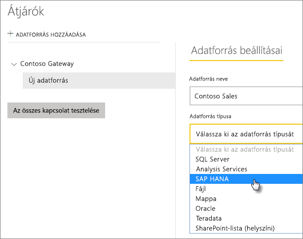
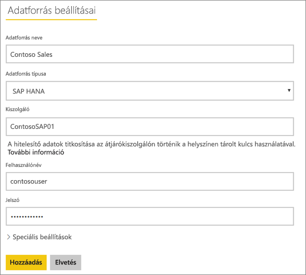
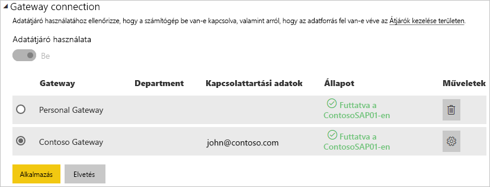

# Az adatforrás kezelése – SAP HANA

[!INCLUDE [gateway-rewrite](includes/gateway-rewrite.md)]

Amint [telepítette a helyszíni adatátjárót](/data-integration/gateway/service-gateway-install), [fel kell vennie az átjáróval használható adatforrásokat](service-gateway-data-sources.md#add-a-data-source). Ez a cikk bemutatja, hogyan lehet használni az átjárókat és az SAP HANA-adatforrásokat akár ütemezett frissítéshez, akár a DirectQueryhez.

## Adatforrások felvétele

Az [Adatforrás hozzáadása](service-gateway-data-sources.md#add-a-data-source) című témakörben további információt talál adatforrások hozzáadásáról. Az **Adatforrás típusaként** válassza az SAP HANA-t.

Miután kiválasztotta az SAP HANA-t adatforrásként, ki kell töltenie az adatforrás adatainál a **Kiszolgálót**, a **Felhasználónevet** és a **Jelszót**.

> [!NOTE]
> Az adatforrás felé irányuló összes lekérdezés ezen hitelesítő adatok segítségével fut. A [Titkosított hitelesítő adatok tárolása a felhőben](service-gateway-data-sources.md#store-encrypted-credentials-in-the-cloud) című témakörben további információt talál a hitelesítő adatok tárolásáról.

Miután minden információt megadott, válassza a **Hozzáadás** lehetőséget. Az adatforrás ettől kezdve használható ütemezett frissítéshez vagy DirectQuery-lekérdezéshez egy helyszíni SQL Server-kiszolgálón. Ha sikerrel járt, megjelenik a *Sikeres csatlakozás* üzenet.

### Speciális beállítások

Ha szeretné, konfigurálhatja az adatforrás adatvédelmi szintjét is. Ez vezérli, hogy hogyan lesznek egyesítve az adatok. Ez csak ütemezett frissítéshez használható. Mindez nem érvényes a DirectQueryre. Az adatforrás adatvédelmi szintjeiről az [Adatvédelmi szintek (Power Query)](https://support.office.com/article/Privacy-levels-Power-Query-CC3EDE4D-359E-4B28-BC72-9BEE7900B540) című témakörben olvashat részletesebben.

## Az adatforrás használata

Miután létrehozta az adatforrást, használhatja azt DirectQuery-kapcsolatokkal vagy ütemezett frissítéssel is.

> [!NOTE]
> A kiszolgáló és az adatbázis nevének egyeznie kell a Power BI Desktopban és az adatforrásban a helyszíni adatátjárón belül.

Az adatkészlet és az adatforrás közötti kapcsolat az átjárón belül a kiszolgáló nevén és az adatbázis nevén alapul. Ezeknek egyezniük kell. Ha például egy IP-címet ad meg a kiszolgáló nevének, a Power BI Desktopban azt az IP-címet kell használnia az adatforráshoz az átjáró konfigurációján belül. Ha a *SERVER\INSTANCE* nevet használja, a Power BI Desktopban ugyanezt kell használnia az átjáróhoz konfigurált adatforráson belül.

Ez a DirectQuery és az ütemezett frissítések esetén is igaz.

### Az adatforrás használata DirectQuery-kapcsolatokkal

Fontos, hogy a kiszolgáló és az adatbázis neve megegyezzen a Power BI Desktop és az átjáró számára konfigurált adatforrás között. Arra is ügyelnie kell, hogy a felhasználó szerepeljen az adatforrás **Felhasználók** lapján, ha DirectQuery-adatkészleteket szeretne közzétenni. A DirectQuery-hez történő kijelölésre a Power BI Desktopban az első adatimportáláskor kerül sor. A DirectQueryről további információt talál [A DirectQuery használata a Power BI-ban](desktop-use-directquery.md) című cikkben.

Miután elvégezte a közzétételt a Power BI Desktopból vagy az **Adatok lekérése** területről, el kell kezdeni működniük a jelentéseknek. Az átjárón belüli adatforrás létrehozása után több percbe telhet, amíg a kapcsolat használhatóvá válik.

### Az adatforrás használata ütemezett frissítéssel

Ha szerepel az átjárón belül konfigurált adatforrás **Felhasználók** lapján, és a kiszolgáló és az adatbázis neve egyezik, az átjáró megjelenik lehetőségként az ütemezett frissítésnél.

## Következő lépések

* [A helyszíni adatátjáró hibaelhárítása](/data-integration/gateway/service-gateway-tshoot)
* [Átjárók hibaelhárítása – Power BI](service-gateway-onprem-tshoot.md)  

További kérdései vannak? [Kérdezze meg a Power BI közösségét](http://community.powerbi.com/)

