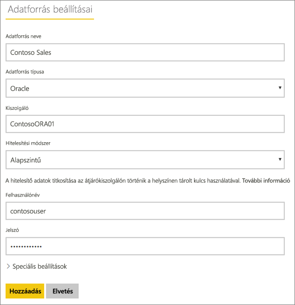
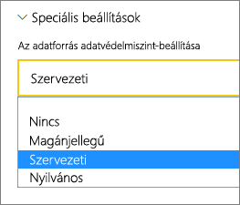
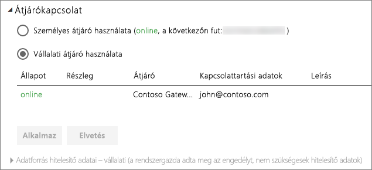

# Az adatforrás kezelése – Importálás/Ütemezett frissítés

[!INCLUDE [gateway-rewrite](includes/gateway-rewrite.md)]

Ha már [telepítette a helyszíni adatátjárót](/data-integration/gateway/service-gateway-install), az átjáróval használható [adatforrásokat is hozzá kell adnia](service-gateway-data-sources.md#add-a-data-source). Ez a cikk bemutatja, hogyan lehet használni az ütemezett frissítéshez használt átjárókat és az adatforrásokat a DirectQuery vagy az élő kapcsolatok helyett.

## Adatforrások felvétele

Az [Adatforrás hozzáadása](service-gateway-data-sources.md#add-a-data-source) című témakörben további információt talál adatforrások hozzáadásáról.

Az összes felsorolt adatforrástípus használható ütemezett frissítéshez a helyszíni átjáróval. Az Analysis Services, az SQL Server és az SAP HANA használható ütemezett frissítéshez vagy DirectQuery/élő kapcsolatokhoz is.

Ekkor kell megadni az információkat az adatforráshoz. Ebbe beletartoznak a forrásra vonatkozó információk és az adatforrás eléréséhez használt hitelesítő adatok.

> [!NOTE]
> Az adatforrás felé irányuló összes lekérdezés ezen hitelesítő adatok segítségével fut. A [Titkosított hitelesítő adatok tárolása a felhőben](service-gateway-data-sources.md#storing-encrypted-credentials-in-the-cloud) című témakörben további információt talál a hitelesítő adatok tárolásáról.

Az [Elérhető adatforrástípusok listájában](service-gateway-data-sources.md#list-of-available-data-source-types) megtalálja azokat az adatforrástípusokat, amelyek használhatók az ütemezett frissítéssel.

Miután minden információt megadott, válassza a **Hozzáadás** lehetőséget. Mostantól használhatja ezt az adatforrást ütemezett frissítéshez a helyszíni adataival. Ha sikerrel járt, megjelenik a *Sikeres csatlakozás* üzenet.

### Speciális beállítások

Ha szeretné, konfigurálhatja az adatforrás adatvédelmi szintjét is. Ez vezérli, hogy hogyan lesznek egyesítve az adatok. Ez csak ütemezett frissítéshez használható. Az adatforrás adatvédelmi szintjeiről az [Adatvédelmi szintek (Power Query)](https://support.office.com/article/Privacy-levels-Power-Query-CC3EDE4D-359E-4B28-BC72-9BEE7900B540) című témakörben olvashat részletesebben.

## Az adatforrás használata ütemezett frissítéshez

Miután létrehozta az adatforrást, használhatja azt DirectQuery-kapcsolatokkal vagy ütemezett frissítéssel is.

> [!NOTE]
> A kiszolgáló és az adatbázis nevének egyeznie kell a Power BI Desktopban és az adatforrásban a helyszíni adatátjárón belül.

Az adatkészlet és az adatforrás közötti kapcsolat az átjárón belül a kiszolgáló nevén és az adatbázis nevén alapul. Ezeknek egyezniük kell. Ha például egy IP-címet ad meg a kiszolgáló nevének, a Power BI Desktopban azt az IP-címet kell használnia az adatforráshoz az átjáró konfigurációján belül. Ha a *SERVER\INSTANCE* nevet használja, a Power BI Desktopban ugyanezt kell használnia az átjáróhoz konfigurált adatforráson belül.

Ha szerepel az átjárón belül konfigurált adatforrás **Felhasználók** lapján, és a kiszolgáló és az adatbázis neve egyezik, az átjáró megjelenik lehetőségként az ütemezett frissítésnél.

> [!WARNING]
> Ha az adatkészlet több adatforrást tartalmaz, az egyes adatforrásokat hozzá kell adni az átjárón belül. Ha egy vagy több adatforrást nem ad hozzá az átjáróhoz, az átjáró nem lesz elérhető ütemezett frissítésre.

## Korlátozások

Az OAuth nem támogatott hitelesítési séma a helyszíni adatátjáróval. Nem vehet fel olyan adatforrásokat, amelyekhez OAuth szükséges. Ha az adatkészlet egy adatforrásához OAuth szükséges, nem fogja tudni ütemezett frissítéshez használni az átjárót.

## Következő lépések

* [A helyszíni adatátjáró hibaelhárítása](/data-integration/gateway/service-gateway-tshoot)
* [Átjárók hibaelhárítása – Power BI](service-gateway-onprem-tshoot.md)

További kérdései vannak? [Kérdezze meg a Power BI közösségét](http://community.powerbi.com/)
