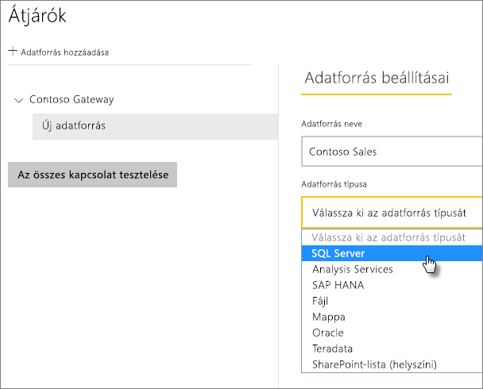
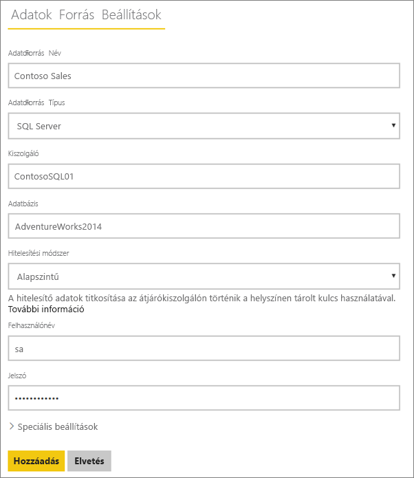
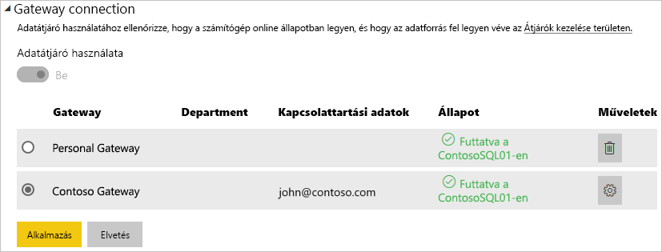

# Adatforrások kezelése – SQL Server

[!INCLUDE [gateway-rewrite](includes/gateway-rewrite.md)]

Miután [telepítette a helyszíni adatátjárót](/data-integration/gateway/service-gateway-install), az átjáróval használható [adatforrásokat](service-gateway-data-sources.md#add-a-data-source) vehet fel. Ez a cikk bemutatja, hogyan lehet használni az átjárókat és az SQL Server-adatforrásokat akár ütemezett frissítéshez, akár a DirectQueryhez.

## Adatforrás hozzáadása

Az [Adatforrás hozzáadása](service-gateway-data-sources.md#add-a-data-source) című témakörben további információt talál adatforrások hozzáadásáról. Az **Adatforrás típusa** területen válassza az **SQL Server** lehetőséget.

> [!NOTE]
> DirectQuery használatakor az átjáró csak az **SQL Server 2012 SP1** és későbbi verzióit támogatja.

Ez után adja meg az adatforrás adatait, például a **Kiszolgálót** és az **Adatbázist**. 

A **Hitelesítési módszer** területen választhatja a **Windows** vagy az **Egyszerű** lehetőséget. Az **Egyszerű** lehetőséget akkor válassza, ha Windows-hitelesítés helyett SQL-hitelesítés használatát tervezi. Ez után írja be az adatforráshoz használandó hitelesítő adatokat.

> [!NOTE]
> Az adatforráson minden lekérdezés ezekkel a hitelesítő adatokkal fog futni, hacsak nincs hozzá konfigurálva és engedélyezve a Kerberos használata egyszeri bejelentkezéshez (SSO). Egyszeri bejelentkezés (SSO) használata esetén az importált adatkészletek a tárolt hitelesítő adatokat használják, a DirectQuery-adatkészletek viszont az aktuális Power BI-felhasználó nevében, SSO használatával futtatják a lekérdezéseket. A [Titkosított hitelesítő adatok tárolása a felhőben](service-gateway-data-sources.md#store-encrypted-credentials-in-the-cloud) című témakörben további információt talál a hitelesítő adatok tárolásáról. Elolvashatja [A Kerberos használata a Power BI-ból a helyszíni adatforrásokba történő egyszeri bejelentkezéshez (SSO)](service-gateway-sso-kerberos.md) című cikket is.

Miután mindent kitöltött, válassza a **Hozzáadás** lehetőséget. Az adatforrás ettől kezdve használható ütemezett frissítéshez vagy DirectQuery-lekérdezéshez egy helyszíni SQL Server kiszolgálón. Ha sikerrel járt, megjelenik a *Sikeres csatlakozás* üzenet.

### Speciális beállítások

Ha szeretné, konfigurálhatja az adatforrás adatvédelmi szintjét is. Ez a beállítás vezérli, hogy hogyan lesznek egyesítve az adatok. Ez csak ütemezett frissítéshez használható. Az adatvédelmi szint beállítása nem vonatkozik a DirectQueryre. Az adatforrás adatvédelmi szintjeiről az [Adatvédelmi szintek (Power Query)](https://support.office.com/article/Privacy-levels-Power-Query-CC3EDE4D-359E-4B28-BC72-9BEE7900B540) című témakörben olvashat részletesebben.

## Az adatforrás használata

Miután létrehozta az adatforrást, használhatja azt DirectQuery-kapcsolatokkal vagy ütemezett frissítéssel is.

> [!NOTE]
> A kiszolgáló és az adatbázis nevének egyeznie kell a Power BI Desktopban és az adatforrásban a helyszíni adatátjárón belül.

Az adatkészlet és az adatforrás közötti kapcsolat az átjárón belül a kiszolgáló nevén és az adatbázis nevén alapul. A neveknek egyezniük kell. Ha például egy IP-címet ad meg a kiszolgáló nevének, a Power BI Desktopban azt az IP-címet kell használnia az adatforráshoz az átjáró konfigurációján belül. Ha a Power BI Desktopban a *KISZOLGÁLÓ\PÉLDÁNY* formát használta, az átjáró konfigurációjában ezt kell megadnia az adatforráshoz.

Ez a DirectQuery és az ütemezett frissítések esetén is követelmény.

### Az adatforrás használata DirectQuery-kapcsolatokkal

Fontos, hogy a kiszolgáló és az adatbázisnevek megegyezzenek a Power BI Desktop és az átjáró számára konfigurált adatforrás között. Arra is ügyelnie kell, hogy a felhasználó szerepeljen az adatforrás **Felhasználók** lapján, ha DirectQuery-adathalmazokat szeretne közzétenni. A DirectQuery-hez történő kijelölésre a Power BI Desktopban az első adatimportáláskor kerül sor. A DirectQuery használatáról további információt talál [A DirectQuery használata a Power BI-ban](desktop-use-directquery.md) című cikkben.

Miután elvégezte a közzétételt a Power BI Desktopból vagy az **Adatok lekérése** területről, el kell kezdeni működniük a jelentéseknek. Az átjárón belüli adatforrás létrehozása után több percbe telhet, amíg a kapcsolat használhatóvá válik.

### Az adatforrás használata ütemezett frissítéssel

Ha szerepel az átjárón belül konfigurált adatforrás **Felhasználók** lapján, és a kiszolgáló és az adatbázis neve egyezik, az átjáró megjelenik lehetőségként az ütemezett frissítésnél.

## További lépések

* [Csatlakozás helyszíni adatokhoz az SQL Serverrel](service-gateway-sql-tutorial.md)
* [A helyszíni adatátjáró hibaelhárítása](/data-integration/gateway/service-gateway-tshoot)
* [Átjárók hibaelhárítása – Power BI](service-gateway-onprem-tshoot.md)
* [A Kerberos használata a Power BI-ból a helyszíni adatforrásokba történő egyszeri bejelentkezéshez (SSO)](service-gateway-sso-kerberos.md)

Több kérdése van? Forduljon a [Power BI közösségéhez](https://community.powerbi.com/).

