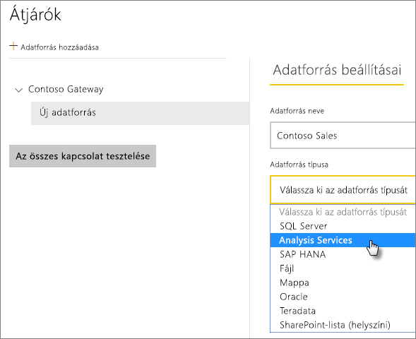
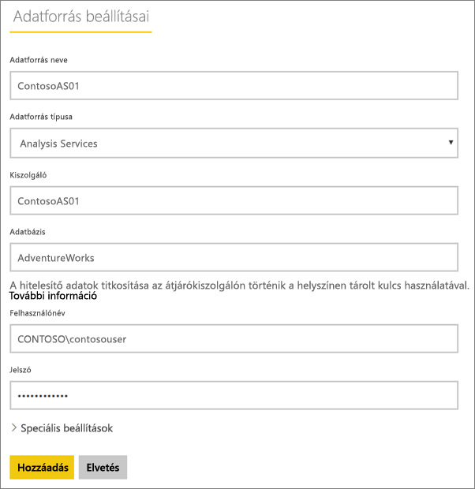
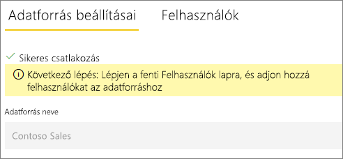
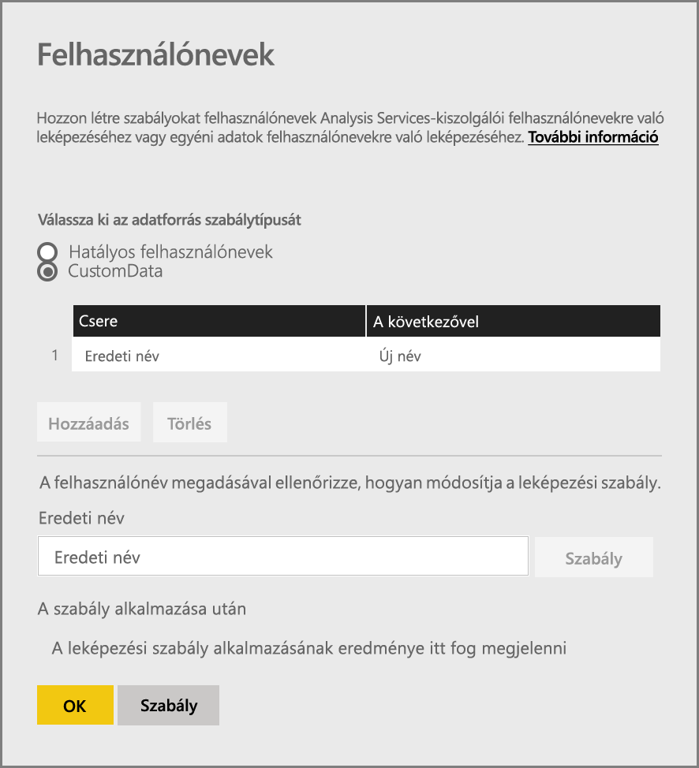
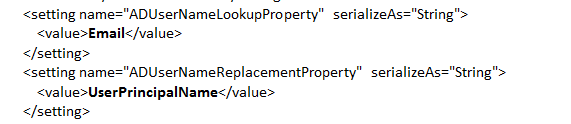
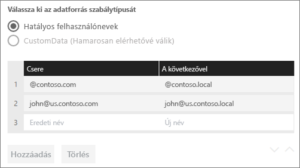
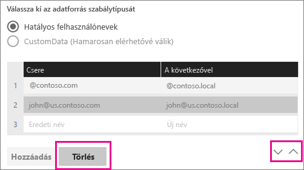
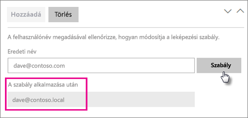
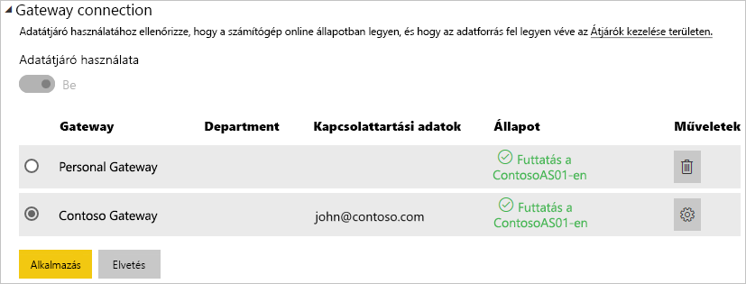

# <a name="manage-your-data-source---analysis-services"></a>Az adatforrás kezelése – Analysis Services

[!INCLUDE [gateway-rewrite](includes/gateway-rewrite.md)]

Miután [telepítette a helyszíni adatátjárót](/data-integration/gateway/service-gateway-install), [fel kell vennie az átjáróval használható adatforrásokat](service-gateway-data-sources.md#add-a-data-source). Ez a cikk bemutatja, hogyan lehet használni az átjárókat és az SQL Server Analysis Services- (SSAS-) adatforrásokat akár ütemezett frissítéshez, akár élő kapcsolatokhoz.

Az Analysis Services-zel való élő kapcsolat beállításáról [ebből a videóból](https://www.youtube.com/watch?v=GPf0YS-Xbyo&feature=youtu.be) tájékozódhat.

> [!NOTE]
> Analysis Services-adatforrás használata esetén a az átjárót olyan számítógépre kell telepítenie, amely az Analysis Services-kiszolgálóval közös erdőbe/tartományba van beléptetve.

## <a name="add-a-data-source"></a>Adatforrás hozzáadása

Az [Adatforrás hozzáadása](service-gateway-data-sources.md#add-a-data-source) című témakörben további információt talál adatforrások hozzáadásáról. Az **Adatforrás típusa** beállításnál válassza az **Analysis Services** lehetőséget, ha többdimenziós vagy táblázatos kiszolgálóhoz csatlakozik.



Adja meg az adatforrás adatait, például a **Kiszolgálót** és az **Adatbázist**. Az átjáró a beírt **Felhasználónévvel** és **Jelszóval** csatlakozik az Analysis Services-példányhoz.

> [!NOTE]
> A megadott Windows-fióknak kiszolgálói rendszergazdai engedélyekkel kell rendelkeznie a példányhoz, amelyhez csatlakozik. Ha a fiók jelszava úgy van beállítva, hogy lejárjon, a felhasználók kapcsolódási kísérletei meghiúsulhatnak, ha nem az adatforrás jelszava nem frissül. A [Titkosított hitelesítő adatok tárolása a felhőben](service-gateway-data-sources.md#store-encrypted-credentials-in-the-cloud) című témakörben további információt talál a hitelesítő adatok tárolásáról.



Miután mindent kitöltött, válassza a **Hozzáadás** lehetőséget. Mostantól használhatja ezt az adatforrást ütemezett frissítésekhez, vagy egy helyszíni Analysis Services-példánnyal kialakított élő kapcsolatokhoz. Ha sikerrel járt, megjelenik a *Sikeres csatlakozás* üzenet.



### <a name="advanced-settings"></a>Speciális beállítások

Ha szeretné, konfigurálhatja az adatforrás adatvédelmi szintjét is. Ez a beállítás vezérli, hogy hogyan lesznek egyesítve az adatok. Ez csak ütemezett frissítéshez használható. Az adatvédelmi szint beállítása nem vonatkozik az élő kapcsolatokra. Az adatforrás adatvédelmi szintjeiről az [Adatvédelmi szintek (Power Query)](https://support.office.com/article/Privacy-levels-Power-Query-CC3EDE4D-359E-4B28-BC72-9BEE7900B540) című témakörben olvashat részletesebben.


## <a name="user-names-with-analysis-services"></a>Az Analysis Services és a felhasználónevek

<iframe width="560" height="315" src="https://www.youtube.com/embed/Qb5EEjkHoLg" frameborder="0" allowfullscreen></iframe>

Amikor egy felhasználó az Analysis Serviceshez csatlakoztatott jelentéssel dolgozik, a rendszer az érvényes felhasználónevet átadja az átjárónak, majd a helyszíni Analysis Services-kiszolgálónak. A Power BI-ba való bejelentkezéshez használt e-mail-címet adja át az Analysis Services-nek érvényes felhasználóként. Ezt a rendszer továbbadja az [EffectiveUserName](https://msdn.microsoft.com/library/dn140245.aspx#bkmk_auth) kapcsolati tulajdonságnak. 

Ennek az e-mail-címnek egyeznie kell a helyi Active Directory-tartományban meghatározott egyszerű felhasználónévvel (UPN). Az UPN az Active Directory-fiókok egy tulajdonsága. A Windows-fióknak ekkor szerepelnie kell egy Analysis Services-szerepkörben. Ha nem található egyezés az Active Directoryban, sikertelen lesz a bejelentkezés. Az Active Directoryval és a felhasználók elnevezésével kapcsolatban a [Felhasználónév-attribútumok](https://msdn.microsoft.com/library/ms677605.aspx) című cikkből tájékozódhat.

[Le is képezheti a Power BI-ban használt bejelentkezési nevet egy helyi címtár UPN-jére](service-gateway-enterprise-manage-ssas.md#map-user-names-for-analysis-services-data-sources).

## <a name="map-user-names-for-analysis-services-data-sources"></a>Felhasználónevek és Analysis Services-adatforrások egymáshoz rendelése

<iframe width="560" height="315" src="https://www.youtube.com/embed/eATPS-c7YRU" frameborder="0" allowfullscreen></iframe>

A Power BI lehetővé teszi a felhasználónevek és az Analysis Services-adatforrások egymáshoz rendelését. Szabályokat konfigurálhat a Power BI-ba bejelentkezett felhasználónevek és az Analysis Services-kapcsolat EffectiveUserName tulajdonságaként átadott nevek egymáshoz rendeléséhez. A felhasználónevek egymáshoz rendelése kitűnő kerülő megoldás amikor a helyi Azure Active Directoryban (Azure AD-ben) nincs az Active Directory-példány felhasználónevével megegyező egyszerű felhasználónév. Ha az e-mail-címe például nancy@contoso.onmicrsoft.com, akkor hozzárendelheti a nancy@contoso.com címet és ez lesz átadva az átjárónak.

Kétféleképpen képezhet le felhasználóneveket az Analysis Services számára:

* Felhasználó manuális újbóli leképezése
* Helyszíni Active Directory-tulajdonságkeresés Azure AD UPN-ek Active Directory-felhasználókra való leképezéséhez (Active Directory keresési leképezés)

Bár a második módszerrel manuális leképezés is végezhető, ez időigényes és nehezen fenntartható. Különösen nehézkes akkor, ha a mintázat megfeleltetése nem elégséges. Például ha az Azure AD-ben és a helyszíni Azure Active Directoryban mások a tartománynevek, vagy ha a felhasználói fiókok nevei mások az Azure AD-ben és az Active Directoryban. Ezért nem ajánljuk, hogy manuális leképezésénél a második megközelítéssel próbálkozzon.

Ezt a két megközelítést a következő két szakaszban ismertetjük részletesen.

### <a name="manual-user-name-remapping"></a>Felhasználónév manuális újbóli leképezése

Az Analysis Services-adatforrásokhoz konfigurálhat UPN-ekre vonatkozó egyéni szabályokat. Az egyéni szabályok segítenek, ha a Power BI szolgáltatás bejelentkezési nevei nem egyeznek a helyi könyvtár UPN-jével. Amikor például a john@contoso.com használatával jelentkezik be a Power BI-be, de a helyi könyvtár UPN-je john@contoso.local, konfigurálhat egy leképezési szabályt, hogy a rendszer a john@contoso.local értéket átadja az Analysis Servicesnek.

Az UPN leképezési képernyőjének megnyitásához kövesse az alábbi lépéseket.

1. Kattintson a fogaskerék ikonra, és válassza az **Átjárók kezelése** lehetőséget.
2. Bontsa ki az Analysis Services-adatforrást tartalmazó átjárót. Ha eddig nem hozta létre az Analysis Services-adatforrást, most megteheti.
3. Válassza ki az adatforrást, majd válassza a **Felhasználók** fület.
4. Válassza a **Felhasználónevek leképezése** lehetőséget.

    

Ekkor megjelennek a szabályok hozzáadásának és adott felhasználó tesztelésének lehetőségei.

> [!NOTE]
> Előfordulhat, hogy véletlenül olyan felhasználót módosít, akit nem szeretett volna. Ha például a **Csere (eredeti érték)** contoso.com, és **A következővel (új név)** @contoso.local, minden, a @contoso.com nevet tartalmazó bejelentkezési adatokkal rendelkező felhasználó @contoso.local névre módosul. Ezenkívül, ha a **Csere (eredeti név)** dave@contoso.com, és **A következővel (új név)** dave@contoso.local, a v-dave@contoso.com nevet tartalmazó bejelentkezési adatokkal rendelkező felhasználók v-dave@contoso.local névre módosulnak.

### <a name="active-directory-lookup-mapping"></a>Active Directory keresési leképezés

Ha helyszíni Active Directory-tulajdonságkeresést szeretne végezni az Azure AD UPN-ek Active Directory-felhasználókra való leképezéséhez, kövesse a jelen szakaszban ismertetett lépéseket. Először tekintsük át, hogyan működik ez a leképezés.

A Power BI szolgáltatásban a következő történik:

* A Power BI Azure AD-felhasználók által egy helyszíni SSAS-kiszolgálóra irányított összes lekérdezés esetén a rendszer egy UPN-sztringet továbbít, például a következőt: firstName.lastName@contoso.com.

> [!NOTE]
> A Power BI-adatforrás konfigurációjában meghatározott összes manuális felhasználói UPN-leképezés továbbra is érvényesül, *mielőtt* a rendszer a felhasználónév sztringjét a helyszíni adatátjáróra küldené.

A konfigurálható egyéni felhasználóleképezéssel rendelkező helyszíni adatátjárón kövesse az alábbi lépéseket.

1. Keresse meg azt az Active Directoryt, amelyben keresnie kell. Ez lehet automatikus vagy konfigurálható.
2. Keresse meg az Active Directory személy attribútumát (például E-mail) a Power BI szolgáltatásban. Az attribútum egy bejövő UPN-sztringen alapul, például: firstName.lastName@contoso.com.
3. Ha az Active Directory-keresés meghiúsul, megkísérli a továbbított UPN-t használni az EffectiveUser értékeként az SSAS-hez.
4. Ha az Active Directory-keresés sikeres, lekéri az Active Directory személy UserPrincipalName nevét.
5. A UserPrincipalName e-mail-címet EffectiveUser értékként adja át az SSAS-nek, például a következőképpen: Alias@corp.on-prem.contoso.

Az átjáró konfigurálása az Active Directory-kereséshez:

1. [Töltse le és telepítse a legújabb átjárót](/data-integration/gateway/service-gateway-install).

2. Az átjáróban módosítsa a helyszíni adatátjárói szolgáltatást, hogy tartományi fiókkal fusson (helyi szolgáltatásfiók helyett). Ellenkező esetben az AD-keresés futásidőben nem fog megfelelően működni. Indítsa el a [helyszíni adatátjáró alkalmazást](/data-integration/gateway/service-gateway-app) a számítógépén, majd nyissa meg a **Szolgáltatásbeállítások** > **Szolgáltatásfiók módosítása** menüpontot. Győződjön meg arról, hogy rendelkezik ezen átjáró helyreállítási kulcsával, mert vissza kell majd állítania ugyanezen a gépen, ha nem szeretne helyette létrehozni új átjárót. A változtatás érvénybe léptetéséhez indítsa újra az átjárószolgáltatást.

3. Lépjen rendszergazdaként az átjáró telepítési mappájához, a *C:\Program Files\Hegyszíni adatátjáró* mappához, hogy írási-olvasási engedélyei legyenek. Nyissa meg a *Microsoft.PowerBI.DataMovement.Pipeline.GatewayCore.dll.config* fájlt.

4. Szerkessze a következő két konfigurációértéket az alapján, hogy *Ön* milyen Active Directory-attribútumkonfigurációkat adott meg az Active Directory-felhasználóihoz. A következő konfigurációs értékek példaként szolgálnak. Adja meg az értékeket az Active Directory-konfiguráció alapján. A konfigurációk megkülönböztetik a kis- és nagybetűket, ezért ügyeljen rá, hogy megegyezzenek az Active Directoryban szereplő értékekkel.

    

    Ha nincs megadva érték az ADServerPath-konfigurációhoz, az átjáró az alapértelmezett globális katalógust használja. Az ADServerPath-konfigurációhoz több értéket is megadhat. Az értékeket pontosvesszővel kell elválasztania egymástól, az alábbi példában látható módon:

    ```xml
    <setting name="ADServerPath" serializeAs="String">
        <value> >GC://serverpath1; GC://serverpath2;GC://serverpath3</value>
    </setting>
    ```

    Az átjáró balról jobbra haladva elemzi az ADServerPath értékeit, amíg egyezést nem talál. Ha itt sincs egyezés, a rendszer az eredeti UPN-t használja. Győződjön meg arról, hogy az átjárószolgáltatást (PBIEgwService) futtató fiók rendelkezik az ADServerPath-konfigurációban megadott összes Active Directory-kiszolgálóra vonatkozó lekérdezési engedéllyel.

    Az átjáró két ADServerPath-típust támogat, ezt a következő példákban tekintheti meg:

    **WinNT**

    ```xml
    <value="WinNT://usa.domain.corp.contoso.com,computer"/>
    ```

    **GC**

    ```xml
    <value> GC://USA.domain.com </value>
    ```

5. A konfiguráció módosításának érvénybe léptetéséhez indítsa újra a helyszíni adatátjáró szolgáltatást.

### <a name="work-with-mapping-rules"></a>Leképezési szabályok használata

Leképezési szabály létrehozásához írja be az **Eredeti név** és az **Új név** értékét, majd válassza a **Hozzáadás** lehetőséget.

| Mező | Description (Leírás) |
| --- | --- |
| Csere (eredeti név) |A Power BI-ba való bejelentkezéshez használt e-mail-cím. |
| A következővel (új név) |Az érték, amelyre lecseréli. A csere eredménye lesz az Analysis Services-kapcsolat EffectiveUserName tulajdonságának értéke. |



Amikor kiválaszt egy elemet a listából, a sávnyíl ikonjaival újrarendezheti azt. Igény szerint törölheti is az elemet.



### <a name="use-a-wildcard"></a>Helyettesítő karakter használata

Helyettesítő karaktert (*) is használhat a **Csere (eredeti név)** sztringhez. Ez csak önállóan használható, más sztringrészlettel nem. A helyettesítő karakter lehetővé teszi, hogy a művelet az összes felhasználóra vonatkozzon, és egyetlen értéket adjon tovább az adatforrásba. Ez akkor hasznos, ha azt szeretné, hogy a cégen vagy vállalaton belül mindenki ugyanazt a felhasználót használja a helyi környezetben.

### <a name="test-a-mapping-rule"></a>Leképezési szabály tesztelése

Az eredeti nevet lecserélő név érvényesítéséhez írjon be egy értéket az **Eredeti név** mezőbe. Ezután válassza a **Szabály tesztelése** lehetőséget.



> [!NOTE]
> Eltarthat néhány percig, mire a szolgáltatás elkezdi a mentett szabályok használatát. A böngészőben a szabály azonnal működésbe lép.

### <a name="limitations-for-mapping-rules"></a>A leképezési szabályok korlátozásai

A leképezés csak a konfigurálás alatt álló adott adatforrásra vonatkozik. Ez nem globális beállítás. Ha több Analysis Services-adatforrása van, mindegyik adatforráshoz le kell képeznie a felhasználókat.

## <a name="authentication-to-a-live-analysis-services-data-source"></a>Hitelesítés élő Analysis Services-adatforrásnál

Valahányszor a felhasználó kapcsolatba lép az Analysis Servicesszel, az érvényes felhasználóneve adódik át az átjárónak, majd tovább a helyszíni Analysis Services-kiszolgálónak. A szolgáltatás a UPN-t (amely általában a felhőbe való bejelentkezéshez használt e-mail-cím) adja át az Analysis Services-nek érvényes felhasználóként. Az egyszerű felhasználónév a csatlakozás EffectiveUserName tulajdonságában adódik át. 

Ennek az e-mail-címnek egyeznie kell egy, a helyszíni Active Directory-tartományban megadott egyszerű felhasználónévvel. Az UPN az Active Directory-fiókok egy tulajdonsága. A kiszolgálóhoz való hozzáféréshez ennek a Windows-fióknak benne kell lennie egy Analysis Services-szerepkörben. A bejelentkezés sikertelen lesz, ha nincs egyező találat az Active Directoryban.

Az Analysis Services szűrést is képes végezni az adott fiók alapján. A szűrés történhet szerepköralapú vagy sorszintű biztonsággal.

## <a name="role-based-security"></a>Szerepköralapú biztonság

A modellek a felhasználói szerepkörök alapján gondoskodnak a biztonságról. Az egy adott modell-projekthez tartozó szerepkörök definiálása a szerzői szakaszban, az SQL Server Data Tools – Business Intelligence használatával, vagy a modell telepítése után, az SQL Server Management Studio használatával történik. A szerepkörök a Windows-felhasználói név vagy Windows-csoport szerint tárolják tagjaikat. A szerepkörök határozzák meg egy felhasználó engedélyeit a modellen végzett lekérdezésekre vagy műveletekre. A felhasználók többsége olvasási engedéllyel rendelkező szerepkörhöz tartozik. A további, rendszergazdáknak szánt szerepkörök elemek feldolgozására és adatbázis-funkciók vagy más szerepkörök kezelésére is jogosultak.

## <a name="row-level-security"></a>Sorszintű biztonság

A sorszintű biztonság csak az Analysis Services sorszintű biztonságára vonatkozik. A modellek dinamikus, sorszintű biztonságot is nyújthatnak. A felhasználókat tartalmazó legalább egy szerepkörrel ellentétben a dinamikus biztonság nem követelmény a táblázatos modellek esetében. A magas szintű dinamikus biztonság egy adott táblázat adott sorának szintjéig meghatározza egy felhasználó adatolvasási jogosultságát. A szerepkörökhöz hasonlóan a dinamikus sorszintű biztonság is a felhasználó Windows-felhasználónevén múlik.

A felhasználók modelladatokra vonatkozó lekérdezési és megtekintési képességét a következők határozzák meg:

- Azok a szerepkörök, amelyekhez a Windows-felhasználói fiókjuk tartozik.
- A dinamikus sorszintű biztonság, amennyiben ez konfigurálva van.

A szerepkörök és a dinamikus sorszintű biztonság megvalósítása a modellekben meghaladja e cikk kereteit. Erről további információt talál az MSDN [Szerepkörök (táblázatos SSAS)](https://msdn.microsoft.com/library/hh213165.aspx) és [Biztonsági szerepkörök (Analysis Services - többdimenziós adatok)](https://msdn.microsoft.com/library/ms174840.aspx) című cikkeiben. A táblázatos modellek biztonságának legrészletesebb tárgyalását a letölthető [A táblázatos BI szemantikus modell biztosítása](https://msdn.microsoft.com/library/jj127437.aspx) című tanulmányban olvashatja.

## <a name="what-about-azure-ad"></a>Mi az Azure AD szerepe?

A Microsoft-felhőszolgáltatások az [Azure AD](/azure/active-directory/fundamentals/active-directory-whatis) használatával hitelesítik a felhasználókat. Az Azure AD a felhasználóneveket és biztonsági csoportokat tartalmazó bérlő. A felhasználó által a bejelentkezéshez használt e-mail-cím általában megegyezik a fiók egyszerű felhasználónevével.

## <a name="what-is-the-role-of-my-local-active-directory-instance"></a>Mi az én helyszíni Active Directory-példányom szerepe?

Az Analysis Services csak akkor tudja meghatározni, hogy egy kapcsolódó felhasználó olyan szerepkör tagja-e, amely jogosult az adatok olvasására, ha a kiszolgáló konvertálja az Azure AD-ból az átjárónak majd onnan az Analysis Services-kiszolgálónak átadott érvényes felhasználónevet. Az Analysis Services-kiszolgáló átadja az érvényes felhasználónevet egy Windows Active Directory-tartományvezérlőnek (DC). Az Active Directory-tartományvezérlő ellenőrzi, hogy az érvényes felhasználónév létezik-e egy helyi fiók egyszerű felhasználóneveként. Ezután visszaadja az adott felhasználó Windows-felhasználónevét az Analysis Services-kiszolgálónak.

Az EffectiveUserName tulajdonság nem használható nem tartományba léptetett Analysis Services-kiszolgálón. A bejelentkezési hibák elkerülése érdekében az Analysis Services-kiszolgálót be kell léptetni egy tartományba.

## <a name="how-do-i-tell-what-my-upn-is"></a>Honnan tudhatom meg, mi az UPN-em?

Előfordulhat, hogy nem tudja az UPN-jét, és az is lehet, hogy Ön nem tartományi rendszergazda. A munkaállomáson a következő paranccsal tudhatja meg a fiókja UPN-jét.

    whoami /upn

Az eredmény egy e-mail-címhez lesz hasonló, de ez a tartományi fiók UPN-je. Ha élő kapcsolatokhoz használ egy Analysis Services-adatforrást, és a UPN nem egyezik a Power BI-ba való bejelentkezéshez használt e-mail-címmel, érdemes áttekinteni, hogyan [képezhet le felhasználóneveket](#map-user-names-for-analysis-services-data-sources).

## <a name="synchronize-an-on-premises-active-directory-with-azure-ad"></a>Helyszíni Active Directory szinkronizálása az Azure AD-vel

Ha élő Analysis Services-kapcsolatokat szeretne használni, a helyi Active Directory-fiókoknak egyeznie kell az Azure AD-beliekkel. Ugyanúgy, ahogyan az egyszerű felhasználóneveknek egyezniük kell a fiókokban.

A felhőszolgáltatások csak az Azure AD-n belüli fiókokat érik el. Hiába ad hozzá fiókot a helyi Active Directory-példányhoz, ha az nem létezik az Azure AD-ben, akkor nem használható. A helyi Active Directory-fiókok és az Azure AD egyeztetése több módon is megoldható:

- Hozzáadhat fiókokat az Azure AD-hez manuálisan.

   Létrehozhat egy fiókot az Azure Portalon vagy a Microsoft 365 Felügyeleti központban, amelynek a neve egyezik a helyi Active Directory-fiók egyszerű felhasználónevével.

- Használhatja az [Azure AD Connect](/azure/active-directory/hybrid/how-to-connect-sync-whatis) eszközt az Azure AD-bérlő és a helyi fiókok szinkronizálására.

   Az Azure AD Connect eszköz címtár- és jelszó-szinkronizálási, valamint hitelesítésbeállítási lehetőséget is nyújt. Így megoldható a jelszókivonat szinkronizálása, az átmenő hitelesítés és az összevonás. Ha Ön nem bérlői vagy helyi tartományi rendszergazda, a konfiguráláshoz fel kell vennie a kapcsolatot a rendszergazdával.

   Az Azure AD Connect használata biztosítja, hogy egyszerű felhasználónév egyezését az Azure AD és a helyszíni Active Directory-példány között.

> [!NOTE]
> A fiókok Azure AD Connect használatával történő szinkronizálása új fiókokat hoz létre az Azure AD-bérlőjén belül.

## <a name="use-the-data-source"></a>Az adatforrás használata

Miután létrehozta az adatforrást, használhatja azt élő kapcsolatokkal vagy ütemezett frissítéssel is.

> [!NOTE]
> A kiszolgáló és az adatbázis nevének egyeznie kell a Power BI Desktopban és az adatforrásban a helyszíni adatátjárón belül.

Az adatkészlet és az adatforrás közötti kapcsolat az átjárón belül a kiszolgáló nevén és az adatbázis nevén alapul. A neveknek egyezniük kell. Ha például egy IP-címet ad meg a kiszolgáló nevének, a Power BI Desktopban azt az IP-címet kell használnia az adatforráshoz az átjáró konfigurációján belül. Ha a Power BI Desktopban a *KISZOLGÁLÓ\PÉLDÁNY* formát használta, az átjáró konfigurációjában is ezt kell megadnia az adatforráshoz.

Ez az élő kapcsolatok és az ütemezett frissítések esetén is igaz.

### <a name="use-the-data-source-with-live-connections"></a>Az adatforrás használata élő kapcsolatokkal

Fontos, hogy a kiszolgáló és az adatbázis neve megegyezzen a Power BI Desktop és az átjáró számára konfigurált adatforrás között. Arról is meg kell győződnie, hogy a felhasználó szerepel az adatforrás **Felhasználók** lapján, ha élő kapcsolati adatkészleteket szeretne közzétenni. Az élő kapcsolatok esetén a kiválasztásra az első adatimportáláskor kerül sor a Power BI Desktopon belül.

Miután elvégezte a közzétételt a Power BI Desktopból vagy az **Adatok lekérése** területről, el kell kezdeni működniük a jelentéseknek. Az átjárón belüli adatforrás létrehozása után több percbe telhet, amíg a kapcsolat használhatóvá válik.

### <a name="use-the-data-source-with-scheduled-refresh"></a>Az adatforrás használata ütemezett frissítéssel

Ha szerepel az átjárón belül konfigurált adatforrás **Felhasználók** lapján, és a kiszolgáló és az adatbázis neve egyezik, az átjáró megjelenik lehetőségként az ütemezett frissítésnél.



### <a name="limitations-of-analysis-services-live-connections"></a>Az Analysis Services élő kapcsolatainak korlátozásai

Élő kapcsolatokat táblázatos vagy többdimenziós példányokhoz használhat.

| **Kiszolgáló verziója** | **Kötelező termékváltozat** |
| --- | --- |
| 2012 SP1 CU4 vagy újabb |Business Intelligence és Enterprise termékváltozat |
| 2014 |Business Intelligence és Enterprise termékváltozat |
| 2016 |Standard vagy magasabb szintű termékváltozat |

* A cellaszintű formázás és a fordítási funkciók nem támogatottak.
* A műveletek és az elnevezett készletek nem jelennek meg a Power BI-ban. Azonban továbbra is lehetséges a műveleteket vagy elnevezett készleteket is tartalmazó többdimenziós kockákhoz kapcsolódni, és vizualizációkat és jelentéseket létrehozni.

## <a name="next-steps"></a>További lépések

* [A helyszíni adatátjáró hibaelhárítása](/data-integration/gateway/service-gateway-tshoot)
* [Átjárók hibaelhárítása – Power BI](service-gateway-onprem-tshoot.md)

Több kérdése van? Kérdezze meg [a Power BI közösségét](https://community.powerbi.com/).

