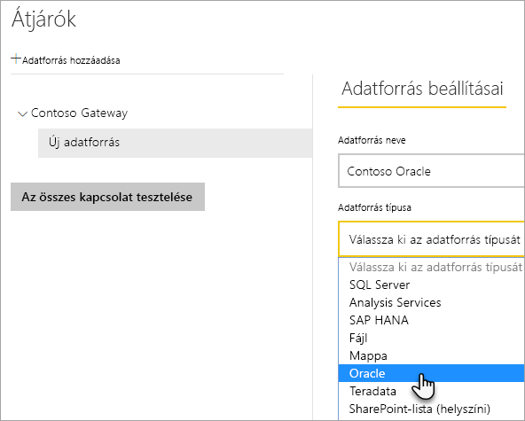
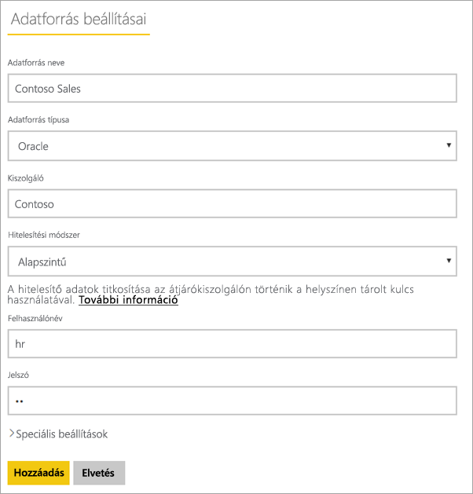
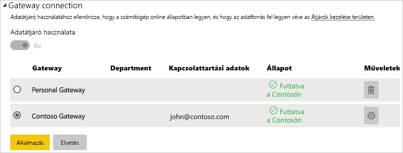

# <a name="manage-your-data-source---oracle"></a>A vállalati adatforrások kezelése – Oracle

[!INCLUDE [gateway-rewrite](includes/gateway-rewrite.md)]

Miután [telepítette a helyszíni adatátjárót](/data-integration/gateway/service-gateway-install), [fel kell vennie az átjáróval használható adatforrásokat](service-gateway-data-sources.md#add-a-data-source). Ez a cikk bemutatja, hogyan használhatók az átjárók és az Oracle-adatforrások akár ütemezett frissítéshez, akár a DirectQueryhez.

## <a name="install-the-oracle-client"></a>Az Oracle ügyfél telepítése

Az átjáró Oracle-kiszolgálóhoz való csatlakoztatásához telepíteni és konfigurálni kell a .NET rendszer Oracle-adatszolgáltatóját (ODP.NET). Az ODP.NET az Oracle Data Access Components (ODAC) része.

A Power BI Desktop 32 bites verzióihoz a következő hivatkozással töltse le és telepítse a 32 bites Oracle ügyfelet:

* [32 bites Oracle Data Access Components (ODAC) az Oracle Developer Tools for Visual Studio (12.1.0.2.4) verzióval](https://www.oracle.com/technetwork/topics/dotnet/utilsoft-086879.html)

A Power BI Desktop 64 bites verzióihoz vagy a helyszíni adatátjáróhoz a következő hivatkozással töltse le és telepítse a 64 bites Oracle ügyfelet:

* [64 bites ODAC 12.2c 1-es kiadás (12.2.0.1.0) Windows x64 rendszerhez](https://www.oracle.com/technetwork/database/windows/downloads/index-090165.html)

Az ügyfél telepítése után a megfelelő információkkal konfigurálnia kell a tnsnames.ora fájlt az adatbázishoz megfelelő adatokkal. A Power BI Desktop és az átjáró a tnsnames.ora fájlban meghatározott net_service_name névből fog kiindulni. Konfigurált net_service_name nélkül nem tud csatlakozni. A tnsnames.ora fájl alapértelmezett elérési útja a következő: `[Oracle Home Directory]\Network\Admin\tnsnames.ora`. A tnsnames.ora fájlok konfigurálásáról további információ: [Oracle: Helyi elnevezési paraméterek (tnsnames.ora)](https://docs.oracle.com/cd/B28359_01/network.111/b28317/tnsnames.htm).

### <a name="example-tnsnamesora-file-entry"></a>Példa tnsnames.ora fájlbejegyzés

A tnsname.ora fájlban lévő bejegyzések alapvető formátuma a következő:

```
net_service_name=
 (DESCRIPTION=
   (ADDRESS=(protocol_address_information))
   (CONNECT_DATA=
     (SERVICE_NAME=service_name)))
```

Íme egy példa a kitöltött kiszolgáló- és portinformációkra:

```
CONTOSO =
  (DESCRIPTION =
    (ADDRESS = (PROTOCOL = TCP)(HOST = oracleserver.contoso.com)(PORT = 1521))
    (CONNECT_DATA =
      (SERVER = DEDICATED)
      (SERVICE_NAME = CONTOSO)
    )
  )
```

## <a name="add-a-data-source"></a>Adatforrások felvétele

Az [Adatforrás hozzáadása](service-gateway-data-sources.md#add-a-data-source) című témakörben további információt talál adatforrások hozzáadásáról. Az **Adatforrás típusa** területen válassza az **Oracle** lehetőséget.



Miután kiválasztotta az Oracle-t adatforrásként, ki kell töltenie az adatforrás adatait, többek között meg kell adnia a **Kiszolgálót** és az **Adatbázist**. 

A **Hitelesítési módszer** területen választhatja a **Windows** vagy az **Egyszerű** lehetőséget. Az **Egyszerű** lehetőséget akkor válassza, ha Windows-hitelesítés helyett egy Oracle-ben létrehozott fiók használatát tervezi. Ez után írja be az adatforráshoz használandó hitelesítő adatokat.

> [!NOTE]
> Az adatforrás felé irányuló összes lekérdezés ezen hitelesítő adatok segítségével fut. A [Titkosított hitelesítő adatok tárolása a felhőben](service-gateway-data-sources.md#store-encrypted-credentials-in-the-cloud) című témakörben további információt talál a hitelesítő adatok tárolásáról.



Miután mindent kitöltött, válassza a **Hozzáadás** lehetőséget. Mostantól használhatja ezt az adatforrást az ütemezett frissítéshez vagy a DirectQueryhez egy helyszíni Oracle-kiszolgálóval. Ha sikerrel járt, megjelenik a *Sikeres csatlakozás* üzenet.


### <a name="advanced-settings"></a>Speciális beállítások

Ha szeretné, konfigurálhatja az adatforrás adatvédelmi szintjét is. Ez a beállítás vezérli, hogy hogyan lesznek egyesítve az adatok. Ez csak ütemezett frissítéshez használható. Az adatvédelmi szint beállítása nem vonatkozik a DirectQueryre. Az adatforrás adatvédelmi szintjeiről az [Adatvédelmi szintek (Power Query)](https://support.office.com/article/Privacy-levels-Power-Query-CC3EDE4D-359E-4B28-BC72-9BEE7900B540) című témakörben olvashat részletesebben.


## <a name="use-the-data-source"></a>Az adatforrás használata

Miután létrehozta az adatforrást, használhatja azt DirectQuery-kapcsolatokkal vagy ütemezett frissítéssel is.

> [!WARNING]
> A kiszolgáló és az adatbázis nevének egyeznie kell a Power BI Desktopban és az adatforrásban a helyszíni adatátjárón belül.

Az adatkészlet és az adatforrás közötti kapcsolat az átjárón belül a kiszolgáló nevén és az adatbázis nevén alapul. A neveknek egyezniük kell. Ha például egy IP-címet ad meg a kiszolgáló nevének, a Power BI Desktopban azt az IP-címet kell használnia az adatforráshoz az átjáró konfigurációján belül. Ennek a névnek egyeznie kell a tnsnames.ora fájlban meghatározott aliassal is. További információ a tnsnames.ora fájlról: [Az Oracle-ügyfél telepítése](#install-the-oracle-client).

Ez a DirectQuery és az ütemezett frissítések esetén is követelmény.

### <a name="use-the-data-source-with-directquery-connections"></a>Az adatforrás használata DirectQuery-kapcsolatokkal

Fontos, hogy a kiszolgáló és az adatbázisnevek megegyezzenek a Power BI Desktop és az átjáró számára konfigurált adatforrás között. Arra is ügyelnie kell, hogy a felhasználó szerepeljen az adatforrás **Felhasználók** lapján, ha DirectQuery-adathalmazokat szeretne közzétenni. A DirectQuery-hez történő kijelölésre a Power BI Desktopban az első adatimportáláskor kerül sor. A DirectQuery használatáról további információt talál [A DirectQuery használata a Power BI-ban](desktop-use-directquery.md) című cikkben.

Miután elvégezte a közzétételt a Power BI Desktopból vagy az **Adatok lekérése** területről, el kell kezdeni működniük a jelentéseknek. Az átjárón belüli adatforrás létrehozása után több percbe telhet, amíg a kapcsolat használhatóvá válik.

### <a name="use-the-data-source-with-scheduled-refresh"></a>Az adatforrás használata ütemezett frissítéssel

Ha szerepel az átjárón belül konfigurált adatforrás **Felhasználók** lapján, és a kiszolgáló és az adatbázis neve egyezik, az átjáró megjelenik lehetőségként az ütemezett frissítésnél.



## <a name="troubleshooting"></a>Hibaelhárítás

Több hibaüzenetet kaphat az Oracle-től, ha az elnevezési szintaxis helytelen vagy nincs megfelelően konfigurálva:

* ORA-12154: TNS: nem oldható fel a megadott csatlakozásazonosító.
* ORA-12514: A TNS figyelő jelenleg nem ismeri a csatlakozásleíróban kért szolgáltatást.
* ORA-12541: TNS: nincs figyelő.
* ORA-12170: TNS: kapcsolat-időtúllépés történt.
* ORA-12504: A TNS figyelő nem kapta meg a SERVICE_NAME nevet a CONNECT_DATA adatokban.

Ezek a hibák akkor fordulhatnak elő, ha az Oracle-ügyfél nincs telepítve, vagy ha nincs megfelelően konfigurálva. Ha telepítve van, ellenőrizze, hogy a tnsnames.ora fájl helyesen van-e konfigurálva, és hogy a megfelelő net_service_name nevet használja-e. Arra is ügyelnie kell, hogy a net_service_name azonos legyen a Power BI Desktopot használó és az átjárót futtató gépen. További információ: [Az Oracle-ügyfél telepítése](#install-the-oracle-client).

> [!NOTE]
> Az Oracle-kiszolgáló verziója és az Oracle-ügyfél verziója közötti kompatibilitás miatt is kaphat hibaüzenetet. Ezeknek a verzióknak általában egyezniük kell.

Az átjáróval kapcsolatos további hibaelhárítási információk: [A helyszíni adatátjáró hibaelhárítása](/data-integration/gateway/service-gateway-tshoot).

## <a name="next-steps"></a>Következő lépések

* [Átjárók hibaelhárítása – Power BI](service-gateway-onprem-tshoot.md)
* [Power BI Premium](service-premium.md)

További kérdései vannak? Forduljon a [Power BI közösségéhez](https://community.powerbi.com/).

