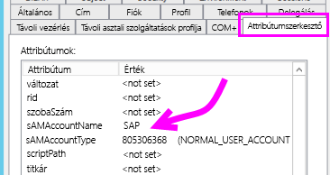
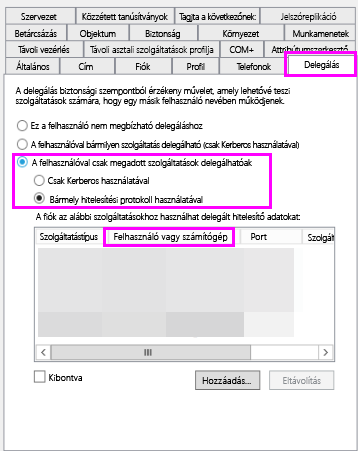
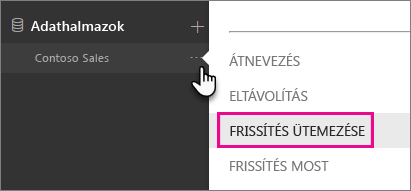
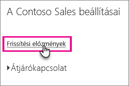
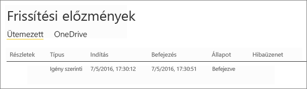

# <a name="troubleshoot-gateways---power-bi"></a>Átjárók hibaelhárítása – Power BI

[!INCLUDE [gateway-rewrite](includes/gateway-rewrite.md)]

Ez a cikk néhány olyan gyakori problémát ismertet, amelyek a helyszíni adatátjáró Power BI-jal való használatakor előfordulhatnak. Ha olyan problémával találkozik, mely itt nincs felsorolva, használhatja a Power BI [közösségi](https://community.powerbi.com) webhelyét, vagy létrehozhat egy [támogatási jegyet](https://powerbi.microsoft.com/support).

## <a name="configuration"></a>Konfiguráció

### <a name="error-power-bi-service-reported-local-gateway-as-unreachable-restart-the-gateway-and-try-again"></a>Hiba: A Power BI szolgáltatás jelentése szerint a helyi átjáró nem érhető el. Indítsa újra az átjárót, majd próbálkozzon újra.

A konfigurálás végén a rendszer újra meghívja a Power BI szolgáltatást az átjáró érvényesítése érdekében. A Power BI szolgáltatás az átjárót nem élőként látja. Lehetséges, hogy a Windows-szolgáltatás újraindításával elhárítható a kommunikációs probléma. A naplókat a [Naplók gyűjtése a helyszíni adatátjáró alkalmazásból](/data-integration/gateway/service-gateway-tshoot#collect-logs-from-the-on-premises-data-gateway-app) című cikkben leírtak alapján összegyűjtve és megvizsgálva további részleteket fedhet fel.

## <a name="data-sources"></a>Adatforrások

### <a name="error-unable-to-connect-details-invalid-connection-credentials"></a>Hiba: Nem sikerült csatlakozni. Részletek: „Érvénytelen kapcsolathitelesítő adatok”

A **Részletek megjelenítése** terület megjeleníti az adatforrástól származó hibaüzenetet. Az SQL Server esetében ez az alábbihoz hasonló:

    Login failed for user 'username'.

Ellenőrizze, hogy a megfelelő felhasználónevet és jelszót adta-e meg. Ellenőrizze továbbá, hogy ezekkel a hitelesítő adatokkal sikeresen lehet-e kapcsolódni az adatforráshoz. Győződjön meg arról, hogy az éppen használt fiók megfelel a hitelesítési módszernek.

### <a name="error-unable-to-connect-details-cannot-connect-to-the-database"></a>Hiba: Nem sikerült csatlakozni. Részletek: „Nem lehet csatlakozni az adatbázishoz”

A kiszolgálóhoz sikerült kapcsolódni, a megadott adatbázishoz azonban nem. Ellenőrizze az adatbázis nevét, és hogy a felhasználói hitelesítő adatok megfelelő jogosultságot biztosítanak-e az adatbázis eléréséhez.

A **Részletek megjelenítése** terület megjeleníti az adatforrástól származó hibaüzenetet. Az SQL Server esetében ez az alábbihoz hasonló:

    Cannot open database "AdventureWorks" requested by the login. The login failed. Login failed for user 'username'.

### <a name="error-unable-to-connect-details-unknown-error-in-data-gateway"></a>Hiba: Nem sikerült csatlakozni. Részletek: „Ismeretlen hiba az adatátjáróban”

Ez a hiba különböző okok miatt fordulhat elő. Mindenképpen ellenőrizze, hogy létrehozható-e kapcsolat az adatforrás és az átjárót üzemeltető gép között. Ez annak a következménye lehet, hogy a kiszolgáló nem érhető el.

A **Részletek megjelenítése** területen ekkor megjelenik a **DM_GWPipeline_UnknownError** hibakód.

További információt az **Eseménynaplók** > **Alkalmazás- és szolgáltatásnaplók** > **Helyszíni adatátjáró szolgáltatás** részben talál.

### <a name="error-we-encountered-an-error-while-trying-to-connect-to-server-details-we-reached-the-data-gateway-but-the-gateway-cant-access-the-on-premises-data-source"></a>Hiba: Hiba történt a \<kiszolgálóhoz\> történő csatlakozás közben. Részletek: „Az adatátjáró elérése sikerült, de az átjáró nem tud hozzáférni a helyszíni adatforráshoz.”

Nem sikerült csatlakozni a megadott adatforráshoz. Ellenőrizze az adott adatforráshoz megadott információkat.

A **Részletek megjelenítése** területen ekkor megjelenik a **DM_GWPipeline_Gateway_DataSourceAccessError** hibakód.

Ha a mögöttes hibaüzenet az alábbihoz hasonló, az azt jelenti, hogy az adatforráshoz használt fiók nem a szóban forgó Analysis Services-példány kiszolgálói rendszergazdája. További információ: [Grant server admin rights to an Analysis Services instance](https://docs.microsoft.com/sql/analysis-services/instances/grant-server-admin-rights-to-an-analysis-services-instance) (Szolgáltató-rendszergazdai jogosultságok biztosítása egy Analysis Services-példánynak).

    The 'CONTOSO\account' value of the 'EffectiveUserName' XML for Analysis property is not valid.

Ha a mögöttes hibaüzenet az alábbihoz hasonló, az azt is jelentheti, hogy az Analysis Services-szolgáltatásfiókból hiányzik a [token-groups-global-and-universal](https://msdn.microsoft.com/library/windows/desktop/ms680300.aspx) (TGGAU) könyvtárattribútum.

    The username or password is incorrect.

A Windows 2000 előtti rendszerekkel kompatibilis tartományok esetében a TGGAU attribútum engedélyezve van. A legtöbb újonnan létrehozott tartomány alapértelmezés szerint nem engedélyezi ezt az attribútumot. További információ: [Some applications and APIs require access to authorization information on account objects](https://support.microsoft.com/kb/331951) (Egyes alkalmazások és API-k hozzáférést igényelnek a jóváhagyási adatokhoz a fiókobjektumoknál).

Az attribútumok engedélyezési állapotának ellenőrzéséhez kövesse az alábbi lépéseket.

1. Csatlakozzon az Analysis Services-géphez az SQL Server Management Studióban. A Speciális kapcsolati tulajdonságok részben adja meg a szóban forgó felhasználóhoz tartozó EffectiveUserName paramétert, és nézze meg, hogy a hiba továbbra is fennáll-e.
2. A dsacls Active Directory eszköz használatával ellenőrizheti, hogy az attribútum szerepel-e a listában. Ez az eszköz egy tartományvezérlőben található meg. Ismernie kell a fiók megkülönböztetett tartománynevét, és el kell küldenie az eszköznek.

        dsacls "CN=John Doe,CN=UserAccounts,DC=contoso,DC=com"

    Az eredményeknek az alábbiakhoz hasonlónak kell lenniük:

            Allow BUILTIN\Windows Authorization Access Group
                                          SPECIAL ACCESS for tokenGroupsGlobalAndUniversal
                                          READ PROPERTY

A probléma elhárításához engedélyeznie kell a TGGAU attribútumot az Analysis Services Windows-szolgáltatáshoz használt fiók számára.

#### <a name="another-possibility-for-the-username-or-password-is-incorrect"></a>Másik lehetőség hibás felhasználónév vagy jelszó esetén.

Ennek a hibának az is lehet az oka, hogy az Analysis Services-kiszolgáló másik tartományban van, mint a felhasználók, és a tartományok között nincs kétirányú megbízhatósági kapcsolat.

A tartományok közötti megbízhatósági kapcsolatot a tartományi rendszergazdával együttműködésben kell ellenőriznie.

#### <a name="unable-to-see-the-data-gateway-data-sources-in-the-get-data-experience-for-analysis-services-from-the-power-bi-service"></a>Nem láthatók az adatátjáró adatforrásai az Analysis Services „Adatok lekérése” felületén a Power BI szolgáltatás használatakor

Az átjáró konfigurálása során győződjön meg arról, hogy a fiókja szerepel az adatforrás **Felhasználók** lapján található listában. Ha nem rendelkezik hozzáféréssel az átjáróhoz, kérje meg az átjáró rendszergazdáját ennek ellenőrzésére. Az Analysis Services listájában szereplő adatforrás csak a **Felhasználók** listában szereplő fiókok számára látható.

### <a name="error-you-dont-have-any-gateway-installed-or-configured-for-the-data-sources-in-this-dataset"></a>Hiba: Nem rendelkezik egyetlen telepített vagy konfigurált átjáróval sem az ebben az adathalmazban lévő adatforrásokhoz.

Ellenőrizze, hogy hozzáadott-e egy vagy több adatforrást az átjáróhoz, amint az az [Adatforrás hozzáadása](service-gateway-data-sources.md#add-a-data-source) szakaszban szerepel. Ha az átjáró nem jelenik meg a felügyeleti portál **Átjárók kezelése**, területén, próbálja meg törölni a böngésző gyorsítótárát, vagy próbáljon kijelentkezni a szolgáltatásból, aztán ismét vissza.

## <a name="datasets"></a>Adathalmazok

### <a name="error-there-is-not-enough-space-for-this-row"></a>Hiba: Nincs elegendő szabad terület ehhez a sorhoz.

Ez a hiba akkor fordul elő, ha egyetlen sor mérete nagyobb 4 MB-nál. Határozza meg, hogy az adatforrás melyik soráról van szó, és próbálja meg kiszűrni a sort, vagy csökkenteni a méretét.

### <a name="error-the-server-name-provided-doesnt-match-the-server-name-on-the-sql-server-ssl-certificate"></a>Hiba: A megadott kiszolgálónév nem egyezik az SQL-kiszolgáló SSL-tanúsítványán szereplő kiszolgálónévvel

Ez a hiba akkor fordulhat elő, ha tanúsítvány köznapi neve a kiszolgáló teljes tartománynevéhez (FQDN) tartozik, viszont csak a kiszolgáló NetBIOS-neve lett megadva. Ez eltérést okoz a tanúsítványban. A probléma megoldásához adja meg a kiszolgálónevet az átjáró adatforrásán belül, valamint a PBIX-fájlt a kiszolgáló teljes tartománynevének használatához.

### <a name="error-you-dont-see-the-on-premises-data-gateway-present-when-you-configure-scheduled-refresh"></a>Hiba: Az ütemezett frissítés konfigurálásakor nem látható a helyszíni adatátjáró.

Ennek különböző okai lehetnek a különböző forgatókönyvekben:

- A Power BI Desktopban és az átjáróhoz konfigurált adatforrásban megadott kiszolgáló- és az adatbázisnév nem egyezik meg. A neveknek egyezniük kell. A rendszer nem tesz különbséget a kis- és a nagybetűk között.
- Az átjáró konfigurációjában a fiókja nem szerepel az adatforrás **Felhasználók** lapján. Fel kell kerülnie a listára. Ezért az átjáró rendszergazdája felelős.
- A Power BI Desktop-fájl több adatforrást tartalmaz, és ezek közül nem mindegyik van konfigurálva az átjáróhoz. Ahhoz, hogy az adott átjáró megjelenjen az Ütemezett frissítésben, mindegyik adatforrást meg kell határoznia az átjáróhoz.

### <a name="error-the-received-uncompressed-data-on-the-gateway-client-has-exceeded-the-limit"></a>Hiba: Az átjáróügyfélen fogadott tömörítetlen adatok mérete nagyobb az engedélyezettnél.

A pontos határérték táblánként 10 GB tömörítetlen adat. Ha ezzel a problémával találkozik, jó lehetőségei vannak a hiba optimalizálására és elkerülésére. A probléma megoldását különösen a nagymértékben állandó, hosszú sztringekből álló értékek használatának csökkentése, és ezek helyett normalizált kulcs használata segíti. Másik megoldásként eltávolíthatja az oszlopot (ha nincs használatban).

## <a name="reports"></a>Jelentések

### <a name="error-report-could-not-access-the-data-source-because-you-do-not-have-access-to-our-data-source-via-an-on-premises-data-gateway"></a>Hiba: A jelentés nem tudott hozzáférni az adatforráshoz, mert nem rendelkezik hozzáféréssel az adatforráshoz egy helyszíni adatátjárón keresztül.

Ezt a hibát általában az alábbiak valamelyike okozza:

- Az adatforrás adatai nem egyeznek meg az alapul szolgáló adatkészletben található adatokkal. A kiszolgáló és az adatbázis nevének meg kell egyeznie a helyszíni adatátjáró számára meghatározott adatforrásban és a Power BI Desktopban. Ha a Power BI Desktop esetében IP-címet használ, akkor a helyszíni adatátjáróhoz tartozó adatforrásnak is IP-címet kell használnia.
- A vállalaton belül nem található elérhető adatforrással rendelkező átjáró. Az adatforrás konfigurálása egy új vagy egy meglévő helyszíni adatátjárón is elvégezhető.

### <a name="error-data-source-access-error-please-contact-the-gateway-administrator"></a>Hiba: Adatforrás-hozzáférési hiba. Forduljon az átjáró rendszergazdájához.

Ha ez a jelentés élő Analysis Services-kapcsolatot használ, azt a problémát tapasztalhatja, hogy az EffectiveUserName tulajdonságnak átadott érték nem érvényes, vagy nem rendelkezik engedélyekkel az Analysis Services-gépen. A hitelesítési probléma oka jellemzően az, hogy az EffectiveUserName tulajdonságnak átadott érték nem egyezik meg egyetlen helyileg érvényes egyszerű felhasználónévvel (UPN-nel) sem.

Az érvényes felhasználónév megerősítéséhez kövesse az alábbi lépéseket.

1. Keresse meg az érvényes felhasználónevet az [átjáró naplóiban](/data-integration/gateway/service-gateway-tshoot#collect-logs-from-the-on-premises-data-gateway-app).
2. Ha megtalálta az átadott értéket, ellenőrizze a helyességét. Ha az Ön felhasználójáról van szó, futtathatja a következő parancsot egy parancssorból a UPN megtekintéséhez. A UPN egy e-mail-cím formátumával rendelkezik.

        whoami /upn

Opcionálisan megtekintheti a Power BI által az Azure Active Directoryból beszerzett UPN-t is.

1. Lépjen a [https://developer.microsoft.com/graph/graph-explorer](https://developer.microsoft.com/graph/graph-explorer) lapra.
2. Válassza a **Bejelentkezés** lehetőséget a jobb felső sarokban.
3. Futtassa az alábbi lekérdezést. Egy eléggé nagy JSON-válasz jelenik meg.

        https://graph.windows.net/me?api-version=1.5
4. Keressen rá a következőre: **userPrincipalName**.

Ha az Azure Active Directory UPN-je nem egyezik meg a helyi Active Directory UPN-jével, a [Felhasználónevek leképezése](service-gateway-enterprise-manage-ssas.md#map-user-names-for-analysis-services-data-sources) szolgáltatás segítségével lecserélheti egy érvényes értékre. Az UPN módosítását elvégeztetheti a bérlői rendszergazda vagy a helyi Active Directory-rendszergazda segítségével is.

## <a name="kerberos"></a>Kerberos

Ha az alapul szolgáló adatbázis-kiszolgáló és a helyszíni adatátjáró nincs megfelelően konfigurálva a [Kerberos által korlátozott delegáláshoz](service-gateway-sso-kerberos.md), engedélyezze a [részletes naplózást](/data-integration/gateway/service-gateway-performance#slow-performing-queries) az átjárón. Ezután a hibaelhárítás kiindulási pontjaként vizsgálja meg az átjáró naplófájljaiban található hibákat vagy nyomkövetéseket. Az átjáró megtekinthető naplóinak gyűjtéséről a [Naplók gyűjtése a helyszíni adatátjáró alkalmazásból](/data-integration/gateway/service-gateway-tshoot#collect-logs-from-the-on-premises-data-gateway-app) című cikkben tájékozódhat.

### <a name="impersonationlevel"></a>ImpersonationLevel

A ImpersonationLevel az egyszerű szolgáltatásnév vagy a helyi szabályzat beállításához kapcsolódik.

```
[DataMovement.PipeLine.GatewayDataAccess] About to impersonate user DOMAIN\User (IsAuthenticated: True, ImpersonationLevel: Identification)
```

**Megoldás**

Kövesse az alábbi lépéseket a probléma megoldásához.

1. Állítson be egyszerű szolgáltatásnevet a helyszíni átjáróhoz.
2. Állítson be korlátozott delegálást az Active Directory szolgáltatásban.

### <a name="failedtoimpersonateuserexception-failed-to-create-windows-identity-for-user-userid"></a>FailedToImpersonateUserException: A felhasználó azonosítójához nem sikerült Windows-identitást létrehozni

A FailedToImpersonateUserException akkor történik, ha nem tud megszemélyesítést végezni más felhasználó nevében. Ez a hiba akkor is előfordulhat, ha a megszemélyesíteni kívánt fiók egy másik tartományból van, mint amelyikben az átjáró szolgáltatás tartománya található. Ez egy korlátozás.

**Megoldás**

* Ellenőrizze a fenti ImpersonationLevel szakasz lépéseit követve, hogy megfelelő-e a konfiguráció.
* Győződjön meg róla, hogy a megszemélyesíteni kívánt felhasználói azonosító egy érvényes Active Directory-fiók.

### <a name="general-error-1033-error-while-you-parse-the-protocol"></a>Általános hiba: 1033 hiba a protokoll elemzése közben

Az 1033-as hibát kapja, amikor az SAP HANA-ban konfigurált külső azonosító nem egyezik a bejelentkezési adatokkal, ha a felhasználó megszemélyesítése egyszerű felhasználónévvel (alias@domain.com) történt. A naplókban az „Eredeti UPN (alias@domain.com) új UPN-nel lesz lecserélve (alias@domain.com)” a hibanaplók elején, az alábbiak szerint:

```
[DM.GatewayCore] SingleSignOn Required. Original UPN 'alias@domain.com' replaced with new UPN 'alias@domain.com.'
```

**Megoldás**

* Az SAP HANA megköveteli a megszemélyesített felhasználótól, hogy az sAMAccountName attribútumot használja az Active Directoryban (felhasználói alias). Ha ez az attribútum nem helyes, az 1033-as hiba jelenik meg.

    

* A naplókban az sAMAccountName (alias) fióknév jelenik meg, nem pedig az egyszerű felhasználónév, amely az aliasból és az azt követő tartományból áll (alias@doimain.com).

    

```xml
      <setting name="ADUserNameReplacementProperty" serializeAs="String">
        <value>sAMAccount</value>
      </setting>
      <setting name="ADServerPath" serializeAs="String">
        <value />
      </setting>
      <setting name="CustomASDataSource" serializeAs="String">
        <value />
      </setting>
      <setting name="ADUserNameLookupProperty" serializeAs="String">
        <value>AADEmail</value>
```

### <a name="sap-aglibodbchdb-dllhdbodbc-communication-link-failure-10709-connection-failed-rte-1-kerberos-error-major-miscellaneous-failure-851968-minor-no-credentials-are-available-in-the-security-package"></a>[SAP AG][LIBODBCHDB DLL][HDBODBC] Kommunikációs kapcsolódási hiba;-10709 sikertelen kapcsolódás (RTE:[-1] Kerberos-hiba. Jelentős: "[851968] Egyéb hiba." Kisebb: „Nincsenek hitelesítő adatok a biztonsági csomagban.”

A „-10709 sikertelen kapcsolat” hibaüzenetet kapja, ha a delegálás beállítása nem megfelelő az Active Directoryban.

**Megoldás**

* Győződjön meg róla, hogy rendelkezik a SAP Hana-kiszolgálóval az Active Directory delegálási lapján az átjárószolgáltatási fiókhoz.

   

## <a name="refresh-history"></a>Frissítési előzmények

Ha az átjárót egy ütemezett frissítéshez használja, a **Frissítési előzmények** területen megtekintheti a hibákat. Itt hasznos információkat is találhat egy esetleges támogatási kéréshez. Emellett megtekintheti az ütemezett és az igény szerinti frissítéseket is. A Frissítési előzmények oldalra az alábbi lépésekben juthat el.

1. A Power BI navigációs paneljének **Adathalmazok** területén válasszon ki egy adathalmazt. Nyissa meg a menüt, majd válassza a **Frissítés ütemezése** lehetőséget.

    

2. A **Beállítások:** &gt; **Frissítés ütemezése** menüpontban válassza a **Frissítési előzmények** lehetőséget.

    

    

Az egyes frissítési hibák elhárításáról a [Frissítési forgatókönyvekkel kapcsolatos hibák elhárítása](refresh-troubleshooting-refresh-scenarios.md) című cikk nyújt további információt.

## <a name="fiddler-trace"></a>Nyomon követés a Fiddlerrel

A [Fiddler](https://www.telerik.com/fiddler) a Telerik által kifejlesztett, HTTP-forgalmat figyelő ingyenes eszköz. Nyomon követheti a Power BI szolgáltatás és az ügyfélszámítógép közötti adatforgalmat. A forgalomlista hibaüzenetek és egyéb, kapcsolódó információk megjelenítésére is képes.


## <a name="next-steps"></a>Következő lépések

* [A helyszíni adatátjáró hibaelhárítása](/data-integration/gateway/service-gateway-tshoot)
* [Helyszíni adatátjáró proxybeállításainak konfigurálása](/data-integration/gateway/service-gateway-proxy)  
* [Az adatforrás kezelése – Analysis Services](service-gateway-enterprise-manage-ssas.md)  
* [Az adatforrás kezelése – SAP HANA](service-gateway-enterprise-manage-sap.md)  
* [Az adatforrás kezelése – SQL Server](service-gateway-enterprise-manage-sql.md)  
* [Adatforrások kezelése – Importálás/ütemezett frissítés](service-gateway-enterprise-manage-scheduled-refresh.md)  

További kérdései vannak? Kérdezze meg [a Power BI közösségét](https://community.powerbi.com/).
