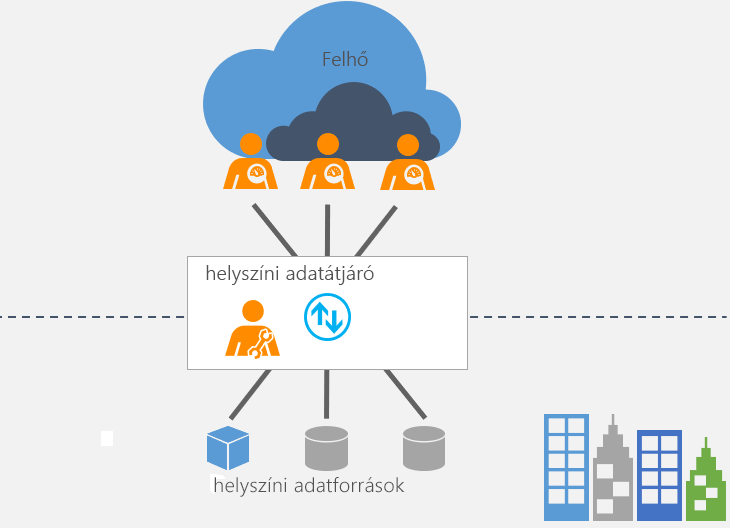

# Mi az a helyszíni adatátjáró?

[!INCLUDE [gateway-rewrite](includes/gateway-rewrite.md)]

A helyszíni adatátjáró hídként biztosítja a helyszíni (nem felhőbeli) adatok és számos Microsoft-felhőszolgáltatás közötti gyors és biztonságos adatátvitelt. Ezen felhőszolgáltatások közé tartozik a Power BI, a PowerApps, a Power Automate, az Azure Analysis Services és az Azure Logic Apps. Az átjáró használata lehetővé teszi, hogy a cégek az adatbázisaikat és más adatforrásaikat a helyszíni hálózaton belül tartsák, de ezzel együtt biztonságosan használhassák ezeket a felhőszolgáltatásokban is.

## Az átjáró működése

Az átjáró működéséről további információt talál [A helyszíni adatátjáró architektúrája](/data-integration/gateway/service-gateway-onprem-indepth) című témakörben.

## Átjárótípusok

Kétféle átjárótípus van, mindkettő más-más helyzethez:

* A **helyszíni adatátjáró** több felhasználó számára teszi lehetővé, hogy több helyszíni adatforráshoz csatlakozzanak. A helyszíni adatátjárót egyetlen átjárótelepítéssel minden támogatott szolgáltatáshoz használhatja. Ez az átjáró összetett helyzetekhez optimális, ahol többen is hozzá akarnak férni több adatforráshoz.

* A **helyszíni adatátjáró (személyes mód)** egyetlen felhasználónak teszi lehetővé, hogy kapcsolódjon a forrásokhoz, és nem osztható meg másokkal. A helyszíni adatátjáró (személyes mód) csak a Power BI-jal használható. Ez az átjáró kiválóan alkalmazható olyan helyzetekhez, ahol egyedül Ön készít jelentéseket, és nem szükséges megosztania adatforrásokat másokkal.

## Átjáró használata

Átjáró használatához négy fő lépés szükséges.

1. [Az átjáró letöltése és telepítése](/data-integration/gateway/service-gateway-install) helyi számítógépre.
1. Az átjáró [konfigurálása](/data-integration/gateway/service-gateway-app) a tűzfal és más hálózati követelmények alapján.
1. [Átjáró-rendszergazdák hozzáadása](/data-integration/gateway/service-gateway-manage), akik más hálózati követelményeket is kezelhetnek.
1. Helyszíni adatforrás frissítése [az átjáró használatával](service-gateway-sql-tutorial.md).
1. Az átjáró [hibaelhárítása](service-gateway-onprem-tshoot.md) hibák esetén.

## További lépések

* [A helyszíni adatátjáró telepítése](/data-integration/gateway/service-gateway-install)

Több kérdése van? [Kérdezze meg a Power BI közösségét](https://community.powerbi.com/)
