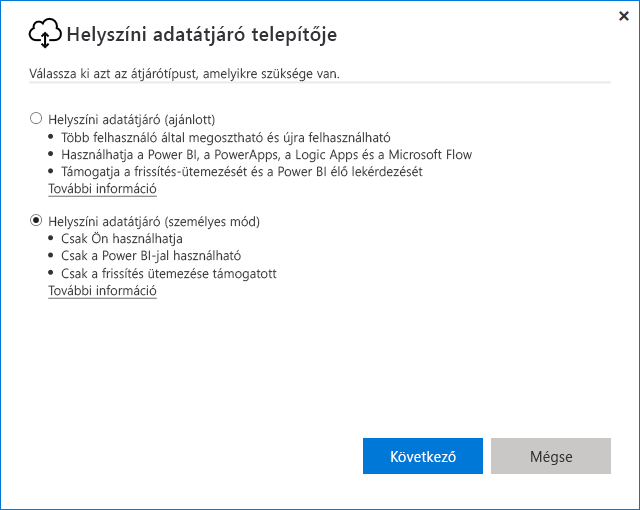
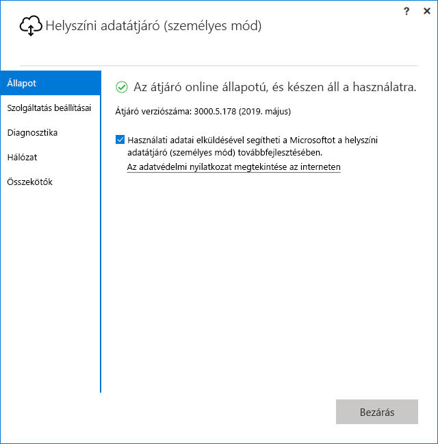

# <a name="use-personal-gateways-in-power-bi"></a>Privát átjárók használata a Power BI-ban

[!INCLUDE [gateway-rewrite](includes/gateway-rewrite.md)]

A (privát) helyszíni adatátjáró a helyszíni adatátjáró egy verziója, amely csak a Power BI-jal működik. Egy privát átjáróval átjárót telepíthet a saját számítógépére, és helyszíni adatokhoz kaphat hozzáférést.

> [!NOTE]
> Power BI-felhasználónként csak egy személyes módú átjáró futtatható. Ha egy második személyes módú átjárót telepít egy adott felhasználó számára – akár egy másik számítógépen is –, a legutóbbi telepítés a korábbi telepítések helyébe lép.

## <a name="on-premises-data-gateway-vs-on-premises-data-gateway-personal-mode"></a>A helyszíni adatátjáró és a (privát) helyszíni adatátjáró összehasonlítása

Az alábbi táblázat a helyszíni adatátjáró és a (privát) helyszíni adatátjáró különbségeit írja le.

|   |Helyszíni adatátjáró | Helyszíni adatátjáró (személyes mód) |
| ---- | ---- | ---- |
|Támogatott felhőszolgáltatások |Power BI, PowerApps, Azure Logic Apps, Microsoft Flow, Azure Analysis Services, adatfolyamok |Power BI |
|Futtatás |Az átjáróhoz hozzáféréssel rendelkező felhasználók által konfigurált módon |Windows-hitelesítéssel saját nevében, más hitelesítéstípusoknál az Ön által konfigurált módon |
|Csak a számítógép rendszergazdájaként telepíthető |Igen |Nem |
|Központosított átjáró- és adatforrás-kezelés |Igen |Nem |
|Adatimportálás és a frissítések ütemezése |Igen |Igen |
|DirectQuery-támogatás |Igen |Nem |
|LiveConnect-támogatás az Analysis Serviceshez |Igen |Nem |

## <a name="install-the-on-premises-data-gateway-personal-mode"></a>A (privát) helyszíni adatátjáró telepítése

A (privát) helyszíni adatátjáró a következő módon telepíthető:

1. [Töltse le a helyszíni adatátjárót](https://go.microsoft.com/fwlink/?LinkId=820925&clcid=0x409).

2. A telepítőben válassza a (privát) helyszíni adatátjáró lehetőséget, majd a **Tovább** lehetőséget.

   

Az átjárófájlok a _"%localappdata%\Microsoft\On-premises data gateway (personal mode)_ helyen vannak telepítve. Miután a telepítést sikeresen befejezte és bejelentkezett, az alábbi képernyőt fogja látni.



## <a name="use-fast-combine-with-the-personal-gateway"></a>Gyors összevonás használata a személyes átjáróval

A privát átjárón használt gyors összevonás használatával a lekérdezések végrehajtása során figyelmen kívül hagyhatja a megadott adatvédelmi szinteket. Az alábbi módon engedélyezhető, hogy a gyors összevonás működjön a (privát) helyszíni adatátjáróval:

1. Tallózással nyissa meg a következő fájlt:

   `%localappdata%\Microsoft\On-premises data gateway (personal mode)\Microsoft.PowerBI.DataMovement.Pipeline.GatewayCore.dll.config`

2. A fájl végéhez adja hozzá a következő szöveget:

    ```xml
    <setting name="EnableFastCombine" serializeAs="String">
       <value>true</value>
    </setting>
    ```

3. Ha elkészült, a beállítás körülbelül egy perc után lép életbe. A megfelelő működés ellenőrzéséhez próbáljon meg elvégezni a Power BI szolgáltatásban egy igény szerinti frissítést, amivel ellenőrizheti, hogy a Gyors összevonás működik-e.

## <a name="frequently-asked-questions-faq"></a>Gyakori kérdések (GYIK)

**Kérdés:** Futtathatom egyszerre a helyszíni adatátjárót (személyes mód) és a helyszíni adatátjárót (korábbi nevén az átjáró Vállalati verzióját)?
  
**Válasz:** Igen, futhat mindkettő egyszerre.

**Kérdés:** Futtathatom a helyszíni adatátjárót (személyes mód) szolgáltatásként?
  
**Válasz:** Nem. A helyszíni adatátjáró (személyes mód) csak alkalmazásként futtatható. Ha az átjárót szolgáltatásként vagy rendszergazda módban kell futtatnia, fontolja meg a [helyszíni adatátjáró](/data-integration/gateway/service-gateway-onprem) (korábbi nevén a Vállalati átjáró) használatát.

**Kérdés:** Milyen gyakran frissül a helyszíni adatátjáró (személyes mód)?
  
**Válasz:** A személyes átjárót havonta tervezzük frissíteni.

**Kérdés:** Miért kell frissítenem a hitelesítő adataim?
  
**Válasz:** Számos helyzet kiválthatja a hitelesítő adatok bekérését. A leggyakoribb eset az, ha a helyszíni adatátjáró (személyes mód) egy másik gépen lett újratelepítve, mint a személyes Power BI-átjáró. Az is lehet, hogy az adatforrásban áll fenn egy probléma, és a Power BI nem tudott tesztkapcsolatot létesíteni, illetve időtúllépés vagy rendszerhiba történt. A Power BI szolgáltatás hitelesítő adatainak frissítéséhez válassza a fogaskerék ikont, majd a **Beállítások** > **Adatkészletek** lehetőséget. Keresse meg a szóban forgó adatkészletet, és válassza az **Adatforrás azonosító adatai** lehetőséget.

**Kérdés:** Mennyi ideig lesz az előző személyes átjáróm offline állapotú a frissítés során?
  
**Válasz:** A személyes átjáró új verziójára való frissítési folyamat csak néhány percig tart.

**Kérdés:** R- és Python-szkripteket használok. Ezeket támogatja a szolgáltatás?
  
**Válasz:** Az R- és Python-szkriptek támogatottak privát módban.

## <a name="next-steps"></a>Következő lépések

* [Helyszíni adatátjáró proxybeállításainak konfigurálása](/data-integration/gateway/service-gateway-proxy)  

További kérdései vannak? Kérdezze meg [a Power BI közösségét](https://community.powerbi.com/).
