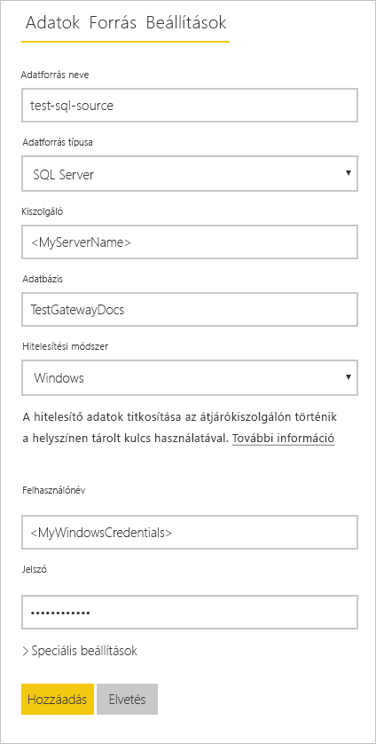
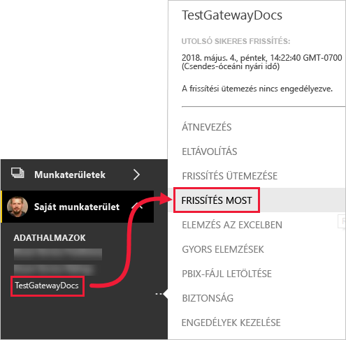

# <a name="refresh-data-from-an-on-premises-sql-server-database"></a>Adatok frissítése helyszíni SQL Server-adatbázisból

Ebben az oktatóanyagban megtudhatja, hogyan frissíthet Power BI-adathalmazt a helyi hálózaton található helyszíni relációs adatbázisból. A jelen oktatóanyag egy SQL Server-adatbázist használ példaként, amelyet helyszíni adatátjárón keresztül kell elérnie a Power BI-nak.

A jelen oktatóanyagban az alábbi lépéseket fogja végrehajtani:

> [!div class="checklist"]
> * Létrehoz és közzétesz egy Power BI Desktop-fájlt (PBIX-fájlt), amely egy helyszíni SQL Server-adatbázisból importál adatokat.
> * Adatforrás- és adathalmaz-beállításokat konfigurál a Power BI-ban az adatátjárón keresztül létesített SQL Server-kapcsolat számára.
> * Konfigurál egy frissítési ütemtervet annak biztosítására, hogy a Power BI-adathalmaz friss adatokkal rendelkezzen.
> * Igény szerinti frissítést hajt végre az adathalmazhoz kapcsolódóan.
> * Áttekinti a frissítési előzményeket, és elemzi a korábbi frissítési ciklusok eredményét.
> * Eltávolítja az erőforrásokat az oktatóanyagban létrehozott összetevők törlésével.

## <a name="prerequisites"></a>Előfeltételek

- Mielőtt nekikezdene az oktatóanyagnak, regisztráljon a [Power BI ingyenes próba-előfizetésére](https://app.powerbi.com/signupredirect?pbi_source=web), ha még nem rendelkezik vele.
- [Telepítse a Power BI Desktopot](https://powerbi.microsoft.com/desktop/) egy helyi számítógépen.
- [Telepítse az SQL Servert](/sql/database-engine/install-windows/install-sql-server) egy helyi számítógépen, és állítsa vissza a [mintaadatbázist egy biztonsági másolatból]((https://github.com/Microsoft/sql-server-samples/releases/download/adventureworks/AdventureWorksDW2017.bak)). Az AdventureWorksszel kapcsolatos további információkért tekintse meg az [AdventureWorks telepítését és konfigurálását](/sql/samples/adventureworks-install-configure) ismertető témakört.
- [Telepítsen egy helyszíni adatátjárót](service-gateway-install.md) azon a helyi számítógépen, amelyen az SQL Servert is telepítette (éles környezetben ez általában egy másik számítógép lenne).

> [!NOTE]
> Ha Ön nem átjáró-rendszergazda, és nem szeretné saját maga telepíteni az átjárót, forduljon a szervezet átjáró-rendszergazdájához. Ő létrehozhatja az adathalmaznak az SQL Server-adatbázishoz való csatlakoztatásához szükséges adatforrás-definíciót.

## <a name="create-and-publish-a-power-bi-desktop-file"></a>Power BI Desktop-fájl létrehozása és közzététele

Az alábbi eljárást követve hozhat létre alapszintű Power BI-jelentést az AdventureWorksDW mintaadatbázissal. Tegye közzé a jelentést a Power BI szolgáltatásban, így a rendelkezésére fog állni a Power BI-ban az az adathalmaz, amelyet a későbbi lépésekben konfigurálhat és frissíthet.

1. A Power BI Desktop **Kezdőlap** lapján válassza az **Adatok lekérése** \> **SQL Server** elemet.

2. Az **SQL Server-adatbázis** párbeszédpanelen írja be a megfelelő nevet a **Kiszolgáló** és az **Adatbázis (opcionális)** mezőbe, ellenőrizze, hogy az **Adatkapcsolati mód** beállítása **Importálás** értékű-e, majd kattintson az **OK** gombra.

    

3. Ellenőrizze **hitelesítő adatait**, majd válassza a **Csatlakozás** elemet.

    > [!NOTE]
    > Ha a hitelesítés nem végezhető el, ellenőrizze, hogy a helyes hitelesítési módszert választotta, és adatbázis-hozzáféréssel rendelkező fiókot használ-e. Tesztkörnyezetekben célszerű adatbázis-hitelesítést használni explicit felhasználónévvel és jelszóval. Éles környezetekben általában a Windows-hitelesítés használatos. Tekintse meg a [Frissítési forgatókönyvekkel kapcsolatos hibák elhárítása](refresh-troubleshooting-refresh-scenarios.md) című témakört, és forduljon az adatbázis-rendszergazdához további segítségért.

1. Ha megjelenik a **Titkosítás támogatása** párbeszédpanel, kattintson az **OK** gombra.

2. A **Kezelő** párbeszédpanelen jelölje ki a **DimProduct** táblát, majd kattintson a **Betöltés** gombra.

    

3. A Power BI Desktop **Jelentés** nézetében a **Vizualizációk** panelen válassza a **Halmozott oszlopdiagram** lehetőséget.

    

4. Ha a jelentésvásznon az oszlopdiagram lett kiválasztva, a **Mezők** ablaktáblán jelölje be az **EnglishProductName** és a **ListPrice** elemet.

    

5. Húzza az **EndDate** elemet a **Jelentési szint szűrői** részre, majd az **Alapszintű szűrés** területen csak az **(Üres)** jelölőnégyzet jelölje be.

    

    A diagram most a következő képhez hasonlóan néz ki.

    

    Láthatja, hogy az öt **Road-250** termék a legmagasabb listaárral jelenik meg. Ez meg fog változni, amikor ebben az oktatóanyagban később módosítja az adatokat és frissíti a jelentést.

6. Mentse a jelentést az „AdventureWorksProducts.pbix” néven.

7. A **Kezdőlap** lapon válassza a **Közzététel** \> **Saját munkaterület** \> **Kiválasztás** elemet. Ha a rendszer erre kéri, jelentkezzen be a Power BI szolgáltatásba.

8. A **sikeres műveletet jelző** képernyőn válassza az **AdventureWorksProducts.pbix megnyitása a Power BI szolgáltatásban** elemet.

    [Közzététel a Power BI-ban](./media/service-gateway-sql-tutorial/publish-to-power-bi.png)

## <a name="connect-a-dataset-to-a-sql-server-database"></a>Adathalmaz csatlakoztatása SQL Server-adatbázishoz

A Power BI Desktopban közvetlenül csatlakozott a helyszíni SQL Server-adatbázishoz, a Power BI szolgáltatásnak azonban átjáróra van szüksége, amely hídként szolgál a felhő és a helyszíni hálózat között. Az alábbi lépéseket követve adja hozzá a helyszíni SQL Server-adatbázist adatforrásként egy átjáróhoz, majd csatlakoztassa az adathalmazt ehhez az adatforráshoz.

1. Jelentkezzen be a Power BI szolgáltatásba. A jobb felső sarokban válassza a beállítások fogaskerék ikonját, majd kattintson a **Beállítások** elemre.

    

2. Az **Adathalmazok** lapon jelölje ki az **AdventureWorksProducts** adathalmazt, hogy a helyszíni SQL Server-adatbázishoz adatátjárón keresztül csatlakozhasson.

3. Bontsa ki az **Átjárókapcsolat** elemet, és ellenőrizze, hogy legalább egy átjáró látható-e. Ha nem lát átjárót, tekintse meg az [Előfeltételek](#prerequisites) című szakaszt az oktatóanyag korábbi részében, ahol megtalálhatja az átjárók telepítését és konfigurálását ismertető termékdokumentációra mutató hivatkozást.

    

4. A **Műveletek** részen bontsa ki a váltógombot az adatforrások megtekintéséhez, és kattintson a **Hozzáadás az átjáróhoz** hivatkozásra.

    

    > [!NOTE]
    > Ha Ön nem átjáró-rendszergazda, és nem szeretné saját maga telepíteni az átjárót, forduljon a szervezet átjáró-rendszergazdájához. Ő létrehozhatja az adathalmaznak az SQL Server-adatbázishoz való csatlakoztatásához szükséges adatforrás-definíciót.

5. Az **Átjárók** kezelésére szolgáló oldal **Adatforrás-beállítások** lapján adja meg és ellenőrizze az alábbi információkat, majd válassza a **Hozzáadás** elemet.

    | Beállítás | Érték |
    | --- | --- |
    | Adatforrás neve | AdventureWorksProducts |
    | Adatforrás típusa | SQL Server |
    | Kiszolgáló | Az SQL Server-példány neve, például SQLServer01 (egyeznie kell a Power BI Desktopban megadott névvel). |
    | Adatbázis | Az SQL Server-adatbázis neve, például AdventureWorksDW (egyeznie kell a Power BI Desktopban megadott névvel). |
    | Hitelesítési módszer | Windows vagy Alapszintű (általában Windows). |
    | Felhasználónév | Az SQL Serverhez való csatlakozáshoz használt felhasználói fiók. |
    | Jelszó | Az SQL Serverhez való csatlakozáshoz használt fiók jelszava. |

    

6. Az **Adathalmazok** lapon bontsa ki újra az **Átjárókapcsolat** elemet. Jelölje ki a konfigurált adatátjárót, amelynek **Állapot** oszlopában az látható, hogy a telepítési helyéül szolgáló gépen fut, és kattintson az **Alkalmaz** gombra.

    

## <a name="configure-a-refresh-schedule"></a>Frissítési ütemezés konfigurálása

Miután csatlakoztatta a Power BI-ban található adathalmazt a helyszíni SQL Server-adatbázishoz egy adatátjárón keresztül, az alábbi lépéseket követve konfigurálhatja a frissítési ütemezést. Az adathalmaz ütemezett frissítésével gondoskodhat arról, hogy a jelentések és az irányítópultok a legfrissebb adatokkal rendelkezzenek.

1. A bal oldali navigációs panelen nyissa meg a **Saját munkaterület** \> **Adathalmazok** lapot. Kattintson az **AdventureWorksProducts** adathalmazhoz tartozó három pontra ( **. . .** ), majd válassza a **Frissítés ütemezése** elemet.

    > [!NOTE]
    > Ügyeljen arra, hogy az **AdventureWorksProducts** adathalmazhoz tartozó három pontra kattintson, ne pedig azokra, amelyek az ugyanilyen nevű jelentéshez tartoznak. Az **AdventureWorksProducts** jelentés helyi menüje nem tartalmazza a **Frissítés ütemezése** elemet.

2. Az **Ütemezett frissítés** rész **Tartsa adatait naprakészen** területén állítsa a frissítési beállítást **Be** értékűre.

3. Válasszon ki egy megfelelő értéket a **Frissítési gyakoriság** beállításnak (ebben a példában ez **Naponta**), majd az **Időpont** részen kattintson a **Másik időpont hozzáadása** hivatkozásra a kívánt frissítési időpont megadásához (ebben a példában reggel és este 6:30).

    

    > [!NOTE]
    > Napi 8 időpontot konfigurálhat, ha az adathalmaz megosztott kapacitásban található, illetve 48 időpontot a Power BI Premium esetén.

4. Hagyja bejelölve az **Értesítést kérek e-mailben, ha sikertelen a frissítés** jelölőnégyzetet, és kattintson az **Alkalmaz** gombra.

## <a name="perform-an-on-demand-refresh"></a>Igény szerinti frissítés végrehajtása

A frissítési ütemezés konfigurálását követően a Power BI a következő ütemezett időpontban frissíteni fogja az adathalmazt egy 15 perces intervallumon belül. Ha ennél hamarabb szeretné frissíteni az adatokat, például az átjáró és az adatforrás konfigurációjának teszteléséhez, igény szerinti frissítést hajthat végre a bal oldali navigációs panel Adathalmaz menüjében található **Azonnali frissítés** lehetőséggel. Az igény szerinti frissítések nincsenek hatással a következő ütemezett frissítési időre, azonban beleszámítanak a napi frissítési korlátba, amelyről az előző szakaszban szóltunk.

Szemléltetésképpen szimuláljuk a mintaadatok változását az AdventureWorksDW adatbázis DimProduct tábláját az SQL Server Management Studióval (SSMS) frissítve.

```sql

UPDATE [AdventureWorksDW].[dbo].[DimProduct]
SET ListPrice = 5000
WHERE EnglishProductName ='Road-250 Red, 58'

```

Kövesse az alábbi lépéseket, hogy a frissített adatok eljuthassanak az átjárókapcsolaton keresztül az adathalmazba, majd a Power BI-jelentésekbe.

1. A Power BI szolgáltatás bal oldali navigációs paneljén kattintson a **Saját munkaterület** elemre, és bontsa ki.

2. Az **Adathalmazok** lapon kattintson az **AdventureWorksProducts** adathalmazhoz tartozó három pontra ( **. . .** ), majd válassza az **Azonnali frissítés** elemet.

    

    A jobb felső sarokban láthatja, hogy a Power BI felkészül a kért frissítés végrehajtására.

3. Válassza a **Saját munkaterület \> Jelentések \> AdventureWorksProducts** elemet. Láthatja, hogy a frissített adatok eljutottak a céljukhoz, és a legmagasabb listaárral rendelkező termék immár a **Road-250 Red, 58**.

    

## <a name="review-the-refresh-history"></a>A frissítési előzmények áttekintése

Időnként érdemes ellenőrizni a korábbi frissítési ciklusok eredményét a frissítési előzmények között. Előfordulhat, hogy az adatbázis hitelesítő adatai lejártak, vagy a kiválasztott átjáró offline volt, amikor esedékessé vált egy ütemezett frissítés. Az alábbi lépéseket követve vizsgálhatja meg a frissítési előzményeket, és ellenőrizze az esetleges problémákat.

1. A Power BI felhasználói felületének jobb felső sarkában válassza a beállítások fogaskerék ikonját, majd kattintson a **Beállítások** elemre.

2. Lépjen az **Adathalmazok** lapra, és jelölje ki a megvizsgálni kívánt adathalmazt, például: **AdventureWorksProducts**.

3. Kattintson a **Frissítési előzmények** hivatkozásra a **Frissítési előzmények** párbeszédpanel megnyitásához.

    

4. Az **Ütemezett** lapon láthatja a korábbi ütemezett és igény szerinti frissítéseket a kezdési és befejezési idejükkel a **Kezdés** és a **Befejezés** oszlopban, az **Állapot** oszlopban pedig a **Befejezve** állapot jelzi, hogy a Power BI sikeresen végrehajtotta a frissítést. Sikertelen frissítés esetén a hibaüzenetet láthatja, és megvizsgálhatja a hiba részleteit.

    

    > [!NOTE]
    > A OneDrive lapnak csak olyan adathalmazok esetén van jelentősége, amelyek a OneDrive-on vagy a SharePoint Online-ban található Power BI Desktop-fájlokhoz, Excel-munkafüzetekhez vagy CSV-fájlokhoz csatlakoznak. Ezzel kapcsolatban az [Adatfrissítés a Power BI-ban](refresh-data.md) című témakör szolgál bővebb információval.

## <a name="clean-up-resources"></a>Erőforrások felszabadítása

Ha a továbbiakban nem kívánja használni a mintaadatokat, törölje az adatbázist az SQL Server Management Studióban (SSMS). Ha nem szeretné használni az SQL Server-adatforrást, távolítsa el az adatforrást az adatátjáróból. Vegye fontolóra az adatátjáró eltávolítását is, ha csak a jelen oktatóanyag elvégzése céljából telepítette. Az AdventureWorksProducts adathalmazt, illetve a Power BI által az AdventureWorksProducts.pbix fájl feltöltésekor létrehozott AdventureWorksProducts jelentést is törölnie kell.

## <a name="next-steps"></a>Következő lépések

Ebben az oktatóanyagban megtudta, hogyan importálhat adatokat helyszíni SQL Server-adatbázisból Power BI-adathalmazba, és hogyan frissítheti az adathalmazt ütemezetten vagy igény szerint az őt használó jelentések és irányítópultok naprakészen tartásához a Power BI-ban. A továbbiakban alaposabban megismerkedhet az adatátjárók és adatforrások Power BI-ban történő kezelésével. Érdemes lehet áttekinteni az „Adatfrissítés a Power BI-ban” című elméleti cikket.

- [Helyszíni Power BI-átjáró kezelése](service-gateway-manage.md)
- [Adatforrások kezelése – Importálás/ütemezett frissítés](service-gateway-enterprise-manage-scheduled-refresh.md)
- [Adatfrissítés a Power BI-ban](refresh-data.md)
