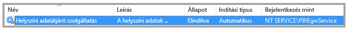
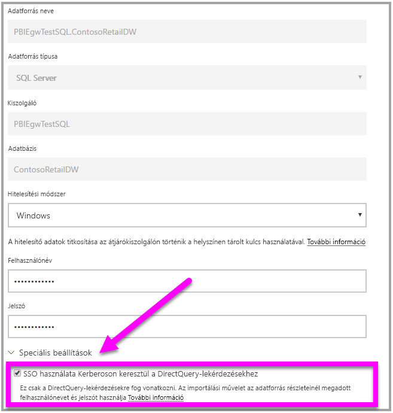

# <a name="use-resource-based-kerberos-for-single-sign-on-sso-from-power-bi-to-on-premises-data-sources"></a>Az erőforrás-alapú Kerberos használata a Power BI-ból a helyszíni adatforrásokba történő egyszeri bejelentkezéshez (SSO)

Az [erőforrás-alapú korlátozott Kerberos-delegálással](/windows-server/security/kerberos/kerberos-constrained-delegation-overview) engedélyezheti az egyszeri bejelentkezéses csatlakozást a Windows Server 2012-n és a szolgáltatás és újabb verzióin, az előtérbeli és háttérbeli szolgáltatások így eltérő tartományokban is lehetnek. Ennek működéséhez a háttérbeli szolgáltatástartománynak meg kell bíznia az előtérbeli szolgáltatástartományban.

## <a name="preparing-for-resource-based-kerberos-constrained-delegation"></a>Az erőforrás-alapú Kerberos által korlátozott delegálás előkészítése

Számos elemet kell konfigurálni ahhoz, hogy a Kerberos által korlátozott delegálás megfelelően működjön, beleértve a _szolgáltatás egyszerű szolgáltatásneveit_ (SPN) és a delegálási beállításokat a szolgáltatásfiókokhoz.

### <a name="prerequisite-1-operating-system-requirements"></a>1\. előfeltétel: Operációsrendszer-követelmények

Az erőforrás-alapú korlátozott delegálás csak egy Windows Server 2012 R2-t vagy Windows Server 2012-t vagy újabb verziót futtató tartományvezérlőn konfigurálható.

### <a name="prerequisite-2-install-and-configure-the-on-premises-data-gateway"></a>2\. előfeltétel: A helyszíni adatátjáró telepítése és konfigurálása

A helyszíni adatátjáró támogatja a helyben történő frissítést, valamint a meglévő átjárók _beállításainak átvételét_.

### <a name="prerequisite-3-run-the-gateway-windows-service-as-a-domain-account"></a>3\. előfeltétel: Az átjáró Windows-szolgáltatásának futtatása tartományi fiókként

A standard telepítés során az átjáró a gép helyi szolgáltatásfiókjával fut (ebben az esetben: _NT Service\PBIEgwService_), az alábbi képen látható módon:



A **Kerberos által korlátozott delegálás engedélyezéséhez az átjárót tartományi fiókkal kell futtatni, ha az Azure AD még nincs szinkronizálva a helyi Active Directoryval (az Azure AD DirSync/Connect használatával). Ha szeretne tartományi fiókra váltani, lásd: [Az átjárószolgáltatás-fiók módosítása](/data-integration/gateway/service-gateway-service-account).

Ha az Azure AD DirSync / Connect konfigurálva van, és a felhasználói fiókok szinkronizálva vannak, az átjárószolgáltatásnak nem kell helyi AD-kereséseket végrehajtania futásidőben. Az átjárószolgáltatáshoz használhatja a helyi szolgáltatási SID-t (azaz nincs szükség tartományi fiókra). A Kerberos által korlátozott delegálás cikkben ismertetett konfigurációs lépések ugyanazok, mint ez a konfiguráció (csak a tartományi fiók helyett az átjáró számítógép-objektumát kell Active Directoryban alkalmazni).

### <a name="prerequisite-4-have-domain-admin-rights-to-configure-spns-setspn-and-kerberos-constrained-delegation-settings"></a>4\. előfeltétel: Tartományi rendszergazdai jogosultsággal kell rendelkezni az SPN-ek (SetSPN) és a Kerberos által korlátozott delegálási beállítások konfigurálásához

Habár technikailag lehetséges az, hogy egy tartományi rendszergazda ideiglenesen vagy véglegesen jogosultságot adjon valaki másnak az egyszerű szolgáltatásnevek és a Kerberos-delegálás konfigurálására anélkül, hogy rendszergazdai jogosultságra lenne szükség, nem ez az ajánlott eljárás. A következő szakaszban részletezzük a **3. előfeltételhez** szükséges konfigurációs lépéseket.

## <a name="configuring-kerberos-constrained-delegation-for-the-gateway-and-data-source"></a>A Kerberos által korlátozott delegálás konfigurálása az átjáróhoz és az adatforráshoz

A rendszer megfelelő konfigurálásához a következő két elemet kell konfigurálni vagy érvényesíteni:

* Szükség esetén konfiguráljon egy egyszerű szolgáltatásnevet az átjárószolgáltatás tartományfiókjához.

* Delegálási beállítások konfigurálása az átjárószolgáltatás tartományfiókján.

Vegye figyelembe, hogy ezen két konfigurációs lépés végrehajtásához tartományi rendszergazdai jogosultságok szükségesek.

A következő szakaszok ezeket a lépéseket ismertetik.

### <a name="configure-an-spn-for-the-gateway-service-account"></a>Az átjáró szolgáltatásfiókjához tartozó egyszerű szolgáltatásnév konfigurálása

Először az alábbi lépések végrehajtásával állapítsa meg, hogy létre lett-e már hozva egyszerű szolgáltatásnév az átjáró szolgáltatásfiókjaként használt tartományi fiókhoz:

1. Tartományi rendszergazdaként futtassa az **Active Directory – felhasználók és számítógépek** modult.

1. Kattintson a jobb gombbal a tartományra, válassza a **Keresés** lehetőséget, és írja be az átjáró szolgáltatásfiókjának nevét.

1. A keresési eredményekben kattintson a jobb gombbal az átjáró szolgáltatásfiókjára, majd válassza a **Tulajdonságok** lehetőséget.

1. Ha a **Delegálás** lap látható a **Tulajdonságok** párbeszédpanelen, akkor már létre lett hozva egy egyszerű szolgáltatásnév, ezért továbbléphet a [delegálási beállítások konfigurálásáról](#configure-delegation-settings) szóló következő alszakaszra.

    Ha nincs **Delegálás** lap a **Tulajdonságok** párbeszédpanelen, manuálisan létrehozhat egy egyszerű szolgáltatásnevet a fiókban, így megjelenik a **Delegálás** lap (ez a delegálási beállítások konfigurálásának legegyszerűbb módja). Egyszerű szolgáltatásnevet létrehozhat a [setspn eszközzel](https://technet.microsoft.com/library/cc731241.aspx), amely a Windows rendszer része (tartományi rendszergazdai jogosultságokra van szükség az egyszerű szolgáltatásnév létrehozásához).

    Például tegyük fel, hogy az átjáró szolgáltatásfiókja „PBIEgwTest\GatewaySvc”, és az átjáró szolgáltatást futtató számítógép neve **Machine1**. Ebben a példában az adott számítógépen az átjáró-szolgáltatásfiók egyszerű szolgáltatásnevének beállításához a következő parancsot futtatná:

      

    Miután végzett ezzel a lépéssel, továbbléphet a delegálási beállítások konfigurálására.

### <a name="configure-delegation-settings"></a>A delegálási beállítások konfigurálása

A következő lépésekben egy helyszíni környezetet feltételezünk két, eltérő tartományokban található géppel: egy átjárót tartalmazó géppel és egy SQL Servert futtató adatbázis-kiszolgálóval. A példa kedvéért a következő beállításokat és neveket is feltételezzük:

* Átjáró gépneve: **PBIEgwTestGW**
* Átjárószolgáltatás-fiók: **PBIEgwTestFrontEnd\GatewaySvc** (fiók megjelenítendő neve: Gateway Connector)
* SQL Server adatforrás gépneve: **PBIEgwTestSQL**
* SQL Server adatforrás szolgáltatásfiókja: **PBIEgwTestBackEnd\SQLService**

A példaként megadott nevekkel és beállításokkal a konfigurációs lépések a következők:

1. A Microsoft Management Console (MMC) beépülő moduljának, az **Active Directory – felhasználók és számítógépeknek** a **PBIEgwTestFront-end** tartománybeli tartományvezérlőn való használatával győződjön meg róla, hogy nem alkalmazott delegálási beállításokat az átjárószolgáltatás-fiókra.

    

1. Az **Active Directory – felhasználók és számítógépek** beépülő modul a **PBIEgwTestBack-end** tartománybeli tartományvezérlőn való használatával győződjön meg róla, hogy nem alkalmazott delegálási beállításokat a háttérbeli szolgáltatásfiókra. Emellett győződjön meg arról, hogy nincs beállítva az „msDS-AllowedToActOnBehalfOfOtherIdentity” attribútum ehhez a fiókhoz. Ezt az „attribútumszerkesztőben”, a következő kép szerint találhatja meg:

    

1. Hozzon létre egy csoportot az **Active Directory – felhasználók és számítógépek** beépülő modulban a **PBIEgwTestBack-end** tartománybeli tartományvezérlőn. Adja hozzá a csoporthoz az átjárószolgáltatás-fiókot, a következő képhez hasonlóan. A képen egy új, _ResourceDelGroup_ nevű csoport látható, amelyhez hozzáadja a **GatewaySvc** átjárószolgáltatás-fiókot.

    

1. Nyissa meg a parancssort, és futtassa a következő parancsokat a **PBIEgwTestBack-end** tartománybeli tartományvezérlőn az msDS-AllowedToActOnBehalfOfOtherIdentity attribútum a háttérbeli szolgáltatásfiókon való frissítéséhez:

    ```powershell
    $c = Get-ADGroup ResourceDelGroup
    Set-ADUser SQLService -PrincipalsAllowedToDelegateToAccount $c
    ```

1. Az **Active Directory – felhasználók és számítógépek** modulban ellenőrizheti, hogy a frissítés megjelenik-e a háttérbeli szolgáltatásfiók tulajdonságainak „Attribútumszerkesztő” lapján.

Végül az átjárószolgáltatást futtató gépen (a példánkban **PBIEgwTestGW**) az átjárószolgáltatás-fióknak meg kell adni az „Ügyfél megszemélyesítése hitelesítés után” helyi házirendet. Ezt a Helyi csoportházirend-szerkesztőben hajthatja végre/ellenőrizheti (**gpedit**).

1. Az átjárót tartalmazó számítógépen futtassa a következőt: _gpedit.msc_.

1. Navigáljon a **Helyi számítógép-házirend > Számítógép konfigurációja > A Windows beállításai > Biztonsági beállítások > Helyi házirend > Felhasználói jogok kiosztása** elemhez az alábbi képen látható módon.

    

1. A **Felhasználói jogok kiosztása** lehetőségnél a házirendek listájából válassza ki az **Ügyfél megszemélyesítése hitelesítés után** elemet.

    

1. Kattintson a jobb gombbal, és nyissa meg az **Ügyfél megszemélyesítése hitelesítés után** elem **Tulajdonságok** elemét, majd ellenőrizze a fiókok listáját. A listának tartalmaznia kell az átjáró-szolgáltatásfiókot (**PBIEgwTestFront-end** **\GatewaySvc**).

1. A **Felhasználói jogok kiosztása** lehetőségnél a házirendek listájából válassza ki **Az operációs rendszer részeként való működés (SeTcbPrivilege)** elemet. Győződjön meg róla, hogy az átjáró-szolgáltatásfiók a fiókok listájában is szerepel.

1. Indítsa újra a **helyszíni adatátjáró** szolgáltatás folyamatát.

## <a name="running-a-power-bi-report"></a>Power BI-jelentés futtatása

A cikkben szereplő korábbi konfigurációs lépések elvégzése után konfigurálja az adatforrást a Power BI-ban az **Átjáró kezelése** lapon. Ezután az itt található **Speciális beállítások** területen engedélyezze az egyszeri bejelentkezést, majd tegye közzé az adatforráshoz kötött jelentéseket és adathalmazokat.



Ez a konfiguráció a legtöbb esetben működik. A Kerberos esetében azonban más konfigurációkra lehet szükség a környezettől függően. Ha a jelentés továbbra sem töltődik be, forduljon a tartományi rendszergazdájához a probléma részletesebb kivizsgálásához.

## <a name="next-steps"></a>Következő lépések

A **helyszíni adatátjáróval** és a **DirectQueryvel** kapcsolatos további információkért lásd az alábbi forrásanyagokat:

* [Mi az a helyszíni adatátjáró?](/data-integration/gateway/service-gateway-onprem.md)
* [A DirectQuery használata a Power BI-ban](desktop-directquery-about.md)
* [A DirectQuery által támogatott adatforrások](desktop-directquery-data-sources.md)
* [A DirectQuery és az SAP BW](desktop-directquery-sap-bw.md)
* [A DirectQuery és az SAP HANA](desktop-directquery-sap-hana.md)
