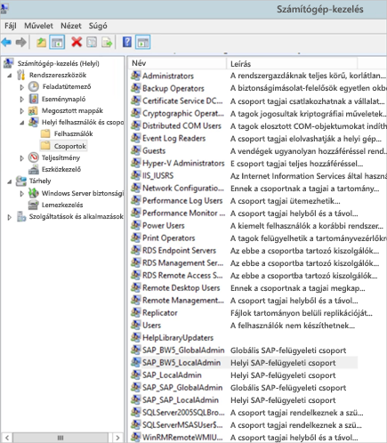
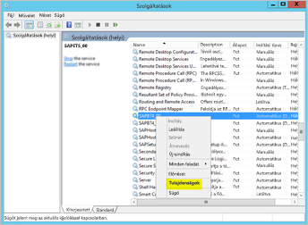
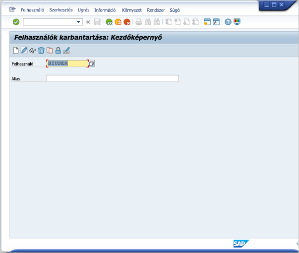
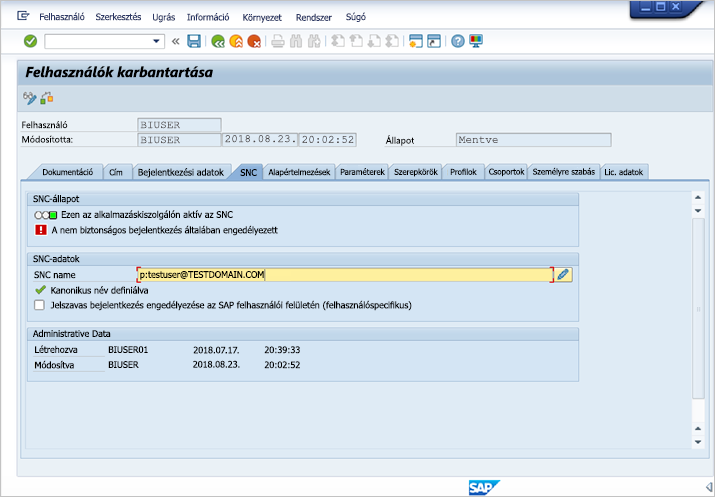
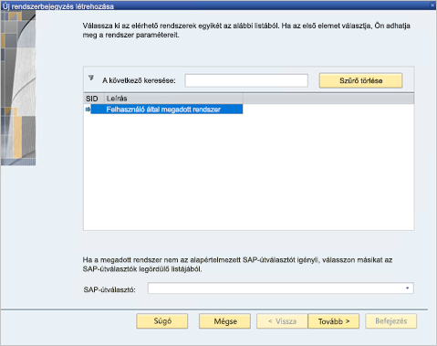
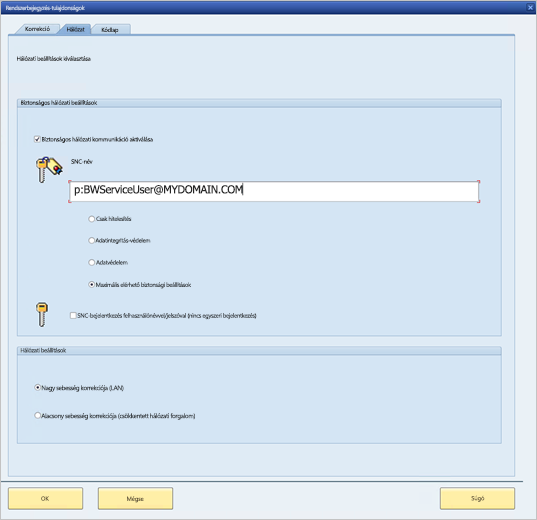
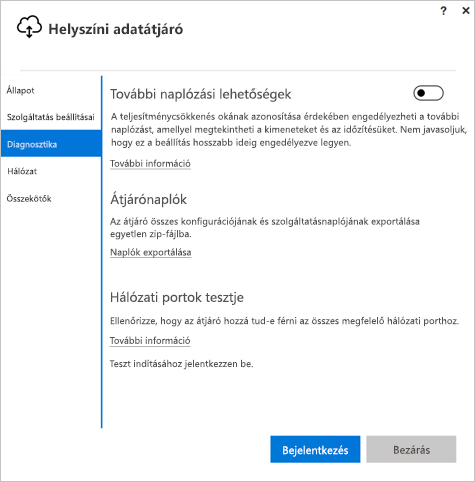

# <a name="use-kerberos-for-single-sign-on-sso-to-sap-bw-using-gx64krb5"></a>Kerberos használata az SAP BW-n történő egyszeri bejelentkezéshez (SSO) a gx64krb5-tel

Ez a cikk azt ismerteti, hogy hogyan konfigurálhatja az SAP BW-adatforrást a Power BI szolgáltatás egyszeri bejelentkezési funkciójának engedélyezéséhez a gx64krb5 használatával.

> [!NOTE]
> Ha elvégzi a jelen cikk és [a Kerberos SSO konfigurálását ismertető cikk](service-gateway-sso-kerberos.md) lépéseit, engedélyezheti a frissítést az SAP BW-alkalmazáskiszolgálóra alapuló jelentésekhez a Power BI szolgáltatásban. A Microsoft azonban a gx64krb5 helyett a CommonCryptoLib használatát javasolja SNC-kódtárként. Az SAP már nem támogatja a gx64krb5-öt, ennek az átjáró használatára történő konfigurációjához szükséges lépései pedig jelentősen összetettebbek, mint a CommonCryptoLib eljárása. Az SSO a CommonCryptoLibbel történő konfigurálásához tekintse meg [Az SAP BW konfigurálása egyszeri bejelentkezéshez a CommonCryptoLib használatával](service-gateway-sso-kerberos-sap-bw-commoncryptolib.md) című cikket. A konfigurációt a CommonCryptoLib _vagy_ a gx64krb5 számára kell elvégeznie. Ne konfiguráljon mindkét könyvtárhoz.

### <a name="set-up-gx64krb5-on-gateway-machine-and-the-sap-bw-server"></a>A gx64krb5 beállítása az átjárógépen és az SAP BW-kiszolgálón
Ez az útmutató próbál olyan átfogó lennie, amennyire csak lehetséges. Ha már végrehajtott ezek közül néhány lépést, azokat kihagyhatja. Előfordulhat például, hogy már konfigurálta az SAP BW-kiszolgálót az egyszeri bejelentkezéshez a gx64krb5 használatával.

### <a name="set-up-gx64krb5-on-the-gateway-machine-and-the-sap-bw-server"></a>A gx64krb5 beállítása az átjárógépen és az SAP BW-kiszolgálón

> [!NOTE]
> A `gx64krb5` kódtárat már nem támogatja az SAP. További információt az [SAP 352295 megjegyzés](https://launchpad.support.sap.com/#/notes/352295) című cikkben talál. Vegye figyelembe azt is, hogy a `gx64krb5` nem teszi lehetővé az adatátjáróból az SAP BW üzenetkiszolgálóba irányuló SSO-kapcsolatokat. Csak az SAP BW-alkalmazáskiszolgálóba irányuló kapcsolatok lehetségesek. Ez az alkalmazáskiszolgálóra vonatkozó korlátozás nem létezik, ha a [CommonCryptoLib](service-gateway-sso-kerberos-sap-bw-commoncryptolib.md) az SNC-könyvtára. A BW SSO-val egyéb SNC-könyvtárak is működhetnek, azonban ezeket nem támogatja hivatalosan a Microsoft.

A `gx64krb5` kódtárat az ügyfélnek és a kiszolgálónak is használnia kell az SSO-kapcsolat átjárón keresztüli létrehozásához, azaz az ügyfélnek és a kiszolgálónak is ugyanazt az SNC-kódtárat kell használnia.

1. Töltse le a `gx64krb5` könyvtárat az [SAP Note 2115486](https://launchpad.support.sap.com/) oldaláról (ehhez szükséges egy SAP S-felhasználó). Legalább az 1.0.11.x verzióval kell rendelkeznie. Emellett töltse le a `gsskrb5` elemet (a könyvtár 32 bites verzióját), ha az SSO-kapcsolatot az SAP GUI-ban is tesztelni szeretné az átjárón keresztüli SSO-kapcsolat létrehozása előtt (ajánlott). A 32 bites verzió azért szükséges az SAP GUI-teszthez, mert az SAP GUI csak 32 bites verzióban érhető el.

1. A `gx64krb5` kódtárt egy olyan helyen helyezze el az átjárógépen, ahol hozzá tud férni az átjáró szolgáltatásfelhasználója. Ha tesztelni szeretné az SSO-kapcsolatot az SAP GUI használatával, a `gsskrb5` egy példányát is helyezze el a gépen, és állítsa be az **SNC_LIB** környezeti változót úgy, hogy erre a helyre mutasson. Mind az átjáró szolgáltatásfelhasználójának, mind pedig a szolgáltatásfelhasználó által megszemélyesített Active Directory- (AD-) felhasználónak rendelkeznie kell olvasási és végrehajtási engedélyekkel a `gx64krb5` példányához. Javasoljuk, hogy a .dll kiterjesztésű fájlokra vonatkozó engedélyeket adja meg a Hitelesített felhasználók csoport számára. Tesztelési célból ezeket az engedélyeket explicit módon megadhatja az átjáró Szolgáltatás felhasználója és a tesztelési Active Directory-felhasználó számára is.

1. Ha a BW-kiszolgálót még nem konfigurálta az SSO-hoz a gx64krb5 kódtárral, helyezze a .dll egy másik példányát az SAP BW-kiszolgálógépre olyan helyre, amelyhez hozzá tud férni az SAP BW-kiszolgáló. A gx64krb5 SAP BW-kiszolgálóval való használatának konfigurálásáról [az SAP dokumentációjában](https://launchpad.support.sap.com/#/notes/2115486) (S-felhasználó szükséges hozzá) talál további információt.

1. Az ügyfél- és a kiszolgálógépeken állítsa be az `SNC_LIB` és/vagy az `SNC_LIB_64` környezeti változót. Ha a gsskrb5-öt használja, állítsa az `SNC_LIB` változót a gsskrb5.dll fájl abszolút elérési útjára. Ha a gx64krb5-öt használja, állítsa az `SNC_LIB_64` változót a gx64krb5.dll fájl abszolút elérési útjára.

### <a name="configure-an-sap-bw-service-user-and-enable-snc-communication-on-the-bw-server"></a>Az SAP BW-szolgáltatásfelhasználó konfigurálása és SNC-kommunikáció engedélyezése a BW-kiszolgálón

Akkor térjen erre a szakaszra, ha még nem konfigurálta az SAP BW-kiszolgálót az SNC-kommunikációhoz (például SSO-hoz) a gx64krb5/ használatával.

> [!NOTE]
> Ez a szakasz feltételezi, hogy már létrehozott egy szolgáltatásfelhasználót a BW-hez, amelyhez egy megfelelő SPN-t kötött (például egy `SAP/` kezdetűt).

1. Biztosítson hozzáférést a szolgáltatásfelhasználónak az SAP BW-alkalmazáskiszolgálóhoz:

    1. Az SAP BW kiszolgálógépén adja hozzá a szolgáltatásfelhasználót a Helyi rendszergazdák csoportjához. Nyissa meg a Számítógép-felügyelet programot, és keresse meg a kiszolgálójához tartozó Helyi rendszergazdák csoportot. Például:

        

    1. Kattintson duplán a Helyi rendszergazdák csoportra, majd válassza a **Hozzáadás** lehetőséget a szolgáltatásfelhasználó a csoporthoz történő hozzáadásához. A **Névellenőrzés** lehetőség használatával ellenőrizze, hogy helyesen írta-e be a nevet. Kattintson az **OK** gombra.

1. Állítsa be az SAP BW-kiszolgáló szolgáltatásfelhasználóját azon felhasználóként, amely elindítja az SAP BW-kiszolgálószolgáltatást az SAP BW-kiszolgálógépen.

    1. Nyissa meg a **Futtatás** párbeszédpanelt, és írja be a **Services.msc** nevet. Keresse meg az SAP BW-alkalmazáskiszolgáló példányának megfelelő szolgáltatást. Kattintson rá a jobb gombbal, és válassza a **Tulajdonságok** elemet.

        

    1. Váltson a **Bejelentkezés** lapra, és módosítsa a felhasználót az SAP BW-szolgáltatásfelhasználójára. Adja meg a felhasználó jelszavát, és válassza az **OK** lehetőséget.

1. Jelentkezzen be a kiszolgálóba az SAP Logon programban, és állítsa be az alábbi profilparamétereket az RZ10 tranzakció használatával:

    1. Állítsa az **snc/identity/as** profilparamétert *p:&lt;az Ön által létrehozott SAP BW-szolgáltatásfelhasználó&gt;* értékre, például: *p:BWSzolgaltatasfelhasznalo\@SAJATTARTOMANY.HU*. Figyelje meg a szolgáltatásfelhasználó egyszerű felhasználóneve előtt szereplő p: elemet. Ez nem p:CN=, mintha a közös titkosítási kódtárat használná SNC-kódtárként.

    1. Állítsa az **snc/gssapi\_lib** profilparamétert *&lt;a gx64krb5.dll elérési útja a BW-kiszolgálógépen&gt;* értékre. Ne feledje a kódtárat egy olyan helyre helyezni, amelyhez az SAP BW-alkalmazáskiszolgáló hozzá tud férni.

    1. Emellett módosítsa az alábbi profilparaméterek értékeit az igényeinek megfelelően. Az utolsó öt lehetőség lehetővé teszi, hogy az ügyfelek SNC konfigurálása nélkül csatlakozzanak az SAP BW-kiszolgálóhoz az SAP Logon használatával.

        | **Beállítás** | **Érték** |
        | --- | --- |
        | snc/data\_protection/max | 3 |
        | snc/data\_protection/min | 1 |
        | snc/data\_protection/use | 9 |
        | snc/accept\_insecure\_cpic | 1 |
        | snc/accept\_insecure\_gui | 1 |
        | snc/accept\_insecure\_r3int\_rfc | 1 |
        | snc/accept\_insecure\_rfc | 1 |
        | snc/permit\_insecure\_start | 1 |

    1. Állítsa az **snc/enable** tulajdonság értékét 1-re.

1. A profilparaméterek beállítása után nyissa meg az SAP Felügyeleti konzolt a kiszolgálógépen, és indítsa újra az SAP BW-példányt. Ha a kiszolgáló nem indul el, ellenőrizze, hogy a profilparamétereket megfelelően állította-e be. A profilparaméterek beállításáról további információt az [SAP dokumentációjában](https://help.sap.com/saphelp_nw70ehp1/helpdata/en/e6/56f466e99a11d1a5b00000e835363f/frameset.htm) talál. Ha problémába ütközik, tekintse át a szakasz később részletezett, hibaelhárítással kapcsolatos információit.

### <a name="map-a-sap-bw-user-to-an-active-directory-user"></a>SAP BW-felhasználó leképezése egy Active Directory-felhasználóra

Ha még nem tette meg, képezzen le egy Active Directory-felhasználót egy SAP BW-alkalmazáskiszolgáló-felhasználóra, és tesztelje az egyszeri bejelentkezési kapcsolatot az SAP Logon programban.

1. Jelentkezzen be az SAP BW-kiszolgálóba az SAP Logon használatával. Futtassa az SU01 tranzakciót.

1. A **Felhasználó** mezőben adja meg azt az SAP BW-felhasználót, akinek engedélyezni szeretné az egyszeri bejelentkezési kapcsolatot (az alábbi képernyőképen a BIUSER nevű felhasználónak készülünk engedélyeket beállítani). Válassza a **Szerkesztés** ikont (amely egy tollat ábrázol) az SAP Logon-ablak bal felső részében.

    

1. Válassza az **SNC** lapot. Az SNC-név beviteli mezőjében adja meg a *p:&lt;Active Directory-felhasználó&gt;@&lt;tartománynév&gt;* értéket. Vegye figyelembe, hogy a kötelező p: elemnek meg kell előznie az Active Directory-felhasználó egyszerű felhasználónevét. A megadott Active Directory-felhasználónak ahhoz a személyhez vagy szervezethez kell tartoznia, amely számára engedélyezni szeretné az egyszeri bejelentkezési hozzáférést az SAP BW-alkalmazáskiszolgálójához. Ha például a *tesztelhasznalo\@TESZTTARTOMANY.HU* felhasználónak szeretné engedélyezni az egyszeri bejelentkezési hozzáférést, adja meg a *p:tesztfelhasznalo\@TESZTTARTOMANY.HU* értéket.

    

1. Válassza a **Mentés** ikont (amely egy hajlékonylemezt ábrázol) a képernyő bal felső sarkában.

### <a name="test-sign-in-via-sso"></a>Az egyszeri bejelentkezés tesztelése

Ellenőrizze, hogy be tud-e jelentkezni a kiszolgálóba az SAP Logon használatával egyszeri bejelentkezéssel azon Active Directory-felhasználóként, amely számára az előbb engedélyezte az egyszeri bejelentkezési hozzáférést.

1. Annak az Active Directory-felhasználónak a nevében, akinek az imént engedélyezte az egyszeri bejelentkezési hozzáférést, jelentkezzen be egy olyan gépre a tartományában, amelyen telepítve van az SAP Logon. Indítsa el az SAP Logont, és hozzon létre egy új kapcsolatot.

1. Másolja a vágólapra a korábban arra a gépre letöltött `gsskrb5`.dll fájlt, amelyre az imént bejelentkezett. Állítsa be az `SNC_LIB` környezeti változót úgy, hogy az ennek a helynek az abszolút elérési útjára mutasson.

1. Indítsa el az SAP Logont, és hozzon létre egy új kapcsolatot.

1. Az **Új rendszerbejegyzés létrehozása** képernyőn válassza a **Felhasználó által megadott rendszer** lehetőséget, majd a **Tovább** gombot.

    

1. A következő képernyőn adja meg a megfelelő részleteket az alkalmazáskiszolgálóval, a példányszámmal és a rendszer-azonosítóval együtt. Ezután válassza a **Befejezés** gombot.

1. Kattintson a jobb gombbal az új kapcsolatra, majd válassza a **Tulajdonságok** elemet. Válassza a **Hálózat** lapot. Az **SNC-név** mezőbe írja be a *p:&lt;az SAP BW-szolgáltatásfelhasználó egyszerű felhasználóneve&gt;* értéket, például: *p:BWSzolgaltatasfelhasznalo\@SAJATTARTOMANY.HU*. Ezután válassza az **OK** gombot.

    

1. Kattintson duplán az előbb létrehozott kapcsolatra, hogy megkísérelje az egyszeri bejelentkezést az SAP BW-kiszolgálóra. Ha ez a kapcsolat sikeres, folytassa a következő lépéssel. Ellenkező esetben tekintse át a dokumentum korábbi lépéseit, hogy meggyőződjön arról, hogy azok megfelelően lettek elvégezve, vagy tekintse át az alábbi, hibaelhárítással kapcsolatos szakaszt. Ha ebben a környezetben nem tud csatlakozni az SAP BW-kiszolgálóhoz egyszeri bejelentkezéssel, akkor az átjárói környezetben sem fog tudni csatlakozni az SAP BW-kiszolgálóhoz egyszeri bejelentkezéssel.

### <a name="add-registry-entries-to-the-gateway-machine"></a>Beállításjegyzékbeli bejegyzések hozzáadása az átjárót tartalmazó számítógépen

Adja hozzá a szükséges beállításjegyzék-bejegyzéseket annak a gépnek beállításjegyzékéhez, amelyre az átjáró telepítve van, valamint azokhoz a gépekhez, amelyekhez csatlakozni szeretne a Power BI Desktopról. A futtatandó parancsok:

1. ```REG ADD HKLM\SOFTWARE\Wow6432Node\SAP\gsskrb5 /v ForceIniCredOK /t REG_DWORD /d 1 /f```

1. ```REG ADD HKLM\SOFTWARE\SAP\gsskrb5 /v ForceIniCredOK /t REG_DWORD /d 1 /f```

### <a name="add-a-new-sap-bw-application-server-data-source-to-the-power-bi-service-or-edit-an-existing-one"></a>Új SAP BW-alkalmazáskiszolgáló-adatforrás hozzáadása a Power BI szolgáltatáshoz, vagy meglévő szerkesztése

1. Az adatforrás konfigurációs ablakában adja meg az Alkalmazáskiszolgáló **Gazdagépnév**, **Rendszer száma** és **Ügyfél-azonosító** adatait, ahogy azt a Power BI Desktopból az SAP BW-kiszolgálóba való bejelentkezés során tenné.

1. Az **SNC-partner neve** mezőbe írja be a *p:&lt;az SAP BW-szolgáltatásfelhasználóra leképezett egyszerű szolgáltatásnév&gt;* értéket. Ha például az egyszerű szolgáltatásnév az **SAP/BWSzolgaltatasfelhasznalo\@SAJATTARTOMANY.HU**, akkor a *p:SAP/BWSzolgaltatasfelhasznalo\@SAJATTARTOMANY.HU* értéket kell írnia az **SNC-partner neve** mezőbe.

1. Az SNC-kódtárnál válassza az **SNC\_LIB** vagy az **SNC\_LIB\_64** lehetőséget. Ügyeljen rá, hogy az átjárógép **SNC\_LIB\_64** beállítása a gx64krb5.dll fájlra mutasson. Alternatívaként az „Egyéni” lehetőséggel megadhatja a gx64krb5.dll abszolút elérési útját (az átjárógépen).

1. Jelölje be az **Egyszeri bejelentkezés használata a Kerberoson keresztül DirectQuery-lekérdezésekhez** jelölőnégyzetet, majd válassza az **Alkalmaz** lehetőséget. Ha a tesztkapcsolat nem volt sikeres, ellenőrizze, hogy az előző telepítési és konfigurációs lépések megfelelően lettek elvégezve.

1. [Power BI-jelentés futtatása](service-gateway-sso-kerberos.md#run-a-power-bi-report)

## <a name="troubleshooting"></a>Hibaelhárítás

### <a name="troubleshoot-gx64krb5-configuration"></a>A gx64krb5 konfigurációjának hibaelhárítása

Ha bármilyen problémát tapasztal, kövesse az alábbi lépéseket a gx64krb5-telepítés és az egyszeri bejelentkezési kapcsolatok hibaelhárításához.

* A kiszolgálónaplók (…work\dev\_w0 a kiszolgálógépen) megtekintése segíthet a gx64krb5 telepítésének lépései során előforduló hibák elhárításában. Ez különösen igaz akkor, ha az SAP BW-kiszolgáló nem indul el a profilparaméterek módosítása után.

* Ha nem tudja elindítani az SAP BW szolgáltatást egy bejelentkezési hiba miatt, előfordulhat, hogy rossz jelszót adott meg az SAP BW indítási felhasználójának beállításakor. Ellenőrizze a jelszót úgy, hogy bejelentkezik egy Active Directory-környezetben található gépre az SAP BW-szolgáltatásfelhasználóként.

* Ha az alapul szolgáló hitelesítő adatokkal (például SQL Server) kapcsolatban olyan hibák jelentkeznek, amelyek megakadályozzák a kiszolgáló indítását, ellenőrizze, hogy adott-e hozzáférést a szolgáltatásfelhasználónak az SAP BW-adatbázishoz.

* Megjelenhet a következő hibaüzenet: *(GSS-API) A megadott cél ismeretlen vagy nem érhető el.* Ez általában azt jelenti, hogy rossz SNC-nevet adott meg. Ügyeljen arra, hogy az ügyfélalkalmazásban csak a „p:” elemet használja, ne a „p:CN=”-t vagy bármi mást, amely a szolgáltatásfelhasználó egyszerű felhasználónevétől eltér.

* Megjelenhet a következő hibaüzenet: *(GSS-API) Érvénytelen fájlnevet adott meg.* Győződjön meg arról, hogy a „p:” szerepel a kiszolgáló SNC-azonosítójának profilparaméter-értékében.

* Megjelenhet a következő hibaüzenet: *(SNC-hiba) A megadott modul nem található.* Ezt általában az okozza, hogy a `gx64krb5.dll` olyan helyen található, amelynek hozzáféréséhez megemelt jogosultsági szint (rendszergazdai jogosultság) szükséges.

### <a name="troubleshoot-gateway-connectivity-issues"></a>Átjáróhoz való csatlakozás hibaelhárítása

1. Tekintse meg az átjárónaplókat. Nyissa meg az átjárókonfigurációs alkalmazást, és válassza a **Diagnosztika**, majd a **Naplók exportálása** lehetőséget. A legutóbbi hibák a vizsgált naplófájlok alján jelennek meg.

    

1. Kapcsolja be az SAP BW-nyomkövetést, és tekintse át a létrehozott naplófájlokat. Számos különböző típusú SAP BW-nyomkövetés érhető el (például a CPIC-nyomkövetés). Erről további információt az SAP dokumentációjában talál.

## <a name="next-steps"></a>Következő lépések

A **helyszíni adatátjáróval** és a **DirectQueryvel** kapcsolatos további információkért lásd az alábbi forrásanyagokat:

* [Mi az a helyszíni adatátjáró?](/data-integration/gateway/service-gateway-onprem)
* [A DirectQuery használata a Power BI-ban](desktop-directquery-about.md)
* [A DirectQuery által támogatott adatforrások](desktop-directquery-data-sources.md)
* [A DirectQuery és az SAP BW](desktop-directquery-sap-bw.md)
* [A DirectQuery és az SAP HANA](desktop-directquery-sap-hana.md)
